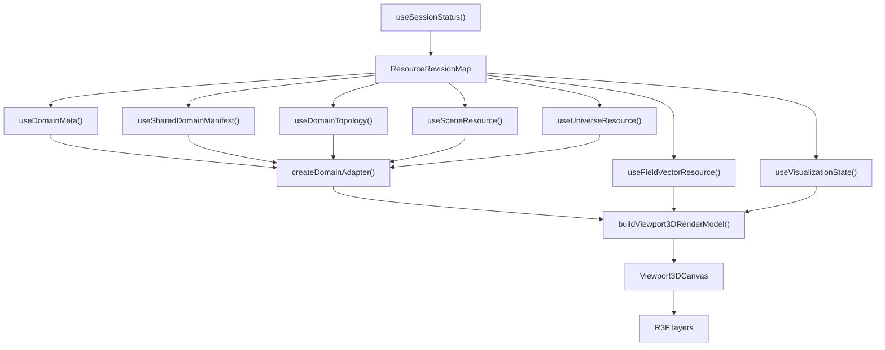

# 01 - Viewport 3D Module Architecture

**Decision:** one R3F viewport, one canvas, no multi-pane in Phase 5.

This document describes the target module shape. It replaces earlier drafts that described `ViewportGrid`, synced panes, and per-pane layer state.

## 1. Purpose

`viewport-3d` renders the current physical domain, mesh, field quantities, vector glyphs, airbox, selection highlights, and camera overlays in one WebGL scene.

It is domain-neutral at renderer level. FDM/FEM differences are handled before the renderer, inside resource hooks, domain adapters, and render-model builders.

## 2. Module Identity

```text
Module ID:  viewport-3d
Slot:       viewport-main
Capability: preview_3d
Surface:    one R3F Canvas
Depends on: kernel API, resource hooks, selection controller, command registry
```

The module must not import explorer, inspector, mesh, or results module internals. Cross-module interaction uses kernel selection, commands, resource invalidation, and events.

## 3. Data Flow



The module never calls `fetch()` and never constructs `/v2/...` strings. Resource hooks call `ControlRoomApi` facade methods.

## 4. File Tree

```text
src/modules/viewport-3d/
  manifest.ts
  Viewport3DModule.tsx
  store.ts
  components/
    Viewport3DCanvas.tsx
    ViewportToolbar.tsx
    ViewportOverlayStack.tsx
    OrbitCameraControls.tsx
  layers/
    ObjectMeshLayer.tsx
    ScalarFieldLayer.tsx
    VectorGlyphLayer.tsx
    WireframeLayer.tsx
    AirboxLayer.tsx
    AxesGridLayer.tsx
    BoundsBoxLayer.tsx
    SelectionHighlightLayer.tsx
  hooks/
    useViewport3DResources.ts
    useViewport3DResourceTracker.ts
    useViewport3DDiagnostics.ts
  model/
    viewport3DTypes.ts
    buildViewport3DRenderModel.ts
    fieldColorMapping.ts
    glyphSampling.ts
    lodStrategy.ts
  __tests__/
    buildViewport3DRenderModel.test.ts
    fieldColorMapping.test.ts
    glyphSampling.test.ts
    lodStrategy.test.ts
```

Shared domain code lives outside the module:

```text
src/domain/
  adapters/
    SpatialDomainAdapter.ts
    FdmDomainAdapter.ts
    FemDomainAdapter.ts
    createDomainAdapter.ts
  render-models/
    topologyRenderModel.ts
    fieldRenderModel.ts
    sceneObjectModel.ts
  resources/
    ResourceCache.ts
```

## 5. State Ownership

| State | Owner | Update path |
|---|---|---|
| Camera | `viewport-3d/store.ts` | orbit controls, command registry |
| Active quantity | `VisualizationStateResource` | `api.visualization.patch()` |
| Layer visibility | `VisualizationStateResource` | `api.visualization.patch()` |
| Sampling/LOD budget | `VisualizationStateResource.sampling` | `api.visualization.patch()` |
| Field/topology revisions | backend status/realtime invalidation | resource hooks |
| Decoded binary resources | `ResourceCache` | ETag, revision, retain/release |
| Three.js resources | R3F layers + viewport resource tracker | layer lifecycle |
| Selected object/node | kernel `SelectionController` | picking/explorer/inspector |
| Hover hit metadata | local ref or lightweight store | pointer events |
| Diagnostics | viewport diagnostics controller | dev/profiling only |

No large typed array, geometry, material, texture, or worker object belongs in React state.

## 6. Render Model Contract

```typescript
interface Viewport3DRenderModel {
  objects: ObjectRenderData[];
  airbox: AirboxRenderData | null;
  universeBounds: Bounds3 | null;
  scalarField: ScalarFieldRenderData | null;
  vectorField: VectorFieldRenderData | null;
  layers: VisualizationLayerState;
  selection: SelectionRenderData;
  cameraHint: CameraHint | null;
  clip: ClipPlaneConfig | null;
  status: ViewportResourceStatus;
  sampling: SamplingConfig;
  quantity: QuantityDisplayConfig;
  diagnostics: ViewportModelDiagnostics;
}
```

`ObjectRenderData` is already domain-neutral:

```typescript
interface ObjectRenderData {
  objectId: string;
  label: string;
  partIds: string[];
  geometry: CellGeometryResult;
  baseColor: [number, number, number];
  fieldLocation: "cell" | "node" | "sample";
  hasFieldData: boolean;
}
```

`AirboxRenderData` is separate from scene objects:

```typescript
interface AirboxRenderData {
  partId: string;
  geometry: CellGeometryResult;
  bounds: Bounds3 | null;
  visible: boolean;
}
```

## 7. FDM/FEM Boundary

The renderer never receives `discretization` branching. The adapters may branch internally.

FDM adapter responsibilities:

- use `DomainMeta.grid` and `DomainMeta.bounds`;
- treat 204 topology as normal;
- apply LOD before allocating instance buffers;
- preserve field location and unit metadata.

FEM adapter responsibilities:

- decode FMMT topology;
- use shared-domain manifest and `MeshPartResource` for object/part/airbox mapping;
- keep boundary faces, markers, part ids, node indices, and surface faces available to render-model builders;
- convert Float64 coordinate data to render buffers with explicit ownership and release.

## 8. Picking and Selection

Phase 5 picking emits canonical selection, not full probe values.

Supported hit metadata:

- object id when available;
- mesh part id when available;
- face index or instance id;
- world-space position;
- viewport source id.

Flow:

```text
R3F pointer hit
  -> resolve object/part from render model lookup
  -> kernel.selection.set({ objectId, nodeId, moduleSource: "viewport-3d" })
  -> event bus emits selection change
  -> explorer/inspector/highlight update from kernel state
```

Field-value probing is deferred until the backend exposes either a point probe endpoint or topology includes stable boundary face -> element/sample mapping with interpolation semantics.

## 9. Lifecycle

Mount:

1. module manifest registers;
2. resource hooks fetch status, meta, manifest, topology, field, visualization, scene, and universe resources;
3. adapters build domain-neutral render inputs;
4. render model builder produces `Viewport3DRenderModel`;
5. one R3F canvas mounts and renders initial frame;
6. canvas becomes idle until a dirty reason appears.

Quantity switch:

1. command or toolbar patches visualization state;
2. visualization revision changes;
3. field hook fetches new field vector for the selected quantity/component/scope;
4. scalar/vector buffers update;
5. topology geometry is reused;
6. R3F invalidates one frame.

Topology change:

1. mesh/topology revision changes;
2. topology hook fetches FMMT or receives FDM not-applicable;
3. adapter rebuilds topology render input;
4. stale geometry/render buffers are released;
5. compatible field resources are refetched or marked stale;
6. R3F invalidates one frame.

Unmount:

1. pending requests abort;
2. subscriptions and observers are removed;
3. R3F layers unmount;
4. viewport resource tracker reports zero module-owned WebGL resources;
5. cache releases consumer references and evicts resources if byte budget requires it.

## 10. Deferred Work

These are not part of Phase 5:

- split/multi-pane viewport;
- per-pane quantity/layer state;
- geometry transform gizmos;
- field-value probe readout;
- always-on animation without explicit solver visualization mode.

