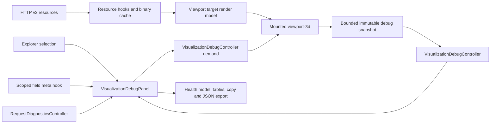

# Airbox UI and Visualization Debug Inspector Implementation Plan

> **For agentic workers:** REQUIRED SUB-SKILL: Use superpowers:subagent-driven-development (recommended) or superpowers:executing-plans to implement this plan task-by-task. Steps use checkbox (`- [ ]`) syntax for tracking.

**Status:** COMPLETE — wszystkie zadania i bramki mają dowód PASS; niezależny re-review: APPROVE (2026-07-15).

**Raport końcowy:** [Airbox UI, Visualization Debug i launcher WSL](2026-07-15-airbox-ui-visualization-debug-wsl-final-verification.md)

**Goal:** Rozbudować gałąź Airbox w zunifikowanym Explorerze oraz dodać pod każdą obsługiwaną gałęzią `Visualization` inspektor `Debug`, który pokazuje dokładnie te dane pola, topologii i render-passów, które są aktualnie używane przez viewport, wraz z rozmiarem pamięci, wymiarami, próbkami, statystykami, rewizjami, pochodzeniem i wykrytymi niespójnościami.

**Architecture:** Zmiana jest resource-first. Explorer pozostaje lekką projekcją semantyczną, Inspector czyta serwerowe metadane przez istniejące hooki zasobów, a aktywny `viewport-3d` publikuje do nowego, kernelowego `VisualizationDebugController` wyłącznie mały, niemutowalny i ograniczony rozmiarem snapshot diagnostyczny. Snapshot nie przechowuje pełnych tablic pola, topologii ani obiektów Three.js. Pełne skanowanie wartości uruchamia się tylko na żądanie, gdy wybrany jest węzeł `Visualization > Debug`, i pracuje porcjami z możliwością anulowania. Istniejący field-vector resource zostaje utwardzony o typowane response metadata, pełne CORS exposure i ETag obejmujący identity topologii. Nie powstaje drugi endpoint pod ekran, drugi transport danych, drugi model fizyczny, nowy ekran aplikacji ani stale aktywny profiler.

**Tech Stack:** React 19, TypeScript, Next.js 16, kernel controllers, `useSyncExternalStore`, istniejące v2 resource hooks, FMVP binary codec, Three.js/R3F, Vitest, React Testing Library, Playwright/browser smoke, shadcn/ui-style shared primitives, Catppuccin `--fm-*` tokens.

## Global Constraints

- `airbox` pozostaje jedynym widocznym dla użytkownika celem wizualizacji Airbox; `part:__air__` pozostaje nośnikiem data-plane, a nie drugim targetem.
- Najpierw musi zostać zachowany kontrakt z `2026-07-14-airbox-visualization-identity-and-stability.md`; implementacja tego planu nie może cofać filtrowania `object:__air__`, mapowania roli `air` ani stabilności Airbox vectors/histogram hover.
- Zachować identyfikatory `model:airbox:mesh` i `model:airbox:visualization`, ponieważ używają ich istniejące komendy i testy ribbonu.
- `Debug` jest semantycznym dzieckiem `Visualization`, a nie zakładką zwykłych ustawień wyglądu. Zwykły panel `Visualization` nadal służy do sterowania; `Debug` jest tylko do obserwacji i eksportu dowodów.
- Nie rejestrować nowego modułu w slocie. UI Debug należy do istniejącego modułu `inspector`; współdzielony kontroler diagnostyczny należy do kernelu.
- Nie dodawać endpointu ukształtowanego pod ekran Debug. Dane serwerowe pochodzą z obecnych zasobów `field meta`, field-vector response metadata, manifestu siatki, stanu wizualizacji i client acknowledgements; ciężki FMVP jest ten sam, który zużywa viewport.
- Utwardzenie istniejącego field-vector resource obejmuje OpenAPI response headers, CORS exposure, typowany `FieldVectorResponseMetadata`, zachowanie metadata po `304` i ETag zależny od topology identity. Nie rozszerzać JSON statusu ani eventów WebSocket.
- Nie wykonywać drugiego żądania po FMVP tylko dla Debug. Liczba nowych ciężkich żądań po otwarciu Debug ma wynosić zero.
- Nie umieszczać pełnych `Float64Array`, `Float32Array`, `Uint32Array`, topologii, geometrii, materiałów ani surowych response bodies w React state, Zustand, kontekście lub kernelowym snapshotcie.
- Nie przekazywać aktywnej tablicy pola do workera przez transfer, bo odłączyłoby to bufor renderera. Nie klonować jej do workera, bo podwoiłoby to pamięć.
- Debug zamknięty oznacza: brak skanów wartości, brak próbkowania, brak dodatkowego hooka `field meta`, brak odpytywania, brak nowych ramek viewportu i brak cyklicznego próbkowania pamięci.
- Wszystkie listy diagnostyczne są ograniczone. Domyślnie: 12 próbek punktów, 8 składowych na próbkę, 20 problemów, 8 dopasowanych requestów i 64 KiB na serializowany snapshot.
- Statystyki muszą podawać źródło: `backend-meta`, `decoded-payload`, `render-derived`, `transport`, `cache`, `webgl-shared` albo `ui-derived`. Nie wolno mieszać ich w jedną niewyjaśnioną liczbę.
- Pamięć ma rozróżniać `owned`, `referenced`, `shared` i `estimated`. Nie sumować pamięci współdzielonej z własnością targetu w jeden mylący „total”.
- `all zero` jest obserwacją, nie automatycznym błędem fizycznym. Zero może być prawidłowym wynikiem.
- Brak porównywalnych danych, nieznane progi lub brak target-specific WebGL attribution dają stan `unknown`, nie fałszywe `pass` ani `0 B`.
- Wszystkie nowe klasy CSS mają prefiks `fm-`; kolory pochodzą wyłącznie z `--fm-*` tokenów. Kontrolki interaktywne korzystają ze wspólnych prymitywów.
- Zwykła zmiana quantity, pola lub stylu nie może przebudowywać topologii. Debug nie może zmieniać jakości renderowania ani gęstości glyphów.
- Każdy test regresyjny należy najpierw uruchomić w stanie czerwonym, następnie wykonać minimalną zmianę produkcyjną i ponownie uruchomić test.
- Nie modyfikować niezwiązanych zmian w brudnym worktree i nie formatować przy okazji innych plików.

---

## 1. Zakres i kryteria ukończenia

Implementacja jest ukończona wyłącznie wtedy, gdy wszystkie poniższe punkty są spełnione:

1. Explorer pokazuje rozbudowaną gałąź Airbox, bez duplikatu `Airbox Quality` pod globalnym `Mesh`.
2. Każdy semantyczny węzeł Airbox ma własny Inspector, a nie jedną wielofunkcyjną stronę dla różnych znaczeń.
3. `Visualization > Debug` istnieje dla Airbox, obiektu i regionu oraz zawsze rozwiązuje ten sam canonical target, co jego rodzic `Visualization`.
4. Debug pokazuje target, carrier, query, resource key, transport, cache, dekodowany layout, statystyki, próbki, pamięć, render-passy, rewizje, freshness i problemy.
5. Dane `decoded-payload` pochodzą z bufora faktycznie podłączonego do `Viewport3DTargetRenderPassModel`, a nie z niezależnego ponownego fetchu.
6. Backendowe statystyki są pobierane z `useFieldMetaResource()` dla dokładnie tego samego quantity, component, scope, snapshot/stage/view i są podpisane jako backendowe.
7. Debug wykrywa co najmniej: quantity mismatch, scope mismatch, value-count mismatch, node-index mismatch, topology/domain mismatch, stale revision, non-finite values, outlier-dominated range, brak wymaganego render-passu i request/decode error.
8. Zamknięty Debug nie dodaje pracy proporcjonalnej do rozmiaru pola i nie powoduje request/frame churn w idle.
9. Otwarcie i zamknięcie Debug wielokrotnie nie zostawia subskrypcji, timerów, skanów, object URL ani snapshotów.
10. Typecheck, lint, pełne testy, React Doctor, idle audit i browser smoke przechodzą; browser smoke potwierdza widoczny canvas, żywy kontekst WebGL i niezerowy drawing buffer.

## 2. Stan obecny i luki

| Obszar | Stan obecny | Luka do zamknięcia |
|---|---|---|
| Explorer Airbox | `Airbox Mesh Policy` i `Airbox Visualization` są bezpośrednimi liśćmi `Universe` | Brak nadrzędnego `Airbox`, brak rozdzielenia parametrów, jakości, statystyk, topologii i provenance |
| Airbox Quality | `model:mesh:airbox-quality` jest pod globalnym `Mesh` | Semantycznie należy do `Universe > Airbox > Mesh`; obecne położenie rozdziela jeden obiekt na dwa miejsca |
| Inspector Airbox | `airbox.mesh` i `airbox.mesh-quality` używają `AirboxMeshPolicyPanel` | Różne węzły nie mają własnych widoków; panel pobiera i pokazuje wiele odpowiedzialności naraz |
| Field metadata | `FieldMeta` ma quantity, kind, components, location, unit, revisions oraz min/max/mean | Brak informacji, czy te metadane odpowiadają buforowi faktycznie użytemu przez render-pass |
| FMVP | `DecodedFieldVector` ma grid, nComp, pointCount, valueCount, indexing, nodeIndices, scope i typed values | Informacje istnieją w pamięci viewportu, ale Inspector ich nie widzi |
| Field-vector headers | Backend emituje revision, domain generation, quantity, component, counts, scope, snapshot, topology hash, indexing i node-index count | Część nagłówków nie jest udokumentowana w OpenAPI ani wystawiona przez CORS; frontend nie zachowuje ich jako typowanego metadata |
| Field-vector ETag | ETag obejmuje quantity/component/field revision/domain/scope/sample/snapshot | Nie obejmuje topology hash/revision, więc zmiana mapowania topologii może błędnie dopuścić `304` dla starego FMVP |
| Request diagnostics | `RequestDiagnosticsController` trzyma ograniczone wpisy z resource key, byte length, ETag, status i duration | Brak target-scoped projekcji i korelacji z aktywnym render bufferem |
| Cache | `ResourceCache` zna wpisy, rozmiary, ETag, retain i inflight; publicznie udostępnia tylko aggregate stats/peek | Brak bezpiecznej diagnostyki jednego wpisu bez ujawnienia danych |
| Render model | `Viewport3DTargetRenderPassModel` zna field buffer, surface, vectors i degradation | Dane są streszczane do stringów, a nie publikowane jako typowany bounded snapshot |
| Range diagnostics | Scalar mapping liczy finite/non-finite/zero/min/max/mean/p01/p99/outlier | Debug powinien je ponownie wykorzystać i nie skanować drugi raz |
| Memory | Registry pokazuje globalne cache budgets i resource tracker | Brak rozdzielenia pamięci target-owned, target-referenced i global/shared |

## 3. Docelowa architektura informacji

### 3.1 Explorer

```text
Session Model
└── Universe
    └── Airbox                                      airbox.root
        ├── Mesh                                    airbox.mesh
        │   ├── Parameters                          airbox.mesh.parameters
        │   ├── Quality Gates                       airbox.mesh.quality-gates
        │   ├── Statistics                          airbox.mesh.statistics
        │   ├── Topology                            airbox.mesh.topology
        │   └── Build & Provenance                  airbox.mesh.build
        └── Visualization                           airbox.visualization
            └── Debug                               airbox.visualization.debug

Objects
└── <Object>
    └── Visualization                               object.visualization
        ├── Mode visualization                      existing conditional branch
        └── Debug                                   object.visualization.debug

Objects
└── <Object>
    └── Regions
        └── <Region>
            └── Visualization                       object.region.visualization
                └── Debug                           object.region.visualization.debug
```

Kolejność jest celowa: ustawienia i tryby pracy pozostają pierwsze, Debug jest ostatni. Explorer nie pobiera zasobów wizualizacji dla badge'y Debug; badge ma być stały (`debug`) albo wyliczony wyłącznie z już istniejącego snapshotu drzewa.

### 3.2 Stabilne identyfikatory

| Węzeł | ID |
|---|---|
| Airbox | `model:airbox` |
| Mesh | `model:airbox:mesh` |
| Parameters | `model:airbox:mesh:parameters` |
| Quality Gates | `model:airbox:mesh:quality-gates` |
| Statistics | `model:airbox:mesh:statistics` |
| Topology | `model:airbox:mesh:topology` |
| Build & Provenance | `model:airbox:mesh:build` |
| Visualization | `model:airbox:visualization` |
| Airbox Debug | `model:airbox:visualization:debug` |
| Object Debug | `${objectParentId}:visualization:debug` |
| Region Debug | `${regionNodeId}:visualization:debug` |

Stary `model:mesh:airbox-quality` jest usuwany w tym samym commicie, w którym wszystkie komendy i testy przechodzą na `model:airbox:mesh:quality-gates`. Nie pozostawiać dwóch widocznych aliasów. `model:airbox:mesh` i `model:airbox:visualization` nie zmieniają ID.

### 3.3 Przepływ danych Debug



HTTP v2 pozostaje źródłem prawdy. WebSocket wyłącznie unieważnia zasoby. Kontroler Debug nie staje się cachem danych serwerowych; przechowuje tylko obserwację bieżącego renderera.

## 4. Kontrakt danych diagnostycznych

### 4.1 Typ snapshotu

Utworzyć `apps/control-room/src/kernel/visualization/visualizationDebugTypes.ts` z pełnym kontraktem:

```typescript
export type VisualizationDebugDisposition =
  | "ready"
  | "degraded"
  | "blocked"
  | "unknown";

export type VisualizationDebugEvidenceSource =
  | "backend-meta"
  | "cache"
  | "decoded-payload"
  | "render-derived"
  | "transport"
  | "ui-derived"
  | "webgl-shared";

export interface VisualizationDebugIssue {
  code: string;
  evidence: readonly string[];
  message: string;
  severity: "error" | "warning" | "info";
  source: VisualizationDebugEvidenceSource;
}

export interface VisualizationDebugSample {
  componentValues: readonly number[];
  magnitude: number | null;
  nodeIndex: number | null;
  pointIndex: number;
}

export interface VisualizationDebugNumericStats {
  finiteCount: number;
  max: number | null;
  mean: number | null;
  min: number | null;
  nonFiniteCount: number;
  p01: number | null;
  p99: number | null;
  source: VisualizationDebugEvidenceSource;
  zeroCount: number;
}

export interface VisualizationDebugMemoryRow {
  byteLength: number | null;
  id: string;
  label: string;
  ownership: "owned" | "referenced" | "shared" | "estimated";
  source: VisualizationDebugEvidenceSource;
}

export interface VisualizationDebugCarrierSnapshot {
  cache: {
    byteLength: number | null;
    entryState: "missing" | "inflight" | "ready";
    etag: string | null;
    fieldCacheByteLength: number;
    fieldCacheEntryCount: number;
    fieldCacheMaxBytes: number;
    retainCount: number;
  };
  carrierId: string;
  carrierRole: string;
  memory: readonly VisualizationDebugMemoryRow[];
  payload: {
    component: string;
    dtype: "float64";
    formatVersion: number | null;
    grid: readonly [number, number, number];
    indexing: string;
    nComp: number;
    nodeIndexCount: number | null;
    pointCount: number;
    quantityId: string;
    scopeId: string | null;
    scopeKind: string;
    valueCount: number;
  } | null;
  render: {
    adoption: {
      adoptedFieldBufferId: string | null;
      adoptedScalarBufferKey: string | null;
      adoptedVectorBuildKey: string | null;
      frameCommitId: string | null;
    };
    fieldBufferState: string;
    requestedPasses: readonly string[];
    surface: {
      colorMode: string | null;
      degradation: string | null;
      projectionMode: string | null;
      scalarByteLength: number | null;
    };
    vectors: {
      buildKey: string | null;
      degradation: string | null;
      segmentByteLength: number | null;
      segmentCount: number | null;
    };
  };
  request: {
    plannerRequestId: string | null;
    resourceKey: string | null;
  };
  revisions: {
    domainGenerationId: string | null;
    fieldRevision: string | null;
    meshTopologyHash: string | null;
    topologyRevision: string | null;
    visualizationRevision: string | null;
  };
  samples: readonly VisualizationDebugSample[];
  scanState: "idle" | "scanning" | "complete" | "cancelled" | "unavailable";
  statistics: readonly VisualizationDebugNumericStats[];
}

export interface VisualizationDebugSnapshot {
  capturedAtMs: number;
  carriers: readonly VisualizationDebugCarrierSnapshot[];
  disposition: VisualizationDebugDisposition;
  issues: readonly VisualizationDebugIssue[];
  sharedMemory: readonly VisualizationDebugMemoryRow[];
  target: {
    carrierIds: readonly string[];
    id: string;
    kind: "airbox" | "object" | "region";
    label: string;
  };
  viewport: {
    contextLost: boolean | null;
    drawingBuffer: readonly [number, number] | null;
    frameCommittedAtMs: number;
    frameCommitId: string;
    viewportId: string;
  };
  version: 1;
}
```

W produkcji każdy array w tym kontrakcie ma być zamrożony albo tworzony jako nowa ograniczona kolekcja. `VisualizationDebugController` odrzuca snapshot po serializacji większy niż 64 KiB i publikuje zamiast niego bounded issue `snapshot-size-limit`.

### 4.2 Źródła i znaczenie danych

| Pole UI | Źródło | Semantyka |
|---|---|---|
| Canonical target | kernel selection + visualization target resolver | Ten sam target co rodzic `Visualization` |
| Carrier IDs | current shared-domain manifest | Mesh/data-plane nośnik targetu; dla Airbox typowo `part:__air__` |
| Quantity/component/scope | carrier field buffer source + request query | Faktycznie załadowany bufor przypisany do render carrier, nie tylko ustawienie użytkownika |
| Backend min/max/mean | exact scoped `FieldMeta` | Statystyki backendu dla zgodnego query |
| Payload layout | `DecodedFieldVector` | dtype, grid, nComp, point/value count, indexing, node indices |
| Payload samples | dokładnie ten sam `DecodedFieldVector` | Deterministyczne, ograniczone próbki bez kopii całej tablicy |
| Render stats | istniejące `ScalarRangeDiagnostics` | Statystyki wartości użytych do koloru powierzchni |
| Wire bytes i response identity | typed binary response metadata + request diagnostics | Liczba bajtów odpowiedzi oraz nagłówki backendu, niezależnie sprawdzone z FMVP |
| Cache bytes | exact cache entry diagnostics | Rozmiar wpisu cache, ETag, retain i inflight/ready |
| Decoded bytes | typed array `byteLength` | `values` plus `nodeIndices`, bez szacowania |
| Derived bytes | scalar colors i vector segments `byteLength` | Bufory utworzone dla target render-passu |
| Topology bytes | topology snapshot | Wartość `referenced`, ponieważ topologia jest współdzielona |
| WebGL bytes/counts | resource tracker/ledger | `shared`, dopóki tracker nie ma pewnej target attribution |
| Render adoption | gated layer adoption receipts + frame commit | Identyfikatory bufferów przyjętych przez surface/vector layer w zatwierdzonej ramce |
| Revision rendered | visualization client ack | Backendowy dowód viewport-wide revision; pozostaje osobny od target/carrier adoption |

Jeden logical target może mieć wiele carrierów. Object/region Debug grupuje `targetPasses` po manifest mapping i canonical target resolverze; Airbox grupuje wszystkie air-role carriers pod `airbox`. Dla FDM, gdzie field source jest pełnodomenowy i `fieldBufferState` może być `derived-global`, utworzyć jawny carrier `fdm-domain` z `scopeKind: "full"` oraz osobnym geometry-mask description. Nie przedstawiać pełnodomenowego payloadu jako object-scoped. Jeśli kilka viewportów renderuje ten sam target, Inspector pokazuje osobną grupę na viewport zamiast arbitralnie wybierać jeden snapshot.

### 4.3 Reguły health

| Kod | Warunek | Severity | Dyspozycja |
|---|---|---|---|
| `target-not-active` | Brak targetu w bieżącym render modelu | warning | unknown |
| `field-request-error` | Ostatni dopasowany request ma error/network-error | error | blocked |
| `field-buffer-missing` | Render-plan wymaga pola, a buffer jest null | error | blocked |
| `quantity-mismatch` | Requested quantity różni się od payload quantity po canonicalizacji | error | blocked |
| `response-metadata-mismatch` | Typowane response headers są sprzeczne z decoded FMVP | error | blocked |
| `scope-kind-mismatch` | Planned request i payload scope są niezgodne po uwzględnieniu jawnego FDM full-domain geometry mask | error | blocked |
| `scope-id-mismatch` | Carrier/query scope ID różni się od payload scope ID | error | blocked |
| `value-count-mismatch` | `pointCount * nComp !== valueCount` | error | blocked |
| `node-index-count-mismatch` | Explicit/sample indexing ma inną liczbę indeksów niż punktów | error | blocked |
| `domain-generation-mismatch` | Pole i aktualna domena mają różne generation IDs | error | blocked |
| `topology-hash-mismatch` | Pole i topologia mają różne hash | error | blocked |
| `field-revision-stale` | Renderuje retained output starszy od oczekiwanej rewizji | warning | degraded |
| `frame-not-committed` | Istnieje candidate model, ale nie ma committed frame/adoption receipt | warning | unknown |
| `adopted-source-mismatch` | Layer adoption ID różni się od candidate buffer bez jawnego retained-compatible reason | warning | degraded |
| `non-finite-values` | Payload lub render stats ma NaN/Infinity | warning | degraded |
| `all-zero-values` | Wszystkie porównywalne wartości są zerowe | info | bez automatycznego pogorszenia |
| `range-outlier-dominated` | Istniejący range diagnostic zgłasza dominację outlierów | warning | degraded |
| `surface-pass-missing` | Surface jest włączony, ale nie ma scalar colors | warning | degraded |
| `vector-pass-missing` | Vectors są włączone, ale brak segments/build output | warning | degraded |
| `backend-render-range-mismatch` | Porównywalne exact scope/component stats różnią się ponad tolerancję | warning | degraded |
| `transport-cache-byte-mismatch` | Znane wire/cache bytes są sprzeczne w sposób niewyjaśniony przez dekodowanie | info | bez automatycznego pogorszenia |

Tolerancja porównania zakresu ma być wspólną funkcją: `abs(left - right) <= max(1e-12, 1e-9 * max(abs(left), abs(right), 1))`. Porównanie uruchamiać wyłącznie, gdy quantity, component, scope, snapshot/stage/view i semantyka statystyki są zgodne. Priorytet końcowy: dowolny `error` daje `blocked`; potem `warning` daje `degraded`; brak wystarczających dowodów daje `unknown`; komplet zgodnych dowodów daje `ready`.

### 4.4 Próbkowanie i pełny skan

- Wybierać maksymalnie 12 indeksów równomiernie z zakresu `[0, pointCount - 1]`, zawsze włączając pierwszy, środkowy i ostatni punkt, jeśli istnieją.
- Nie używać `Array.from(values)` ani spread operatora na typed arrays.
- Na wiersz przechowywać maksymalnie 8 składowych. Gdy `nComp > 8`, dodać issue `component-display-cap` i nadal pokazać prawdziwe `nComp`.
- Magnitude liczyć tylko dla skończonych pokazanych składowych; gdy pełny wektor nie jest dostępny, wartość ma być `null`.
- Jeśli `ScalarRangeDiagnostics` już odpowiada dokładnemu renderowanemu componentowi, użyć go i nie skanować ponownie.
- Dla pełnego wektora wykonać pojedynczy cooperative scan z `AbortSignal`, stałą porcją 65 536 wartości i funkcją yield używaną już przez chunked viewport work.
- Publikować stan `scanning` raz i wynik `complete` raz. Nie publikować postępu dla każdej porcji.
- Anulować skan po zmianie targetu, field revision, resource key, topologii, quantity, component, po zwolnieniu demand lub unmount viewportu.

## 5. Projekt widoków Inspector

### 5.1 Airbox

| Węzeł | Inspector | Zawartość |
|---|---|---|
| `Airbox` | `AirboxOverviewPanel` | Tryb/rozmiar/padding, status mesh, liczby topologii, aktywna quantity, status visualization, rewizje i skróty do dzieci |
| `Mesh` | `AirboxMeshOverviewPanel` | Podsumowanie polityki, effective target, freshness, ostatni build i status pięciu dzieci |
| `Parameters` | `AirboxMeshParametersPanel` | Canonical authoring values, draft/validation/commit, resolved values, jawne rozdzielenie Python-round-trip i backend-effective controls |
| `Quality Gates` | `AirboxMeshQualityGatesPanel` | Airbox-scoped quality stats, backend-published gates jeśli istnieją, osobno podpisane structural UI checks; brak progów oznacza unknown |
| `Statistics` | `AirboxMeshStatisticsPanel` | node/tetra/boundary/surface counts, bounds, element-size distributions, SICN/gamma/volume summaries i jednostki |
| `Topology` | `AirboxMeshTopologyPanel` | canonical target `airbox`, carrier IDs/roles, marker, indexing, generation/hash/revisions, bounds i shared-node caveat |
| `Build & Provenance` | `AirboxMeshBuildPanel` | requested/effective policy, build mode, source scene revision, fallbacks, operation statuses, degraded reasons i bounded raw reports |
| `Visualization` | istniejący panel sterowania | visibility, geometry scope, surface, wireframe, points, vectors, quantity, color/range |
| `Debug` | `VisualizationDebugPanel` | Dokładny target-scoped dowód działania data/render pipeline |

`AirboxMeshPolicyPanel.tsx` należy rozdzielić przez przeniesienie istniejących sekcji, nie przez skopiowanie logiki. Każdy panel pobiera tylko potrzebne zasoby. Wspólne pure adapters i formatters trafiają do `panels/airbox/airboxMeshInspectorModel.ts`; nie tworzyć jednego hooka pobierającego wszystkie zasoby dla każdej strony.

### 5.2 Visualization Debug

Panel ma stałą kolejność sekcji:

1. **Health** — badge `ready/degraded/blocked/unknown`, krótka diagnoza i wiek snapshotu.
2. **Active target** — selection kind, target kind/id/label, carrier IDs i registry source.
3. **Viewport & carriers** — viewport ID, committed frame, context/drawing buffer oraz osobna grupa każdego carrier ID/role.
4. **Request & transport** — planner request ID, canonical resource key, HTTP request ID, URL/path, status, duration, wire bytes, ETag i timestamp maksymalnie 8 wpisów.
5. **Backend metadata** — quantity, label, kind, unit, components, location, field revision, domain generation i backend min/max/mean.
6. **Decoded payload** — dtype, FMVP version, grid, nComp, pointCount, valueCount, indexing, nodeIndexCount, scope kind/id.
7. **Statistics** — osobne wiersze dla backend meta, decoded payload i render-derived; nie scalać nieporównywalnych zakresów.
8. **Sample values** — semantyczna tabela z point index, node index, składowymi i magnitude; maksymalnie 12 wierszy na cały snapshot, rozdzielone według carrier.
9. **Memory** — grouped `owned/referenced/shared/estimated`, z jawną informacją, że wartości shared nie wchodzą do target-owned total.
10. **Render passes** — requested source kontra adopted source, field buffer state, surface mode/projection/degradation, vectors build key/segments/degradation.
11. **Revisions & provenance** — visualization, field, topology, domain generation, topology hash, cache ETag i rendered ack.
12. **Detected inconsistencies** — kody, severity, źródło, evidence i bezpośredni opis.
13. **Evidence export** — `Copy snapshot`, `Copy resource key`, `Export JSON`; surowy JSON jest ograniczony i domyślnie zwinięty.

Nie stosować dużych kart dashboardowych. Użyć `InspectorSection`, `FieldRow`, `FeedbackBanner`, wspólnych `Button`, `Accordion`, `Tabs` tylko tam, gdzie faktycznie rozdzielają źródła. Liczby używają tabular figures i notacji naukowej, wartości pamięci czytelnego formattera IEC, a każda wartość fizyczna pokazuje unit.

## 6. Plan implementacji

### Task 1: Utrwalić kontrakt i zależność od bieżącej naprawy Airbox identity

**Files:**
- Read first: `docs/superpowers/plans/2026-07-14-airbox-visualization-identity-and-stability.md`
- Modify: `docs/specs/frontend-v2/11-explorer-view.md`
- Modify: `docs/specs/frontend-v2/13-inspector-and-property-editing.md`
- Modify: `docs/specs/frontend-v2/17-performance-memory-profiler.md`
- Modify: `docs/specs/frontend-v2/23-per-object-visualization-control.md`
- Modify: `docs/specs/frontend-v2/25-viewport-3d-field-data-architecture.md`
- Modify: `docs/specs/frontend-v2/01-module-kernel-architecture.md`

**Exact contract:**
- `airbox` jest user-facing targetem; `part:__air__` jest carrierem.
- Debug działa dla canonical targetu i pokazuje carrier osobno.
- Nowy kontroler kernelowy jest bounded diagnostics service, nie właściciel server state.
- Diagnostyka jest demand-driven i nie rozszerza status resource ani WebSocket payload.

- [x] Sprawdzić aktualny diff identity/stability i potwierdzić, że implementacja target registry, role-first resolver oraz Airbox vector path jest ukończona albo jawnie poprzedza ten plan.
- [x] Dodać do specyfikacji dokładne drzewo Explorer, właścicieli paneli i stable node IDs.
- [x] Dodać do specyfikacji performance limity snapshotu, próbek, requestów i zasadę zero work when closed.
- [x] Dodać do viewport field architecture rozdzielenie requested query, decoded payload, rendered derived data i backend meta.
- [x] Dodać do module-kernel architecture `VisualizationDebugController` jako opt-in diagnostic observation service.
- [x] Uruchomić `rg -n "airbox\.visualization\.debug|VisualizationDebugController|64 KiB" docs/specs/frontend-v2` i potwierdzić, że wszystkie trzy kontrakty są zapisane.

### Task 2: Utwardzić istniejący field-vector response contract i ETag

**Files:**
- Modify: `crates/fullmag-api/src/router_v2/handlers/data/fields.rs`
- Modify: `crates/fullmag-api/src/router_v2/middleware/cors.rs`
- Test: `crates/fullmag-api/src/router_v2/tests.rs`
- Modify: `apps/control-room/src/kernel/api/apiTypes.ts`
- Modify: `apps/control-room/src/kernel/api/ControlRoomApi.ts`
- Test: `apps/control-room/src/kernel/api/ControlRoomApi.test.ts`
- Modify: `apps/control-room/src/kernel/resources/ResourceCache.ts`
- Test: `apps/control-room/src/kernel/resources/ResourceCache.test.ts`
- Modify: `apps/control-room/src/modules/viewport-3d/viewport3dResources.ts`
- Test: `apps/control-room/src/modules/viewport-3d/viewport3dResources.test.ts`
- Generate: `apps/control-room/src/kernel/api/generated/openapi-v2.json`
- Generate: `apps/control-room/src/kernel/api/generated/openapi-v2-types.ts`
- Generate: `apps/control-room/src/kernel/api/generated/openapi-v2-client.ts`
- Test: `apps/control-room/src/kernel/api/openapiV2GeneratedContract.test.ts`

**Contract:**
- Nie powstaje nowy route. Zmieniany jest wyłącznie istniejący `GET /v2/sessions/current/data/fields/{quantity_id}/samples/vector`.
- OpenAPI dokumentuje istniejące response headers: field revision, domain generation, quantity, component, encoding, point/value/component counts, scope kind/id, snapshot ID, mesh topology hash, field indexing i node-index count.
- CORS wystawia wszystkie te headers.
- `BinaryResourceResult<DecodedFieldVector>` zawiera `responseMetadata: FieldVectorResponseMetadata` dla `ready`; `ResourceCache<TData, TMetadata>` przechowuje opcjonalne typowane metadata razem z payloadem i ETag, tak aby `304` nie kasowało ostatnich metadanych. Pozostałe cache używają domyślnego pustego metadata type.
- Field-vector ETag obejmuje topology revision/hash lub równoważny stabilny topology identity token oprócz dotychczasowych field/scope/sample/snapshot tokens.
- Po decode frontend porównuje header metadata z FMVP metadata i publikuje typowane identity issues; nie odrzuca poprawnego legacy FMVP v2 wyłącznie z powodu braku pól v3.

- [x] Dodać backend test, że topology hash/revision change przy niezmienionej field revision daje nowy ETag i odpowiedź `200`, nie `304`.
- [x] Dodać backend test kompletu headerów dla FMVP v3 oraz poprawnego braku nieobowiązkowych headerów dla legacy payloadu.
- [x] Dodać CORS test/read assertion dla `x-fullmag-snapshot-id`, `x-fullmag-mesh-topology-hash`, `x-fullmag-field-indexing` i `x-fullmag-node-index-count`.
- [x] Dodać frontend tests parsowania każdego headera, braku headera, niepoprawnej liczby i zachowania metadata po cache `304`.
- [x] Dodać ResourceCache tests typed metadata set/get, replacement, eviction, oversize entry i brak metadata w cache'ach, które go nie deklarują.
- [x] Dodać test header-vs-FMVP mismatch dla quantity, counts, scope, topology hash i indexing.
- [x] Uruchomić focused backend/frontend tests i potwierdzić czerwone wyniki.
- [x] Rozszerzyć utoipa response header documentation oraz CORS exposure.
- [x] Rozszerzyć ETag token o topology identity bez zmiany route/query semantics.
- [x] Dodać `FieldVectorResponseMetadata` i parser w centralnym API facade; komponenty nie czytają `Response.headers` samodzielnie.
- [x] Rozszerzyć ResourceCache o drugi parametr generyczny metadata i przechować field-vector metadata w cache entry obok decoded payloadu; nie wystawiać decoded data poza istniejący viewport resource owner.
- [x] Uruchomić `pnpm --dir apps/control-room generate:api` zamiast ręcznie edytować generated files.
- [x] Uruchomić focused backend tests, `ControlRoomApi.test.ts` i `openapiV2GeneratedContract.test.ts`.

### Task 3: Przebudować Explorer Airbox i dodać semantyczne węzły Debug

**Files:**
- Modify: `apps/control-room/src/modules/explorer/explorerTypes.ts`
- Modify: `apps/control-room/src/modules/explorer/builders/buildModelTree.ts`
- Test: `apps/control-room/src/modules/explorer/builders/buildModelTree.test.ts`

**Interfaces:**
- Add kinds: `airbox.root`, `airbox.mesh.parameters`, `airbox.mesh.quality-gates`, `airbox.mesh.statistics`, `airbox.mesh.topology`, `airbox.mesh.build`, `airbox.visualization.debug`, `object.visualization.debug`, `object.region.visualization.debug`.
- Add pure builder `visualizationDebugNode({kind, parentId, objectId, regionId})`.
- Remove kind `airbox.mesh-quality` after all registry/selection users migrate in the same task sequence.

- [x] Dodać test dokładnego drzewa Airbox z parent IDs, kolejnością i stable IDs.
- [x] Dodać test, że `model:mesh:airbox-quality` nie istnieje w całym drzewie.
- [x] Dodać test Debug jako ostatniego dziecka Airbox Visualization.
- [x] Dodać test Debug dla antenowego uproszczonego object branch, zwykłego object branch i region branch.
- [x] Uruchomić test i potwierdzić czerwony wynik wynikający z płaskiego obecnego drzewa.
- [x] Dodać nowe kinds i wspólny mały builder.
- [x] Zbudować `airbox.root`, przepiąć istniejące stabilne liście i usunąć globalny duplikat.
- [x] Nie dodawać resource hooks do ExplorerModule ani buildera drzewa.
- [x] Uruchomić `pnpm --dir apps/control-room exec vitest run src/modules/explorer/builders/buildModelTree.test.ts` i potwierdzić przejście.

### Task 4: Rozszerzyć selection contract bez zmiany canonical targetów

**Files:**
- Modify: `apps/control-room/src/kernel/selection/selectionTypes.ts`
- Modify: `apps/control-room/src/modules/explorer/explorerSelection.ts`
- Modify: `apps/control-room/src/kernel/visualization/ObjectVisualizationController.ts`
- Test: `apps/control-room/src/modules/explorer/explorerSelection.test.ts`
- Test: `apps/control-room/src/kernel/visualization/ObjectVisualizationController.test.ts`

**Expected refs:**
- Airbox Debug: `{type: "airbox", kind: "airbox.visualization.debug", visualizationTargetId: "airbox"}`.
- Object Debug: `visualizationTargetIdForSceneObject(objectId)`.
- Region Debug: `visualizationTargetIdForSceneObject(objectId, regionId)`.
- Airbox root/mesh children są wybieralne, ale tylko visualization/debug rozwiązuje target ustawień display.

- [x] Dodać testy selection ref dla każdego nowego kind.
- [x] Dodać test canonicalizacji object ID kończącego się `_geom` i URL encoding region ID.
- [x] Dodać test, że `airbox.root` nie jest traktowany jako display-edit target.
- [x] Uruchomić testy i potwierdzić czerwony wynik.
- [x] Rozszerzyć uniony i resolver w sposób jawny, bez catch-all dla wszystkich `airbox.*`.
- [x] Uruchomić oba focused suites i potwierdzić przejście.

### Task 5: Rozdzielić Airbox Inspector na widoki o jednej odpowiedzialności

**Files:**
- Create: `apps/control-room/src/modules/inspector/panels/airbox/AirboxOverviewPanel.tsx`
- Create: `apps/control-room/src/modules/inspector/panels/airbox/AirboxMeshOverviewPanel.tsx`
- Create: `apps/control-room/src/modules/inspector/panels/airbox/AirboxMeshParametersPanel.tsx`
- Create: `apps/control-room/src/modules/inspector/panels/airbox/AirboxMeshQualityGatesPanel.tsx`
- Create: `apps/control-room/src/modules/inspector/panels/airbox/AirboxMeshStatisticsPanel.tsx`
- Create: `apps/control-room/src/modules/inspector/panels/airbox/AirboxMeshTopologyPanel.tsx`
- Create: `apps/control-room/src/modules/inspector/panels/airbox/AirboxMeshBuildPanel.tsx`
- Create: `apps/control-room/src/modules/inspector/panels/airbox/airboxMeshInspectorModel.ts`
- Create: `apps/control-room/src/modules/inspector/panels/airbox/airboxMeshInspectorModel.test.ts`
- Modify then remove: `apps/control-room/src/modules/inspector/panels/AirboxMeshPolicyPanel.tsx`
- Move/update: `apps/control-room/src/modules/inspector/panels/AirboxMeshPolicyPanelModel.ts`
- Modify: `apps/control-room/src/modules/inspector/inspectorRegistry.tsx`
- Test: `apps/control-room/src/modules/inspector/inspectorRegistry.test.tsx`
- Test: focused component tests under `panels/airbox/`

**Resource ownership:**
- Overview: lightweight policy + manifest summary + visualization state.
- Parameters: `useUniverseMeshPolicyResource` and existing authoring transaction only.
- Quality Gates: `useMeshUniverseQualityResource`; global shared-domain gates mogą być pokazane wyłącznie jako global cross-reference, nigdy jako Airbox pass/fail.
- Statistics: universe quality/report plus airbox manifest part.
- Topology: shared-domain manifest and domain/topology metadata, bez ponownego pobrania binary topology przez Inspector.
- Build: universe report, shared build report/provenance and operation statuses.

- [x] Napisać pure model tests dla authored/effective parameters, missing report, stale revision, airbox carrier by role, counts, bounds i degraded build.
- [x] Dodać test, że marker `0` nie jest jedynym frontendowym identyfikatorem Airbox; manifest role/canonical carrier ma pierwszeństwo.
- [x] Dodać test, że wspólne interface nodes są podpisane jako współdzielone, nie jako wyłączna pamięć/liczba Airbox.
- [x] Dodać testy registry: każdy kind ma inny panel ID; Visualization nadal używa panelu sterowania; Debug nie używa panelu sterowania.
- [x] Uruchomić testy i potwierdzić czerwony wynik.
- [x] Przenieść istniejące sekcje z policy panelu do nowych właścicieli bez duplikowania parserów i transactions.
- [x] Oddzielić canonical Python-round-trip values od backend-effective/advanced values w Parameters.
- [x] W Quality Gates pokazać `unknown` i bezpośredni powód, gdy backend nie publikuje Airbox-scoped progów. Structural UI checks podpisać jako `ui-derived`.
- [x] Usunąć stary wieloodpowiedzialny panel dopiero po braku importów potwierdzonym przez `rg -n "AirboxMeshPolicyPanel" apps/control-room/src`.
- [x] Uruchomić focused inspector tests.

### Task 6: Dodać bounded VisualizationDebugController do kernelu

**Files:**
- Create: `apps/control-room/src/kernel/visualization/visualizationDebugTypes.ts`
- Create: `apps/control-room/src/kernel/visualization/VisualizationDebugController.ts`
- Create: `apps/control-room/src/kernel/visualization/VisualizationDebugController.test.ts`
- Create: `apps/control-room/src/kernel/visualization/useVisualizationDebug.ts`
- Modify: `apps/control-room/src/kernel/types.ts`
- Modify: `apps/control-room/src/kernel/KernelProvider.tsx`
- Modify: kernel test fixtures constructing `KernelApi`

**Controller API:**

```typescript
export interface VisualizationDebugDemand {
  expanded: boolean;
  targetId: string;
}

export interface VisualizationDebugPublisherToken {
  generation: number;
  viewportId: string;
}

export class VisualizationDebugController {
  clearPublisher(token: VisualizationDebugPublisherToken): void;
  commit(
    token: VisualizationDebugPublisherToken,
    targetId: string,
    snapshot: VisualizationDebugSnapshot,
  ): void;
  getDemandSnapshot(targetId: string): VisualizationDebugDemand;
  getSnapshots(targetId: string): readonly VisualizationDebugSnapshot[];
  registerPublisher(viewportId: string): VisualizationDebugPublisherToken;
  request(targetId: string): () => void;
  subscribe(targetId: string, listener: () => void): () => void;
  subscribeDemand(targetId: string, listener: () => void): () => void;
}
```

`request()` używa reference count i zwraca idempotentny release. `commit()` zachowuje poprzednią referencję, jeśli snapshot jest semantycznie równy. Publisher token ma generation, dlatego cleanup starego viewportu nie może usunąć nowszego snapshotu o tym samym `viewportId`. Controller ma limit 8 targetów oraz 2 viewport snapshots na target i usuwa najstarszy niedemandowany wpis.

- [x] Napisać testy register/commit/get/subscribe, semantic no-op, request/release ref-count, idempotent release, target cap i publisher cleanup.
- [x] Dodać test, że stary publisher token nie może commitować ani wyczyścić snapshotu nowszej generation.
- [x] Dodać test odrzucenia pełnego typed array w runtime guardzie oraz limitu serializowanego snapshotu.
- [x] Dodać test stabilnego empty server snapshot dla `useSyncExternalStore`.
- [x] Uruchomić testy i potwierdzić czerwony wynik.
- [x] Zaimplementować kontroler bez timerów, polling i server state.
- [x] Dodać `readonly visualizationDebug` do niezmiennego `KernelApi` i utworzyć kontroler dokładnie raz w `createKernel()`.
- [x] Zaktualizować wszystkie ręczne testowe obiekty `KernelApi` jawnie, nie przez unsafe cast.
- [x] Uruchomić controller i KernelProvider tests.

### Task 7: Udostępnić bezpieczną diagnostykę cache i canonical resource key

**Files:**
- Modify: `apps/control-room/src/kernel/resources/ResourceCache.ts`
- Test: `apps/control-room/src/kernel/resources/ResourceCache.test.ts`
- Modify: `apps/control-room/src/modules/viewport-3d/model/viewport3DTargetFieldBuffer.ts`
- Test: `apps/control-room/src/modules/viewport-3d/model/viewport3DTargetFieldBuffer.test.ts`
- Modify: `apps/control-room/src/modules/viewport-3d/viewport3dRenderModel.ts`
- Modify: `apps/control-room/src/modules/viewport-3d/viewport3dResources.ts`
- Test: `apps/control-room/src/modules/viewport-3d/viewport3dResources.test.ts`

**Cache inspection result:**

```typescript
export interface ResourceCacheEntryDiagnostics {
  byteLength: number | null;
  entryState: "missing" | "inflight" | "ready";
  etag: string | null;
  key: string;
  retainCount: number;
}

export interface Viewport3DFieldVectorCacheEntryDiagnostics
  extends ResourceCacheEntryDiagnostics {
  responseMetadata: FieldVectorResponseMetadata | null;
}
```

- [x] Dodać tests, że `inspect(key)` nie aktualizuje LRU, nie emituje hit/miss i nie zwraca `data`.
- [x] Dodać tests dla missing, inflight, ready, retained i released.
- [x] Dodać `resourceKey` do `Viewport3DTargetFieldBuffer` i `Viewport3DTargetFieldBufferSource`, budowane przez `serializeCanonicalFieldVectorResourceKey(canonicalFieldVectorQuery(quantityId, query))`.
- [x] Dodać test, że `requestId` i `resourceKey` są różnymi, stabilnymi tożsamościami i zachowują canonical query order.
- [x] Dodać `getViewport3DFieldVectorCacheEntryDiagnostics(resourceKey)` oraz typed aggregate field cache budget; funkcja zwraca liczby i bounded response metadata, nigdy decoded data.
- [x] Uruchomić focused cache/buffer/resource tests.

### Task 8: Zbudować pure debug model, memory accounting i health checks

**Files:**
- Create: `apps/control-room/src/kernel/visualization/buildVisualizationDebugHealth.ts`
- Create: `apps/control-room/src/kernel/visualization/buildVisualizationDebugHealth.test.ts`
- Create: `apps/control-room/src/modules/viewport-3d/model/viewport3DVisualizationDebugModel.ts`
- Create: `apps/control-room/src/modules/viewport-3d/model/viewport3DVisualizationDebugModel.test.ts`
- Create: `apps/control-room/src/modules/viewport-3d/model/scanFieldVectorDebugStatistics.ts`
- Create: `apps/control-room/src/modules/viewport-3d/model/scanFieldVectorDebugStatistics.test.ts`

**Pure model inputs:** logical target, manifest target-to-carrier mapping, carrier render passes, FDM full-domain fallback source, decoded field sources, cache entry diagnostics, field cache budget, topology byte summary, existing target diagnostics, derived work items, layer adoption receipts i visualization revision.

- [x] Napisać test kompletnego Airbox snapshotu z canonical target `airbox`, carrier `part:__air__`, scoped FMVP, surface colors i vector segments.
- [x] Napisać odpowiednie testy object i region targetu.
- [x] Napisać test object targetu z dwoma carrier parts i potwierdzić dwa osobne carrier snapshots bez podwójnego liczenia shared buffers.
- [x] Napisać test FDM object visualization z `derived-global`: payload ma carrier `fdm-domain`, scope `full`, a UI jawnie pokazuje geometry mask zamiast fałszywego object scope.
- [x] Napisać testy wszystkich health codes z tabeli w sekcji 4.3.
- [x] Napisać test, że all-zero nie tworzy `blocked` ani `degraded` bez innego problemu.
- [x] Napisać test exact memory rows: wire, cache, values, node indices, scalar buffer, vector segments i referenced topology.
- [x] Napisać test, że shared memory nie wchodzi do owned total i brak target attribution zwraca `null`, a nie zero.
- [x] Napisać test deterministycznych 12 próbek dla 0, 1, 2, 12, 13 i miliona punktów.
- [x] Napisać test NaN/Infinity, nComp powyżej 8 i sampled node indices.
- [x] Napisać test cooperative scan cancellation i braku dużej kopii wejścia.
- [x] Uruchomić tests i potwierdzić czerwony wynik.
- [x] Zaimplementować pure builders i cooperative scanner z `AbortSignal`.
- [x] Użyć istniejącego `rangeDiagnostics`, gdy odpowiada renderowanemu componentowi; skan uruchamiać tylko dla brakujących exact stats.
- [x] Zamrozić/bound wszystkie kolekcje wynikowe.
- [x] Uruchomić focused model tests.

### Task 9: Publikować snapshot z aktywnego viewportu tylko przy demand

**Files:**
- Create: `apps/control-room/src/modules/viewport-3d/hooks/useViewport3DVisualizationDebugPublisher.ts`
- Test: `apps/control-room/src/modules/viewport-3d/hooks/useViewport3DVisualizationDebugPublisher.test.tsx`
- Create: `apps/control-room/src/modules/viewport-3d/model/viewport3DRenderAdoptionRegistry.ts`
- Test: `apps/control-room/src/modules/viewport-3d/model/viewport3DRenderAdoptionRegistry.test.ts`
- Modify: `apps/control-room/src/modules/viewport-3d/Viewport3DModule.tsx`
- Modify: `apps/control-room/src/modules/viewport-3d/hooks/useViewport3DSceneModel.ts`
- Modify: `apps/control-room/src/modules/viewport-3d/model/viewport3DTargetDiagnostics.ts`
- Modify: `apps/control-room/src/modules/viewport-3d/layers/viewport3DLayerPassInputs.ts`
- Modify: `apps/control-room/src/modules/viewport-3d/layers/MeshPartLayer.tsx`
- Modify: `apps/control-room/src/modules/viewport-3d/layers/VectorFieldLayer.tsx`
- Test: focused layer pass/adoption tests beside these files

**Lifecycle:**
- Hook subskrybuje wyłącznie demand dla aktualnie dostępnych targetów.
- Bez demand nie dotyka `fieldBuffer.values` i nie publikuje snapshotu.
- Po demand buduje candidate snapshot, zbiera bounded layer adoption receipts i commit-je snapshot dopiero w tym samym seam, który zatwierdza istniejący `onVisualizationFrameCommitted`.
- Adoption registry jest module-local ref store, nie React state. Surface/vector layer zapisuje tylko IDs i byte counts przy faktycznym przyjęciu bufora; bez demand zapis jest no-op.
- Cleanup anuluje skan i czyści publisher token, gdy target znika lub viewport się odmontuje.

- [x] Dodać test `Debug closed`: zero scan calls, zero publish calls po render model updates niezwiązanych z demand.
- [x] Dodać test `Debug open`: publisher grupuje carrier passes przez canonical target resolver i manifest mapping, a nie przez błędne `targetPasses.get(logicalTargetId)`.
- [x] Dodać test wielu carrierów, Airbox role grouping i FDM `derived-global` source.
- [x] Dodać test, że candidate przed frame commit nie jest widoczny w Inspectorze, a committed snapshot zawiera IDs faktycznie adopted przez surface/vector layers.
- [x] Dodać test retained compatible buffer: requested source i adopted source są pokazane osobno.
- [x] Dodać test zmiany revision w trakcie skanu: stary wynik nie jest publikowany.
- [x] Dodać test release demand i unmount: AbortController jest wywołany, snapshot wyczyszczony, brak późnego publish.
- [x] Dodać test semantic no-op: identyczny model nie budzi subscriberów i nie invaliduje R3F canvas.
- [x] Uruchomić tests i potwierdzić czerwony wynik.
- [x] Zaimplementować hook przy granicy modułu, bez przekazywania callbacków przez shell i bez importu Inspector do viewportu.
- [x] Upewnić się, że hook nie wywołuje `invalidate()` R3F i nie dodaje render dirty reason.
- [x] Oznaczyć client ack jako viewport-wide, a adoption receipt jako target/carrier-specific; nie wyprowadzać liczby rendered glyphs z samego ack.
- [x] Uruchomić viewport publisher tests oraz istniejące target diagnostics/render model tests.

### Task 10: Zbudować Inspector adapter dla backend meta, transportu i viewport snapshotu

**Files:**
- Create: `apps/control-room/src/modules/inspector/panels/visualization-debug/VisualizationDebugPanelModel.ts`
- Create: `apps/control-room/src/modules/inspector/panels/visualization-debug/VisualizationDebugPanelModel.test.ts`
- Create: `apps/control-room/src/modules/inspector/panels/visualization-debug/useVisualizationDebugPanelModel.ts`
- Test: `apps/control-room/src/modules/inspector/panels/visualization-debug/useVisualizationDebugPanelModel.test.tsx`
- Create: `apps/control-room/src/kernel/visualization/useVisualizationClientAcksResource.ts`

**Adapter behavior:**
- Resolve target wyłącznie z `SelectionRef`.
- Na mount wywołać `kernel.visualizationDebug.request(targetId)` i zwolnić demand na cleanup.
- Czytać readonly viewport snapshots przez `useSyncExternalStore` i grupować po `viewportId`, potem `carrierId`.
- Włączyć `useFieldMetaResource` dopiero, gdy carrier snapshot dostarczy exact quantity/query; deduplikować identyczne query i ustawić zgodne component, scope, snapshot/stage/view.
- Filtrować `kernel.diagnostics.listNewestFirst()` po exact resource keys wszystkich carrierów i ograniczyć wynik łącznie do 8 wpisów.
- Client ack opisywać jako viewport-wide revision acknowledgement.

- [x] Napisać tests Airbox/object/region selection to target.
- [x] Napisać test missing viewport, missing snapshot, target not in render model i active non-3D center tab.
- [x] Napisać test, że field meta hook jest disabled przed exact query i enabled po snapshot publish.
- [x] Napisać test transport filtering: obce quantity/scope i podobny prefix nie mogą przejść.
- [x] Napisać test dwóch viewport snapshots i dwóch carrierów bez arbitralnego wyboru lub scalenia tożsamości.
- [x] Napisać test backend/render comparison tylko dla zgodnych scope/component/revision.
- [x] Napisać test request/release cleanup oraz SSR/client first-render equality.
- [x] Uruchomić tests i potwierdzić czerwony wynik.
- [x] Zaimplementować adapter bez importowania plików wewnętrznych `modules/viewport-3d`; wspólne typy i kontroler pozostają w kernelu.
- [x] Dodać resource hook client ack przez istniejący typed facade/path, bez ręcznego stringa endpointu zaczynającego się od `/v2/`.
- [x] Uruchomić focused hook/model tests.

### Task 11: Zbudować VisualizationDebugPanel jako naukowy Inspector

**Files:**
- Create: `apps/control-room/src/modules/inspector/panels/visualization-debug/VisualizationDebugPanel.tsx`
- Create: `apps/control-room/src/modules/inspector/panels/visualization-debug/VisualizationDebugPanel.test.tsx`
- Create: `apps/control-room/src/modules/inspector/panels/visualization-debug/VisualizationDebugSampleTable.tsx`
- Create: `apps/control-room/src/modules/inspector/panels/visualization-debug/visualizationDebugExport.ts`
- Create: `apps/control-room/src/modules/inspector/panels/visualization-debug/visualizationDebugExport.test.ts`
- Modify: odpowiedni import-only design stylesheet index under `apps/control-room/src/design/styles/`
- Create: `apps/control-room/src/design/styles/components/visualization-debug.css`

**UI states:** loading evidence, ready, degraded, blocked, unknown, stale snapshot, scanning, no active viewport, no field requested, target not rendered, request error i unsupported target.

- [x] Napisać component tests wszystkich 13 sekcji oraz każdego głównego empty/error state.
- [x] Napisać test semantic table headings i accessible names przycisków.
- [x] Napisać test, że sample table renderuje maksymalnie 12 rows i nie wkłada raw tuple do tooltip/DOM.
- [x] Napisać test copy snapshot, copy resource key, clipboard failure i krótkiego feedbacku.
- [x] Napisać test export JSON: bounded schema version, poprawny MIME, revoke object URL po akcji i cleanup timerów na unmount.
- [x] Napisać test keyboard navigation, focus visibility i braku polegania wyłącznie na kolorze.
- [x] Uruchomić tests i potwierdzić czerwony wynik.
- [x] Zbudować panel z istniejących shared primitives i inspector primitives.
- [x] Użyć `fm-visualization-debug-*` oraz `--fm-*`; nie dodawać raw Catppuccin hex w komponencie/CSS.
- [x] Użyć stabilnej geometrii sekcji, tabular numeric formatting, SI unit oraz IEC byte formatting.
- [x] Nie dodawać globalnej komendy ani nowego manifestu; Copy/Export pozostają lokalnymi evidence actions.
- [x] Uruchomić focused component/export tests.

### Task 12: Zarejestrować wszystkie panele i usunąć stare mapowania

**Files:**
- Modify: `apps/control-room/src/modules/inspector/inspectorRegistry.tsx`
- Test: `apps/control-room/src/modules/inspector/inspectorRegistry.test.tsx`
- Modify: context/ribbon command files only where they refer to removed `model:mesh:airbox-quality`
- Test: affected ribbon/command tests

**Registry panel IDs:**
- `airbox-overview`
- `airbox-mesh-overview`
- `airbox-mesh-parameters`
- `airbox-mesh-quality-gates`
- `airbox-mesh-statistics`
- `airbox-mesh-topology`
- `airbox-mesh-build`
- existing `object-visualization` for ordinary controls
- `visualization-debug` for all three Debug kinds

- [x] Dodać test exact registry resolution dla każdego nowego kind.
- [x] Dodać test, że `airbox.mesh.*` nie wpada do jednego generic panelu.
- [x] Dodać test, że trzy Debug kinds używają tego samego panel component, ale zachowują różne selection/target semantics.
- [x] Dodać test, że ordinary Visualization nie montuje Debug hooków.
- [x] Przepiąć komendy/deep links z usuniętego quality node na nowe stable ID.
- [x] Usunąć `airbox.mesh-quality` z unions i registry dopiero po `rg` pokazującym brak legalnych użyć.
- [x] Uruchomić inspector/ribbon focused suites.

### Task 13: Udowodnić resource-first i brak ukrytego drugiego transportu

**Files:**
- Verify: `apps/control-room/scripts/check-api-hygiene.mjs`
- Test: `apps/control-room/src/modules/inspector/panels/visualization-debug/VisualizationDebugPanel.performance.test.ts`
- Test: relevant `apps/control-room/src/kernel/api/fieldQueryIdentity.test.ts`

- [x] Dodać test, że Debug nie wywołuje field vector facade i nie tworzy własnego binary resource hooka.
- [x] Dodać test, że exact field meta query używa canonical resource identity.
- [x] Dodać test, że transport matching opiera się na exact `resourceKey`, nie substringu quantity.
- [x] Uruchomić `rg -n "fetch\(" apps/control-room/src/modules/inspector apps/control-room/src/modules/explorer` i sklasyfikować każdy istniejący wynik; nowe pliki nie mogą mieć wyniku.
- [x] Uruchomić `rg -n '"/v2/' apps/control-room/src/modules/inspector apps/control-room/src/modules/explorer` i potwierdzić brak nowych endpoint strings.
- [x] Uruchomić `./scripts/ci-resource-first-gates.sh --strict`.
- [x] Uruchomić `./scripts/ci/contract_guard.sh --strict`.
- [x] Potwierdzić, że OpenAPI i generated artifacts zmieniły się wyłącznie o dokumentację istniejących field-vector response headers; route, query i JSON resources pozostają bez zmian.

### Task 14: Dodać performance, memory i lifecycle gates

**Files:**
- Test: `apps/control-room/src/kernel/performance/computePerformanceAuditScript.test.ts`
- Create: `apps/control-room/src/modules/viewport-3d/viewport3dVisualizationDebugMemoryStress.test.tsx`
- Modify: `apps/control-room/scripts/audit-idle-performance.mjs`
- Modify: `apps/control-room/scripts/smoke-airbox-field-routing.mjs`
- Modify: `apps/control-room/src/modules/viewport-3d/airboxFieldRoutingSmokeScript.test.ts`

**Budgets:**
- Debug closed: 0 scans, 0 extra field-vector requests, 0 debug publishes, 0 idle viewport frames.
- Debug open and settled: 0 repeated scans, 0 polling, 0 repeated publishes for identical revisions.
- Snapshot: at most 64 KiB serialized.
- Samples: at most 12 rows and 8 component values per row.
- Transport evidence: at most 8 rows.
- Memory stress: after 50 open/close cycles, controller demand count returns to 0, scan tasks return to 0, no retained object URL/timer, module-owned WebGL resource count returns to baseline after viewport unmount.

- [x] Dodać unit/performance guard potwierdzający wszystkie limity.
- [x] Dodać stress test 50 zmian targetu/quantity i 50 open/close bez stale publish.
- [x] Dodać test unmount viewport while Debug stays selected: stan przechodzi na unavailable/unknown, bez crash i bez odłączonego bufora.
- [x] Dodać test center-tab switch: viewport unmount czyści publisher, Inspector nie trzyma typed arrays i nie utrzymuje WebGL.
- [x] Uruchomić `pnpm --dir apps/control-room audit:idle-performance` i zapisać zero idle frames/request churn po settle.
- [x] Uruchomić `pnpm --dir apps/control-room exec vitest run src/modules/viewport-3d/viewport3dVisualizationDebugMemoryStress.test.tsx`.

### Task 15: Browser proof i wizualna weryfikacja

**Scenario A — Airbox:**
1. Otworzyć sesję z bieżącą siatką shared-domain i opublikowanym polem obejmującym Airbox.
2. Wybrać `Universe > Airbox > Visualization` i włączyć surface oraz vectors.
3. Zapisać screenshot przed zmianą z widocznym viewportem i zwykłym panelem Visualization.
4. Wybrać `Universe > Airbox > Visualization > Debug`.
5. Sprawdzić target `airbox`, carrier `part:__air__`, exact resource key, point/value count, minimum, maximum, samples i memory rows.
6. Sprawdzić, że viewport nie zmienił jakości, zakresu, widoczności ani gęstości vectors.
7. Zapisać screenshot po zmianie.

**Scenario B — object:** powtórzyć dla jednego obiektu, potwierdzając `object:<canonical-id>` i object-scoped carrier/query.

**Scenario C — region:** powtórzyć dla regionu, potwierdzając `region:<canonical-object-id>:<encoded-region-id>` i właściwy carrier.

- [x] Rozszerzyć browser smoke o selekcję trzech Debug node kinds, jeśli fixture zawiera object i region.
- [x] Asercja canvas: widoczny, dodatni bounding rect.
- [x] Asercja WebGL: `gl.isContextLost() === false`.
- [x] Asercja drawing buffer: width i height większe od zera.
- [x] Asercja transport: otwarcie Debug nie zwiększa liczby field-vector requests; dopuszczalny jest jeden cache'owany/scoped field-meta JSON request.
- [x] Asercja idle: po settle brak kolejnych viewport frames, skanów i requestów.
- [x] Asercja console/network: brak uncaught error, decode error, hydration warning i context-loss log.
- [x] Asercja accessibility: pełny panel dostępny klawiaturą, logiczny focus order, status ma tekst oprócz koloru.
- [x] Opisać różnicę wizualną: pojawia się gęsty, spokojny instrument diagnostyczny w prawym Inspectorze; centralny viewport pozostaje identyczny.

### Task 16: Pełna weryfikacja i usunięcie pozostałości migracji

- [x] Uruchomić focused tests z Tasks 2–14.
- [x] Uruchomić `pnpm --dir apps/control-room typecheck`.
- [x] Uruchomić `pnpm --dir apps/control-room lint` i potwierdzić zero warnings.
- [x] Uruchomić `pnpm --dir apps/control-room test`.
- [x] Uruchomić przypięty React Doctor `0.7.8` offline dla plików roboczych; potwierdzić 0 blocking findings i jawnie zapisać, że remote score był wyłączony.
- [x] Uruchomić `pnpm --dir apps/control-room audit:idle-performance`.
- [x] Uruchomić niedestrukcyjny aktywny-session `smoke:viewport-3d` oraz deterministyczny screenshot flow na dokładnym Node `24.18.0`.
- [x] Uruchomić `rg -n "airbox\.mesh-quality|model:mesh:airbox-quality|AirboxMeshPolicyPanel" apps/control-room/src` i usunąć wszystkie stare architektoniczne użycia; nazwa może pozostać wyłącznie w jawnie nazwanym migration test fixture, jeśli taki fixture jest nadal potrzebny.
- [x] Uruchomić `rg -n "Float64Array|Float32Array|Uint32Array" apps/control-room/src/modules/inspector/panels/visualization-debug apps/control-room/src/kernel/visualization/VisualizationDebugController.ts` i potwierdzić, że panel/kontroler nie przechowuje dużych arrays.
- [x] Uruchomić `rg -n "setInterval|requestAnimationFrame" apps/control-room/src/modules/inspector/panels/visualization-debug apps/control-room/src/kernel/visualization/VisualizationDebugController.ts` i potwierdzić brak sampling/render loops.
- [x] Uruchomić `git diff --check`.
- [x] Osobno sprawdzić `git diff --cached --name-only` przed ewentualnym commitem i nie włączać niezwiązanych zmian współdzielonego worktree.
- [x] Porównać końcowy diff z dziesięcioma kryteriami ukończenia z sekcji 1.

## 7. Szczegółowa macierz testów

| Warstwa | Happy path | Stale/degraded/error | Lifecycle/performance |
|---|---|---|---|
| Explorer | Pełne drzewo Airbox i trzy Debug placements | Brak globalnego duplikatu i poprawne optional mode children | Brak nowych resource subscriptions |
| Selection | Airbox/object/region canonical targets | `_geom`, encoded region, non-display Airbox nodes | Stabilny selection snapshot |
| Airbox panels | Poprawne resources per panel | Missing report, unknown gates, degraded build | Panel pobiera tylko własne zasoby |
| Debug controller | Publish/subscription/demand | Oversize reject, target eviction | Ref-count cleanup, semantic no-op |
| Cache inspect | Ready entry/ETag/bytes | Missing/inflight | Brak LRU mutation i eventów |
| Snapshot model | Exact payload/memory/render | Wszystkie health codes | Bounded arrays i immutable output |
| Scanner | Exact finite stats i samples | NaN/Infinity, abort, high nComp | Chunked yield, no copy |
| Publisher | Exact target pass | Target disappears, revision changes | Zero closed work, abort on unmount |
| Inspector adapter | Exact meta/transport merge | No viewport, no field, mismatch | SSR-safe, demand cleanup |
| Panel | Wszystkie sekcje i export | Clipboard/export failure | Timer/object URL cleanup |
| Browser | Airbox/object/region evidence | Network/decode/stale visibility | Live WebGL, nonzero buffer, idle quiet |

## 8. Migration i kolejność wdrożenia

1. Najpierw zakończyć/zweryfikować bieżący plan Airbox identity and stability.
2. Utwardzić field-vector response headers, CORS, frontend metadata i topology-aware ETag; wygenerować OpenAPI artifacts.
3. Zmienić specyfikacje i Explorer/selection bez dodawania Debug runtime.
4. Rozdzielić Airbox inspectors i usunąć globalny duplicate quality.
5. Dodać kernel controller oraz bezpieczne cache/resource identities.
6. Dodać pure snapshot/health/scanner.
7. Podłączyć demand-driven publisher do viewportu.
8. Dodać Inspector adapter i UI.
9. Uruchomić focused gates po każdej warstwie.
10. Na końcu wykonać stress, browser proof, screenshots i pełne zero-tolerance gates.

Nie utrzymywać długotrwale dwóch drzew Airbox ani dwóch implementacji panelu mesh. Jeśli wdrożenie musi zostać podzielone na commity, każdy commit ma się kompilować, a przejściowe mapowania pozostają niewidoczne dla użytkownika i są usuwane w ostatnim commicie tej samej serii.

## 9. Jawne non-goals

- Brak zmian fizyki, solverów, Python DSL, ProblemIR i planner capabilities; ta praca reorganizuje UI i obserwuje istniejącą semantykę.
- Brak nowego backendowego `diagnostics/visualization-debug` endpointu.
- Brak kopiowania pełnych pól do JSON, clipboard, logów albo artifactów.
- Brak target-specific GPU memory, dopóki resource tracker nie ma wiarygodnego ownership ID. UI pokazuje wtedy shared WebGL evidence i `unknown` attribution.
- Brak live numeric probing po kliknięciu w geometrię; wymaga osobnego kontraktu interpolacji/probe.
- Brak automatycznego „naprawiania” quantity, scope, range albo render settings przez Debug. Panel diagnozuje, ale nie mutuje stanu fizycznego ani wizualizacji.
- Brak osobnych drzew FDM i FEM. Ten sam Debug działa przez domain-neutral target/render model.

## 10. Ryzyka i zabezpieczenia

| Ryzyko | Zabezpieczenie |
|---|---|
| Debug sam powoduje spadek FPS | Demand tylko po selekcji, cooperative scan, cancel i brak publish churn |
| Inspector trzyma duże bufory po unmount | Kernel snapshot zawiera wyłącznie liczby/małe arrays; publisher czyści target |
| Statystyki backendu i renderera mają inną semantykę | Jawne źródła, exact query comparison i brak porównania bez zgodności |
| Airbox myli target z carrierem | Osobne pola target/carrier i zachowany canonical identity plan |
| Global cache bytes wyglądają jak koszt targetu | Ownership labels i brak fałszywego łącznego totalu |
| Wartość zero zostaje uznana za błąd | `all-zero-values` jest informacją, nie failure |
| Debug wymusza dodatkowy field fetch | Test request count i architektoniczny zakaz binary hooka w Inspectorze |
| Selection Debug zmienia render | Debug node rozwiązuje ten sam target, ale nie zapisuje visualization state |
| Stary quality node pozostaje w innym miejscu | Exact tree test, końcowy `rg` i atomowe przepięcie komend |
| Hydration mismatch po wejściu w workspace | Stabilny server snapshot w `useSyncExternalStore` i test SSR/hydration |

## 11. Raport końcowy wymagany po implementacji

Raport ma zawierać:

- dokładną listę zmienionych resource hooks, controllers, adapters i viewport seams;
- potwierdzenie wygenerowania OpenAPI/types/transport po udokumentowaniu response headers oraz brak nowego route lub JSON resource;
- potwierdzenie, że HTTP v2 nadal jest source of truth, a WebSocket tylko invaliduje;
- wynik focused/full tests, typecheck, lint, React Doctor, idle audit i browser smoke;
- zmierzone: liczba dodatkowych field-vector requests po otwarciu Debug, liczba idle frames, maksymalny snapshot size i wynik 50-cycle stress;
- screenshot przed/po oraz opis różnicy;
- jawne ograniczenia, szczególnie brak target-specific WebGL attribution, jeśli tracker nadal jej nie dostarcza;
- listę usuniętych starych IDs/kinds/panels i dowód z końcowego wyszukiwania.
