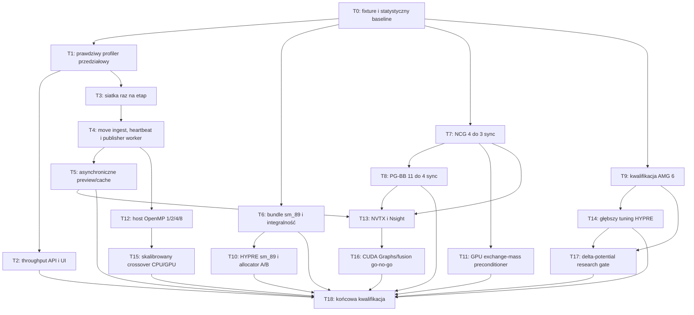

# FEM GPU End-to-End Performance Remediation Implementation Plan

> **For agentic workers:** REQUIRED SUB-SKILL: Use superpowers:subagent-driven-development (recommended) or superpowers:executing-plans to implement this plan task-by-task. Steps use checkbox (`- [ ]`) syntax for tracking.

**Goal:** Skrócić rzeczywisty czas od zaakceptowanego kroku do zaakceptowanego kroku oraz czas do tej samej tolerancji relaksacji FEM, usuwając potwierdzone koszty hosta, błąd architektury CUDA bundle, nadmiarowe synchronizacje i niekwalifikowane polityki solvera, bez obniżenia dokładności fizycznej, jakości preview ani kompletności artefaktów.

**Architecture:** Najpierw zamrażamy wersjonowany workload i naprawiamy pomiar całego przedziału, aby każda późniejsza zmiana miała porównywalny baseline. Następnie przenosimy niezmienne zasoby siatki oraz przygotowanie publikacji poza hot loop, naprawiamy pakowanie `sm_89`, redukujemy readbacki NCG/PG-BB i kwalifikujemy politykę AMG. Preconditioner, polityka CPU/GPU, HYPRE allocator, CUDA Graphs i delta-potential są osobnymi eksperymentami z bramką go/no-go; nie stają się defaultem bez lepszego czasu do tej samej tolerancji i pełnych bramek numerycznych.

**Tech Stack:** Rust, C++17, CUDA Runtime/NVTX, MFEM 4.9, HYPRE 3.1.0, libCEED 0.12.0, CUDA 12.4.1 w zarządzanym obrazie, Python 3, OpenAPI v2, React/TypeScript, repozytoryjne receptury `just` i Docker Compose.

## Global Constraints

- Punktem startowym jest bieżący stos MFEM 4.9/HYPRE 3.1.0 oraz zakończony plan `docs/superpowers/plans/2026-07-20-fem-gpu-ncg-demag-optimization.md`; nie powtarzać upgrade'u ani już wdrożonego reuse zaakceptowanego endpointu i persistent HYPRE setup.
- Audyt źródłowy i baseline znajdują się w `docs/audits/2026-07-20-fem-gpu-solver-performance-audit.md`. Obecny stan jest `implemented` i `production_executable` dla zbadanego wycinka; nie jest pełną walidacją fizyczną ani kwalifikacją NIST SP4.
- Główną funkcją celu jest `time_to_tolerance_seconds`, a dla stałego budżetu kroków `end_to_end_wall_time`; `GPU-Util` z `nvidia-smi` jest metryką pomocniczą, nigdy kryterium akceptacji.
- Baseline i candidate muszą używać tego samego ProblemIR, tej samej wersjonowanej siatki, tej samej tolerancji, tego samego stop reason contract i tej samej jakości preview/artefaktów.
- Nie wolno poluzować `demag rtol <= 1e-12` dla produkcyjnych direct minimizerów, tolerancji energii, kontroli normy `|m|`, kryterium Armijo, wymagań fresh-zero dla różnych trial endpoints ani bramek CPU/GPU parity.
- Explicit `device="gpu"` pozostaje fail-closed. Automatyczny crossover wolno stosować wyłącznie dla `device="auto"` i musi zachować requested oraz resolved execution w provenance.
- Nie dodawać nowej fizyki do `Context`, `mfem_bridge.cpp`, generycznego dispatchu ani orkiestratora. Właściciele to odpowiednio subsystem demag, subsystem relaxation, runner publication i resource-first API.
- Profiler pozostaje opt-in, bounded i bez alokacji próbek, serializacji oraz I/O, gdy `enabled=false`.
- Preview zachowuje domyślną rozdzielczość, maskę aktywnego obszaru, jednostki, quantity semantics i ostatnią kompletną klatkę. Obniżenie jakości jest poza zakresem tego planu.
- Istniejące stage-scoped mesh/dedup, background HTTP publisher, CUDA preview snapshots, pending handoff i `last_good` są punktami rozszerzenia, nie kodem do zastąpienia. Każdy task zaczyna się od testu potwierdzającego aktualny kontrakt i usuwa wyłącznie zmierzony koszt.
- Thin `/v2/sessions/current/status` pozostaje revision-driven. Szczegóły częstotliwości publishera należą do diagnostics, a świeżość pól do zasobów data/fields; `time_to_tolerance_seconds` jest własnością lifecycle wykonania etapu.
- Każdy wariant natywnego runtime ma hash-addressed bundle root, manifest, zestaw bibliotek i jawny mechanizm wyboru/odtworzenia. Rebuild nie może nadpisać jedynej kopii baseline'u.
- Task badawczy zakończony `no_go` usuwa cały prototype/runtime selection z normalnego drzewa; pozostają wyłącznie nota, test/oracle potrzebny do reprodukcji wyniku i raport kwalifikacji.
- Wszystkie natywne FEM/MFEM/CUDA/HYPRE buildy oraz dowody runtime wykonywać przez zarządzane receptury `just`. Hostowe `cargo test` i testy Pythona są testami pomocniczymi, nie końcowym dowodem GPU.
- Zmiany OpenAPI wykonywać resource-first: najpierw ADR/spec/schema, następnie generacja klienta; nie edytować ręcznie plików wygenerowanych.
- Zmiany planera/crossover wymagają podczas wykonania umiejętności `capability-matrix-check`; zmiany numeryczne preconditionera i delta-potential wymagają najpierw publikacyjnej noty fizycznej.
- Implementację prowadzić w izolowanym worktree. Nie modyfikować należących do użytkownika `external_solvers/3` ani `tests/standard_problems/mumag/sp4/fem/scenarios/relax_projected_gradient_bb.py`.
- Przed każdym commitem uruchomić osobno `git diff --cached --name-only` i potwierdzić, że staging zawiera wyłącznie pliki zadania. Nie commitować ani nie pushować bez świadomego zakresu.

---

## 1. Stan wejściowy i liczby odniesienia

Plan rozpoczyna się od aktualnego commitu, a nie od historycznego stanu sprzed upgrade'u:

- próbki użytkownika: mediana `Total` około 231,5 ms zamiast około 711,6 ms, czyli około 3,07× szybciej w próbce solvera;
- świeży bieg 64-krokowy: GPU 6257,015 ms, CPU 11117,381 ms, około 1,777× wall speedup;
- najlepszy sprawdzony pojedynczy profil AMG 6: ostatni krok 71,031 ms, demag 51,524 ms, 22 iteracje;
- normalna ścieżka NCG nadal wykonuje 4 sterujące synchronizacje na zaakceptowany krok;
- typowy nierozliczony koszt hosta wynosi około 115–127 ms/krok, ale obecny profiler przypisuje całe okno 16–18 kroków do jednego wiersza;
- workload około 1210 węzłów i 5154 tetraedrów jest za mały, aby stale nasycić RTX 4080;
- zarządzany `libfullmag_fem` zawiera kod `sm_52`/PTX zamiast natywnego `sm_89`; HYPRE ma `sm_60/70/80/90`, bez `sm_89`.

Te liczby są baseline audytu, nie stałymi progami dla wszystkich urządzeń. Task 0 zastępuje je powtarzalnym, wersjonowanym baseline'em.

## 2. Definicje metryk i bramki globalne

Po Task 2 każde porównanie używa następujących znaczeń:

| Metryka | Definicja | Źródło |
|---|---|---|
| `solver_steps_per_second` | zaakceptowane kroki / suma czasu faz natywnego solvera w tym samym domkniętym oknie (`native_solver_wall_time_ns`), bez callbacku/publikacji | profiler solvera |
| `end_to_end_steps_per_second` | zaakceptowane kroki / monotoniczny czas od pierwszego do ostatniego kroku w oknie | profiler przedziałowy |
| `published_steps_per_second` | różnica numerów kroków skutecznie opublikowanych / monotoniczny czas publikacji | publisher worker |
| `time_to_tolerance_seconds` | monotoniczny czas od startu etapu do potwierdzonego stop reason spełniającego tolerancję | lifecycle etapu |
| `unprofiled_gap_per_step_ns` | `(span_wall - profiled_step_total) / span_step_count` | profiler przedziałowy |

Globalna bramka promowania optymalizacji:

1. identyczny fixture i `solver_mesh_signature`;
2. 1 warmup + minimum 5 powtórzeń;
3. raport p50, p95 i odchylenia standardowego;
4. brak pogorszenia p95 end-to-end większego niż 5%;
5. brak pogorszenia czasu do tej samej tolerancji; dla preconditionera wymagane co najmniej 10% lepsze p50;
6. identyczny stop reason, residual contract, monotoniczność energii, norm defect i akceptowane CPU/GPU trajectory tolerances;
7. brak nowych pełnych H2D/D2H w hot loop i brak wzrostu bazowej liczby sync/step;
8. preview i artefakty kompletne oraz jakościowo identyczne;
9. profiler off/on i headless/interactive nie wykazują niewyjaśnionej różnicy;
10. każda nieudana hipoteza kończy się raportem no-go, a nie zmianą defaultu.

## 3. Zależności wykonania



Tasks 10, 11, 14, 15, 16 i 17 są warunkowe. Ich brak promocji nie blokuje zamknięcia P0/P1; blokuje jedynie twierdzenie, że dana hipoteza została wdrożona produkcyjnie.

## 4. Mapa plików

### Tworzone

- `examples/assets/fem_performance/box500_airbox_exchange_demag_v1.mesh.json` — wersjonowana siatka głównego workloadu.
- `examples/assets/fem_performance/box500_airbox_exchange_demag_v1.fixture.json` — ProblemIR/mesh/hash/stop-condition identity.
- `examples/assets/fem_performance/amg_qualification_suite_v1.json` — trzy rozmiary siatki i airbox factor 2.
- `benchmarks/fem-gpu/reference/pre-remediation/rtx4080-sm89/` — niezmienny baseline wejściowy i metadata urządzenia.
- `benchmarks/fem-gpu/accepted/rtx4080-sm89/` — promowany baseline po końcowej kwalifikacji.
- `scripts/inspect_cuda_architectures.py` i `scripts/test_inspect_cuda_architectures.py` — parser `cuobjdump` i fail-closed arch gate.
- `crates/fullmag-cli/src/solver_profile_persistence.rs` — bounded worker JSONL profilu.
- `crates/fullmag-cli/src/live_publisher_diagnostics.rs` — wydzielone bounded telemetry publishera bez dalszego rozrostu orkiestratora.
- `crates/fullmag-cli/src/stage_heartbeat.rs` — lekki stage heartbeat bez pól numerycznych i payloadów.
- `backends/fem/core/demag_solver_policy.hpp` i `backends/fem/core/demag_solver_policy.cpp` — jeden natywny właściciel defaultów i resolved AMG policy.
- `backends/fem/gpu/cuda/relaxation/exchange_mass_preconditioner.hpp` i `backends/fem/gpu/cuda/relaxation/exchange_mass_preconditioner.cpp` — opcjonalny device-resident preconditioner.
- `docs/physics/0581-fem-gpu-direct-minimizer-preconditioning.md` — kontrakt SPD, jednostki, warianty i walidacja.
- `docs/physics/0582-fem-deterministic-delta-potential-demag.md` — osobny kontrakt badawczy delta solve.
- `docs/adr/0021-fem-runtime-crossover-policy.md` — auto-only crossover z provenance.
- `scripts/analysis/capture_fem_gpu_nsight.py` — NVTX/Nsight capture i raport.
- `docs/audits/2026-07-20-fem-gpu-solver-performance-remediation-closure.md` — końcowy ledger dowodów.

### Głównie modyfikowane

- `scripts/analysis/fem_gpu_benchmark.py`, `scripts/test_validate_fem_relaxation_runtime_log.py`, `justfile` — fixture, statystyki, semantyczne performance gates.
- `crates/fullmag-runner/src/solver_profile.rs`, `crates/fullmag-runner/src/types.rs` — monotoniczne okna, fazy hosta i lekkie updates.
- `crates/fullmag-runner/src/fem/relax/direct_minimizer.rs`, `llg_overdamped.rs`, `preview.rs` — brak per-step mesh i domknięcie istniejącego async preview dla nadal synchronicznych quantity.
- `crates/fullmag-cli/src/step_utils.rs`, `orchestrator.rs`, `live_workspace.rs`, `types.rs` — move semantics, heartbeat, worker publication.
- `crates/fullmag-api/src/schemas/status.rs`, `schemas/diagnostics.rs`, `schemas/fields.rs`, handlers diagnostics/data — prawdziwe rate metrics i freshness we właściwych zasobach; thin status zawiera tylko wskaźniki/revisions.
- `apps/control-room/src/modules/footer/FooterTelemetry.tsx`, `FooterDiagnostics.tsx` i ich testy — jawne solver/end-to-end/published oraz current/delta/cumulative.
- `docs/adr/0011-resource-first-api.md`, `docs/specs/resource-first-control-room-api-v2.md` — kontrakt metryk.
- `crates/fullmag-fem-sys/build.rs`, `scripts/export_fem_gpu_runtime.sh`, `scripts/validate_managed_fem_runtime_bundle.py`, `compose.yaml`, `docker/fem-gpu/Dockerfile` — architektury i integralność bundle.
- `backends/fem/gpu/cuda/relaxation/nonlinear_cg.cpp`, `backends/fem/gpu/cuda/relaxation/pgbb.cpp`, `backends/fem/gpu/cuda/relaxation/direct_energy_increment.hpp` i `backends/fem/gpu/cuda/relaxation/direct_energy_increment.cpp` — redukcja readbacków.
- `backends/fem/gpu/cuda/demag_poisson/hypre_device_solver.cpp`, CPU odpowiednik oraz provenance — wspólna polityka AMG.
- `backends/fem/cpu/mfem/runtime/mfem_context.cpp` — host thread policy również dla GPU.
- `crates/fullmag-runner/src/solver_runtime/selection.rs`, `fem_selection.rs`, `registry.rs`, `fem/execution.rs` — dopiero po ADR: skalibrowany auto crossover.

---

### Task 0: Zamrozić fixture, statystyki i baseline przed zmianami

**Files:**

- Create: `examples/assets/fem_performance/box500_airbox_exchange_demag_v1.mesh.json`
- Create: `examples/assets/fem_performance/box500_airbox_exchange_demag_v1.fixture.json`
- Create: `examples/assets/fem_performance/amg_qualification_suite_v1.json`
- Create: `benchmarks/fem-gpu/reference/pre-remediation/rtx4080-sm89/benchmark.csv`
- Create: `benchmarks/fem-gpu/reference/pre-remediation/rtx4080-sm89/summary.json`
- Create: `benchmarks/fem-gpu/reference/pre-remediation/rtx4080-sm89/environment.json`
- Create: `benchmarks/fem-gpu/accepted/rtx4080-sm89/benchmark.csv`
- Create: `benchmarks/fem-gpu/accepted/rtx4080-sm89/summary.json`
- Create: `benchmarks/fem-gpu/accepted/rtx4080-sm89/environment.json`
- Create at execution: `.fullmag/runtimes/fem-gpu-variants/pre-remediation-sm52-<manifest-sha256>/snapshot.json`
- Modify: `scripts/analysis/fem_gpu_benchmark.py`
- Modify: `scripts/test_validate_fem_relaxation_runtime_log.py`
- Modify: `justfile`

**Interfaces:**

- Consumes: istniejące `--reuse-generated-domain-mesh`, `--accepted-baseline`, `--repeat`, `--gpu-warmup` i `solver_mesh_signature`.
- Produces: `--fixture-manifest PATH`, `--require-fixture-identity`, rozkłady `p50/p95/stddev`, hash-addressed snapshot całego baseline runtime oraz recepturę `verify-fem-gpu-performance-regression` wymagającą baseline'u.

- [ ] **Step 1: Dodać failing tests dla fixture identity i statystyk**

W `scripts/test_validate_fem_relaxation_runtime_log.py` dodać testy wymagające następującego kontraktu:

```python
def test_benchmark_summary_reports_distribution() -> None:
    benchmark = load_benchmark_module()
    summary = benchmark.summarize_distribution([10.0, 11.0, 12.0, 20.0, 30.0])
    assert summary == {
        "count": 5,
        "p50": 12.0,
        "p95": 30.0,
        "stddev": pytest.approx(7.5789181286),
    }

def test_fixture_identity_rejects_mesh_hash_drift(tmp_path) -> None:
    benchmark = load_benchmark_module()
    mesh = tmp_path / "mesh.json"
    mesh.write_text('{"nodes":[],"elements":[]}', encoding="utf-8")
    manifest = tmp_path / "fixture.json"
    manifest.write_text(json.dumps({
        "schema": "fullmag.fem_gpu.performance_fixture.v1",
        "solver_mesh_path": "mesh.json",
        "solver_mesh_sha256": "0" * 64,
    }), encoding="utf-8")
    with pytest.raises(ValueError, match="solver mesh sha256 mismatch"):
        benchmark.load_fixture_manifest(manifest)
```

- [ ] **Step 2: Uruchomić RED**

Run:

```bash
python3 -m pytest scripts/test_validate_fem_relaxation_runtime_log.py \
  -k 'distribution or fixture_identity' -q
```

Expected: FAIL, ponieważ `summarize_distribution` i `load_fixture_manifest` nie istnieją.

- [ ] **Step 3: Wprowadzić deterministyczny kontrakt fixture i agregacji**

W `fem_gpu_benchmark.py` dodać dokładne interfejsy:

```python
@dataclass(frozen=True)
class PerformanceFixture:
    manifest_path: Path
    solver_mesh_path: Path
    solver_mesh_sha256: str
    solver_mesh_signature: str
    problem_ir_sha256: str
    stop_condition: dict[str, object]

def summarize_distribution(values: Sequence[float]) -> dict[str, float | int]:
    ordered = sorted(float(value) for value in values)
    if not ordered:
        raise ValueError("performance distribution requires at least one value")
    p95_index = max(0, math.ceil(0.95 * len(ordered)) - 1)
    return {
        "count": len(ordered),
        "p50": statistics.median(ordered),
        "p95": ordered[p95_index],
        "stddev": statistics.pstdev(ordered),
    }

def load_fixture_manifest(path: Path) -> PerformanceFixture:
    manifest_path = path.resolve()
    payload = json.loads(manifest_path.read_text(encoding="utf-8"))
    if payload.get("schema") != "fullmag.fem_gpu.performance_fixture.v1":
        raise ValueError("unsupported FEM GPU performance fixture schema")
    mesh_path = (manifest_path.parent / str(payload["solver_mesh_path"])).resolve()
    actual_sha256 = hashlib.sha256(mesh_path.read_bytes()).hexdigest()
    expected_sha256 = str(payload["solver_mesh_sha256"])
    if actual_sha256 != expected_sha256:
        raise ValueError(
            f"solver mesh sha256 mismatch: expected {expected_sha256}, got {actual_sha256}"
        )
    return PerformanceFixture(
        manifest_path=manifest_path,
        solver_mesh_path=mesh_path,
        solver_mesh_sha256=expected_sha256,
        solver_mesh_signature=str(payload["solver_mesh_signature"]),
        problem_ir_sha256=str(payload["problem_ir_sha256"]),
        stop_condition=dict(payload["stop_condition"]),
    )

def verify_fixture_row(
    row: Mapping[str, object], fixture: PerformanceFixture
) -> list[str]:
    failures: list[str] = []
    if row.get("solver_mesh_signature") != fixture.solver_mesh_signature:
        failures.append("solver_mesh_signature differs from fixture")
    if row.get("problem_ir_sha256") != fixture.problem_ir_sha256:
        failures.append("problem_ir_sha256 differs from fixture")
    return failures
```

Do importów dodać `hashlib`, `math`, `statistics`, `dataclass`, `Mapping` i `Sequence`; do testu dodać `json` oraz `pytest`. Loader kanonikalizuje ścieżkę względem manifestu, liczy SHA-256 i odrzuca niezgodność przed uruchomieniem solvera.

- [ ] **Step 4: Wygenerować fixture wyłącznie zarządzaną ścieżką**

Dodać argumenty `--write-fixture-manifest PATH` oraz `--write-fixture-suite PATH` i recepturę `generate-fem-gpu-performance-fixtures`, która uruchamia skrypt w kontenerze dla wskazanych trzech rozdzielczości. Uruchomić:

```bash
just generate-fem-gpu-performance-fixtures
```

Receptura najpierw wywołuje `just ensure-managed-fem-runtime`, następnie `docker compose --profile fem-gpu run --rm fem-gpu` z `PYTHONPATH=/workspace/packages/fullmag-py/src`, `--steps 1`, `--reuse-generated-domain-mesh`, trwałym cache `examples/assets/fem_performance`, `--write-fixture-manifest examples/assets/fem_performance/box500_airbox_exchange_demag_v1.fixture.json` i `--write-fixture-suite examples/assets/fem_performance/amg_qualification_suite_v1.json`. Skrypt zapisuje mesh oraz manifest zawierający wyliczone, a nie ręcznie wpisane: SHA-256 mesh, `solver_mesh_signature`, SHA-256 kanonicznego ProblemIR, node/element count, airbox factor, demag rtol i benchmark-only torque target. Dla suite komenda wykonuje trzy generacje z `domain_hmax/airbox_hmax` równymi `250e-9/500e-9`, `100e-9/250e-9` i `50e-9/100e-9`, po czym zapisuje wszystkie trzy ścieżki oraz hashe do `amg_qualification_suite_v1.json`.

- [ ] **Step 5: Dodać mocną recepturę regresji**

`verify-fem-gpu-performance-regression` ma zawsze przekazywać:

```text
--fixture-manifest examples/assets/fem_performance/box500_airbox_exchange_demag_v1.fixture.json
--require-fixture-identity
--gpu-warmup
--repeat 5
--require-stable-solver-mesh
--accepted-baseline benchmarks/fem-gpu/accepted/rtx4080-sm89/benchmark.csv
--require-accepted-baseline
--max-performance-regression-percent 5
```

Receptura ma fail-closed, jeśli urządzenie nie pasuje do `environment.json`; nie może porównywać np. RTX 4080 do innego GPU jako tego samego baseline'u.

- [ ] **Step 6: Zamrozić binarny runtime i zarejestrować pre-remediation baseline**

Przed pierwszym rebuildem skopiować lub utworzyć hardlink snapshot całego zwalidowanego bundle do `.fullmag/runtimes/fem-gpu-variants/pre-remediation-sm52-<manifest-sha256>/`. `snapshot.json` zapisuje SHA-256 manifestu, `libfullmag_fem`, faktycznie załadowanego HYPRE/MFEM/libCEED, wynik arch inspection, GPU UUID/name/compute capability, driver/toolkit i komendę wyboru tego bundle. Test restore uruchamia walidator na snapshot root i potwierdza, że późniejszy eksport do `fem-gpu-host` nie zmienia inode/hash snapshotu. Sam CSV bez odtwarzalnych bibliotek nie jest baseline'em architektury.

Run:

```bash
FULLMAG_BENCH_REPEAT=5 \
FULLMAG_BENCH_STEPS=64 \
FULLMAG_BENCH_RELAX_ALGORITHMS=nonlinear_cg \
FULLMAG_BENCH_DEMAG_AMG_RELAX_TYPES=6 \
just verify-fem-gpu-demag-performance-benchmark
```

Expected: pięć porównywalnych GPU runs, jedna signature, CPU oracle, p50/p95/stddev, residual i synchronizacje. Skopiować identyczne CSV/summary/environment do `reference/pre-remediation` jako niezmienny historyczny punkt oraz do `accepted` jako bieżący baseline wymagany przez następne tasks. `environment.json` zapisuje osobno target GPU `sm_89`, faktyczny kod bundle `sm_52`/PTX, hash-addressed bundle root i wszystkie library hashes, aby późniejsze A/B architektury było rzeczywiście odtwarzalne.

- [ ] **Step 7: GREEN i commit**

Run `python3 -m pytest scripts/test_validate_fem_relaxation_runtime_log.py -q`, następnie zarządzaną recepturę z Step 6.

```bash
git add examples/assets/fem_performance benchmarks/fem-gpu/reference \
  benchmarks/fem-gpu/accepted \
  scripts/analysis/fem_gpu_benchmark.py \
  scripts/test_validate_fem_relaxation_runtime_log.py justfile
git diff --cached --name-only
git commit -m "test: freeze FEM GPU performance baseline"
```

---

### Task 1: Naprawić profiler przedziałowy i rozliczyć fazy hosta

**Files:**

- Modify: `crates/fullmag-runner/src/solver_profile.rs`
- Modify: `crates/fullmag-runner/src/types.rs`
- Modify: `crates/fullmag-cli/src/orchestrator.rs`
- Modify: `crates/fullmag-cli/src/live_workspace.rs`
- Modify: `crates/fullmag-api/src/schemas/diagnostics.rs`
- Modify: `apps/control-room/src/modules/footer/FooterDiagnostics.tsx`
- Test: inline test modules w plikach Rust wymienionych wyżej
- Test: `apps/control-room/src/modules/footer/FooterDiagnostics.test.ts`

**Interfaces:**

- Consumes: `StepStats`, monotoniczny `Instant`, istniejący bounded `SolverProfileState`.
- Produces: prawdziwe okno kroków i fazy `mesh_payload`, `live_state_build`, `publisher_replace`, `profile_persist_enqueue`, `publisher_http`.
- Produces: także jawne `native_solver_wall_time_ns` jako sumę natywnych faz solvera w dokładnie tym samym oknie; `StepStats.wall_time_ns` zachowuje dotychczasowe znaczenie całego synchronicznego kroku i nie jest przemianowane po cichu.

- [ ] **Step 1: Napisać RED dla wielokrokowego okna**

Test Rust ma podać trzy kroki o `wall_time_ns=10 ms` w monotonicznym oknie `100 ms` i wymagać:

```rust
assert_eq!(sample.span_first_step, 11);
assert_eq!(sample.span_last_step, 13);
assert_eq!(sample.span_step_count, 3);
assert_eq!(sample.span_monotonic_wall_time_ns, 100_000_000);
assert_eq!(sample.profiled_step_total_ns, 30_000_000);
assert_eq!(sample.unprofiled_gap_total_ns, 70_000_000);
assert_eq!(sample.unprofiled_gap_per_step_ns, 23_333_333);
```

Drugi test przesuwa `sample_time_unix_ms` wstecz i potwierdza, że span oparty o `Instant` pozostaje dodatni.

- [ ] **Step 2: Uruchomić RED pomocniczo**

Run:

```bash
CARGO_TARGET_DIR=/tmp/fullmag-profile-target \
cargo test -p fullmag-runner solver_profile -- --nocapture
```

Expected: FAIL na brakujących polach. Ten host test nie jest dowodem FEM GPU.

- [ ] **Step 3: Rozszerzyć model próbki bez zmiany disabled path**

Dodać:

```rust
#[derive(Debug, Clone, Serialize, Deserialize, PartialEq, Eq)]
#[serde(rename_all = "snake_case")]
pub enum SolverProfileSampleKind {
    NormalStep,
    Publish,
    Preview,
    Finalization,
    Stall,
}

pub struct SolverProfilePhaseWindow {
    pub id: String,
    pub label: String,
    pub sum_wall_time_ns: u64,
    pub mean_wall_time_ns: u64,
    pub max_wall_time_ns: u64,
}
```

`SolverProfileStepSample` otrzymuje pola wskazane w teście, `sample_kinds: Vec<SolverProfileSampleKind>` oraz `phase_windows`. `record_step` ma natychmiast wracać przed `Instant::now()` i przed budowaniem wektorów, gdy profiler jest wyłączony. Prywatne `record_step_at(&StepStats, Instant)` zapewnia deterministyczne testy.

Agregator zamyka wszystkie rate na jednym zakresie `[span_first_step, span_last_step]`: licznik jest sumą zaakceptowanych kroków w tym oknie, `native_solver_wall_time_ns` jest sumą natywnych faz tych samych próbek, a end-to-end używa monotonicznego span tego samego okna. Zabronione jest łączenie ostatniego kroku z licznikiem całego runu.

- [ ] **Step 4: Dodać dokładne host phase counters**

`StepStats` otrzymuje:

```rust
pub mesh_payload_wall_time_ns: u64,
pub step_update_deep_clone_count: u64,
pub live_state_build_wall_time_ns: u64,
pub publisher_replace_wall_time_ns: u64,
pub profile_persist_enqueue_wall_time_ns: u64,
```

Koszt workera HTTP oraz profilu jest raportowany w osobnych diagnostics i nie jest fałszywie dodawany do natywnego `wall_time_ns`. `orchestration_wall_time_ns` obejmuje cały synchroniczny callback aż do powrotu do solvera.

- [ ] **Step 5: Naprawić UI znaczenie wiersza**

Tabela ma wyświetlać `Span steps`, `Span wall`, `Gap total`, `Gap/step`, a fazy ostatniego kroku oznaczać jako `last step`. Sumy okna są osobną sekcją. `Missing` pozostaje wyłącznie różnicą wewnątrz ostatniego `StepStats`, nie synonimem host gap.

- [ ] **Step 6: GREEN i zarządzany smoke**

Run:

```bash
CARGO_TARGET_DIR=/tmp/fullmag-profile-target cargo test -p fullmag-runner solver_profile
pnpm --dir apps/control-room test -- FooterDiagnostics.test.ts
just verify-fem-relaxation-runtime
```

Expected: testy przechodzą; managed log zawiera monotoniczne okno i nieujemne `Gap/step`.

- [ ] **Step 7: Commit**

```bash
git add crates/fullmag-runner/src/solver_profile.rs crates/fullmag-runner/src/types.rs \
  crates/fullmag-cli/src/orchestrator.rs crates/fullmag-cli/src/live_workspace.rs \
  crates/fullmag-api/src/schemas/diagnostics.rs \
  apps/control-room/src/modules/footer/FooterDiagnostics.tsx \
  apps/control-room/src/modules/footer/FooterDiagnostics.test.ts
git diff --cached --name-only
git commit -m "fix: make FEM solver profiling interval-accurate"
```

---

### Task 2: Naprawić throughput API, OpenAPI i etykiety artefaktów

**Files:**

- Modify first: `docs/adr/0011-resource-first-api.md`
- Modify first: `docs/specs/resource-first-control-room-api-v2.md`
- Modify only for compatibility/revision wiring: `crates/fullmag-api/src/schemas/status.rs`
- Modify only for compatibility/revision wiring: `crates/fullmag-api/src/router_v2/handlers/sessions/status.rs`
- Modify: `crates/fullmag-api/src/schemas/diagnostics.rs`
- Modify: stage execution/completion resource schema and handler owning `time_to_tolerance_seconds`
- Modify: `crates/fullmag-cli/src/orchestrator.rs`
- Modify: `crates/fullmag-cli/src/live_workspace.rs`
- Regenerate: `apps/control-room/src/kernel/api/generated/openapi-v2.json`
- Regenerate: `apps/control-room/src/kernel/api/generated/openapi-v2-types.ts`
- Regenerate: `apps/control-room/src/kernel/api/generated/openapi-v2-client.ts`
- Regenerate: `apps/control-room/src/kernel/api/generated/openapi-v2-paths.ts`
- Modify: `apps/control-room/src/modules/footer/FooterTelemetry.tsx`
- Modify: `apps/control-room/src/modules/footer/FooterDiagnostics.tsx`
- Test: inline `#[cfg(test)]` modules przy diagnostics rate aggregator, stage completion resource oraz compatibility status alias
- Test: `apps/control-room/src/modules/footer/FooterTelemetry.test.ts`
- Test: `apps/control-room/src/modules/footer/FooterDiagnostics.test.ts`
- Test: `apps/control-room/src/kernel/api/ControlRoomApi.test.ts`

**Interfaces:**

- Consumes: okna z Task 1 i successful-publish diagnostics.
- Produces: trzy jawne rate metrics z oknem i revision w diagnostics, `time_to_tolerance_seconds` w stage execution completion oraz przejściowy alias starego pola bez dalszego pogrubiania thin status.

- [ ] **Step 1: Zapisać decyzję API przed kodem**

ADR 0011 ma określić:

```text
diagnostics.rates.solver_steps_per_second     = accepted steps / native_solver_wall_time_ns in the same closed window
diagnostics.rates.end_to_end_steps_per_second = accepted-step monotonic span rate
diagnostics.rates.published_steps_per_second  = successfully published-step rate
stage_execution.completion.time_to_tolerance_seconds = present only for tolerance-qualified completion
status.steps_per_second = deprecated compatibility alias of end_to_end value; no new rate payloads are added to thin status
```

Każda rate jest obiektem `{ value, window_step_count, window_wall_time_ns, source_revision }`. Alias usuwa się po dwóch wersjach API i po migracji jedynego klienta Control Room.

- [ ] **Step 2: Napisać RED dla błędnego fallbacku**

Test agregatora tworzy okno 10 kroków, `native_solver_wall_time_ns=2 s`, monotoniczny span `5 s` i trzy skuteczne publikacje w `3 s`. Oczekiwanie:

```rust
assert_eq!(metrics.solver_steps_per_second.unwrap().value, 5.0);
assert_eq!(metrics.end_to_end_steps_per_second.unwrap().value, 2.0);
assert_eq!(metrics.published_steps_per_second.unwrap().value, 1.0);
assert_eq!(compat_status.steps_per_second, Some(2.0));
```

Przy braku span `end_to_end` i alias muszą być `None`; zakazane jest `total_steps / last_step.wall_time`.

- [ ] **Step 3: Dodać typ API**

```rust
pub struct RateMetric {
    pub value: f64,
    pub window_step_count: u64,
    pub window_wall_time_ns: u64,
    pub source_revision: u64,
}

pub struct SolverRateDiagnostics {
    pub solver_steps_per_second: Option<RateMetric>,
    pub end_to_end_steps_per_second: Option<RateMetric>,
    pub published_steps_per_second: Option<RateMetric>,
}
```

Publisher zapisuje monotoniczny span wyłącznie po udanym HTTP sync. Lifecycle etapu zapisuje `time_to_tolerance` wyłącznie, gdy `StageCompletionIR` potwierdza osiągnięcie kryterium, nigdy dla `max_steps`, cancel lub failure. Thin status niesie jedynie resource revisions i przejściowy stary alias.

- [ ] **Step 4: Rozdzielić artefakt current/delta/cumulative**

`FooterDiagnostics` pokazuje:

- `enqueue now`: bieżący czas i bajty;
- `queue current / max`: dwie osobne wartości;
- `writer delta`: różnica jobs i wall time od poprzedniej próbki;
- `writer cumulative`: tylko tooltip/expanded detail;
- `GPU sync delta` jako różnicę od poprzedniej próbki oraz `GPU sync cumulative` jako licznik od początku runu.

Test ma odrzucać historyczne `q3` jako bieżącą głębokość, gdy `current=1`.

- [ ] **Step 5: Wygenerować OpenAPI, nie edytować generated ręcznie**

Run:

```bash
pnpm --dir apps/control-room generate:api
pnpm --dir apps/control-room check:api-hygiene
```

- [ ] **Step 6: GREEN**

Run:

```bash
CARGO_TARGET_DIR=/tmp/fullmag-api-metrics-target cargo test -p fullmag-api session_status
pnpm --dir apps/control-room test -- FooterTelemetry.test.ts FooterDiagnostics.test.ts
pnpm --dir apps/control-room typecheck
pnpm --dir apps/control-room lint
```

Expected: status nie zawiera matematycznie błędnego lifetime fallbacku; footer opisuje trzy różne rates.

- [ ] **Step 7: Commit**

```bash
git add docs/adr/0011-resource-first-api.md \
  docs/specs/resource-first-control-room-api-v2.md \
  crates/fullmag-api crates/fullmag-cli/src/orchestrator.rs \
  crates/fullmag-cli/src/live_workspace.rs apps/control-room
git diff --cached --name-only
git commit -m "fix: expose truthful FEM throughput metrics"
```

---

### Task 3: Publikować siatkę FEM raz na etap

**Files:**

- Modify: `crates/fullmag-runner/src/types.rs`
- Modify: `crates/fullmag-runner/src/fem/relax/direct_minimizer.rs`
- Modify: `crates/fullmag-runner/src/fem/relax/llg_overdamped.rs`
- Modify: `crates/fullmag-runner/src/frequency_response.rs`
- Modify: `crates/fullmag-runner/src/interactive_runtime.rs` and FEM submodules constructing updates
- Modify: `crates/fullmag-runner/src/hysteresis.rs`
- Modify: `crates/fullmag-runner/src/lib.rs`
- Modify: `crates/fullmag-runner/src/quantities.rs`
- Modify: all constructing/consuming call sites in `crates/fullmag-runner/src/session.rs`
- Modify: `crates/fullmag-cli/src/types.rs`
- Modify: `crates/fullmag-cli/src/step_utils.rs`
- Modify: `crates/fullmag-cli/src/orchestrator.rs`
- Modify: `crates/fullmag-cli/src/live_workspace.rs`
- Test: inline `#[cfg(test)]` modules w `crates/fullmag-runner/src/fem/relax/direct_minimizer.rs`
- Test: inline `#[cfg(test)]` modules w `crates/fullmag-cli/src/live_workspace.rs`
- Test: request compatibility tests w `crates/fullmag-api/src/types.rs`

**Interfaces:**

- Consumes: istniejące `fem_mesh_payload_from_backend_plan` i top-level `CurrentLiveSnapshotPayload.fem_mesh`.
- Produces: stage-scoped `FemMeshPayload`, `StepUpdate.fem_mesh_generation_id` i kontrolowaną migrację wszystkich producentów/konsumentów; nested compatibility mesh znika dopiero po przejściu kompletnego call-site gate.

- [ ] **Step 1: Napisać RED dowodzący jednego fingerprintu**

Test wykonuje trzy callbacki i instrumentuje `FemMeshPayload::from(plan)`. Oczekuje:

```rust
assert_eq!(mesh_payload_build_count, 1);
assert!(updates.iter().all(|update| update.fem_mesh_generation_id.as_deref() == Some(expected)));
assert!(serialized_latest_step.get("fem_mesh").is_none());
```

Test API potwierdza, że top-level mesh jest przyjęty raz, a późniejsze runtime frames zachowują go po stronie API.

- [ ] **Step 2: RED**

Run:

```bash
CARGO_TARGET_DIR=/tmp/fullmag-mesh-hotloop-target \
cargo test -p fullmag-runner direct_minimizer -- --nocapture
CARGO_TARGET_DIR=/tmp/fullmag-mesh-hotloop-target \
cargo test -p fullmag-cli publish_delta_promotes_domain_mesh_once -- --nocapture
```

Expected: FAIL; obecnie mesh powstaje w każdym callbacku i występuje w `latest_step`.

- [ ] **Step 3: Zmienić kontrakt update**

Najpierw dodać stage resource oraz lekkie generation ID, zachowując przejściowo odczyt starego pola dla kompatybilności deserializacji. Po migracji wszystkich konstruktorów (`frequency_response`, `interactive_runtime`, `hysteresis`, `lib`, `quantities`, `session` oraz relax) `StepUpdate` traci runtime ownership `fem_mesh: Option<FemMeshPayload>` i otrzymuje:

```rust
#[serde(default, skip_serializing_if = "Option::is_none")]
pub fem_mesh_generation_id: Option<String>,
```

`LiveStepView` traci nested mesh dopiero po testach compatibility. Top-level stage mesh pozostaje jedynym wire ownerem. Runner wylicza payload/fingerprint przed wejściem do pętli i przekazuje tylko generation ID w każdym kroku. Istniejące stage-level mesh/dedup w `orchestrator`, `live_workspace` i `session` jest reużywane, a nie implementowane drugi raz.

- [ ] **Step 4: Usunąć compatibility duplication**

`LocalLiveWorkspaceState` przechowuje stage mesh oddzielnie od `LiveStateManifest`. `build_publish_payload(include_mesh)` klonuje go najwyżej podczas stage-init/full-resync, nigdy w normalnym step delta. `published_fem_mesh_generation_id` nadal tłumi powtórki.

- [ ] **Step 5: Dodać semantic source gate**

Test ma sprawdzać brak `FemMeshPayload::from(plan)` wewnątrz callback closures, brak runtime zapisów `StepUpdate.fem_mesh` we wszystkich call sites wskazanych przez `rg`, oraz po zakończeniu migracji brak pola `fem_mesh` w `StepUpdate`/`LiveStepView`. Nie sprawdzać numerów linii ani dokładnego stylu pętli. Gate musi wykonać pełne `rg "StepUpdate\\s*\\{|\\.fem_mesh" crates/fullmag-runner crates/fullmag-cli crates/fullmag-api` i sklasyfikować każdy pozostały wynik.

- [ ] **Step 6: GREEN i pomiar**

Run:

```bash
just verify-fem-relaxation-source-contract
just verify-fem-relaxation-runtime
FULLMAG_BENCH_REPEAT=5 just verify-fem-gpu-performance-regression
```

Acceptance: `mesh_payload_build_count=1/stage`, `step_update_deep_clone_count=0`, brak zmiany generation ID/revisions, gap p50 maleje lub zostaje w pełni przypisany do dalszych faz.

- [ ] **Step 7: Commit**

```bash
git add crates/fullmag-runner/src crates/fullmag-cli/src \
  crates/fullmag-api/src backends/fem/tests justfile
git diff --cached --name-only
git commit -m "perf: remove FEM mesh payload from the step hot loop"
```

---

### Task 4: Wprowadzić move-based ingest, lekki heartbeat i worker publikacji/profilu

**Files:**

- Create: `crates/fullmag-cli/src/solver_profile_persistence.rs`
- Create: `crates/fullmag-cli/src/stage_heartbeat.rs`
- Create: `crates/fullmag-cli/src/live_publisher_diagnostics.rs`
- Modify: `crates/fullmag-cli/src/main.rs`
- Modify: `crates/fullmag-cli/src/step_utils.rs`
- Modify: `crates/fullmag-cli/src/orchestrator.rs`
- Modify: `crates/fullmag-cli/src/live_workspace.rs`
- Modify: `crates/fullmag-cli/src/types.rs`
- Modify: `crates/fullmag-runner/src/solver_profile.rs`
- Test: inline tests w `crates/fullmag-cli/src/orchestrator.rs`
- Test: inline tests w `crates/fullmag-cli/src/live_workspace.rs`
- Test: inline tests w `crates/fullmag-cli/src/solver_profile_persistence.rs`

**Interfaces:**

- Consumes: lekki `StepUpdate` z Task 3.
- Produces: `offset_step_update(StepUpdate, u64, f64, bool) -> StepUpdate`, wydzielony `StageHeartbeatProgress`, worker-built delta na istniejącym background publisherze, wydzielone publisher diagnostics i bounded profile persistence.

- [ ] **Step 1: RED dla ownership i heartbeat**

Test source/behavior wymaga sygnatury:

```rust
pub(crate) fn offset_step_update(
    mut update: fullmag_runner::StepUpdate,
    step_offset: u64,
    time_offset: f64,
    finished: bool,
) -> fullmag_runner::StepUpdate
```

oraz lekkiego snapshotu:

```rust
#[derive(Clone)]
struct StageHeartbeatProgress {
    stats: fullmag_runner::StepStats,
    hysteresis_field_m_t: Option<f64>,
    finished: bool,
    last_step_at: Instant,
    stage_started_at: Instant,
}
```

Test nie pozwala, by heartbeat przechowywał `StepUpdate`, magnetization, preview lub mesh.

- [ ] **Step 2: Przenieść ownership przez callback**

Kolejność callbacku:

```text
offset_step_update(update, step_offset, time_offset, finished)
heartbeat.record(&update)        # klonuje wyłącznie StepStats
profiler observes &update.stats
apply_live_step_update_to_workspace_state(
    state, run_id, session_id, artifact_dir, update, include_scalar_row
)
return StepAction
```

`live_state_manifest_from_update` oraz `apply_live_step_update_to_workspace_state` konsumują update i używają `Option::take`/move dla magnetization i preview. Zachowanie zachowania ostatniego kompletnego pola realizuje jawny merge stanu, bez klonowania całego update.

- [ ] **Step 3: Przenieść budowę delta do workera**

Nie tworzyć drugiego workera HTTP: `LocalLiveWorkspace::update` ma dalej używać istniejącego background publishera, ale synchronicznie tylko mutuje state i wywołuje `request_publish()`. Istniejący worker po throttle pobiera state, a po zmianie sam buduje `publish_delta`, wykonuje scalar filtering/merge/size estimation i HTTP. Synchroniczna ścieżka solvera raportuje wyłącznie czas mutacji oraz enqueue/wake. Nowa logika heartbeat i diagnostics trafia do nowych modułów, nie powiększa dalej `orchestrator.rs` ani `live_workspace.rs` poza cienkim wiringiem.

Wymagany kontrakt diagnostyczny:

```rust
pub struct LivePublisherDiagnostics {
    pub state_lock_wall_time_ns: u64,
    pub delta_build_wall_time_ns: u64,
    pub replace_wall_time_ns: u64,
    pub clone_wall_time_ns: u64,
    pub http_wall_time_ns: u64,
    pub published_first_step: u64,
    pub published_last_step: u64,
    pub published_span_wall_time_ns: u64,
    // istniejące bounded counters pozostają
}
```

- [ ] **Step 4: Wprowadzić bounded profile persistence**

`SolverProfilePersistWorker` przyjmuje `SolverProfilePersistJob { artifact_dir, sample }` przez `sync_channel(16)`. Producer nie serializuje JSON i nie otwiera pliku. `try_send` nie blokuje; pełna kolejka ustawia widoczny `persistence_failed=true`, zapisuje jeden engine error i wyłącza dalsze persist dla runu zamiast po cichu gubić próbki.

- [ ] **Step 5: RED/GREEN test powolnego API i powolnego dysku**

Z fake sinkiem blokującym 250 ms zmierzyć pięć callbacków. Oczekiwanie:

```rust
assert!(callback_p95 < Duration::from_millis(10));
assert_eq!(publisher_diagnostics.publish_count, 1); // coalesced
assert_eq!(profile_worker.persistence_failed, false);
```

Drugi test wypełnia kolejkę profilu i wymaga jawnego failure state bez blokady callbacku.

- [ ] **Step 6: Managed acceptance**

Run:

```bash
just verify-fem-relaxation-runtime
FULLMAG_BENCH_REPEAT=5 just verify-fem-gpu-performance-regression
```

Acceptance: normalny `unprofiled_gap_per_step` p50 < 20 ms na głównym fixture albo każda pozostała część jest nazwana; p95 callbacku nie przekracza 10 ms poza krokiem zawierającym nowy heavy field handoff.

- [ ] **Step 7: Commit**

```bash
git add crates/fullmag-cli/src crates/fullmag-runner/src/solver_profile.rs
git diff --cached --name-only
git commit -m "perf: move FEM live publication off the solver callback"
```

---

### Task 5: Domknąć istniejący async preview/cache poza deadline kroku bez obniżenia jakości

**Files:**

- Modify: `crates/fullmag-runner/src/fem/relax/preview.rs`
- Modify: `crates/fullmag-runner/src/fem/relax/direct_minimizer.rs`
- Modify: `crates/fullmag-runner/src/fem/relax/llg_overdamped.rs`
- Modify: `crates/fullmag-runner/src/native_fem.rs`
- Modify: `crates/fullmag-runner/src/types.rs`
- Modify: `crates/fullmag-api/src/types.rs`
- Modify: `crates/fullmag-api/src/schemas/fields.rs`
- Modify: właściwe handlers/resources `data/fields` wybrane po source audit; nie dodawać freshness payload do thin status
- Regenerate: `apps/control-room/src/kernel/api/generated/openapi-v2.json`
- Regenerate: `apps/control-room/src/kernel/api/generated/openapi-v2-types.ts`
- Regenerate: `apps/control-room/src/kernel/api/generated/openapi-v2-client.ts`
- Regenerate: `apps/control-room/src/kernel/api/generated/openapi-v2-paths.ts`
- Modify: `apps/control-room/src/kernel/resources/studyRuntimeResources.ts`
- Modify: `apps/control-room/src/kernel/resources/studyRuntimeResources.test.ts`
- Modify: `apps/control-room/src/modules/viewport-3d/hooks/useViewport3DSceneModel.ts`
- Modify: `apps/control-room/src/modules/viewport-3d/hooks/useViewport3DSceneModel.test.ts`
- Modify: `apps/control-room/src/modules/viewport-3d/viewport3dDiagnostics.test.ts`

**Interfaces:**

- Consumes: `NativeFemPreviewSnapshot` i `NativeFemFieldSnapshot`, które są `Send`.
- Produces: rozszerzenie istniejących CUDA snapshotów, pending handoff i `last_good` o quantity nadal materializowane synchronicznie oraz freshness metadata zasobu pola. Nie tworzy konkurencyjnego `FemPreviewMaterializer`.

- [ ] **Step 1: RED dla nieblokującego heavy preview**

Najpierw test charakteryzujący potwierdza, że istniejące `NativeFemPreviewSnapshot`/`NativeFemFieldSnapshot`, pending handoff i `last_good` wykonują asynchroniczny przypadek magnetization/demag bez blokady. Następnie fake energy-density snapshot czeka 80 ms. Solver callback ma jedynie przekazać go istniejącym mechanizmem i natychmiast zwrócić; wynik jest publikowany później:

```rust
assert!(handoff_elapsed < Duration::from_millis(2));
assert_eq!(preview_state.last_good("H_demag").unwrap().source_step, 40);
assert_eq!(preview_state.pending_step("H_demag"), Some(50));
```

Test energii `eden_total` wymaga, aby solver thread nie wywoływał `copy_live_preview_field`.

- [ ] **Step 2: Rozszerzyć istniejący bounded handoff, bez drugiego workera**

```rust
pub(crate) struct PreviewResult {
    pub request_revision: u64,
    pub source_step: u64,
    pub materialization_wall_time_ns: u64,
    pub field: LivePreviewField,
}

pub(crate) struct PendingFemPreviewState { /* existing one-in-flight ownership */ }

impl PendingFemPreviewState {
    pub fn can_accept(&self) -> bool;
    pub fn submit(&self, job: PendingFemPreviewJob) -> Result<(), PendingFemPreviewJob>;
    pub fn try_take_completed(&self) -> Option<Result<PreviewResult, RunError>>;
}
```

Przed utworzeniem snapshotów solver sprawdza istniejące `can_accept`; dzięki temu nie niszczy w locie snapshotu przy pełnej kolejce. Gdy handoff jest zajęty, zachowana zostaje ostatnia kompletna klatka i rośnie jawny `preview_superseded_count`. Nazwy i typy implementacyjne mają podążać za aktualnym `preview.rs`; pseudokod nie upoważnia do duplikacji już obecnego stanu.

- [ ] **Step 3: Obsłużyć energy density przez async field snapshots**

`PendingFemPreviewJob::EnergyDensity` zawiera snapshot `m`, wymagane snapshoty `H_*`, `Ms`, maskę i prefaktory. Worker po ich gotowości liczy tę samą formułę `prefactor * mu0 * Ms * dot(m,h)` i sumuje aktywne termy. Nie dodawać nowej fizyki do FFI i nie wykonywać synchronicznego wielokrotnego D2H w callbacku.

- [ ] **Step 4: Dodać staleness resource contract**

Preview field/resource w data/fields otrzymuje:

```text
source_step
source_revision
materialized_at_unix_ms
stale_by_steps
materialization_wall_time_ns
state = complete | stale_complete | pending | error
```

Control Room nadal renderuje `stale_complete`, jeżeli topology generation jest zgodna; nie czyści widoku podczas oczekiwania. Zmiana quantity nadal kończy się ostatnią kompletną klatką odpowiedniego quantity albo jawnym pending. Thin session status publikuje wyłącznie revision zasobu pola, nie kopię freshness metadata.

- [ ] **Step 5: Porównać macierz preview**

Uruchomić na tym samym fixture: disabled, `m`, `H_demag`, pełny cache; cadence 10/25/50; headless, interactive bez przeglądarki i z otwartym Control Room. Każdy wariant 1 warmup + 5 repeats.

Acceptance: p50 synchronicznego enqueue < 2 ms, brak piku około 79 ms w solver callbacku, identyczne wartości i maski preview, brak idle redraw regression w `audit:compute-performance`.

- [ ] **Step 6: Verification**

Run:

```bash
just verify-fem-relaxation-runtime
pnpm --dir apps/control-room test
pnpm --dir apps/control-room audit:compute-performance
pnpm --dir apps/control-room typecheck
pnpm --dir apps/control-room lint
```

- [ ] **Step 7: Commit**

```bash
git add crates/fullmag-runner crates/fullmag-api apps/control-room docs/adr/0011-resource-first-api.md \
  docs/specs/resource-first-control-room-api-v2.md
git diff --cached --name-only
git commit -m "perf: materialize FEM previews outside the solver deadline"
```

---

### Task 6: Naprawić architekturę CUDA i integralność zarządzanego bundle

**Files:**

- Create: `scripts/inspect_cuda_architectures.py`
- Create: `scripts/test_inspect_cuda_architectures.py`
- Modify: `crates/fullmag-fem-sys/build.rs`
- Modify: `compose.yaml`
- Modify: `scripts/export_fem_gpu_runtime.sh`
- Modify: `scripts/validate_managed_fem_runtime_bundle.py`
- Modify: `scripts/test_export_fem_gpu_runtime_copy_helpers.py`
- Modify: `docker/fem-gpu/Dockerfile`
- Modify: `justfile`
- Modify: `crates/fullmag-runner/src/native_fem.rs`
- Modify: `crates/fullmag-runner/src/types.rs`
- Modify: `crates/fullmag-api/src/schemas/diagnostics.rs`

**Interfaces:**

- Consumes: `FULLMAG_CUDA_ARCHITECTURES`.
- Produces: manifest schema v2 z hashami bibliotek i rzeczywistymi cubin/PTX, exact `sm_89` gate dla `libfullmag_fem.so` oraz faktycznie załadowanego HYPRE, a także jawny hash-addressed candidate bundle i restore/select command.

- [ ] **Step 1: RED dla build.rs i walidatora**

Test source wymaga:

```text
cargo:rerun-if-env-changed=FULLMAG_CUDA_ARCHITECTURES
cmake.define("CMAKE_CUDA_ARCHITECTURES", value)
```

Test walidatora tworzy bundle z prawidłowymi binarkami, ale biblioteką raportującą tylko `sm_52`; `--require-native-cubin sm_89` musi zwrócić non-zero.

- [ ] **Step 2: Dodać parser `cuobjdump`**

Interfejs:

```python
@dataclass(frozen=True)
class CudaCodeObjects:
    cubins: Sequence[str]
    ptx: Sequence[str]

def _architectures(output: str, prefix: str) -> Sequence[str]:
    pattern = re.compile(rf"\b{re.escape(prefix)}_[0-9]+\b")
    return tuple(sorted(set(pattern.findall(output))))

def _ptx_targets(output: str) -> Sequence[str]:
    pattern = re.compile(r"(?m)^\s*\.target\s+sm_([0-9]+[a-z]?)\b")
    return tuple(
        sorted({f"compute_{match}" for match in pattern.findall(output)})
    )

def inspect_cuda_binary(
    path: Path, cuobjdump: str = "cuobjdump"
) -> CudaCodeObjects:
    def run(flag: str) -> str:
        result = subprocess.run(
            [cuobjdump, flag, str(path)],
            check=False,
            capture_output=True,
            text=True,
        )
        if result.returncode != 0:
            raise RuntimeError(
                f"{cuobjdump} {flag} failed for {path}: {result.stderr.strip()}"
            )
        return result.stdout

    return CudaCodeObjects(
        cubins=_architectures(run("--list-elf"), "sm"),
        ptx=_ptx_targets(run("--dump-ptx")),
    )

def supports_native(objects: CudaCodeObjects, sm: str) -> bool:
    return sm in objects.cubins
```

Do importów dodać `re`, `subprocess`, `dataclass`, `Path` i `Sequence`. Parser używa `cuobjdump --list-elf` dla nazw cubinów, ale profil PTX bierze z dyrektywy `.target sm_*` zwracanej przez `cuobjdump --dump-ptx`; nie zakłada, że nazwa osadzonego pliku PTX zawiera `compute_*`. Sortuje/deduplikuje architektury i fail-closed przy błędzie narzędzia lub gdy zarówno zbiór cubinów, jak i PTX jest pusty dla biblioteki oznaczonej `cuda_required=true`. Zachowanie narzędzia i oba tryby odczytu są zdefiniowane w [oficjalnej dokumentacji NVIDIA CUDA Binary Utilities](https://docs.nvidia.com/cuda/cuda-binary-utilities/).

- [ ] **Step 3: Propagować architektury w każdej ścieżce build**

Managed portable Fullmag matrix:

```text
80-real;89-real;90-real;90-virtual
```

HYPRE matrix:

```text
60 70 80 89 90
```

`compose.yaml` ustawia Fullmag matrix; lokalna receptura może użyć `native`, ale eksportowany bundle musi mieć jawny, zapisany zestaw. Zmiana env wymusza rerun Cargo build script.

- [ ] **Step 4: Rozszerzyć manifest schema v2**

Manifest zawiera dla `libfullmag_fem`, MFEM, HYPRE i libCEED:

```json
{
  "path": "lib/libfullmag_fem.so.0.1.0",
  "sha256": "calculated-by-export",
  "soname": "libfullmag_fem.so.0",
  "cuda_required": true,
  "cubins": ["sm_80", "sm_89", "sm_90"],
  "ptx": ["compute_90"]
}
```

Top-level build metadata zawiera MFEM `4.9`, HYPRE `3.1.0`, libCEED `0.12.0`, CUDA toolkit, compiler i requested/effective architectures. Walidator hashuje rozwiązaną bibliotekę, nie sam symlink, i potwierdza przez loader trace/`ldd` oraz runtime diagnostics, którą bibliotekę HYPRE ładuje launcher. Gate sprawdza oba obiekty CUDA oddzielnie; `sm_89` tylko w Fullmag nie wystarcza.

Eksport zapisuje wynik do `.fullmag/runtimes/fem-gpu-variants/<variant>-<manifest-sha256>/`, a alias `fem-gpu-host` jest wyłącznie wyborem aktywnego bundle. Receptury `select-fem-gpu-runtime-variant` i `validate-fem-gpu-runtime-variant` potrafią przełączyć baseline/candidate bez rebuilda i potwierdzają wszystkie hashe.

- [ ] **Step 5: Rebuild i fail-closed proof**

Run:

```bash
just rebuild-fem-runtime
just ensure-managed-fem-runtime
python3 scripts/inspect_cuda_architectures.py \
  --binary .fullmag/runtimes/fem-gpu-host/lib/libfullmag_fem.so \
  --require-native-cubin sm_89
```

Expected: `sm_89` występuje osobno w Fullmag i faktycznie załadowanym HYPRE; manifest hashes przechodzą; wykryte compute capability runtime to `8.9` i jest zgodne z bundle.

- [ ] **Step 6: Cold/steady A/B**

Porównać zachowany reference bundle `sm_52 PTX-JIT` i candidate `sm_89`: osobno czas pierwszego create/first solve oraz steady p50/p95. Nie wymagać określonego speedupu; poprawność pakowania jest P0 niezależnie od wyniku.

- [ ] **Step 7: Managed regression i commit**

Run:

```bash
just verify-fem-demag-poisson-contract
just verify-fem-time-domain-native-contract
just verify-fem-frequency-domain-native-contract
just verify-fem-relaxation-runtime
```

```bash
git add crates/fullmag-fem-sys/build.rs compose.yaml docker/fem-gpu/Dockerfile \
  scripts/inspect_cuda_architectures.py scripts/test_inspect_cuda_architectures.py \
  scripts/export_fem_gpu_runtime.sh scripts/validate_managed_fem_runtime_bundle.py \
  scripts/test_export_fem_gpu_runtime_copy_helpers.py justfile
git diff --cached --name-only
git commit -m "fix: package native CUDA architectures in FEM runtime"
```

---

### Task 7: Udowodnić i utrwalić kanoniczne NCG 3 sync/krok bez regresji

**Files:**

- Modify: `backends/fem/gpu/cuda/relaxation/nonlinear_cg.cpp`
- Modify: `backends/fem/gpu/cuda/relaxation/direct_energy_increment.hpp`
- Modify: `backends/fem/gpu/cuda/relaxation/direct_energy_increment.cpp`
- Modify: `backends/fem/tests/relaxation_source_contract.cpp`
- Modify: `backends/fem/tests/relaxation_energy_derivative_contract.cpp`
- Modify: `scripts/analysis/fem_gpu_benchmark.py`
- Modify: `scripts/test_validate_fem_relaxation_runtime_log.py`
- Modify: `justfile`
- Modify: `docs/physics/0532-fem-demag-solver-policy-and-runtime-threading.md`

**Interfaces:**

- Consumes: pole `GpuDirectArmijoResult::trial_snapshot.total_energy_j` zwracane przez `gpu_direct_armijo_evaluate`.
- Produces: świeży source/runtime proof istniejącego compute-only effective-field helpera i dokładny skumulowany sync budget; implementacja zmienia się tylko jeśli test najpierw wykaże regresję względem kontraktu.

- [ ] **Step 1: RED dla normalnego zaakceptowanego kroku**

Test używa kanonicznego wzoru z noty 0532:

```python
extra_armijo_reads = max(0, total_rhs_evals - 2 * executed_steps)
expected_max = initial_syncs + 3 * executed_steps + extra_armijo_reads
assert hot_loop_control_scalar_host_sync_count <= expected_max
```

Test C++ wymaga, by trial total energy pochodziła z `armijo_result.trial_snapshot.total_energy_j`, a nie osobnego `gpu_copy_scalar_to_host`.

- [ ] **Step 2: Scharakteryzować istniejące rozdzielenie compute/readback i naprawić tylko odchylenie**

Wprowadzić helper:

```cpp
bool gpu_relax_compute_effective_field_and_energy_terms(
    Context &ctx,
    cudaStream_t stream,
    int node_count,
    int block_count,
    std::string &reason);
```

Test source najpierw potwierdza, że helper już liczy fresh demag, effective field i final energy term slots w istniejącym `gpu.reductions.scalar_result`, ale nie kopiuje total energy na host. Normalna i recovery ścieżka mają używać direct Armijo batch. Nie reimplementować helpera, jeśli ten kontrakt przechodzi.

- [ ] **Step 3: Zachować failure diagnostics**

Po każdej próbie:

```cpp
last_trial_energy_j = armijo_result.trial_snapshot.total_energy_j;
```

Komunikat wyczerpania line search, finite checks, rollback, refinement i fresh-zero semantics pozostają bez zmian.

- [ ] **Step 4: GREEN**

Run:

```bash
just verify-fem-relaxation-source-contract
just verify-fem-relaxation-runtime
FULLMAG_BENCH_GPU_NCG_CONTROL_READBACK_PER_STEP=3 \
FULLMAG_BENCH_RELAX_ALGORITHMS=nonlinear_cg \
FULLMAG_BENCH_REPEAT=5 \
just verify-fem-gpu-performance-regression
```

Acceptance: dokładny limit `initial_syncs + 3 * executed_steps + max(0, total_rhs_evals - 2 * executed_steps)`; dodatkowe sync odpowiadają każdemu kolejnemu trialowi Armijo. Brak osobnych, ręcznie liczonych `direction_recovery_reads`. Energia i trajektoria przechodzą dotychczasowe bramki.

- [ ] **Step 5: Commit**

```bash
git add backends/fem/gpu/cuda/relaxation backends/fem/tests \
  scripts/analysis/fem_gpu_benchmark.py \
  scripts/test_validate_fem_relaxation_runtime_log.py \
  docs/physics/0532-fem-demag-solver-policy-and-runtime-threading.md justfile
git diff --cached --name-only
git commit -m "perf: remove redundant FEM GPU NCG energy readback"
```

---

### Task 8: Udowodnić i utrwalić kanoniczne PG-BB 4 sync/krok oraz usunąć stare testowe sufity

**Files:**

- Modify: `backends/fem/gpu/cuda/relaxation/pgbb.cpp`
- Modify: `backends/fem/gpu/cuda/relaxation/pgbb_kernels.hpp`
- Modify: `backends/fem/gpu/cuda/relaxation/pgbb_kernels.cu`
- Modify: `backends/fem/gpu/cuda/relaxation/direct_energy_increment.hpp`
- Modify: `backends/fem/gpu/cuda/relaxation/direct_energy_increment.cpp`
- Modify: `backends/fem/tests/relaxation_source_contract.cpp`
- Modify: `backends/fem/tests/relaxation_energy_derivative_contract.cpp`
- Modify: `scripts/analysis/fem_gpu_benchmark.py`
- Modify: `scripts/test_validate_fem_relaxation_runtime_log.py`
- Modify: `justfile`
- Modify: `docs/physics/0532-fem-demag-solver-policy-and-runtime-threading.md`

**Interfaces:**

- Consumes: direct Armijo snapshot i packed reduction workspace.
- Produces: baseline 4 readbacks: current snapshot+metrics, Armijo decision+trial snapshot, accepted curvature, final stats.

- [ ] **Step 1: RED semantyczny**

Usunąć asercję `DEFAULT_GPU_PGBB_CONTROL_READBACK_PER_STEP == 11`. Nowy test wymaga:

```python
extra_armijo_reads = max(0, total_rhs_evals - 2 * executed_steps)
expected_max = initial_syncs + 4 * executed_steps + extra_armijo_reads
assert control_syncs <= expected_max
```

Source test zakazuje dwóch osobnych current-state scalar copies oraz trial total readbacku bezpośrednio przed direct Armijo. `total_rhs_evals` jest sumą wszystkich zwróconych rekordów kroków, nie wartością ostatniego kroku.

- [ ] **Step 2: Spakować current energy i gradient metrics**

Jeden device buffer/readback zawiera current energy snapshot, gradient norm, projected gradient norm i wymagane finite flags. Host rozpakowuje jeden `GpuPgbbCurrentMetrics`.

- [ ] **Step 3: Użyć Armijo trial snapshot**

Tak jak w Task 7, nie kopiować trial total energy przed `gpu_direct_armijo_evaluate`. Drugi bazowy sync jest wynikiem direct difference batch. Trzeci pozostaje curvature, czwarty final stats.

- [ ] **Step 4: Uaktualnić wszystkie recipes i docs jako jeden kontrakt**

Wartość 4 ma występować jako domyślny limit benchmarku, nie jako wymaganie dokładnego stylu źródła. Wspólna funkcja `expected_control_sync_budget(algorithm, executed_steps, total_rhs_evals, initial_syncs)` ma być jedynym właścicielem formuły w skrypcie i implementować dokładnie `base + per_step * executed_steps + max(0, total_rhs_evals - 2 * executed_steps)`.

- [ ] **Step 5: Managed GREEN**

Run:

```bash
just verify-fem-relaxation-source-contract
FULLMAG_BENCH_RELAX_ALGORITHMS=projected_gradient_bb \
FULLMAG_BENCH_GPU_PGBB_CONTROL_READBACK_PER_STEP=4 \
FULLMAG_BENCH_REPEAT=5 \
just verify-fem-relaxation-production-benchmark
```

Acceptance: 4 bazowe sync, brak zmiany Armijo/BB/restart, CPU/GPU consistency i energy monotonicity przechodzą.

- [ ] **Step 6: Commit**

```bash
git add backends/fem/gpu/cuda/relaxation backends/fem/tests scripts justfile \
  docs/physics/0532-fem-demag-solver-policy-and-runtime-threading.md
git diff --cached --name-only
git commit -m "perf: reduce FEM GPU PG-BB control readbacks"
```

---

### Task 9: Skwalifikować AMG relax 6 i scentralizować effective policy

**Files:**

- Create: `backends/fem/core/demag_solver_policy.hpp`
- Create: `backends/fem/core/demag_solver_policy.cpp`
- Modify: `backends/fem/CMakeLists.txt`
- Modify: `backends/fem/cpu/mfem/interactions/demag_poisson_hypre.cpp`
- Modify: `backends/fem/gpu/cuda/demag_poisson/hypre_device_solver.cpp`
- Modify: `native/include/fullmag_fem.h`
- Modify: `backends/fem/src/api.cpp`
- Modify: `crates/fullmag-fem-sys/src/lib.rs`
- Modify: `crates/fullmag-runner/src/types.rs`
- Modify: `crates/fullmag-runner/src/native_fem.rs`
- Modify: `crates/fullmag-runner/src/artifacts.rs`
- Modify: `scripts/analysis/fem_gpu_benchmark.py`
- Modify: `scripts/test_validate_fem_relaxation_runtime_log.py`
- Modify: `justfile`
- Create: `docs/audits/2026-07-20-fem-amg-relax-policy-qualification.md`

**Interfaces:**

- Consumes: suite z Task 0.
- Produces: jeden `ResolvedDemagAmgPolicy` i warunkowo default relax 6.

- [ ] **Step 1: RED dla jednego właściciela defaultu**

Test źródłowy ma zakazać niezależnych default/fallback owners w CPU solverze, GPU solverze i Rust artifact. Nie zakazuje literalnego `18` w kwalifikacyjnych fixtures/test vectors. Wymagany interfejs:

```cpp
struct ResolvedDemagAmgPolicy {
    int relax_type;
    int coarsening;
    int interpolation;
    int aggressive_coarsening;
    double strength_threshold;
    int max_levels;
};

ResolvedDemagAmgPolicy resolve_demag_amg_policy_from_environment();
```

- [ ] **Step 2: Przepisać provenance na effective values**

Native step stats ABI raportuje wszystkie resolved fields. Rust i artefakty kopiują effective values z ABI; nie odgadują defaultu ze źródła ani środowiska.

- [ ] **Step 3: Uruchomić kwalifikację 18 kontra 6**

Macierz:

- trzy fixture sizes z `amg_qualification_suite_v1.json`;
- CPU i GPU;
- NCG i PG-BB;
- profiler off/on;
- 1 warmup + 5 repeats;
- rtol `1e-12`;
- fixed-budget oraz jawny benchmark torque target `1e-4 T`, raportowany jako benchmark target, nie nowy default fizyczny.

Run bazowy:

```bash
FULLMAG_BENCH_DEMAG_AMG_RELAX_TYPES=18,6 \
FULLMAG_BENCH_RELAX_ALGORITHMS=projected_gradient_bb,nonlinear_cg \
FULLMAG_BENCH_REPEAT=5 \
just bench-fem-gpu-demag-amg-profile-sweep
```

- [ ] **Step 4: Zastosować jawny warunek promocji**

Promować 6 tylko jeśli:

- wszystkie przypadki converged i residual/parity/trajectory gates przechodzą;
- p50 demag apply i p50 end-to-end nie pogarszają się na żadnym rozmiarze o >5%;
- geometryczna średnia end-to-end poprawia się o co najmniej 5%;
- p95 nie pogarsza się o >5%;
- PCG symmetry contract pozostaje spełniony.

Jeżeli warunek przechodzi, zmienić wyłącznie centralną stałą na 6. Jeśli nie przechodzi, pozostawić 18, zachować 6 jako jawny eksperymentalny override i zapisać no-go summary.

- [ ] **Step 5: Managed regression**

Run:

```bash
just verify-fem-demag-poisson-contract
just verify-fem-relaxation-runtime
just verify-fem-relaxation-cpu-gpu-consistency-smoke
just verify-fem-gpu-performance-regression
```

- [ ] **Step 6: Commit policy i osobno ewentualny default**

```bash
git add backends/fem/core backends/fem/CMakeLists.txt backends/fem/cpu \
  backends/fem/gpu crates/fullmag-fem-sys crates/fullmag-runner scripts justfile
git diff --cached --name-only
git commit -m "refactor: centralize resolved FEM demag AMG policy"
```

Jeżeli bramka przeszła, drugi commit:

```bash
git commit -am "perf: promote qualified FEM AMG relax policy"
```

---

### Task 10: Zmierzyć osobno HYPRE `sm_89`, Umpire i async allocators

**Files:**

- Modify: `docker/fem-gpu/Dockerfile`
- Modify: `scripts/export_fem_gpu_runtime.sh`
- Modify: `scripts/validate_managed_fem_runtime_bundle.py`
- Modify: `scripts/test_export_fem_gpu_runtime_copy_helpers.py`
- Modify: `justfile`
- Create at execution: `.fullmag/reports/fem-hypre-variants/baseline.json`
- Create at execution: `.fullmag/reports/fem-hypre-variants/umpire.json`
- Create at execution: `.fullmag/reports/fem-hypre-variants/cuda_async.json`
- Create at execution: `.fullmag/reports/fem-hypre-variants/thrust_async.json`
- Create at execution: `.fullmag/runtimes/fem-gpu-variants/hypre-baseline-<manifest-sha256>/`
- Create at execution: `.fullmag/runtimes/fem-gpu-variants/hypre-umpire-<manifest-sha256>/`
- Create at execution: `.fullmag/runtimes/fem-gpu-variants/hypre-cuda-async-<manifest-sha256>/`
- Create at execution: `.fullmag/runtimes/fem-gpu-variants/hypre-thrust-async-<manifest-sha256>/`
- Create: `docs/audits/2026-07-20-fem-hypre-memory-strategy-qualification.md`

**Interfaces:**

- Consumes: arch validator z Task 6 i stabilny benchmark z Task 0.
- Produces: izolowane, hash-addressed build variants `baseline`, `umpire`, `cuda_async`, `thrust_async`, które można wybrać bez rebuilda; najwyżej jeden promowany.

- [ ] **Step 1: Wprowadzić jawne build args**

```dockerfile
ARG FULLMAG_HYPRE_GPU_ARCHS="60 70 80 89 90"
ARG FULLMAG_HYPRE_MEMORY_VARIANT=baseline
```

Mapowanie wariantów dla przypiętego HYPRE 3.1.0, zgodne z [oficjalnymi opcjami GPU HYPRE](https://hypre.readthedocs.io/en/stable/ch-misc.html):

| Wariant | Dodatkowe configure flags |
|---|---|
| `baseline` | `--without-umpire` |
| `umpire` | `--with-umpire --with-umpire-device` |
| `cuda_async` | `--without-umpire --enable-device-malloc-async` |
| `thrust_async` | `--without-umpire --enable-thrust-async` |

Build najpierw sprawdza `./configure --help`; brak wymaganej flagi przerywa dany wariant, nie przechodzi cicho do baseline.

- [ ] **Step 2: Zapis konfiguracji w manifeście**

Manifest rejestruje exact configure flags, HYPRE config macros, library hash i cubins. Validator potwierdza, że deklarowany wariant zgadza się z `HYPRE_config.h`. Każdy build eksportuje do osobnego immutable bundle root; A/B używa jawnego select/restore, nigdy kolejnych nadpisań `fem-gpu-host` bez zachowania poprzednika.

- [ ] **Step 3: A/B jedna zmienna naraz**

Dla każdego wariantu: świeży image/bundle, cold create/first solve, steady 64-step, 1 warmup + 5 repeats. Nie łączyć Umpire z async malloc ani z nową polityką AMG w tym porównaniu.

- [ ] **Step 4: Decyzja**

Promować wariant tylko przy co najmniej 5% poprawie właściwego celu (cold setup lub steady end-to-end), p95 bez regresji >5%, identycznej pamięci urządzenia w granicach +10% i pełnych bramkach residual/parity. W przeciwnym razie zachować baseline oraz raport no-go; nie pozostawiać nieużywanych build flags w normalnej ścieżce.

- [ ] **Step 5: Verification i commit**

Run dla zwycięzcy lub baseline:

```bash
just rebuild-fem-runtime
just ensure-managed-fem-runtime
just verify-fem-demag-poisson-contract
just verify-fem-gpu-performance-regression
```

Commit message: `build: qualify HYPRE GPU memory strategy`.

---

### Task 11: Zaprojektować i skwalifikować device-resident exchange-mass preconditioner

**Files:**

- Create first: `docs/physics/0581-fem-gpu-direct-minimizer-preconditioning.md`
- Create: `backends/fem/gpu/cuda/relaxation/exchange_mass_preconditioner.hpp`
- Create: `backends/fem/gpu/cuda/relaxation/exchange_mass_preconditioner.cpp`
- Modify: `backends/fem/gpu/cuda/relaxation/relaxation_state.hpp`
- Modify: `backends/fem/gpu/cuda/relaxation/relaxation_memory.cpp`
- Modify: `backends/fem/gpu/cuda/relaxation/nonlinear_cg.cpp`
- Modify: `backends/fem/gpu/cuda/relaxation/pgbb_kernels.hpp` tylko dla współdzielonych device ops
- Modify: `backends/fem/gpu/cuda/relaxation/pgbb_kernels.cu` tylko dla współdzielonych device ops
- Modify: `backends/fem/CMakeLists.txt`
- Modify: `native/include/fullmag_fem.h`
- Modify: `crates/fullmag-fem-sys/src/lib.rs`
- Modify: `crates/fullmag-runner/src/native_fem.rs`
- Modify: `crates/fullmag-runner/src/types.rs`
- Modify: `crates/fullmag-runner/src/artifacts.rs`
- Modify: właściwe provenance/API schemas dla resolved preconditioner strategy
- Modify: `backends/fem/tests/relaxation_source_contract.cpp`
- Modify: `backends/fem/tests/relaxation_energy_derivative_contract.cpp`
- Modify: `scripts/analysis/fem_gpu_benchmark.py`
- Modify: `scripts/test_validate_fem_relaxation_runtime_log.py`
- Modify: `justfile`

**Interfaces:**

- Consumes: uploaded exchange CSR, lumped mass, tangent gradient i krok `step_m_per_a`.
- Produces: `none`, `diagonal_mass`, `lumped_exchange_mass_cg4`, `lumped_exchange_mass_cg8`, `stagnation_triggered_cg8` jako wewnętrzne resolved strategies oraz jawny resolved strategy/parameters w native stats, provenance, artifacts i diagnostics API.

- [ ] **Step 1: Opublikować kontrakt numeryczny przed kodem**

Nota 0581 musi zawierać:

```text
P_lambda = diag(M_s M_lumped) + lambda * (2/mu0) K_A
z = Pi_T(m) P_lambda^{-1} diag(M_s M_lumped) g
```

z jednostkami SI, warunkiem SPD, obsługą zerowego Ms/maski, relacją do CPU consistent-mass preconditionera, brakiem wpływu na energię/stop condition, API/ProblemIR impact `none`, resolved provenance oraz pełnym planem walidacji.

- [ ] **Step 2: RED dla operatora i braku host sync**

Manufactured SPD tests porównują device result z małym CPU dense oracle. Source/runtime test wymaga zero nowych host scalar sync dla fixed-iteration CG4/CG8.

- [ ] **Step 3: Minimalna realizacja device-resident**

`ExchangeMassPreconditionerState` przechowuje wyłącznie bounded work vectors i signature operatora. Fixed-iteration CG wykonuje 4 lub 8 iteracji bez hostowego kryterium stop; finite flag jest łączony z istniejącym końcowym readbackiem. Operator jest reużywany, a zmiana `step_m_per_a`, mesh signature lub material signature unieważnia cache.

- [ ] **Step 4: Porównać pięć strategii**

Raportować time-to-tolerance, accepted steps, Armijo trials, demag solves, preconditioner wall, HYPRE wall, energy monotonicity, norm defect i parity. `stagnation_triggered` używa istniejących hostowych metryk restart/stagnation; nie dodaje readbacku.

- [ ] **Step 5: Go/no-go**

Strategia może zostać auto defaultem tylko jeśli p50 time-to-tolerance poprawia się >=10% na co najmniej dwóch z trzech rozmiarów, żaden nie pogarsza się >5%, p95 nie pogarsza się >5% i wszystkie fizyczne bramki przechodzą. Dla małego problemu selector może legalnie wybrać `none`.

Jeżeli żadna strategia nie przechodzi, usunąć runtime selection code, pozostawić notę i raport no-go; nie utrzymywać martwego preconditionera za domyślnym feature flagiem.

- [ ] **Step 6: Managed verification**

Run:

```bash
just verify-fem-exchange-runtime
just verify-fem-relaxation-source-contract
just verify-fem-relaxation-runtime
just verify-fem-relaxation-cpu-gpu-consistency-smoke
just verify-fem-gpu-performance-regression
```

- [ ] **Step 7: Commit**

Commit docs/contract osobno: `docs: specify FEM GPU relaxation preconditioning`. Implementację po przejściu bramki: `perf: add qualified FEM GPU relaxation preconditioner`.

---

### Task 12: Skwalifikować politykę host OpenMP dla trybu GPU

**Files:**

- Modify: `backends/fem/cpu/mfem/runtime/mfem_context.cpp`
- Modify: `backends/fem/cpu/mfem/runtime/mfem_context.hpp`
- Modify: `backends/fem/cpu/mfem/runtime/cpu_threads.cpp`
- Modify: `backends/fem/cpu/mfem/runtime/cpu_threads.hpp`
- Modify: `native/include/fullmag_fem.h`
- Modify: `crates/fullmag-fem-sys/src/lib.rs`
- Modify: `crates/fullmag-runner/src/native_fem.rs`
- Modify: `crates/fullmag-runner/src/solver_profile.rs`
- Modify: `scripts/analysis/fem_gpu_benchmark.py`
- Modify: `scripts/test_validate_fem_relaxation_runtime_log.py`
- Modify: `justfile`

**Interfaces:**

- Consumes: istniejący `configure_cpu_openmp_runtime` i requested/effective thread telemetry.
- Produces: host-runtime thread policy wykonywaną także dla GPU, bez wpływu na CUDA/HYPRE device execution policy.

- [ ] **Step 1: RED**

Test tworzy GPU context z requested 4 i wymaga `effective_fem_omp_threads=4`, a nie `gpu-bypass`, przy zachowaniu `hypre_execution_policy=device`.

- [ ] **Step 2: Wydzielić wspólne host setup**

Zmienić nazwę/zakres helpera na `configure_fem_host_runtime_threads`; wywołać przed rozgałęzieniem CPU/GPU. GPU stream creation pozostaje wyłącznie w GPU branch. Nie równoleglić Rust clone/hash — te koszty powinny już zniknąć w Tasks 3–4.

- [ ] **Step 3: A/B 1/2/4/8**

Po Tasks 3–5 wykonać 1 warmup + 5 repeats dla każdego thread count, profiler off/on i UI headless/interactive. Zmierzyć create/setup, steady solver, callback gap i kontencję publisher/writer.

- [ ] **Step 4: Promocja**

Zmieniony default tylko przy >=5% end-to-end p50, p95 bez regresji >5% i braku wzrostu CPU oversubscription. W przeciwnym razie pozostawić 1, ale raportować go jako świadomą resolved policy, nie przypadkowy bypass.

- [ ] **Step 5: Verification i commit**

Run:

```bash
just verify-fem-time-domain-native-contract
just verify-fem-relaxation-runtime
just verify-fem-gpu-performance-regression
```

Commit: `perf: qualify FEM GPU host thread policy`.

---

### Task 13: Dodać NVTX i powtarzalne ślady Nsight

**Files:**

- Create: `scripts/analysis/capture_fem_gpu_nsight.py`
- Create: `scripts/test_capture_fem_gpu_nsight.py`
- Create: `backends/fem/gpu/cuda/runtime/nvtx_ranges.hpp`
- Modify: `backends/fem/CMakeLists.txt`
- Modify: `backends/fem/gpu/cuda/relaxation/nonlinear_cg.cpp`
- Modify: `backends/fem/gpu/cuda/relaxation/pgbb.cpp`
- Modify: `backends/fem/gpu/cuda/demag_poisson/stage_compute.cpp`
- Modify: `backends/fem/gpu/cuda/demag_poisson/hypre_stream_interop.cpp`
- Modify: `crates/fullmag-runner/src/fem/relax/preview.rs`
- Modify: `crates/fullmag-cli/src/orchestrator.rs`
- Modify: `crates/fullmag-cli/src/live_workspace.rs`
- Modify: `scripts/export_fem_gpu_runtime.sh`
- Modify: `justfile`

**Interfaces:**

- Consumes: CUDA Toolkit NVTX headers, fixed fixture/run ID, ukończone Tasks 7 i 8 oraz zarządzany obraz zawierający sprawdzone `nsys` i `ncu`.
- Produces: opt-in ranges i JSON/Markdown trace summary; zero NVTX calls w normalnym buildzie, jeśli opcja wyłączona.

- [ ] **Step 1: RED dla stabilnych range IDs**

Test źródłowy wymaga nazw:

```text
fem.relax.ncg.step
fem.relax.armijo
fem.demag.rhs
fem.demag.hypre.apply
fem.demag.recovery
fem.preview.snapshot
fem.host.callback
fem.host.publish
```

Preflight receptury sprawdza `nsys --version` i `ncu --version` wewnątrz tego samego zarządzanego obrazu, który uruchamia fixture. Brak narzędzia jest statusem `unavailable` i blokuje Tasks 16/17 jako nieweryfikowalne; nie jest zielonym wynikiem capture. Dockerfile może dodać narzędzia dopiero po potwierdzeniu zgodnej wersji CUDA i warunków dystrybucji.

- [ ] **Step 2: Dodać opt-in `FULLMAG_ENABLE_NVTX`**

W release default `OFF`. Makro RAII nie alokuje i kompiluje się do no-op przy OFF. Nie dodawać range per element/kernel; zakresy mają odpowiadać fazom audytu.

- [ ] **Step 3: Capture harness**

Skrypt uruchamia zarządzany fixture przez `nsys profile`, potem `nsys stats --report cuda_api_sum,cuda_gpu_kern_sum,nvtx_sum`, zapisuje run ID, bundle hashes, architektury i parsuje:

- CPU launch gaps;
- czas stream waits;
- HYPRE apply;
- liczby/redukcje kerneli;
- preview overlap;
- callback/publisher overlap.

Osobny, krótki `ncu` pass zbiera occupancy, achieved bandwidth, launch grid i warp stalls dla top 5 kerneli. Brak narzędzia kończy recepturę komunikatem `unavailable`, nie fałszywym pass.

- [ ] **Step 4: Verification i commit**

Run:

```bash
just rebuild-fem-runtime
just capture-fem-gpu-nsight
just verify-fem-relaxation-runtime
```

Commit: `perf: add opt-in FEM GPU Nsight instrumentation`.

---

### Task 14: Wykonać głębszy tuning AMG/coarse solve po stabilizacji pomiaru

**Files:**

- Modify: `scripts/analysis/fem_gpu_benchmark.py`
- Modify: `justfile`
- Modify after positive gate: `backends/fem/core/demag_solver_policy.hpp`
- Modify after positive gate: `backends/fem/core/demag_solver_policy.cpp`
- Create: `docs/audits/2026-07-20-fem-amg-coarse-strategy-qualification.md`

**Interfaces:**

- Consumes: suite, profiler i Nsight z Tasks 0/1/13 oraz wspólny policy owner z Task 9.
- Produces: jedna stała polityka albo bounded size-class selector; nigdy swobodny autotuner w produkcyjnym hot path.

- [ ] **Step 1: Zdefiniować sweep**

Izolować kolejno:

1. relax 6/18 i inne GPU-supported smoothery;
2. PMIS/HMIS coarsening;
3. interpolation 3/6/14/15;
4. aggressive coarsening 0/1;
5. strength threshold;
6. max levels/coarse cutoff.

Nie łączyć zmian przed wyłonieniem zwycięzcy poprzedniej osi. Funkcja celu: median demag apply i end-to-end przy spełnionym residual/trajectory contract, nie sama liczba iteracji.

- [ ] **Step 2: Dodać symmetry legality gate**

Każdy wariant używany z PCG musi przejść test symetrii/preconditioner legality. Niesymetryczny wariant jest odrzucany albo testowany wyłącznie z jawnie zgodnym solverem; nie zmieniać CG na GMRES bez osobnej kwalifikacji czasu i trajektorii.

- [ ] **Step 3: Warunkowy size-class selector**

Selector wolno dodać tylko jeśli różne klasy mają stabilnie różnych zwycięzców. Klucz zawiera wyłącznie setup-time facts: rows, nnz, levels estimate i device capability. Nie używa zmiennych timingów z bieżącego kroku.

- [ ] **Step 4: Go/no-go i managed regression**

Wymaga >=5% geometric-mean improvement, brak case regression >5%, p95 bez regresji >5%, pełny CPU oracle. Jeśli brak, zachować policy z Task 9.

Run:

```bash
COMPOSE_PROJECT_NAME=fullmag just bench-fem-gpu-demag-amg-profile-sweep
COMPOSE_PROJECT_NAME=fullmag just verify-fem-demag-poisson-contract
COMPOSE_PROJECT_NAME=fullmag just verify-fem-relaxation-runtime
COMPOSE_PROJECT_NAME=fullmag just verify-fem-frequency-domain-native-contract
COMPOSE_PROJECT_NAME=fullmag just verify-fem-gpu-performance-regression
```

Commit: `perf: qualify FEM demag AMG policy by problem size` tylko gdy selector przechodzi; w przeciwnym razie commit wyłącznie raportu `docs: record FEM AMG tuning no-go`.

---

### Task 15: Zastąpić surowy node threshold skalibrowanym crossoverem CPU/GPU

**Files:**

- Create first: `docs/adr/0021-fem-runtime-crossover-policy.md`
- Modify: `docs/specs/capability-matrix-v0.md`
- Modify: `docs/specs/capability-matrix-v0.json`
- Modify: `docs/specs/runtime-distribution-and-managed-backends-v1.md`
- Create: `crates/fullmag-runner/src/solver_runtime/fem_crossover.rs`
- Modify: `crates/fullmag-runner/src/solver_runtime/selection.rs`
- Modify: `crates/fullmag-runner/src/solver_runtime/fem_selection.rs`
- Modify: `crates/fullmag-runner/src/solver_runtime/registry.rs`
- Modify: `crates/fullmag-runner/src/fem/execution.rs`
- Modify: `crates/fullmag-runner/src/types.rs`
- Modify: `crates/fullmag-api/src/schemas/status.rs`
- Modify: `crates/fullmag-api/src/router_v2/handlers/sessions/status.rs`
- Modify: `apps/control-room/src/modules/footer/FooterTelemetry.tsx`
- Modify: `apps/control-room/src/modules/footer/FooterTelemetry.test.ts`
- Create: `benchmarks/fem-gpu/crossover/rtx4080-sm89.json`

**Interfaces:**

- Consumes: CPU/GPU benchmark suite po usunięciu host overhead.
- Produces: versioned, signed/hashed `FemCrossoverProfileV1` oraz `FemCrossoverDecision { requested, resolved, reason, calibration_id, confidence }` wyłącznie dla `auto`; explicit GPU jest fail-closed.

- [ ] **Step 1: ADR przed implementacją**

ADR musi rozstrzygnąć:

- explicit CPU/GPU nigdy nie jest zmieniane przez performance policy;
- `auto` używa tylko pasującego, wersjonowanego calibration profile;
- brak profilu zachowuje obecne availability-first GPU preference;
- node count sam nie wystarcza; profil uwzględnia rows, nnz, demag, algorithm i preview mode;
- hysteresis band zapobiega niestabilnej decyzji przy granicy;
- provenance zawsze pokazuje requested i resolved.
- profil zapisuje rozkład próbek, nie tylko punkt crossover: fixture IDs, p50/p95/stddev/count, warmup/repeat policy, bundle/library hashes, GPU UUID/name/compute capability, driver/toolkit, CPU identity, schema version i profile SHA-256/signature;
- lookup fail-closed odrzuca niezgodny schema/hash/device/library identity i nie może zastosować profilu innego GPU;
- `matrix_nnz` nie istnieje obecnie w `FemPlanIR`: ADR ma najpierw ustalić canonical owner i sposób wyliczenia po assembly. Nie rozszerzać IR tylko dla wygody selektora, jeśli planner może użyć istniejącego operator summary bez zmiany publicznej semantyki.

- [ ] **Step 2: RED dla obecnego `FULLMAG_FEM_GPU_MIN_NODES`**

Test ma wykazać, że explicit script `device="gpu"` nie może zostać cicho przełączony przez `FULLMAG_FEM_GPU_MIN_NODES`: jeśli GPU/runtime/capability jest niedostępny, wykonanie kończy się błędem zamiast CPU fallbacku. Nowy test `auto` z poprawnym profilem wybiera CPU poniżej dolnej granicy i GPU powyżej górnej; profil ze złym SHA, GPU identity lub library hashes jest odrzucany.

- [ ] **Step 3: Implementacja kalibracji poza hot path**

```rust
pub struct FemCrossoverFeatures {
    pub node_count: u64,
    pub matrix_nnz: Option<u64>, // populated only by the canonical assembled-operator owner
    pub demag_enabled: bool,
    pub relaxation_algorithm: String,
    pub preview_enabled: bool,
}

pub fn resolve_auto_fem_device(
    features: &FemCrossoverFeatures,
    profile: Option<&FemCrossoverProfile>,
) -> FemCrossoverDecision;
```

Runtime tylko odczytuje profil; nie wykonuje CPU/GPU trial solve użytkownika. Stary `FULLMAG_FEM_GPU_MIN_NODES` zostaje wyłącznie jawnym debug override z deprecation warning, a następnie jest usuwany według ADR.

Brak `matrix_nnz` nie może być zastąpiony zmyśloną wartością ani wymusić zmiany `FemPlanIR`; decyzja używa jawnie wersjonowanego profilu dla dostępnego zestawu cech albo przechodzi do opisanej w ADR polityki availability-first dla `auto`.

- [ ] **Step 4: Capability/API/UI propagation**

Zaktualizować capability matrix, provenance i Control Room, aby wyświetlał `requested auto → resolved cpu/gpu`, calibration ID i reason. Nie dodawać nowego publicznego device enum.

- [ ] **Step 5: Verification**

Run:

```bash
just verify-fem-relaxation-runtime
just verify-fem-time-domain-native-contract
just verify-fem-frequency-domain-native-contract
pnpm --dir apps/control-room generate:api
pnpm --dir apps/control-room typecheck
pnpm --dir apps/control-room lint
pnpm --dir apps/control-room test
```

- [ ] **Step 6: Commit**

ADR/capability commit: `docs: define calibrated FEM runtime crossover`. Implementacja po akceptacji ADR: `feat: resolve FEM auto device from qualified crossover data`.

---

### Task 16: CUDA Graphs i kernel fusion tylko po dowodzie launch-bound

**Files:**

- Create after positive gate: `backends/fem/gpu/cuda/relaxation/relaxation_graph.hpp`
- Create after positive gate: `backends/fem/gpu/cuda/relaxation/relaxation_graph.cpp`
- Modify after positive gate: `backends/fem/gpu/cuda/relaxation/relaxation_state.hpp`
- Modify after positive gate: `backends/fem/gpu/cuda/relaxation/relaxation_memory.cpp`
- Modify after positive gate: `backends/fem/gpu/cuda/relaxation/nonlinear_cg.cpp`
- Modify after positive gate: `backends/fem/gpu/cuda/relaxation/pgbb.cpp`
- Modify after positive gate: `backends/fem/CMakeLists.txt`
- Create: `docs/audits/2026-07-20-fem-gpu-cuda-graphs-evaluation.md`

**Interfaces:**

- Consumes: Task 13 traces wykonane po ukończeniu Tasks 7 i 8 oraz potwierdzone dostępne `nsys`/`ncu`.
- Produces: najwyżej graph dla stabilnych Fullmag-owned kernel segments; HYPRE i host-driven Armijo pozostają poza graphem, dopóki capture legality nie jest jawnie potwierdzona.

- [ ] **Step 1: Go/no-go przed kodem**

Implementować prototype tylko jeśli Nsight pokazuje jednocześnie:

- >=15% end-to-end czasu jako launch/idle gaps w Fullmag-owned kernels;
- identyczną sekwencję w >=90% zaakceptowanych kroków;
- brak dominacji HYPRE coarse/reduction latency, której graph Fullmag nie obejmie.

Jeśli którykolwiek warunek nie przechodzi, zapisać no-go report i zakończyć task bez kodu produkcyjnego.

- [ ] **Step 2: Bounded graph cache**

Przy pozytywnym gate cache key zawiera mesh/operator/material/interaction/algorithm signature. Cache jest tworzony raz na stage, unieważniany przy zmianie signature i ograniczony do jednego active graph. Trial count, Armijo decision i HYPRE call nie są przechwytywane.

- [ ] **Step 3: Fusion scope**

Łączyć wyłącznie sąsiednie elementwise kernels o tych samych danych, jeżeli NCU pokazuje launch-bound i brak occupancy/register regression. Nie łączyć redukcji z host decisions ani nie duplikować formuł fizycznych.

- [ ] **Step 4: Promocja**

Wymaga >=5% end-to-end p50, p95 bez regresji >5%, zero nowych sync, identycznych outputs i stabilnej pamięci. Inaczej usunąć wszystkie pliki/wiring prototype z backendu i normalnego builda; zachować wyłącznie raport, raw trace references i ewentualny niezależny oracle test.

- [ ] **Step 5: Managed verification/commit**

Run:

```bash
COMPOSE_PROJECT_NAME=fullmag just capture-fem-gpu-nsight
COMPOSE_PROJECT_NAME=fullmag just verify-fem-relaxation-source-contract
COMPOSE_PROJECT_NAME=fullmag just verify-fem-relaxation-runtime
COMPOSE_PROJECT_NAME=fullmag just verify-fem-demag-poisson-contract
COMPOSE_PROJECT_NAME=fullmag just verify-fem-gpu-performance-regression
```

Commit produkcyjny tylko po gate: `perf: capture stable FEM relaxation CUDA segments`; przy `no_go` commit raportu nie może zawierać prototype/runtime wiring.

---

### Task 17: Zbadać deterministyczny delta-potential demag bez naruszania fresh-zero

**Files:**

- Create first: `docs/physics/0582-fem-deterministic-delta-potential-demag.md`
- Create for research branch: `backends/fem/gpu/cuda/demag_poisson/delta_potential.hpp`
- Create for research branch: `backends/fem/gpu/cuda/demag_poisson/delta_potential.cpp`
- Modify for research branch: `backends/fem/gpu/cuda/demag_poisson/operators.hpp`
- Modify for research branch: `backends/fem/gpu/cuda/demag_poisson/operators.cpp`
- Modify for research branch: `backends/fem/gpu/cuda/demag_poisson/stage_compute.cpp`
- Modify for research branch: `backends/fem/CMakeLists.txt`
- Create: `backends/fem/tests/demag_delta_potential_contract.cpp`
- Create: `docs/audits/2026-07-20-fem-delta-potential-demag-qualification.md`
- Modify: `justfile` — dodać managed `verify-fem-demag-mesh-airbox-convergence`, jeśli nie istnieje
- Modify after full qualification only: `backends/fem/core/demag_solver_policy.hpp`
- Modify after full qualification only: `backends/fem/core/demag_solver_policy.cpp`

**Interfaces:**

- Consumes: liniowy operator Poissona o niezmiennej signature, poprzedni zaakceptowany endpoint oraz ukończone Tasks 9 i 14, aby badanie używało finalnej zakwalifikowanej polityki demag.
- Produces: badawczy `fresh_delta_correction` mode, nigdy zwykły warm start z odrzuconego trialu.

- [ ] **Step 1: Nota fizyczna przed kodem**

Nota wyprowadza:

```text
A phi_k       = b(m_k)
A delta_phi   = b(m_trial) - b(m_k)
phi_trial     = phi_k + delta_phi
```

oraz residual całkowitego równania, wpływ błędu poprzedniego solve, reset po odrzuconym trialu, jednostki, boundary conditions, CPU/GPU realizację, API/IR impact `none` w fazie badawczej, provenance i mesh convergence.

- [ ] **Step 2: Oracle i determinism RED**

Manufactured RHS porównuje fresh solve i delta correction dla tego samego operatora. Test wymaga identycznej decyzji Armijo, stop reason i energii w zadanych tolerancjach. Oddzielny test potwierdza, że stan odrzuconego trialu nie jest źródłem następnego correction base.

- [ ] **Step 3: Research implementation**

Mode jest domyślnie wyłączony i dostępny wyłącznie w benchmarku. Każda correction kończy się kontrolą residual pełnego `A phi_trial-b_trial`; przekroczenie progu powoduje deterministyczny fresh-zero solve i licznik fallbacku.

- [ ] **Step 4: Qualification matrix**

Wymagane: manufactured solutions, trzy mesh sizes, airbox convergence, CPU oracle, NCG/PG-BB trajectory parity, backtracking/rejection cases oraz 1 warmup + 5 repeats. Raportować correction iterations, fallback count, demag solves i time-to-tolerance.

- [ ] **Step 5: Promocja lub no-go**

Produkcja wyłącznie przy identycznych decyzjach solvera w zakresie kontraktu, braku akumulacji residual i >=10% time-to-tolerance improvement. Inaczej usunąć kod badawczy, CMake wiring, runtime selection i feature switches z normalnego drzewa; pozostają nota, oracle/fixture potrzebne do reprodukcji oraz no-go report.

- [ ] **Step 6: Verification**

Run:

```bash
COMPOSE_PROJECT_NAME=fullmag just verify-fem-demag-poisson-contract
COMPOSE_PROJECT_NAME=fullmag just verify-fem-relaxation-runtime
COMPOSE_PROJECT_NAME=fullmag just verify-fem-relaxation-cpu-gpu-consistency-smoke
COMPOSE_PROJECT_NAME=fullmag just verify-fem-demag-mesh-airbox-convergence
COMPOSE_PROJECT_NAME=fullmag just verify-fem-gpu-performance-regression
```

Receptura mesh/airbox convergence ma powstać przed kwalifikacją, jeśli nie istnieje, i używać tej samej wersjonowanej suite z Task 0. Commit produkcyjny tylko po kwalifikacji: `perf: add qualified FEM demag delta correction`; przy `no_go` commit nie zawiera prototype/runtime wiring.

---

### Task 18: Końcowa kwalifikacja, accepted baseline i ledger statusu

**Files:**

- Create: `docs/audits/2026-07-20-fem-gpu-solver-performance-remediation-closure.md`
- Create/update: `benchmarks/fem-gpu/accepted/rtx4080-sm89/benchmark.csv`
- Create/update: `benchmarks/fem-gpu/accepted/rtx4080-sm89/summary.json`
- Create/update: `benchmarks/fem-gpu/accepted/rtx4080-sm89/environment.json`

**Interfaces:**

- Consumes: wszystkie promowane tasks i raporty no-go.
- Produces: świeży accepted baseline i evidence-backed status każdego ustalenia.

- [ ] **Step 1: Uruchomić czysty managed build**

```bash
just rebuild-fem-runtime
just ensure-managed-fem-runtime
```

Zarchiwizować manifest schema v2, library hashes, MFEM/HYPRE/libCEED/CUDA versions, compute capability i cubin/PTX list.

- [ ] **Step 2: Uruchomić pełne natywne bramki pojedynczo**

```bash
just verify-fem-relaxation-source-contract
just verify-fem-exchange-runtime
just verify-fem-demag-poisson-contract
just verify-fem-time-domain-native-contract
just verify-fem-frequency-domain-native-contract
just verify-fem-relaxation-runtime
just verify-fem-relaxation-cpu-gpu-consistency-smoke
just verify-fem-relaxation-production-benchmark
just verify-fem-gpu-demag-performance-benchmark
just verify-fem-gpu-performance-regression
```

Każdy wynik ma mieć exit code 0 i osobny wpis w ledgerze. Host tests nie zastępują żadnej z tych bramek.

- [ ] **Step 3: Uruchomić frontend/API gates**

```bash
pnpm --dir apps/control-room generate:api
pnpm --dir apps/control-room check:api-hygiene
pnpm --dir apps/control-room typecheck
pnpm --dir apps/control-room lint
pnpm --dir apps/control-room test
pnpm --dir apps/control-room audit:compute-performance
```

- [ ] **Step 4: Wykonać końcową macierz end-to-end**

Na identycznym fixture, 1 warmup + 5 repeats:

- profiler off;
- profiler on/persist off;
- profiler on/persist on;
- preview disabled;
- preview default;
- interactive bez browsera;
- interactive z Control Room;
- CPU oracle;
- GPU candidate;
- cold start i steady state;
- Nsight trace dla finalnego candidate.

- [ ] **Step 5: Zastosować końcową bramkę**

P0/P1 jest zamknięte, jeżeli:

- bundle ma natywne `sm_89` i pełną integralność;
- brak topology hash i deep mesh clone po stage init;
- zwykły host gap p50 <20 ms/krok albo 100% pozostałego czasu jest przypisane do nazwanych faz;
- NCG baseline ma 3 sync/krok, PG-BB 4 sync/krok;
- end-to-end p50 poprawia się względem zamrożonego baseline'u i p95 nie pogarsza się >5%;
- czas do tej samej tolerancji nie pogarsza się;
- API/UI pokazują prawdziwe rate i delta/cumulative semantics;
- preview/artifacts/physics gates przechodzą.

Nie stawiać arbitralnego wymogu wysokiego `GPU-Util`. Dla małego fixture niski SM może pozostać prawidłowym wynikiem po skróceniu wall time.

- [ ] **Step 6: Promować accepted baseline**

Skopiować wyłącznie finalne, powtarzalne candidate CSV/summary/environment do `benchmarks/fem-gpu/accepted/rtx4080-sm89/` i zapisać tam hash-addressed accepted bundle root wraz z manifest/library hashes oraz restore/select command. Pre-remediation reference i jego bundle pozostają niezmienne do porównań historycznych.

- [ ] **Step 7: Napisać closure ledger**

Dla każdego Task 0–17 tabela zawiera:

```text
status: implemented | production_executable | validated | no_go | deferred
commit
managed commands
artifact paths
baseline/candidate p50/p95/stddev
physics/parity result
remaining scope
```

`validated` wolno użyć tylko dla zakresu, który ma wymagane trajektorie/mesh convergence. Sam runtime pass pozostaje `production_executable`.

- [ ] **Step 8: Final commit**

```bash
git add benchmarks/fem-gpu/accepted \
  docs/audits/2026-07-20-fem-gpu-solver-performance-remediation-closure.md
git diff --cached --name-only
git commit -m "docs: close FEM GPU performance remediation evidence"
```

---

## 5. Mapa ustaleń audytu do zadań

| Ustalenie | Priorytet | Task | Warunek zamknięcia |
|---|---:|---:|---|
| Bundle Fullmag ma `sm_52`, nie `sm_89` | P0 | 6 | native cubin + manifest/hash fail-closed |
| HYPRE bez `sm_89` | P1 | 6, 10 | exact HYPRE cubin i A/B |
| Gap obejmuje wiele kroków, UI miesza zakresy | P0 | 1 | monotonic span + sum/mean + gap/step |
| API `steps_per_second` ignoruje gap | P0 | 2 | solver/end-to-end/published osobno |
| Fallback throughput jest matematycznie błędny | P0 | 2 | `None` bez prawdziwego okna |
| Mesh/fingerprint tworzony co krok | P0 | 3 | jeden build/stage |
| Wielokrotne deep clone update/mesh/fields | P0 | 3, 4 | move ingest, clone count 0 |
| Heartbeat przechowuje pełny update | P0 | 4 | `StageHeartbeatProgress` |
| Delta/payload budowane na solver thread | P0 | 4 | worker build i bounded enqueue |
| Profile JSONL/publish poza pomiarem callbacku | P0 | 1, 4 | nazwane sync/async phases |
| Cache spike około 79 ms | P1 | 5 | rozszerzenie istniejących async snapshots/pending/last-good, handoff <2 ms |
| Artifact UI miesza current/max/cumulative | P1 | 2 | jawne etykiety i delty |
| NCG historycznie 4 readbacki | P1 | 7 | świeży proof 3 + skumulowane extra Armijo z `total_rhs_evals` |
| PG-BB stare testowe sufity vs nota 4 | P1 | 8 | świeży proof 4 + skumulowane extra Armijo z `total_rhs_evals` |
| AMG 6 wygląda szybciej na jednej siatce | P1 | 9 | pełna macierz lub brak promocji |
| Brak GPU exchange-mass preconditionera | P1 | 11 | >=10% time-to-tolerance albo no-go |
| OpenMP=1 w GPU | P1 | 12 | A/B po usunięciu clone kosztów |
| HYPRE Umpire/async niezmierzone | P1 | 10 | izolowane A/B lub no-go |
| Brak occupancy/launch evidence | P1 | 13 | NVTX + Nsight artifacts |
| Głębsze AMG/coarse niezmierzone | P2 | 14 | size matrix lub no-go |
| Prosty node threshold crossover | P2 | 15 | ADR, calibration, auto-only |
| CUDA Graphs/fusion spekulacyjne | P2 | 16 | profile gate przed kodem |
| Delta-potential zmienia numerykę | P2 | 17 | publication/oracle/convergence gate |
| Stare source-literal testy utrwalają koszty | P0/P1 | 0, 7, 8, 9 | semantic budgets i performance gates |
| `nvidia-smi` mylone z occupancy | pomiar | 13, 18 | Nsight; brak util threshold |

## 6. Kolejność review i zasady zatrzymania

- Po każdym tasku sprawdzić diff i uruchomić przypisany focused gate; nie kumulować pięciu hipotez w jednym benchmarku.
- Po Tasks 0–2 reviewer zatwierdza definicje metryk przed jakąkolwiek deklaracją speedupu.
- Po Tasks 3–6 reviewer zatwierdza P0 i świeży baseline; dopiero wtedy rozpoczyna się tuning solvera.
- Tasks 7 i 8 muszą być osobnymi commitami, ponieważ zmieniają różne algorytmy i mają osobne rollback points.
- Tasks 9–12 nie mogą zmienić defaultu w tym samym commicie, który dodaje mechanizm pomiarowy lub policy owner.
- Tasks 16–17 natychmiast kończą się no-go reportem, jeżeli prerequisite profile/numerical gate nie przechodzi. Brak kodu jest wtedy prawidłowym wynikiem.
- Jeżeli ten sam managed build/runtime błąd wystąpi dwa razy, zatrzymać iterację, zebrać pełny log i sprawdzić 3–5 rozwiązań w dokumentacji upstream przed trzecią próbą.

## 7. Oczekiwany wynik, bez obietnicy sztucznego nasycenia GPU

Po zrealizowaniu P0 i bezpiecznej części P1 powinniśmy mieć:

- prawdziwy, porównywalny end-to-end pomiar;
- wyraźnie mniejszy koszt CPU pomiędzy krokami;
- natywny kod RTX 4080 w bundle;
- 3 sterujące synchronizacje NCG i 4 PG-BB w ścieżce bazowej;
- kwalifikowaną, a nie zgadywaną politykę AMG;
- preview i API poza deadline solvera;
- jasną odpowiedź, czy preconditioner, allocator, więcej host threads, graphs i delta solve realnie pomagają.

Nawet wtedy mały układ Poissona może nadal pokazywać umiarkowane `GPU-Util`. Sukcesem jest krótszy czas do tej samej tolerancji i mniejszy wall time, nie sztuczne utrzymywanie GPU w stanie busy.
