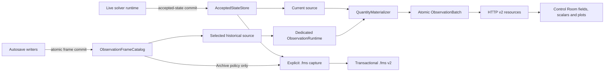

# Trwały runtime, historyczne ramki obserwacyjne i `.fms` — Implementation Plan

> **For agentic workers:** REQUIRED SUB-SKILL: Use superpowers:subagent-driven-development to execute this plan task-by-task.

**Status:** gotowy do implementacji; decyzje D-01–D-08 odzwierciedlają ustalenia użytkownika
**Data audytu:** 2026-08-17
**Zakres:** FDM CPU/CUDA, FDM multilayer, FEM CPU/GPU, runtime interaktywny, autosave pełnego `m`, API v2, Control Room i jawny zapis/odczyt `.fms`
**Dokument bazowy:** [`docs/audits/2026-08-17-interactive-quantity-lifetime-mumax3-fdm-fem-audit.md`](../../audits/2026-08-17-interactive-quantity-lifetime-mumax3-fdm-fem-audit.md)

## 1. Cel i mierzalny rezultat

Po wdrożeniu Fullmag ma zachowywać się w trybie interaktywnym jak MuMax3 w tym, co jest naukowo i architektonicznie właściwe:

1. zakończenie `run`, `relax`, `solve`, `pause` albo `stop` nie niszczy aktywnego kontekstu solvera;
2. bieżący zaakceptowany stan, plan wykonania, geometria/mesh, materiały, operatory, plany FFT/MFEM, preconditionery, bufory robocze i stan wymagany do kontynuacji pozostają rezydentne w RAM/VRAM do jawnego zamknięcia albo zastąpienia sesji;
3. `m` i minimalny pierwotny stan zaakceptowanego kroku są źródłem prawdy; pola i energie pochodne są obliczane na żądanie, a wyniki są cache'owane dla dokładnie jednego źródła/generacji;
4. wszystkie wspierane pola i skalary, w tym `E_total`, `E_demag`, pozostałe energie globalne i gęstości energii, są dostępne po zakończeniu solvera bez ponownego uruchamiania symulacji;
5. autosave zawierający pełne `m` publikuje niezmienne ramki czasowe, które użytkownik może wybrać w Control Room i dla których może uruchomić `Compute Fields`/`Compute Energies` bez zmiany aktywnego solvera;
6. pola i energie zależne od czasu są liczone dla czasu ramki, nie dla `t = 0` ani czasu bieżącej sesji;
7. quantity wymagające stanu, którego ramka nie zawiera, zwraca jawne `unsupported` z listą brakujących nośników; Fullmag nie produkuje wiarygodnie wyglądającego przybliżenia;
8. `.fms` powstaje wyłącznie po jawnym `Save`, `Save As` albo `Export`; profil `Resume` zapisuje zaakceptowany checkpoint, a import rzeczywiście rekonstruuje runtime;
9. FDM i FEM używają jednego kontraktu obserwacji, lecz zachowują oddzielne, produkcyjne realizacje CPU/GPU;
10. żaden wymuszony backend/device nie przechodzi cicho na CPU albo inną rodzinę solvera.

### Kryterium końcowe

Zadanie jest zakończone dopiero wtedy, gdy po zakończeniu procesu solvera, po wyborze ramki autosave i po imporcie `.fms` użytkownik potrafi pobrać zgodne `m`, pola pochodne i energie przez API oraz UI. Historical Compute musi dowodzić zerowej mutacji LiveRuntime. Import `.fms` ma natomiast wykonać dokładnie jedną atomową podmianę runtime, po której Compute Quantities nie zmienia odtworzonego accepted state. Samo istnienie kodu, przejście unit testów albo poprawny wygląd UI nie jest kwalifikacją produkcyjną.

## 2. Ocena stanu obecnego

**Obecne rozwiązanie nie jest jeszcze produkcyjne dla tego kontraktu.** Ma potrzebne elementy, ale są one rozdzielone i nie mają jednej tożsamości zaakceptowanego stanu ani bezpiecznej ścieżki historycznej obserwacji.

| Obszar | Co już działa | Bloker produkcyjny |
|---|---|---|
| MuMax3-like runtime | `InteractiveRuntime` posiada backend po zakończeniu wywołania | nie wszystkie lane'y mają ten sam trwały lifecycle; finalizacja eager dotyczy tylko FDM |
| Bieżące pola | `snapshot_vector_fields` potrafi liczyć batch na aktywnym backendzie | cache jest single-entry i identyfikowany rewizją prezentacji/stanu, nie atomowym ID zaakceptowanego stanu |
| Bieżące energie | `snapshot_step_stats` oraz `compute_current_energies` istnieją | pola i energie są publikowane osobnymi ścieżkami bez wspólnego generation/source ID |
| Katalog quantity | kanoniczny katalog zawiera pola i energie | endpoint availability miesza capability z materialization; transport skalarów pomija część katalogu |
| Autosave `m` | Zarr/HDF5 zapisują próbki pełnego pola | brak produkcyjnego czytnika ramki, fingerprintów domeny, checksumu i atomowego commitu |
| Snapshot historyczny | histereza obsługuje `snapshot_id` dla `m` | jest to wyjątek histerezy; nie można policzyć pól pochodnych dla snapshotu |
| `.fms` | istnieją profile, ZIP64, CAS i checkpointy | eksport nie pobiera atomowego checkpointu runtime, a import nie odtwarza `InteractiveRuntimeHost` |
| UI | istnieje komenda `compute_fields` i selekcja snapshotu histerezy | komenda nie wskazuje źródła/quantity, a wynik historyczny nie ma osobnego resource namespace |

### 2.1. Potwierdzone miejsca w kodzie

| Fakt | Plik i symbol | Znaczenie dla wdrożenia |
|---|---|---|
| Runtime posiada backend i cache | `crates/fullmag-runner/src/interactive/runtime.rs:111`, `InteractiveRuntime` | rozszerzyć istniejącego właściciela; nie budować równoległego solver facade |
| Upload zmienia tylko `m`, podnosi rewizję i czyści cache | `interactive/runtime.rs:133`, `upload_magnetization` | niewystarczające do ramki historycznej: brak czasu, kroku, RNG i coupled state |
| Terminalny pełny batch jest ograniczony do FDM | `interactive/runtime.rs:16`, `build_atomic_terminal_update` | usunąć zależność poprawności od eager terminal materialization |
| Terminalna materializacja następuje tylko dla `Completed` | `crates/fullmag-runner/src/interactive_runtime.rs:149`, `should_materialize_terminal_fdm_fields` | `Paused`, `Stopped` i błędy po zaakceptowanym kroku nie mają spójnej publikacji |
| Host ma pojedynczy opcjonalny runtime | `crates/fullmag-cli/src/interactive_runtime_host.rs:435`, pole `InteractiveRuntimeHost::runtime` | dodać osobnego właściciela observation runtime, nie podmieniać live state |
| Obecne `compute_current_fields` liczy wszystkie pola i zapisuje do live cache | `interactive_runtime_host.rs:600` | rozdzielić current/live od immutable historical result |
| Zmiana problemu niszczy runtime | `interactive_runtime_host.rs:563`, `replace_base_problem` | jawnie zdefiniować jedyne dozwolone granice zwolnienia pamięci |
| Komenda nie ma źródła ani listy quantity | `crates/fullmag-api/src/schemas/commands.rs:193`, `ComputeFields` | rozszerzyć kontrakt OpenAPI z kompatybilnym domyślnym `current` |
| Status materializacji nie ma source/accepted-state identity | `crates/fullmag-runner/src/types.rs:368`, `LiveFieldMaterializationStatus` | dodać atomową tożsamość źródła i wyniku |
| Manifest autosave jest zbyt słaby | `crates/fullmag-runner/src/autosave_storage.rs:14`, `StageManifest` | dodać fingerprints, layout, checksum i complete marker |
| Indeks autosave nie identyfikuje quantity | `autosave_storage.rs:80`, `ContinuousIndexEntry` | naprawić indeks przed wystawieniem historii w API |
| Checkpoint zapisuje blob `m`, ale descriptor go nie referuje | `crates/fullmag-session/src/capture.rs:63`, `capture_checkpoint` | naprawić graf CAS przed `.fms` v2 i GC |
| Eksport bazuje na read modelu API | `crates/fullmag-api/src/session_persistence.rs:664`, `export_session` | capture musi należeć do runtime i granicy zaakceptowanego kroku |
| Import mutuje prezentację, nie solver | `session_persistence.rs:781`, `import_session_commit` | wymagany transactional runtime reconstruction |
| Restore checkpointu mutuje `current_live_state` | `session_persistence.rs:958`, `restore_checkpoint` | nie jest bezpieczną ani rzeczywistą operacją runtime restore |

### 2.2. Fragmenty kodu, które wyznaczają obecną lukę

Terminalna materializacja jest dziś eager i tylko dla FDM:

```rust
let cached_preview_fields = if matches!(plan.backend_plan, BackendPlanIR::Fdm(_)) {
    let quantities = crate::quantities::field_materialization_quantity_ids();
    let mut fields = backend.snapshot_vector_fields(&quantities, &request)?;
    Some(fields)
} else {
    None
};
```

Obecny import stanu obserwacyjnego nie potrafi ustawić kompletnego zaakceptowanego stanu:

```rust
pub fn upload_magnetization(&mut self, magnetization: &[[f64; 3]]) -> Result<(), RunError> {
    self.backend.upload_magnetization(magnetization)?;
    self.state_revision += 1;
    self.display_cache.invalidate();
    Ok(())
}
```

Komenda API nie wskazuje, z jakiego `m` należy liczyć:

```rust
ComputeFields {
    #[serde(default, flatten)]
    intent: RuntimeCommandIntent,
},
ComputeEnergies {
    #[serde(default, flatten)]
    intent: RuntimeCommandIntent,
},
```

Manifest autosave nie wystarcza do udowodnienia zgodności ramki z runtime:

```rust
pub struct StageManifest {
    pub schema_version: String,
    pub target: String,
    pub stage_id: String,
    pub stage_index: u64,
    pub layout: AutosaveLayoutIR,
    pub format: AutosaveFormatIR,
    pub table_quantities: Vec<String>,
    pub field_quantities: Vec<String>,
    pub complete: bool,
    pub table_sample_count: u64,
    pub field_sample_count: u64,
}
```

Najpoważniejsza luka `.fms`: descriptor pola nie łączy się z zapisanym blobem:

```rust
let m_hash = store.store_magnetization(&m)?;
let m_descriptor = TensorDescriptor::new_f64(
    "magnetization",
    vec![m.len(), 3],
    vec!["node".into(), "c".into()],
);
let m_desc_hash = store.cas().put_json(&m_descriptor)?;
```

`m_hash` trafia do `CommonSolverState`, ale nie do chunków `TensorDescriptor`. Obecny komentarz, że descriptor referuje dane „conceptually”, nie tworzy osiągalnego grafu CAS.

## 3. Decyzje architektoniczne

Te decyzje są częścią zakresu i nie powinny być ponownie otwierane podczas implementacji bez nowego ADR.

### D-01. Rezydentny runtime do jawnego końca sesji

Live solver runtime zachowuje wszystkie potrzebne obiekty wykonawcze w RAM/VRAM po zakończeniu etapu i całej symulacji. Zwolnienie jest dozwolone wyłącznie po:

- `Close session`;
- udanym, atomowym zastąpieniu problemu/runtime;
- udanym imporcie innej sesji;
- nieodwracalnym błędzie backendu, po którym runtime jest oznaczony jako `failed_unusable`;
- zakończeniu procesu.

Nie wprowadzamy w pierwszej wersji automatycznego eviction pod presją pamięci. Brak pamięci jest jawnym, typowanym błędem; nie uruchamia fallbacku CPU ani odbudowy z inną precyzją.

### D-02. Trzymamy źródła prawdy, nie wszystkie możliwe pola

W pamięci pozostają:

- bieżący zaakceptowany stan pierwotny (`m`, czas, step, `dt`, wymagany RNG/coupled/integrator state);
- plan, domena, materiały, mesh/grid i fingerprints;
- rezydentne operatory i workspaces backendu;
- wszystkie quantity już policzone dla bieżącego `AcceptedStateId`;
- jedna aktualnie wybrana historyczna ramka i wszystkie quantity policzone dla niej;
- metadane katalogu historycznych ramek.

Nie trzymamy automatycznie w RAM wszystkich ramek autosave ani wszystkich pól pochodnych dla całej historii. Pełna historia `m` jest trwałym data-plane na dysku; wybrana ramka jest ładowana do rezydentnego observation runtime. To zachowuje założenie dużej pamięci dla solvera, ale nie mnoży `O(liczba ramek × liczba quantity × liczba DOF)`.

### D-03. Dwa izolowane konteksty wykonawcze

`InteractiveRuntimeHost` posiada:

1. **LiveRuntime** — jedyny kontekst uprawniony do wykonywania kroków, modyfikowania integratora i publikowania current state;
2. **ObservationRuntime** — osobny, rezydentny kontekst do `Compute Quantities` dla historycznych ramek; nie ma metod `step`, `run`, `relax`, `resume` ani publishera live-state.

Zakazane jest wgrywanie historycznego `m` do LiveRuntime i późniejsze „odtwarzanie” starego `m`. Taki swap nie odtwarza atomowo czasu, `dt`, integratora, FSAL/ABM, RNG, transportu, preconditionerów ani rewizji i pozostawia aktywną sesję skażoną przy błędzie pośrednim.

### D-04. Jedna tożsamość zaakceptowanego stanu

Pola, energie, skalary i `m` muszą wskazywać ten sam `AcceptedStateId`. `domain_generation_id` nie wystarcza: domena może pozostać ta sama przy wielu różnych stanach `m`.

### D-05. Jedna operacja materializacji quantity

Wewnętrzny kontrakt to `ComputeQuantities`, który przyjmuje źródło i listę `quantity_ids`, a zwraca atomowy batch pól i skalarów. Publiczne `ComputeFields` i `ComputeEnergies` pozostają kompatybilnymi aliasami do czasu migracji UI/CLI, ale nie implementują oddzielnej fizyki ani cache.

### D-06. Autosave jest historią obserwacyjną, nie restore aktywnego solvera

Ramka autosave jest immutable snapshotem pierwotnych nośników. Jej wybór zmienia wyłącznie źródło widoku/analizy. Nie cofa aktywnej symulacji. Osobna, jawna operacja `Restore/Branch from frame` może powstać później i musi mieć własną semantykę checkpointu.

### D-07. `.fms` jest jawne i transakcyjne

Nie tworzymy automatycznie ZIP-a `.fms`. Autosave oraz recovery korzystają z `SessionStore`/Zarr. `Save`, `Save As` i `Export` tworzą `.fms` na żądanie. Import najpierw sprawdza integralność i buduje kandydacki runtime, a dopiero potem atomowo zastępuje aktywną sesję.

### D-08. Brak niejawnych obietnic rekonstrukcji

Pełne `m + time + ProblemIR + plan + domain` wystarcza do deterministycznych quantity funkcjonalnych względem tych danych. Nie wystarcza automatycznie do:

- realizacji `H_therm` bez algorytmu i licznika/stanu RNG;
- quantity transportowych zależnych od zaakceptowanego charge/spin state;
- dynamicznego Oersteda zależnego od rozwiązania sprzężonego;
- energii kinetycznej/sprężystej bez odpowiednich pierwotnych nośników;
- exact resume integratora.

Każda quantity deklaruje zależności. Brak nośnika daje `unsupported_missing_primary_state`, nie wartość przybliżoną ani zero.

## 4. Docelowy przepływ danych



Najważniejsza granica: `ObservationRuntime` nigdy nie zapisuje do `latest_fields`, `preview_cache`, bieżących `scalar_rows`, live `state_revision` ani kolejki solvera.

## 5. Kanoniczne typy i interfejsy

Poniższe fragmenty są docelowym kontraktem, nie kodem już istniejącym. Nazwy mogą być dostosowane mechanicznie do stylu crate'ów, ale pola semantyczne nie mogą zniknąć.

### 5.1. Tożsamość źródła i zaakceptowanego stanu

Plik docelowy: `crates/fullmag-runner/src/observation/types.rs`.

```rust
#[derive(Debug, Clone, Serialize, Deserialize, PartialEq)]
pub struct ObservationClock {
    pub accepted_step: u64,
    pub time_s: f64,
    pub dt_s: Option<f64>,
}

#[derive(Debug, Clone, Serialize, Deserialize, PartialEq, Eq, Hash)]
pub struct AcceptedStateId {
    pub run_id: String,
    pub stage_id: Option<String>,
    pub accepted_step: u64,
    pub clock_digest: String,
    pub state_digest: String,
    pub domain_digest: String,
    pub plan_digest: String,
}

#[derive(Debug, Clone, Serialize, Deserialize, PartialEq, Eq, Hash)]
pub struct AcceptedStateGeneration {
    pub runtime_epoch: u64,
    pub accepted_revision: u64,
}

#[derive(Debug, Clone, Serialize, Deserialize, PartialEq, Eq, Hash)]
pub struct AcceptedStateRef {
    pub id: AcceptedStateId,
    pub generation: AcceptedStateGeneration,
}

#[derive(Debug, Clone, Serialize, Deserialize, PartialEq, Eq, Hash)]
#[serde(tag = "kind", rename_all = "snake_case")]
pub enum ObservationSource {
    Current {
        accepted_state: AcceptedStateRef,
    },
    Frame {
        frame_id: ObservationFrameId,
        accepted_state_id: AcceptedStateId,
    },
}
```

`AcceptedStateId` jest trwałą, content-bound tożsamością przenośną między procesami. `AcceptedStateGeneration` jest lokalnym, monotonicznym guardem jednego runtime epoch. Dla Live oba pola są obowiązkowe w command precondition, cache i batchu. `state_digest` obejmuje kanoniczne primary carriers oraz kanoniczny `ObservationClock` z bitowo jednoznacznym `time_s`/`dt_s`; nie może być licznikiem procesu ani rewizją UI.

### 5.2. Descriptor ramki autosave

Plik docelowy: `crates/fullmag-runner/src/observation/frame.rs`.

```rust
#[derive(Debug, Clone, Serialize, Deserialize, PartialEq, Eq, Hash)]
pub struct ObservationFrameId(pub String);

#[derive(Debug, Clone, Serialize, Deserialize)]
pub struct ObservationFrameDescriptor {
    pub schema_version: String,
    pub frame_id: ObservationFrameId,
    pub logical_state_digest: String,
    pub run_id: String,
    pub stage_id: Option<String>,
    pub coordinate: ObservationClock,
    pub problem_digest: String,
    pub plan_digest: String,
    pub domain: ObservationDomainIdentity,
    pub execution: ObservationExecutionIdentity,
    pub primary_state: Vec<PrimaryStateCarrier>,
    pub storage_payload_sha256: String,
    pub payload_bytes: u64,
    pub complete: bool,
}

#[derive(Debug, Clone, Serialize, Deserialize)]
#[serde(tag = "kind", rename_all = "snake_case")]
pub enum PrimaryStateLocator {
    CasObject { sha256: String },
    ArtifactChunk {
        artifact_id: String,
        dataset_id: String,
        chunk_key: String,
    },
}

#[derive(Debug, Clone, Serialize, Deserialize)]
pub struct PrimaryStateCarrier {
    pub quantity_id: String,
    pub location: FieldLocation,
    pub components: Vec<String>,
    pub dtype: String,
    pub shape: Vec<u64>,
    pub locator: PrimaryStateLocator,
    pub payload_sha256: String,
}
```

`frame_id` jest SHA-256 wersjonowanego, kanonicznego semantic preimage: clock, problem/plan/domain identity, primary-state schema i content digest każdego carriera. Preimage wyklucza `frame_id`, storage locator, `complete`, kompresję, chunking i encoding. `logical_state_digest` identyfikuje stan fizyczny, a `storage_payload_sha256` integralność konkretnego opakowania. Rename, repack oraz Zarr↔HDF5 tej samej treści muszą zachować `frame_id`.

### 5.3. Zależności quantity

Rozszerzyć `crates/fullmag-quantities/src/catalog.rs`:

```rust
pub enum PrimaryStateRequirement {
    Magnetization,
    ObservationClock,
    ThermalRngState,
    ChargeState,
    SpinAccumulationState,
    ElasticDisplacement,
    ElasticVelocity,
}

pub struct QuantityRequirements {
    pub quantity_id: &'static str,
    pub required_primary_state: &'static [PrimaryStateRequirement],
    pub deterministic_recompute: bool,
}
```

Availability jest przecięciem:

```text
catalog quantity
∩ physics activated in normalized ProblemIR
∩ resolved plan support
∩ backend/device/precision support
∩ primary carriers present in selected source
```

Materialized/cache status nie może zmieniać capability na `unsupported`.

### 5.4. Atomowy batch obserwacji

```rust
pub struct ObservationRequest<'a> {
    pub source: &'a ObservationSource,
    pub quantity_ids: &'a [String],
    pub allow_partial: bool,
}

pub struct MaterializedQuantity {
    pub materialization_id: String,
    pub quantity_id: String,
    pub payload: CanonicalQuantityPayload,
}

pub enum CanonicalQuantityPayload {
    Field(LivePreviewField),
    Scalar(GlobalQuantityValue),
}

pub struct ObservationBatch {
    pub observation_id: String,
    pub source: ObservationSource,
    pub accepted_state_id: AcceptedStateId,
    pub evaluator_generation: AcceptedStateGeneration,
    pub outputs: Vec<MaterializedQuantity>,
    pub materialized_at_unix_ms: u64,
    pub execution_provenance: ExecutionProvenance,
}

pub trait ObservationEvaluator {
    fn evaluate(&mut self, request: &ObservationRequest<'_>)
        -> Result<ObservationBatch, ObservationError>;
}
```

Materializer produkuje pełne kanoniczne quantity dla source. `observation_id` identyfikuje batch/komendę, nie fizyczną generację cache. Każda quantity ma stabilny `materialization_id`, więc późniejszy batch z innym zestawem quantity kumuluje cache source bez unieważniania wcześniejszych wyników. Projekcja, component, carrier scope i sampling należą do osobnego HTTP projection cache/ETag i nie uruchamiają ponownie fizyki.

Batch jest publikowany all-or-nothing. Jeżeli jedna jawnie zażądana quantity nie może zostać policzona, odpowiedź ma wskazać ją i brakujące zależności; częściowy wynik jest dopuszczalny tylko dla jawnego `allow_partial=true` i zawiera per-quantity status.

## 6. Model pamięci i cache

### 6.1. LiveRuntime

| Zasób | Retencja |
|---|---|
| zaakceptowane `m` | do następnego zaakceptowanego stanu albo zamknięcia |
| integrator, controller, RNG, coupled state | do jawnego reset/restore/close |
| FFT plans, demag/exchange operators, MFEM spaces/operators, preconditionery | do zmiany niekompatybilnego planu/domeny albo close |
| workspaces/buffers CPU/GPU | do zmiany niekompatybilnego planu/domeny albo close |
| policzone pola i energie | wszystkie dla bieżącego `AcceptedStateId`; czyszczone atomowo przy nowym stanie |
| wcześniejsze zaakceptowane stany | nie są automatycznie przechowywane, chyba że zapisuje je autosave/checkpoint |

### 6.2. ObservationRuntime

Jeden rezydentny runtime na kompatybilny `(problem_digest, plan_digest, domain_digest, primary_state_schema, resolved_backend, device, precision, native_abi, build_identity)`. W pierwszym wdrożeniu host utrzymuje maksymalnie jeden taki runtime i jedną wybraną ramkę. Zmiana ramki przy zgodnym pełnym context key ładuje nowe primary carriers i czyści cache; zmiana któregokolwiek elementu buduje nowy kandydat i dopiero po sukcesie zastępuje stary.

GPU może wymagać jednoczesnej pamięci dla LiveRuntime i ObservationRuntime. Jeżeli alokacja się nie powiedzie, API zwraca `observation_runtime_resource_exhausted` wraz z wymaganym i dostępnym budżetem, o ile backend potrafi go podać. Nie wolno zwalniać LiveRuntime ani przechodzić na CPU bez jawnej decyzji użytkownika.

### 6.3. Cache key

```text
QuantityMaterializationKey = SHA-256(
  accepted_state_id
  + quantity_id
  + materializer ABI/build identity
)

ProjectionCacheKey = SHA-256(
  quantity_materialization_id
  + carrier/scope/component
  + binary projection/sampling contract
)
```

Cache fizyki nie zależy od prezentacji ani od całego zestawu quantity w komendzie. Cache projekcji nie zmienia `materialization_id` ani `field_generation_id`. Żaden klucz nie może opierać się wyłącznie na `source_step`, `display_revision`, liczbie próbek ani `domain_generation_id`.

## 7. Semantyka historycznej ramki

### 7.1. Co użytkownik może zrobić

1. Otworzyć listę ramek autosave pełnego `m`.
2. Filtrować po runie i etapie.
3. Wybrać ramkę po czasie fizycznym albo zaakceptowanym kroku.
4. Obejrzeć zapisane `m` bez materializacji pozostałych pól.
5. Zaznaczyć jedną, wiele albo wszystkie dostępne quantity i wybrać `Compute Fields`/`Compute Energies`.
6. Otrzymać pola, energie i provenance przypięte do `frame_id`.
7. Wrócić do `Live` bez zmiany aktywnej symulacji.

### 7.2. Czego wybór ramki nie robi

- nie zmienia `continuation_magnetization` LiveRuntime;
- nie zmienia czasu/kroku aktywnego solve;
- nie zapisuje wyników do bieżącej tabeli skalarów;
- nie podnosi revision domeny ani live accepted state;
- nie tworzy `.fms`;
- nie obiecuje możliwości kontynuacji solvera z tej ramki.

### 7.3. Walidacja przed materializacją

Materializer wykonuje kontrole w stałej kolejności:

1. obsługiwany schema major i `complete=true`;
2. zgodny checksum i rozmiar każdego primary carrier;
3. finite `m`, dokładnie trzy komponenty, jawny component order i location;
4. zgodny `problem_digest` i `plan_digest`;
5. FDM: shape, origin, cell size, active mask, region/material order, multilayer mapping i PBC;
6. FEM: mesh generation, topology, coordinate/connectivity/DOF ordering, region markers i field location;
7. zgodne requested i resolved backend/device/precision;
8. skończony `time_s`, prawidłowy accepted step i spójny `dt`;
9. obecność wszystkich primary-state dependencies żądanych quantity;
10. backend materializer support bez fallbacku.

Niezgodna domena nie uruchamia interpolacji. Transfer między siatkami/meshami to osobny workflow z własnym provenance.

## 8. Autosave: format, atomowość i reader

### 8.1. Zmiany obowiązkowe

`StageManifest` v2 i `ContinuousIndexEntry` v2 muszą dodać:

- `run_id`, `problem_digest`, `plan_digest`, `domain_digest`;
- execution provenance i build identity;
- quantity ID na każdym wpisie indeksu;
- per-quantity sample index zamiast niejednoznacznego globalnego indeksu;
- location, component order, dtype, shape i byte length;
- payload SHA-256;
- jawny `complete`/commit marker;
- identyfikator zaakceptowanego stanu i pełny clock;
- listę primary carriers potrzebnych do reprodukcji.

### 8.2. Protokół zapisu

Każda ramka używa immutable CAS albo copy-on-write generation root i jest publikowana w kolejności:

1. zapisz payload/chunk do nazwy tymczasowej, licząc SHA-256 i rozmiar;
2. flush i `fsync` payloadu;
3. zweryfikuj hash/rozmiar, atomowo zmień nazwę payloadu na finalny immutable locator i wykonaj `fsync` katalogu;
4. zapisz descriptor wskazujący wyłącznie finalne locatory, z `complete=true`, do nazwy tymczasowej;
5. flush/`fsync` descriptoru, atomowo zmień jego nazwę i wykonaj `fsync` katalogu;
6. atomowo zaktualizuj katalog/indeks i wykonaj `fsync` jego katalogu;
7. przy resume wykryj zatwierdzone descriptory brakujące w indeksie i wykonaj reconciliation; orphan payload bez descriptoru podlega bezpiecznemu GC, incomplete descriptor nie jest publikowany;
8. nigdy nie nadpisuj zatwierdzonej ramki ani payloadu o istniejącym content ID.

HDF5 nie może dalej buforować całego etapu w RAM i zapisywać dopiero przy `finish_stage`, jeżeli ma być źródłem produkcyjnych ramek. Musi otrzymać incremental datasets, flush oraz commit journal albo pozostać jawnie `not_observation_frame_capable`.

### 8.3. Legacy

Adapter legacy może wystawić ramkę tylko, gdy metadane z artefaktu pozwalają jednoznacznie odtworzyć problem, plan, domenę, layout i czas. Sama zgodna długość wektora nie jest dowodem. Brak metadanych daje `incompatible_metadata_missing`.

### 8.4. Czytnik

Nowy `ObservationFrameRepository` ma adaptery dla:

- stage autosave Zarr;
- stage autosave HDF5 po spełnieniu durability contract;
- canonical field-series Zarr/JSON;
- checkpoint CAS;
- snapshotów histerezy;
- finalnego zaakceptowanego stanu.

API i UI widzą jeden `ObservationFrameDescriptor`; nie rozpoznają formatów magazynu.

## 9. `.fms`: jawny snapshot w stylu COMSOL

### 9.1. Znaczenie profili

| Profil | Zawartość | Klasa restore |
|---|---|---|
| `Compact` | skrypt, canonical `ProblemIR`, scene/authoring/UI state | `ConfigOnly` |
| `Solved` | `Compact` + zaakceptowane `m`, pełna dyskretyzacja i materiały | `InitialConditionImport` albo udowodnione `LogicalResume` |
| `Resume` | `Solved` + jeden wybrany/najnowszy accepted checkpoint, integrator, RNG i wymagany backend state | `ExactResume` albo jawnie zaakceptowane `LogicalResume` |
| `Archive` | baza `Resume` + jawnie wybrane checkpointy, artefakty i historia autosave | zależna od checkpointu |
| `Recovery` | poza publicznym `.fms`; wewnętrzny mechanizm store objęty osobnym planem crash recovery | niewystawiana w Save/Export |

Pola pochodne i cache podglądu nie należą domyślnie do `Resume`. Po imporcie są liczone na żądanie. Historia autosave wchodzi wyłącznie do `Archive` po estymacji rozmiaru i jawnym wyborze użytkownika. Publiczny profil `Recovery` zostaje usunięty/ukryty w tym wdrożeniu; naprawa automatycznego process-crash recovery nie jest obietnicą tego planu i nie może być prezentowana jako `.fms`.

### 9.2. `fullmag.session.v2`

```text
manifest/format.json
manifest/session.json
manifest/profile.json
manifest/integrity.json
project/main.py
project/problem_ir.json
project/scene_document.json
project/materials.json
execution/requested.json
execution/resolved.json
runs/<run-id>/run.json
runs/<run-id>/plan.json
runs/<run-id>/checkpoints/<checkpoint-id>/checkpoint.json
runs/<run-id>/checkpoints/<checkpoint-id>/state/m.tensor.json
runs/<run-id>/checkpoints/<checkpoint-id>/state/integrator.json
runs/<run-id>/checkpoints/<checkpoint-id>/state/rng.json
runs/<run-id>/checkpoints/<checkpoint-id>/state/backend.json
meshes/<mesh-id>/mesh.json
observation_frames/index.json
observation_frames/<frame-id>/descriptor.json
objects/sha256/<digest>
artifacts/index.json
artifacts/<artifact-id>
```

`manifest/format.json` zawiera `format = fullmag.session.v2`, osobne `major/minor`, `min_reader_version`, `required_features`, `optional_features` i schema ID każdego dokumentu. Canonical JSON, ordering i hash preimage są wersjonowane. Reader odrzuca future major i nieobsługiwane required feature, a zachowuje/ignoruje nieznane optional feature według deklarowanej semantyki.

Każda referencja obiektu zawiera hash, rozmiar nieskompresowany, media type, encoding/compression, rolę semantyczną oraz — dla tensorów — dtype, endian, shape, strides i chunk ordering. Archive zapisuje samowystarczalny `observation_frames/index.json` oraz pełne closure wybranych primary carriers według jawnej polityki `latest`, `last_n`, `range` albo `all`, ograniczonej `max_frames`/`max_bytes`.

### 9.3. Capture i restore

Eksport `Resume`:

1. wysyła runtime-owned request do kolejki solvera;
2. czeka na granicę zaakceptowanego kroku;
3. atomowo pobiera state, integrator, RNG, coupled/backend state i fingerprints;
4. zapisuje pełny, osiągalny graf CAS;
5. dopiero wtedy streamuje `.fms`.

Import:

1. streamuje archiwum do izolowanego staging directory;
2. waliduje ścieżki, limity, manifesty, rozmiary i wszystkie hashe;
3. buduje `RestorePlan` bez mutacji store/runtime;
4. tworzy kandydacki `ProblemIR`, plan, mesh i runtime;
5. ładuje dokładnie żądany restore mode; exact nie degraduje się bez zgody;
6. wykonuje readiness check i snapshot `m`;
7. atomowo podmienia runtime, base problem i zasoby API;
8. przy dowolnym błędzie zachowuje starą sesję bez zmian.

Import nigdy nie wykonuje automatycznie zapisanego `main.py`; runtime powstaje z walidowanego canonical `ProblemIR`.

### 9.4. Bezpieczeństwo importu

Importer odrzuca absolutne ścieżki, `..`, NUL, symlinki, duplikaty po normalizacji, nieznany major, brakujące obiekty, błędne hashe, ZIP bomb i przekroczenie limitów. Limity obejmują rozmiar uploadu, liczbę wpisów, pojedynczy i całkowity rozmiar nieskompresowany, compression ratio, liczbę chunków, checkpointów i artefaktów.

## 10. API v2 i resource-first contract

### 10.1. Zasoby ramek

Thin JSON control plane:

```text
GET /v2/sessions/current/data/observation-frames?run_id=&stage_id=&cursor=&limit=
GET /v2/sessions/current/data/observation-frames/{frame_id}
```

Heavy/binary data plane:

```text
GET /v2/sessions/current/data/observation-frames/{frame_id}/magnetization
```

### 10.2. Komenda

```rust
#[derive(Debug, Clone, Serialize, Deserialize)]
#[serde(tag = "kind", rename_all = "snake_case")]
pub enum ComputeQuantitySource {
    Current {
        expected_accepted_state: Option<AcceptedStateRef>,
    },
    ObservationFrame {
        frame_id: String,
        expected_state_digest: String,
    },
}

ComputeQuantities {
    #[serde(default, flatten)]
    intent: RuntimeCommandIntent,
    #[serde(default)]
    source: ComputeQuantitySource,
    quantity_ids: Vec<String>,
    #[serde(default)]
    allow_partial: bool,
},
```

Brak `source` w legacy `ComputeFields`/`ComputeEnergies` oznacza „current at submission”. Podczas enqueue serwer atomowo rozwiązuje Current do pełnego `AcceptedStateRef` i zapisuje je w wewnętrznym `SessionCommand`; dispatch nigdy nie interpretuje go ponownie jako „aktualny teraz”. Jawne `expected_accepted_state` klienta jest optimistic precondition. Alias używa tego samego coordinatora.

### 10.3. Zasób wyniku i jeden field data plane

```text
GET /v2/sessions/current/data/observation-results/{observation_id}
GET /v2/sessions/current/data/observation-results/{observation_id}/scalars
```

`observation-results` przechowuje cienki manifest batcha, statusy quantity i skalary. Pól nie wystawia się drugim „snapshot field API”. Current i historical korzystają z istniejącego field data plane rozszerzonego o source identity:

```text
GET /v2/sessions/current/data/fields/{quantity_id}/availability?source_kind=observation_frame&source_id={frame_id}
GET /v2/sessions/current/data/fields/{quantity_id}/meta?source_kind=observation_frame&source_id={frame_id}&expected_field_generation_id={generation_id}
GET /v2/sessions/current/data/fields/{quantity_id}/samples/vector?source_kind=observation_frame&source_id={frame_id}&expected_field_generation_id={generation_id}
```

Te same endpointy bez historycznego source zachowują semantykę Live. Nie powstają osobne trasy FDM/FEM ani osobny binary codec dla snapshotów.

`observation_id` obejmuje source/state digest, plan, znormalizowany quantity set i materializer build identity. Scope/carrier/component/sampling nie wchodzą do tego ID; identyfikują wyłącznie projekcję HTTP. Wynik historyczny nie może trafić do live `latest_fields` ani current cache, nawet jeżeli jest aktualnie wyświetlany.

### 10.4. Status i realtime

`GET /status` pozostaje cienki i może zawierać jedynie revision/link pointer; właścicielem wybranego source pozostaje `visualization/state`. WebSocket nie jest autorytatywnym completion payloadem: invaliduje `CommandDetailResource` oraz dokładne observation/field resource keys przez `resource_id` i `recommended_fetch`. Klient pobiera potwierdzone `observation_id`, source i outputs przez HTTP. Pola i skalary są pobierane przez HTTP.

### 10.5. Quantity availability

Catalog i availability są source-qualified, nie zależą od ukrytego globalnego wyboru innego klienta:

```text
GET /v2/sessions/current/data/quantities?source_kind=live&source_id={accepted_state_id}
GET /v2/sessions/current/data/fields/{quantity_id}/availability?source_kind=observation_frame&source_id={frame_id}&target_id={target_id}&carrier={carrier}
```

Endpoint quantities musi raportować osobno:

- `supported_by_plan`;
- `supported_by_resolved_runtime`;
- `primary_state_available_for_selected_source`;
- `materialization_state`;
- `unsupported_reason`;
- `cached_observation_id`.

Globalne skalary nie mogą być wyznaczane na podstawie list preview/snapshot fields. Transport skalarów musi objąć cały aktywny katalog, w tym `e_drive`, `e_el`, `e_kin_el` i `elastic_residual_norm`, gdy dana fizyka jest aktywna.

## 11. Control Room

### 11.1. Model interakcji

Jeden globalny `Observation Source` w workspace:

- `Live`;
- `Autosave frame: relax-2, step 840, t=2.100 ns`.

Selektor ramki pojawia się w Explorerze/Inspectorze etapu i w instrumentach czasu. Wybranie ramki aktualizuje source-aware resource query, ale nie remountuje viewportu i nie zmienia live solver selection.

### 11.2. Timeline

Timeline pokazuje:

- czas i accepted step;
- etap/run;
- complete/corrupt/incompatible status;
- backend/device/precision;
- ikonę primary carriers;
- stan materializacji quantity;
- rozmiar ramki.

Przy dużej historii stosuje cursor pagination i windowing. Status sesji nie zawiera całej listy ani `m`.

### 11.3. `Compute Fields`

Przycisk działa względem aktualnego źródła:

- dla `Live` zachowuje obecną semantykę;
- dla frame wysyła `frame_id`, `expected_state_digest` i wybrane quantity;
- podczas pracy blokuje tylko własną transakcję, nie solver, viewport ani unrelated controls;
- po ACK odświeża wyłącznie zasób `observation_id`;
- pokazuje per-quantity brakujący primary carrier zamiast ogólnego błędu.

Istniejący `hysteresis-snapshot` należy zmapować na ogólny `ObservationSource::Frame`; nie tworzyć oddzielnego drzewa FDM/FEM ani drugiego cache UI.

### 11.4. Save/Export

UI udostępnia `Save`, `Save As`, `Export` oraz `Ctrl+S`. Dialog pokazuje profil, checkpoint, zakres artefaktów/historii, osiągalną klasę restore i estymowany rozmiar. Autosave nigdy nie uruchamia eksportu `.fms`.

## 12. Macierz realizacji backendów

| Lane | Live runtime po solve | Historical observation | Minimalny resume | Exact resume |
|---|---|---|---|---|
| FDM CPU single-grid | obowiązkowy | pierwsza referencyjna implementacja | logical | po codecach integratora/RNG i split-run gates |
| FDM CUDA single-grid | obowiązkowy, bez CPU fallback | po FDM CPU oracle; osobny GPU context | logical | wykorzystać/rozszerzyć native checkpoint ABI i udowodnić bitowo/numerycznie |
| FDM multilayer CPU | obowiązkowy | po usunięciu one-shot-only ścieżki | logical | po pełnym lane checkpoint |
| FDM multilayer CUDA | tylko jeśli publicznie wspierany plan | jawne unsupported do natywnej parity; brak CPU fallback | zależnie od capability | dopiero po pełnych gates |
| FEM CPU time-domain/relax | obowiązkowy shared contract | osobny MFEM observation owner | logical z `m/time` | po osobnym checkpoint owner, nie w `Context`/`mfem_bridge.cpp` |
| FEM GPU time-domain/relax | obowiązkowy shared contract | zarządzany GPU runtime | logical z `m/time` | po CUDA checkpoint owner i managed split-run gates |
| FEM eigen/frequency | lifecycle zależny od własnego solvera | nie używa time-domain evaluatora | specyficzne dla study | poza tym planem, chyba że capability zostanie jawnie dodane |

FEM CPU i GPU współdzielą neutralny kontrakt stanu i quantity, ale nie duplikują implementacji urządzenia. Nowy cross-cutting state nie trafia do monolitycznego `Context` ani `mfem_bridge.cpp`; właściciele checkpointu/obserwacji pozostają w odpowiednich modułach runtime/operatorów.

## 13. Relacja do istniejących dokumentów

Implementacja musi jawnie zaktualizować, a nie pozostawić w konflikcie:

- `docs/superpowers/specs/2026-08-15-fdm-fem-observable-materialization-parity-design.md` — zachować wspólny kontrakt quantity i Airbox, zastąpić pełną eager terminal materialization publikacją accepted-state i materializacją on-demand;
- `docs/architecture/backend-golden-masterplan.md`, sekcja obserwacji — dopisać `AcceptedStateId`, historyczne source i dwa rezydentne runtime'y;
- `docs/specs/resource-first-control-room-api-v2.md` — rozszerzyć current-only `compute_fields`, source-qualified resources i binary payload identity;
- właściwy ADR resource-first — zachować HTTP jako źródło prawdy i WebSocket jako invalidation;
- capability matrix — dodać oddzielne capability dla live residency, historical observation, logical resume i exact resume; nie promować ich razem;
- dokumentację `.fms` — profil, integralność, klasy restore i brak automatycznego ZIP-a.

Nowy dokument powinien wskazać, że wcześniejsza semantyka „materializuj wszystkie pola na końcu FDM” zostaje zastąpiona. Nie wolno pozostawić dwóch normatywnych kontraktów.

## 14. Zasady wykonania planu

1. Każdy task zaczyna się od testu, który przed implementacją przechodzi w stan czerwony z oczekiwanego powodu.
2. Zmiany w FEM/MFEM/CUDA/hypre/libCEED zaczynają build/verification od właściwej container-backed recepty `just`; hostowe `cargo`, CMake lub direct binary są tylko diagnostyką.
3. Przed zmianą aktywnego monolitu `interactive_runtime.rs` należy potwierdzić module linkage rozbitych plików `interactive_runtime/fdm/*` i `interactive_runtime/fem/*`; nie wolno poprawiać martwej kopii.
4. OpenAPI jest źródłem prawdy; wygenerowanych typów frontendowych nie edytuje się ręcznie.
5. Nie dodajemy one-off wyjątków dla `H_demag`, histerezy, FDM albo FEM. Zmiana przechodzi przez katalog quantity, materializer i source-aware data plane.
6. Forced lane/device zawsze failuje jawnie; tylko `auto` może rozwiązać inny lane, z provenance znanym przed wykonaniem.
7. Każdy commit ma jeden reviewable kontrakt. Poniższe propozycje commitów są granicami zmian, nie poleceniem automatycznego commitowania.
8. Współdzielony brudny worktree wymaga zachowania cudzych zmian i inspekcji `git diff --cached --name-only` w osobnym poleceniu przed każdym ewentualnym commitem.

## 15. Implementation file map

### 15.1. Nowe pliki produkcyjne

| Plik | Odpowiedzialność |
|---|---|
| `crates/fullmag-runner/src/observation/mod.rs` | publiczny backend-neutral facade obserwacji |
| `crates/fullmag-runner/src/observation/types.rs` | accepted/source/frame/batch identities |
| `crates/fullmag-runner/src/observation/cache.rs` | source-qualified cache jednej generacji |
| `crates/fullmag-runner/src/observation/frame.rs` | descriptor, walidacja i reader trait |
| `crates/fullmag-runner/src/observation/evaluator.rs` | current i historical coordinator bez transportu HTTP |
| `crates/fullmag-runner/src/interactive/restart.rs` | portable runtime checkpoint/restore contract |
| `crates/fullmag-api/src/router_v2/handlers/data/observation_frames.rs` | lista/detail/binary `m` ramek |
| `crates/fullmag-api/src/router_v2/handlers/data/observation_results.rs` | cienkie metadata batcha i skalary; pola pozostają w kanonicznym field data plane |
| `crates/fullmag-session/src/schema_v2.rs` | kanoniczne manifesty `.fms` v2 |
| `crates/fullmag-session/src/compatibility.rs` | Exact/Logical/Initial/Config comparator |
| `crates/fullmag-session/src/integrity.rs` | hash graph, canonical manifest i weryfikacja |
| `crates/fullmag-session/src/limits.rs` | limity bezpiecznego importu |
| `crates/fullmag-session/src/migration_v1.rs` | fail-closed import v1 bez promocji do Exact |
| `apps/control-room/src/kernel/resources/observationFrameResources.ts` | paginowany resource ramek |
| `apps/control-room/src/kernel/resources/observationResultResources.ts` | source-qualified wynik i invalidacje |
| `apps/control-room/src/modules/inspector/panels/stages/StageAutosaveTimeline.tsx` | timeline i wybór ramki |

### 15.2. Główne pliki modyfikowane

| Warstwa | Pliki/symbole |
|---|---|
| Quantity | `crates/fullmag-quantities/src/catalog.rs`; `crates/fullmag-runner/src/quantities.rs`; `capabilities.rs` |
| Runtime facade | `interactive/backend.rs`; `interactive/runtime.rs`; `interactive/cache.rs`; aktywny `interactive_runtime.rs` |
| Host/orchestrator | `crates/fullmag-cli/src/interactive_runtime_host.rs`; `orchestrator.rs`; `live_workspace.rs` |
| FDM | `fdm/cpu/multilayer_reference.rs`; `fdm/gpu/cuda/multilayer.rs`; `fdm/gpu/cuda/native.rs`; `backends/fdm/include/context.hpp`; `backends/fdm/api/c_api.cpp`; właściwe pliki `context.cu` |
| FEM | `crates/fullmag-runner/src/native_fem.rs`; `backends/fem/include/context.hpp`; `backends/fem/src/api.cpp`; `backends/fem/cpu/mfem/runtime/*`; `backends/fem/gpu/cuda/runtime/*`; `native/include/fullmag_fem.h`; `crates/fullmag-fem-sys/*` |
| Autosave | `autosave_storage.rs`; `autosave_zarr.rs`; `autosave_hdf5.rs`; `artifact_pipeline.rs`; `artifacts.rs` |
| Session | `fullmag-session/src/types.rs`; `capture.rs`; `store.rs`; `fms.rs` |
| API | `schemas/commands.rs`; `schemas/fields.rs`; `schemas/runtime.rs`; `schemas/visualization_state.rs`; `router_v2/handlers/simulation/commands.rs`; `session.rs`; `session_persistence.rs`; `openapi_v2.rs`; realtime schemas/emitery |
| Frontend facade | `kernel/api/ControlRoomApi.ts`; `apiTypes.ts`; `apiPaths.ts`; `fieldQueryIdentity.ts`; `codecs/fieldVectorCodec.ts`; generated OpenAPI |
| Frontend state/UI | `useVisualizationStateResource.ts`; `VisualizationRegistrySyncController.ts`; `RealtimeInvalidationBridge.ts`; `viewport3dResources.ts`; `useViewport3DSceneModel.ts`; istniejące panele histerezy/autosave |

## 16. Szczegółowy plan wdrożenia

### Task 0: Zamknąć kontrakt naukowy i architektoniczny przed kodem

**Pliki:**

- Create: `docs/physics/interactive-observation-and-restart-semantics.md`
- Create: `docs/adr/0025-persistent-runtime-and-observation-sources.md`
- Modify: `docs/superpowers/specs/2026-08-15-fdm-fem-observable-materialization-parity-design.md`
- Modify: `docs/architecture/backend-golden-masterplan.md`
- Modify: `docs/specs/resource-first-control-room-api-v2.md`
- Modify: właściwy plik capability matrix i jego schema/testy

**Kroki TDD/dokumentacyjne:**

- [ ] Dodać failing source/doc gate, który wymaga definicji `AcceptedStateId`, `ObservationSource`, `LogicalResume`, `ExactResume` i braku eager terminal-all-fields jako normatywnej reguły.
- [ ] W physics note opisać, które quantity są funkcjami `m,time,ProblemIR`, które wymagają RNG/coupled carriers, oraz wpływ logical resume na trajektorię numeryczną.
- [ ] W ADR zapisać D-01–D-08, alternatywy „swap live state” i „odbuduj runtime per kliknięcie” oraz powody odrzucenia.
- [ ] W capability matrix rozdzielić source presence, executability, validation i production qualification dla każdej lane.
- [ ] Uruchomić walidatory dokumentacji wskazane przez `scientific-documentation-contract` oraz existing contract guards.

**Akceptacja:** dokumenty nie przeczą sobie, source index prowadzi do istniejących symboli, a capability nie wynika z cache/materialization.

**Proponowany commit:** `docs: define persistent observation and restart semantics`

### Task 1: Ujednolicić katalog quantity, zależności i pełny transport skalarów

**Pliki:**

- Modify: `crates/fullmag-quantities/src/catalog.rs`
- Modify: `crates/fullmag-runner/src/quantities.rs`
- Modify: `crates/fullmag-runner/src/capabilities.rs`
- Modify: `crates/fullmag-runner/src/types.rs`, `StepStats`/global row mapping
- Modify: `crates/fullmag-api/src/router_v2/handlers/data/quantities.rs`
- Modify: `crates/fullmag-api/src/router_v2/handlers/data/scalars.rs`
- Test: odpowiednie moduły testowe w tych crate'ach

**Kroki:**

- [ ] Napisać test, że globalne quantity są klasyfikowane z `scalar_outputs`, nie z preview/snapshot field lists.
- [ ] Napisać test pełności: każdy aktywny global energy spec ma mapping `StepStats -> API scalar`, obejmujący `e_drive`, `e_el`, `e_kin_el`, `elastic_residual_norm`.
- [ ] Napisać test, że capability `supported` pozostaje `supported` przy pustym cache i ma oddzielny `not_materialized`.
- [ ] Dodać `QuantityRequirements` i primary-state dependencies bez duplikowania równań per backend.
- [ ] Uzupełnić FEM capability o rzeczywiście materializowalne spatial energy densities dopiero po testach backendu; pozycje nieudowodnione pozostawić `unvalidated`.
- [ ] Uruchomić skupione testy crate'ów i contract guard.

**Polecenia:**

```bash
cargo test -p fullmag-quantities
cargo test -p fullmag-runner quantities
cargo test -p fullmag-api quantities
cargo test -p fullmag-api scalars
./scripts/ci/contract_guard.sh --strict
```

**Oczekiwane przed implementacją:** testy pełności failują na pominiętych scalarach i pomieszaniu capability/materialization.
**Oczekiwane po implementacji:** wszystkie testy przechodzą, bez special case `H_demag`.

**Proponowany commit:** `fix: unify quantity capability and scalar coverage`

### Task 2: Wprowadzić `AcceptedStateGeneration` i jawne stage controls

**Pliki:**

- Modify: `crates/fullmag-runner/src/interactive/backend.rs`
- Modify: `crates/fullmag-runner/src/interactive/runtime.rs`
- Modify: aktywny `crates/fullmag-runner/src/interactive_runtime.rs`
- Modify: `crates/fullmag-runner/src/types.rs`
- Test: `crates/fullmag-runner/src/interactive_runtime.rs` oraz nowe testy `observation`

**Kroki:**

- [ ] Najpierw dodać test compile/link, który dowodzi, czy `interactive_runtime/fdm/*` i `fem/*` są aktywne; usunąć/ukończyć migrację tylko w zakresie wymaganym przez ten plan.
- [ ] Dodać failing test `runtime_survives_completed_stage_and_awaiting_without_upload_or_drop`.
- [ ] Dodać failing test `stale_quantity_batch_cannot_publish` dla różnego `accepted_revision` przy tej samej domenie i step.
- [ ] Dodać `AcceptedStateId`, `AcceptedStateGeneration`, `AcceptedStateRef`, `RuntimeContextKey`, `StageControls` i `StageControlTransition`.
- [ ] Dodać backend→runtime accepted-step commit event wykonywany po każdym zaakceptowanym kroku, przed cadence/live callbackiem; rewizji nie wolno zwiększać dopiero po całym segmencie.
- [ ] Rozdzielić backend accepted-state commit od fallible artifact/publisher pipeline. Jeżeli `ArtifactPipeline::finish`/`write_artifacts` zawiedzie po commicie, wynik musi nieść `error_after_accept` oraz descriptor ostatniego zaakceptowanego stanu, bez cofania backendu.
- [ ] Zmienić wynik `execute_planned_streaming` tak, aby zawsze publikował accepted-state descriptor, także przy błędzie po zaakceptowanym kroku.
- [ ] Zdefiniować pełne `StageControls`: integrator/tableau, fixed/adaptive controller, timestep policy, relaxation, precession, field refresh, stage-time/time envelopes/regional drives i thermal-step semantics.
- [ ] Wprowadzić transakcyjne `prepare_stage_controls -> apply -> commit/rollback`. Identyczne controls nie resetują historii; nieobsługiwane reconfigure jawnie przebudowuje context z nowym epoch albo odrzuca etap.
- [ ] Zastąpić permissive `unwrap_or(true)` przy błędzie compatibility jawnym błędem.
- [ ] Uruchomić testy runnera.

**Polecenia:**

```bash
cargo test -p fullmag-runner interactive::runtime
cargo test -p fullmag-runner accepted_state
```

**Akceptacja:** runtime epoch zmienia się tylko przy nowym fizycznym kontekście/remesh; accepted revision przy każdej autorytatywnej zmianie state; czas i step nie są samodzielnym ID.

**Proponowany commit:** `feat: add accepted-state runtime identity`

### Task 3: Zachować jeden runtime od pierwszego etapu i usunąć terminalny re-upload

**Pliki:**

- Modify: `crates/fullmag-cli/src/orchestrator.rs`, okolice obecnego tworzenia hosta po scripted stages
- Modify: `crates/fullmag-cli/src/interactive_runtime_host.rs`, `new`, `enter_awaiting_command`, `enter_paused`, `ensure_base_runtime_ready`
- Modify: `crates/fullmag-cli/src/live_workspace.rs`
- Test: moduły testowe CLI

**Kroki:**

- [ ] Dodać test, że `InteractiveRuntimeHost` powstaje przed pierwszym wspieranym scripted stage i zachowuje `runtime_epoch` przez `stage -> awaiting -> compute -> następny stage`.
- [ ] Dodać backend spy potwierdzający zero wywołań `upload_magnetization` przy przejściu do `awaiting_command`/`paused`.
- [ ] Zmienić `enter_awaiting_command` tak, aby przyjmował `AcceptedStateDescriptor`, nie `Vec<m>`.
- [ ] Pozostawić osobną `replace_accepted_state` wyłącznie dla jawnego load/restore, z pełnym checkpointem.
- [ ] Usunąć resynchronizację backendu z serializowanego `LocalLiveWorkspace` w `compute_fields`/`compute_energies`; workspace jest read modelem, nie źródłem solver state.
- [ ] Usunąć destrukcję `self.runtime = None` z error path `refresh_idle_preview`; błąd display/materialization nie może niszczyć LiveRuntime.
- [ ] Ograniczyć destrukcję runtime do: explicit close, zatwierdzony remesh/context swap, transakcyjny restore albo backend oznaczony `failed_unusable`. Każdy punkt ma test Drop/context ID.
- [ ] Zakazać one-shot fallbacku także po wcześniejszym rozwiązaniu `auto`. `auto` wybiera lane wyłącznie przed alokacją; późniejsza awaria kończy komendę albo wymaga jawnego replanowania z nowym provenance.
- [ ] Zinwentaryzować hysteresis, direct minimization i pozostałe workflow: każdy otrzymuje resident owner albo dokładne `unsupported_for_resident_runtime`; usunąć końcowy hysteresis upload `m`.
- [ ] Uruchomić testy host/orchestrator/live workspace.

**Polecenia:**

```bash
cargo test -p fullmag-cli interactive_runtime_host
cargo test -p fullmag-cli live_workspace
cargo test -p fullmag-cli scripted_stage_and_first_interactive_stage_share_runtime_epoch
```

**Akceptacja:** końcowe `m` nie jest ponownie uploadowane do tego samego runtime; FSAL/ABM/adaptive/RNG history nie zmienia się podczas samego idle transition.

**Proponowany commit:** `fix: retain runtime across scripted and interactive stages`

### Task 4: Dokończyć rezydencję FDM single-grid i multilayer

**Pliki:**

- Modify: aktywne FDM owner'y w `crates/fullmag-runner/src/interactive_runtime.rs` lub potwierdzonych modułach `interactive_runtime/fdm/*`
- Modify: `crates/fullmag-runner/src/fdm/cpu/multilayer_reference.rs`
- Modify: `crates/fullmag-runner/src/fdm/gpu/cuda/multilayer.rs`
- Modify: `crates/fullmag-runner/src/fdm/gpu/cuda/native.rs`
- Modify: `backends/fdm/include/context.hpp`
- Modify: `backends/fdm/api/c_api.cpp`
- Modify: `backends/fdm/gpu/cuda/runtime/context.cu`
- Create/Test: `crates/fullmag-fdm-sys/tests/interactive_checkpoint_contract.rs`; FDM CPU oracle i runtime lifecycle

**Kroki:**

- [ ] Napisać test CPU single-grid, że `FftWorkspace`, `IntegratorBuffers` i operator identity pozostają stabilne po solve i on-demand batchu.
- [ ] Napisać native CUDA test context identity/cuFFT plan/kernel catalog oraz `fsal_valid`/`abm_startup`/thermal counter przez idle.
- [ ] Dodać osobne FDM Airbox gates: single-grid full-domain `H_demag`/`H_eff` visual carriers, active mask, body/full-domain scope oraz multilayer Airbox CPU/CUDA; brak GPU support ma dokładny capability reason.
- [ ] Zablokować wywołanie `context_reset_integrator_history` przy przejściu do idle; zachować je wyłącznie dla jawnego external state replace albo niekompatybilnej zmiany integratora.
- [ ] Przekształcić lokalne CPU multilayer `LayerContext`, states i `MultilayerDemagRuntime` w `InteractiveFdmMultilayerRuntime`.
- [ ] Przekształcić lokalny CUDA multilayer `NativeFdmBackend` w owner hosta; zachować dokładny resolved execution shape i brak fallbacku.
- [ ] Dodać `apply_stage_controls` dla FDM CPU/native.
- [ ] Usunąć one-shot snapshot path dla lane'ów deklarowanych jako resident capable; niewspierany CUDA multilayer zwraca capability reason.
- [ ] Porównać wszystkie quantity CPU `double` z GPU `double` dla tego samego accepted state.

**Polecenia iteracyjne:**

```bash
cargo test -p fullmag-runner fdm_interactive
cargo test -p fullmag-runner fdm_multilayer
cargo test -p fullmag-fdm-sys --test interactive_checkpoint_contract -- --nocapture
just verify-fdm-physics-graph-runtime
just verify-fdm-gpu-public-charge-runtime
```

Test target `interactive_checkpoint_contract` musi istnieć i raportować niezerową liczbę wykonanych przypadków; zero matched tests jest błędem gate.

Przed finalną kwalifikacją wybrać z `just --list` istniejące managed CUDA residency/parity recipes i dodać brakujący agregat `verify-fdm-interactive-residency-contract`.

**Akceptacja:** dla każdego publicznie wspieranego FDM lane ten sam context/operator/workspace przeżywa solve, idle i materializację; forced GPU failure nie uruchamia CPU/one-shot.

**Proponowany commit:** `feat: retain FDM runtimes and multilayer operators`

### Task 5: Dokończyć rezydencję FEM body-only i shared-domain/Airbox

**Pliki:**

- Modify: `crates/fullmag-runner/src/native_fem.rs`
- Modify: aktywne FEM owner'y w runnerze
- Modify: `crates/fullmag-cli/src/interactive_runtime_host.rs`, `supports_idle_interactive_runtime`
- Modify: `backends/fem/include/context.hpp`
- Modify: `backends/fem/src/api.cpp` i `backend_lifecycle.cpp`
- Modify: `backends/fem/cpu/mfem/runtime/*`
- Modify: `backends/fem/gpu/cuda/runtime/*`
- Modify: append-only `native/include/fullmag_fem.h` i `crates/fullmag-fem-sys/*`; native stage-control ABI jest obowiązkowe
- Test: managed FEM lifecycle

**Kroki:**

- [ ] Przed zmianą kodu znaleźć właściwe container-backed cele przez `just --list`; pierwszy build/test native wykonać tą trasą.
- [ ] Dodać testy stabilności `Context`, mesh/FES, exchange forms, demag Poisson/FEM-BEM matrix/solver/preconditioner, GPU state i RK workspace przez idle.
- [ ] Dodać test, że przejście do awaiting nie wywołuje `state_io` uploadu i nie kasuje FSAL/adaptive/demag/thermal cache.
- [ ] Usunąć wykluczenie `SharedDomainMeshWithAir`; host ma zachować dokładny `StageFemMeshAsset` i generation.
- [ ] Zastąpić mylącą nazwę ownera GPU/CPU backend-neutralną nazwą tylko jeśli jest to konieczne do poprawnego lane identity; bez drive-by refaktoru.
- [ ] Dodać transakcyjne stage-control ABI w osobnym runtime ownerze, obejmujące wszystkie controls z Task 2. Nie dodawać nowego cross-cutting state do `Context` ani `mfem_bridge.cpp`.
- [ ] Potwierdzić osobno CPU/GPU, każdy publiczny explicit RK, body-only oraz shared-domain/Airbox.

**Polecenia:**

```bash
just verify-fem-time-domain-native-contract
just verify-fem-exchange-runtime
just ensure-managed-fem-runtime
```

Po implementacji dodać/uruchomić `just verify-fem-interactive-residency-contract`, który obejmuje CPU/GPU, body-only i shared-domain/Airbox. Hostowe testy Rust mogą wspierać diagnozę, ale nie są końcowym dowodem native FEM.

**Akceptacja:** pole po solve wykorzystuje te same operatory i mesh generation; `last_solver_setup_reused` albo równoważny licznik dowodzi reuse; brak hidden one-shot.

**Proponowany commit:** `feat: retain FEM runtimes across idle observation`

### Task 6: Zastąpić eager terminal materialization jednym on-demand materializerem

**Pliki:**

- Create: `crates/fullmag-runner/src/observation/{mod,types,cache,evaluator}.rs`
- Modify: `crates/fullmag-runner/src/interactive/runtime.rs`, `build_atomic_terminal_update`
- Modify: `crates/fullmag-runner/src/interactive/cache.rs`
- Modify: `crates/fullmag-cli/src/interactive_runtime_host.rs`, current compute methods
- Modify: `crates/fullmag-cli/src/live_workspace.rs`

**Kroki:**

- [ ] Napisać failing test, że terminal update zawiera accepted-state, `m` i stats, ale nie liczy wszystkich pól niezażądanych przez OutputIR/UI.
- [ ] Napisać test, że dwa żądania tego samego quantity/cache key wykonują backend evaluation raz.
- [ ] Napisać test, że nowy accepted revision atomowo unieważnia wszystkie pola i scalars starej generacji.
- [ ] Napisać test atomowości: pola i energie w jednym batchu mają identyczny accepted-state/source ID.
- [ ] Dodać `evaluate_quantities` do `InteractiveBackend`; istniejące `snapshot_vector_fields` i `snapshot_step_stats` stają się wewnętrznymi realizacjami, nie oddzielnymi semantykami.
- [ ] Zastąpić `DisplayCache` source-qualified cache wszystkich policzonych quantity dla jednej generacji.
- [ ] Usunąć FDM-only branch eager terminal materialization z `build_atomic_terminal_update`.
- [ ] Zachować materializację zaplanowanych artefaktów naukowych wynikającą z `OutputIR`; plan dotyczy tylko automatycznego warmowania UI.

**Polecenia:**

```bash
cargo test -p fullmag-runner observation
cargo test -p fullmag-runner terminal_materialization
cargo test -p fullmag-cli compute_current_quantities
```

**Akceptacja:** `E_total`, `E_demag` i pola są dostępne po Completed/Paused/Stopped dla ostatniego accepted state; nie są liczone, dopóki nie zażąda ich output lub użytkownik.

**Proponowany commit:** `feat: materialize current quantities on demand`

### Task 7: Zbudować atomowy katalog ramek autosave i produkcyjne readery

**Pliki:**

- Modify: `crates/fullmag-runner/src/autosave_storage.rs`
- Modify: `crates/fullmag-runner/src/autosave_zarr.rs`
- Modify: `crates/fullmag-runner/src/autosave_hdf5.rs`
- Modify: `crates/fullmag-runner/src/artifact_pipeline.rs`
- Create: `crates/fullmag-runner/src/observation/frame.rs`
- Modify: `crates/fullmag-runner/src/artifacts.rs`

**Kroki:**

- [ ] Dodać test dwóch pól z różnymi cadence, który reprodukuje niejednoznaczność obecnego globalnego `stage_sample_index`.
- [ ] Dodać test, że jedna coordinate z pełnym `m` daje jeden frame descriptor, niezależnie od pozostałych quantity.
- [ ] Dodać procesowe kill/reopen testy po każdym kroku payload→rename→descriptor→index oraz reconciliation zatwierdzonego descriptoru brakującego w indeksie.
- [ ] Dodać test corrupted/missing chunk, non-finite/wrong-shape `m`, duplicate coordinate i resume incomplete tail.
- [ ] Dodać test rename/repack oraz Zarr↔HDF5, który zachowuje `frame_id`, lecz zmienia storage digest/locator.
- [ ] Wprowadzić manifest/index v2, content-addressed `frame_id`, per-quantity index i protokół commit z sekcji 8.
- [ ] Zaimplementować Zarr reader bez wczytywania całej historii do RAM.
- [ ] Reader rozwiązuje wyłącznie typowane locatory w zarejestrowanym root/CAS z containment i no-follow; dodać traversal, symlink-swap i TOCTOU tests także dla autosave API.
- [ ] Cursor jest opaque i zawiera catalog revision/snapshot boundary oraz stały sort `(stage_index, coordinate, frame_id)`; testy append/delete nie mogą duplikować ani pomijać ramek.
- [ ] Zmienić HDF5 na incremental durable writer albo oznaczyć jego ramki jako niewybieralne do czasu spełnienia kontraktu.
- [ ] Dodać adaptery canonical field series, checkpoint, hysteresis i final state.
- [ ] Dodać fail-closed legacy v1 adapter.

**Polecenia:**

```bash
cargo test -p fullmag-runner autosave_storage
cargo test -p fullmag-runner autosave_zarr
cargo test -p fullmag-runner autosave_hdf5
cargo test -p fullmag-runner observation_frame
cargo test -p fullmag-runner artifact_pipeline
```

**Akceptacja:** tylko kompletna, zgodna i zweryfikowana ramka pełnego `m` pojawia się jako selectable; append jest crash-consistent, a cursor stabilny podczas dopisywania.

**Proponowany commit:** `feat: publish immutable autosave observation frames`

### Task 8: Dodać izolowany, rezydentny `ObservationRuntime`

**Pliki:**

- Modify: `crates/fullmag-cli/src/interactive_runtime_host.rs`
- Modify: `crates/fullmag-runner/src/observation/evaluator.rs`
- Modify: `crates/fullmag-runner/src/interactive/backend.rs`
- Modify: FDM/FEM state import/runtime factories
- Test: runner i CLI integration

**Kroki:**

- [ ] Zbudować fingerprint test aktywnego LiveRuntime przed historycznym compute: `m`, accepted state, time, `dt`, integrator, RNG, coupled/backend state, revisions i cache.
- [ ] Napisać test sukcesu i awarii historical compute, które po operacji porównują cały LiveRuntime fingerprint byte-for-byte/semantycznie bez zmian.
- [ ] Napisać test pola zależnego od czasu: wynik dla ramki `t1` różni się zgodnie z drive od wyniku `t0` i odpowiada bezpośredniemu solver oracle.
- [ ] Napisać testy `H_therm`/coupled quantity bez carriers, oczekujące stabilnego `unsupported_missing_primary_state`.
- [ ] Dodać osobny observation owner do hosta i fabrykę po pełnym context key, w tym `problem_digest`, primary-state schema i native ABI/build.
- [ ] Dodać atomowe `load_observation_state`, obejmujące clock i wszystkie obecne primary carriers, bez integrator step API.
- [ ] Dla wszystkich CPU/GPU lane serializować transakcję `load + evaluate + publish` przez single owner. Po częściowym błędzie load/evaluate odrzucić cały ObservationRuntime zamiast go reużywać.
- [ ] Dodać testy `A success -> B partial failure -> A/C` oraz wymuszone interleaving A/B osobno dla CPU i GPU; żaden wynik nie może odziedziczyć operator state z innego problemu.
- [ ] Cache'ować runtime po pełnym context key oraz quantity po accepted/frame ID; przy zmianie frame wyczyścić wyłącznie observation cache.
- [ ] W razie braku RAM/VRAM zwrócić typed resource exhaustion; nie zwalniać live runtime.

**Polecenia:**

```bash
cargo test -p fullmag-runner historical_observation
cargo test -p fullmag-cli observation_runtime_host
just verify-fdm-interactive-observation-contract
just verify-fem-interactive-observation-contract
```

Ostatnie dwie recepty należy dodać jako managed agregaty; FEM musi pozostać container-backed.

**Akceptacja:** użytkownik może przełączać `Live -> frame A -> frame B -> Live`; wynik zawsze ma właściwe source/time, a live runtime nie zmienia się nawet przy błędzie.

**Proponowany commit:** `feat: evaluate historical frames in isolated runtime`

### Task 9: Rozszerzyć OpenAPI o źródła, ramki i atomowe wyniki

**Pliki:**

- Modify: `crates/fullmag-api/src/schemas/commands.rs`
- Modify: `crates/fullmag-api/src/schemas/fields.rs`
- Modify: `crates/fullmag-api/src/schemas/runtime.rs`
- Modify: `crates/fullmag-api/src/schemas/visualization_state.rs`
- Create: handlers `observation_frames.rs`, `observation_results.rs`
- Modify: `crates/fullmag-api/src/router_v2/mod.rs`
- Modify: `crates/fullmag-api/src/openapi_v2.rs`
- Modify: FMVP encoder/decoder contract w backendzie

**Kroki:**

- [ ] Napisać OpenAPI tests dla paginated frame list, detail, binary `m`, source-aware command i observation results.
- [ ] Dodać `ComputeQuantities` oraz kompatybilne `ComputeFields`/`ComputeEnergies` z default `current`.
- [ ] Rozszerzyć field queries o `source_kind`, `source_id`, `expected_source_revision` i `expected_field_generation_id`.
- [ ] Podnieść FMVP do v4 i umieścić source kind/ID/revision oraz field generation w payloadzie, nie tylko headers.
- [ ] Rozszerzyć `CommandDetailResource` o potwierdzone source, phase, field generation i exact output resource keys.
- [ ] Dodać `field_source` do canonical visualization state; selection pozostaje osobną semantyką.
- [ ] Zachować `snapshot_id/stage_id` jako adapter histerezy z deprecation marker i usunąć po migracji wszystkich klientów/testów.
- [ ] Potwierdzić brak ciężkich arrays w status/WS.

**Polecenia:**

```bash
cargo test -p fullmag-api openapi_v2
cargo test -p fullmag-api observation_frames
cargo test -p fullmag-api observation_results
cargo test -p fullmag-api fields
./scripts/ci-resource-first-gates.sh --strict
./scripts/ci/contract_guard.sh --strict
```

**Akceptacja:** current i historical używają jednego field data plane; każda odpowiedź dowodzi source i generation; stary klient działa dla current do końca deprecation window.

**Proponowany commit:** `feat: expose source-qualified observation resources`

### Task 10: Zbudować source-aware coordinator, exact invalidation i race guards

**Pliki:**

- Modify: `crates/fullmag-api/src/router_v2/handlers/simulation/commands.rs`
- Modify: `crates/fullmag-api/src/router_v2/handlers/simulation/runtime.rs`, `runtime_compute_disabled_reason`
- Modify: `crates/fullmag-api/src/session.rs`
- Modify: `crates/fullmag-api/src/types.rs`
- Modify: realtime schemas i emitery
- Modify: `crates/fullmag-cli/src/orchestrator.rs`
- Modify: `crates/fullmag-cli/src/live_workspace.rs`

**Kroki:**

- [ ] Napisać równoległy test A/B: komendy dla dwóch ramek nie dzielą requirements ani completion.
- [ ] Napisać test source revision mismatch, w którym spóźniony wynik nie może być `Completed` ani zmienić active revision.
- [ ] Zmienić readiness z bieżącego domain generation na exact `(source revision, field generation, carrier fingerprint, quantity)`.
- [ ] Rozdzielić globalne `has_active_compute_command` i `runtime_compute_disabled_reason`: historical observation ma własną kolejkę/coordinator i może działać podczas Live `Running`; current compute zachowuje wymagane ograniczenia single-owner LiveRuntime.
- [ ] Usunąć permissive match, gdy generation brakuje po jednej stronie; brak identity jest błędem dla nowego kontraktu.
- [ ] Publikować historical results do oddzielnego store/namespace, nie `latest_fields`.
- [ ] Zawęzić invalidacje do dokładnych resource keys. WS nadal tylko sygnalizuje zmianę i `recommended_fetch`.
- [ ] Zwracać stabilne kody: 409 source conflict, 404 missing frame, 410 evicted immutable result, 422 incompatible/missing carrier, 202 in progress oraz 503 z domain code `observation_runtime_resource_exhausted` i retryability metadata.

**Polecenia:**

```bash
cargo test -p fullmag-api command_readiness
cargo test -p fullmag-api source_qualified_materialization
cargo test -p fullmag-cli historical_compute_does_not_mutate_live
```

**Akceptacja:** completion komendy zawsze wskazuje dokładne outputs; invalidacja A nie unieważnia B ani live; awaria nie publikuje częściowego batcha bez `allow_partial`.

**Proponowany commit:** `fix: bind materialization completion to source identity`

### Task 11: Wdrożyć timeline i przełączanie źródła w Control Room

**Pliki:**

- Regenerate: `apps/control-room/src/kernel/api/generated/openapi-v2.json`
- Regenerate: `apps/control-room/src/kernel/api/generated/openapi-v2-types.ts`
- Regenerate: `apps/control-room/src/kernel/api/generated/openapi-v2-client.ts`
- Regenerate: `apps/control-room/src/kernel/api/generated/openapi-v2-paths.ts`
- Modify: `apps/control-room/src/kernel/api/ControlRoomApi.ts`, `apiTypes.ts`, `apiPaths.ts`, `fieldQueryIdentity.ts`
- Modify: `apps/control-room/src/kernel/api/codecs/fieldVectorCodec.ts`
- Create: `apps/control-room/src/kernel/resources/observationFrameResources.ts`, `observationResultResources.ts`
- Modify: `apps/control-room/src/kernel/resources/fieldAvailabilityResources.ts`, `studyRuntimeResources.ts`
- Modify: `apps/control-room/src/kernel/realtime/RealtimeInvalidationBridge.ts`
- Modify: `apps/control-room/src/kernel/visualization/useVisualizationStateResource.ts`, `VisualizationRegistrySyncController.ts`
- Modify: `apps/control-room/src/kernel/runtime/studyRuntimeCommandContributions.ts`
- Modify: `apps/control-room/src/kernel/selection/selectionTypes.ts`
- Create: `apps/control-room/src/modules/inspector/panels/stages/StageAutosaveTimeline.tsx`
- Modify: istniejące panele autosave/histerezy
- Modify: `apps/control-room/src/modules/viewport-3d/viewport3dResources.ts`
- Modify: `apps/control-room/src/modules/viewport-3d/hooks/useViewport3DSceneModel.ts`
- Modify: `apps/control-room/src/modules/viewport-3d/model/viewport3DFieldDataPlan.ts`, `viewport3DTargetFieldBuffer.ts`

**Kroki:**

- [ ] Najpierw wygenerować client z OpenAPI; dodać failing contract test, nie edytować generated files ręcznie.
- [ ] Dodać source-aware query identity i codec validation FMVP v4.
- [ ] Zastąpić globalny dedupe key `current-field-cache` kluczem source/quantity; scope/sampling należą do projection key.
- [ ] Dodać paginated/windowed timeline i stany complete/partial/corrupt/incompatible/missing.
- [ ] Dodać `Live`/frame do canonical visualization state; `Return to live` patchuje source, nie usuwa całej selection.
- [ ] Zmapować replay histerezy na ogólny frame adapter.
- [ ] Implementować race guard: odpowiedź A może wejść do cache A, ale po wybraniu B nigdy do aktywnego renderu.
- [ ] Zachować last-good wyłącznie dla identycznego source key, stabilny Inspector root, focus i scroll.
- [ ] Dodać przycisk `Compute Fields`/`Compute Energies` z per-quantity status i brakującymi carriers.
- [ ] Po POST ACK obserwować przez HTTP `GET /simulation/commands/{command_id}` aż do terminalnego completion; WS tylko budzi exact refetch. Dodać testy 202→completion, failure po timeout klienta i reconnect podczas komendy.
- [ ] Dodać lifecycle immutable result: pin przez command ledger/active visualization/lease, jawna retencja i `410 Gone` po legalnej eviction.
- [ ] Potwierdzić, że UI nie pobiera ciężkiego `m` przez status/WS i nie tworzy osobnych drzew FDM/FEM.

**Polecenia:**

```bash
pnpm --dir apps/control-room generate:api
pnpm --dir apps/control-room check:api-hygiene
pnpm --dir apps/control-room typecheck
pnpm --dir apps/control-room exec vitest run \
  src/kernel/api/ControlRoomApi.test.ts \
  src/kernel/api/fieldQueryIdentity.test.ts \
  src/kernel/api/codecs/fieldVectorCodec.test.ts \
  src/kernel/realtime/RealtimeInvalidationBridge.test.ts \
  src/kernel/resources/observationFrameResources.test.tsx \
  src/kernel/resources/observationResultResources.test.tsx
```

**Akceptacja:** sekwencje A→B przed odpowiedzią A, A→Return Live, reconnect/resync i usunięcie frame nie pokazują danych z niewłaściwego źródła ani nie remountują viewportu.

**Proponowany commit:** `feat: inspect and materialize autosave frames`

### Task 12: Naprawić graf CAS i wdrożyć bezpieczne `.fms` v2

**Pliki:**

- Modify: `crates/fullmag-session/src/types.rs`
- Modify: `crates/fullmag-session/src/capture.rs`
- Modify: `crates/fullmag-session/src/store.rs`
- Modify: `crates/fullmag-session/src/fms.rs`
- Create: `schema_v2.rs`, `compatibility.rs`, `integrity.rs`, `limits.rs`, `migration_v1.rs`

**Kroki:**

- [ ] Napisać red test pack→inspect→unpack→load dla realnego magnetization blob; obecnie descriptor nie wskazuje chunku.
- [ ] Napisać transitive CAS closure test dla `CommonSolverState`, tensor chunks, integrator, RNG, backend state i artifacts.
- [ ] Napisać testy missing/corrupt object, canonical manifest determinism, profile exact content i Resume-without-derived-cache.
- [ ] Napisać schema negotiation tests: future major rejected, unsupported required feature rejected, unknown optional feature preserved/ignored zgodnie z kontraktem.
- [ ] Napisać adversarial tests: path traversal, symlink, NUL, duplicate normalized path, ZIP bomb, oversized entry, total size i compression ratio.
- [ ] Wprowadzić schema v2 i prawdziwe object refs/chunks; poprawić GC dopiero na pełnym grafie.
- [ ] Zaimplementować streamowany pack/unpack, staging i integrity verification przed mutacją store.
- [ ] Dodać migration v1; nigdy nie promować v1 do Exact bez pełnych fingerprints/state.
- [ ] Utrzymać Archive history jako jawną policy; Resume zawiera jeden accepted checkpoint i nie zawiera pól pochodnych.
- [ ] Dodać pack→unpack→list→materialize test dla każdej Archive policy (`latest`, `last_n`, `range`, `all`) i potwierdzić dokładne closure oraz limity; Resume nie może przypadkiem zabrać historii.
- [ ] Usunąć/ukryć publiczny profil Recovery w Save/Export; wewnętrzne crash recovery nie może udawać gotowego `.fms`.

**Polecenia:**

```bash
cargo test -p fullmag-session capture
cargo test -p fullmag-session store
cargo test -p fullmag-session fms
cargo test -p fullmag-session migration_v1
```

**Akceptacja:** każde wymagane pole jest osiągalne od manifestu, hash-verified i chronione limitami; inspect nie mutuje, failed import nie zostawia częściowej sesji.

**Proponowany commit:** `feat: add transactional portable session v2`

### Task 13: Dodać runtime-owned checkpoint i rzeczywisty restore `.fms`

**Pliki:**

- Create: `crates/fullmag-runner/src/interactive/restart.rs`
- Modify: `crates/fullmag-runner/src/interactive/backend.rs`, `runtime.rs`
- Modify: `crates/fullmag-cli/src/interactive_runtime_host.rs`
- Modify: FDM checkpoint owner/ABI
- Create/Modify: `backends/fem/cpu/mfem/runtime/checkpoint.*`
- Create/Modify: `backends/fem/gpu/cuda/runtime/checkpoint.*`
- Modify: append-only `native/include/fullmag_fem.h`, `crates/fullmag-fem-sys`, `native_fem.rs`

**Kroki:**

- [ ] Zdefiniować `PortableRuntimeCheckpoint`, capabilities, trzy osobne fingerprinty `Problem`, `Discretization`, `Execution` oraz prepare/commit/abort restore.
- [ ] Zamknąć comparator Exact obowiązkową listą: normalized ProblemIR/materials/BC/PBC, state schema, study kind, grid/mesh+DOF/mask/region ordering, plan, runtime family/engine ID, device/precision/layout/endian, restart ABI/build digest, integrator family+implementation revision, adaptive/FSAL/ABM/relax state, RNG algorithm/state i coupled state.
- [ ] Dodać tabelaryczny test każdego pojedynczego mismatchu Exact→nie-Exact; jedna zielona konfiguracja split-run nie zastępuje macierzy comparatora.
- [ ] Dodać test capture barrier na accepted boundary podczas aktywnego solve.
- [ ] Dodać test failed prepare/restore zachowujący stary runtime i store bez zmian.
- [ ] FDM CPU: serializować integrator, adaptive/FSAL/ABM, RNG i coupled accepted state.
- [ ] FDM CUDA: opakować istniejący native checkpoint w neutralny envelope i zweryfikować ABI/hash/build.
- [ ] FEM: najpierw uczciwe LogicalResume z `m/time/domain`; Exact dopiero po osobnych checkpoint ownerach i pełnym state codec. Nie dodawać checkpoint state do `Context`/`mfem_bridge.cpp`.
- [ ] Dodać split-run kontra uninterrupted dla wszystkich wspieranych integratorów, thermal i coupled cases.
- [ ] Zwracać Exact wyłącznie po pełnym comparatorze; downgrade wymaga jawnego `allow_downgrade=true`.

**Polecenia:**

```bash
cargo test -p fullmag-runner portable_restart
cargo test -p fullmag-cli runtime_restore
just verify-fem-time-domain-native-contract
just verify-fem-llg-time-domain-qualification-production
```

Dodać `just verify-fms-runtime-restore-contract`, który orkiestruje FDM CPU/CUDA i managed FEM CPU/GPU bez host-first native build.

**Akceptacja:** po zamknięciu procesu i imporcie `.fms` materializacja korzysta z odtworzonego problemu/runtime/`m`; Exact przechodzi split-run gate, Logical jest jawnie oznaczone i nie obiecuje bitowej trajektorii.

**Proponowany commit:** `feat: reconstruct runtime from portable checkpoints`

### Task 14: Przenieść `.fms` na resource-first API i dodać Save/Import UX

**Pliki:**

- Modify: `crates/fullmag-api/src/session_persistence.rs`
- Modify: persistence handlers/router/OpenAPI
- Modify: CLI `session save|inspect|open`
- Modify: centralny frontend API facade/resources
- Modify: menu/ribbon/commands/dialogi persistence w Control Room

**Kroki:**

- [ ] Napisać API test, że `export_session` żąda runtime-owned accepted checkpoint, nie kopiuje przypadkowego `current_live_snapshot.json`.
- [ ] Napisać test, że `restore_mode` przechodzi UI→OpenAPI→coordinator→runtime i jest respektowane.
- [ ] Zastąpić base64-in-JSON streamowanym/binary export/import resource: create/status/content oraz inspect/commit.
- [ ] Wstrzyknąć `SessionPersistenceCoordinator` do `AppState`; handler HTTP nie manipuluje bezpośrednio solverem.
- [ ] Dodać drugą stronę coordinatora w `crates/fullmag-cli/src/orchestrator.rs`: typowane request/reply dla capture/prepare/commit/abort, timeout/cancellation, kandydacki runtime oraz jeden atomowy punkt commit runtime+base problem+API read model.
- [ ] Dodać test przerwania/timeout każdej fazy i rollbacku; publisher starego runtime nie może nadpisać stanu po nowym commit.
- [ ] Zmienić `restore_checkpoint` z mutacji read modelu na transactional host restore.
- [ ] Włączyć `Save`, `Save As`, `Export`, `Ctrl+S`, profile, checkpoint/history/artifact policy i size estimate.
- [ ] CLI `session save` działa na rzeczywistej aktywnej sesji; `session open` wykonuje inspect→restore plan→runtime reconstruction; config-only jest jawne.
- [ ] Potwierdzić, że autosave nie wywołuje `.fms` export.

**Polecenia:**

```bash
cargo test -p fullmag-api session_persistence
cargo test -p fullmag-cli session
pnpm --dir apps/control-room typecheck
env TMPDIR=/tmp pnpm --dir apps/control-room test
```

**Akceptacja:** import jest transakcyjny, skrypt nie jest wykonywany, UI nie oferuje nieosiągalnej klasy restore, a duże archiwa nie są wielokrotnie buforowane jako base64.

**Proponowany commit:** `feat: expose explicit portable session save and restore`

### Task 15: Migracja, deprecations i retencja

**Pliki:**

- Modify: autosave v1 adapters i session v1 migration
- Modify: hysteresis snapshot API/frontend adapters
- Modify: OpenAPI deprecation annotations
- Modify: dokumentacja użytkownika i release notes

**Kroki:**

- [ ] Dodać fixtures dla v1 autosave, v1 `.fms`, hysteresis Zarr i canonical field series.
- [ ] Dodać macierz migracji v1 per profil: Compact→ConfigOnly; InitialCondition tylko przy osiągalnym, zgodnym `m`; Resume z brakującym blobem→`missing_object`; nigdy Exact dla v1 bez pełnego state/fingerprint.
- [ ] Udowodnić, że legacy frame bez wystarczających metadanych jest widoczna jako incompatible, nie silently accepted; poprawny Compact nie jest globalnie blokowany.
- [ ] Zachować `snapshot_id/stage_id` do jednego jawnego deprecation window; telemetry/testy muszą potwierdzić brak aktywnych klientów przed usunięciem.
- [ ] Dodać retencję autosave opartą o istniejącą/jawną policy: `max_frames`, `max_bytes`, `keep_terminal`, `keep_checkpoint_refs`.
- [ ] Wprowadzić atomowy read/compute/export lease od descriptor validation do końca evaluate/pack, tombstone i deferred delete. Pruning nie usuwa ramek przypiętych przez `.fms`, command/result, visualization source ani aktywny lease.
- [ ] Dodać concurrency tests prune z list/detail/read/compute/export i oczekiwaną odpowiedź `410 Gone` dopiero po wygaśnięciu lease/pinu.
- [ ] Nie dodawać eviction live/observation runtime pod presją pamięci w tej wersji.

**Akceptacja:** migracja jest fail-closed, odwracalna na poziomie starego pliku i nie fałszuje klasy restore.

**Proponowany commit:** `chore: migrate legacy snapshots to observation sources`

### Task 16: Pełna kwalifikacja produktu

**Pliki:**

- Create/Modify: `justfile` i skrypty weryfikacyjne tylko dla brakujących agregatów
- Create: browser smoke `smoke:autosave-frame-field-materialization`
- Create: managed receipts/artifacts zgodnie z istniejącymi konwencjami
- Modify: capability matrix dopiero po zielonych dowodach

**Kroki:**

- [ ] Uruchomić pełne testy Rust dla quantity, runner, autosave, API, session i CLI.
- [ ] Uruchomić managed FDM CPU/CUDA residency, parity, historical time-dependent fields i save/restart.
- [ ] Uruchomić container-backed FEM CPU/GPU body-only/shared-domain/Airbox residency, historical fields i logical/exact restart zgodnie z deklarowanym capability.
- [ ] Uruchomić OpenAPI generation, API hygiene, TypeScript i Vitest.
- [ ] Uruchomić browser smoke osobno dla FDM i FEM.
- [ ] Wykonać independent review source diff, ABI compatibility, no-fallback i physics results.
- [ ] Dopiero po wszystkich lane-specific gates promować capability z `implemented/unvalidated` do `qualified`.

**Proponowany commit:** `test: qualify persistent observation workflows`

## 17. Test matrix i bramy akceptacyjne

### 17.1. Runtime residency gate

Każdy wspierany lane musi dowieść:

- stabilnego runtime/context ID od pierwszego scripted stage do idle i następnego stage;
- stabilnych planów FFT/MFEM spaces/operators/preconditioners/workspaces;
- braku uploadu `m` przy samym transition do awaiting/paused;
- niezmienionego integrator/RNG/coupled accepted state podczas samego compute;
- jawnego reset reason przy rzeczywistej zmianie integratora;
- braku silent fallback i one-shot path.

Agregaty nie mogą zakończyć się jednym zbiorczym `pass`. Muszą emitować osobny receipt dla każdej komórki poniżej; brak przypadku jest `not_run`, nigdy sukcesem całego kontraktu.

| Receipt/case ID | Realizacja | Topologia/study | Obowiązkowy dowód |
|---|---|---|---|
| `FDM-RES-CPU-SINGLE-D64` | FDM CPU `double` | single-grid + full-domain/Airbox | stabilny runtime/operator/workspace ID, zero terminal upload, current quantities po idle |
| `FDM-RES-CUDA-SINGLE-D64` | FDM CUDA `double` | single-grid + full-domain/Airbox | stabilny native context/cuFFT, FSAL/ABM/RNG bez resetu, zero CPU fallback |
| `FDM-RES-CPU-MULTI-D64` | FDM CPU `double` | multilayer + Airbox | rezydentny layer/demag owner, poprawny mapping warstw i carriers |
| `FDM-RES-CUDA-MULTI-D64` | FDM CUDA `double` | multilayer + Airbox | zielony natywny gate albo dokładne `unsupported` zgodne z capability; nigdy one-shot/CPU fallback |
| `FEM-RES-CPU-BODY-<RK>` | FEM CPU | body-only, każdy publiczny explicit RK | stabilny Context/FES/forms/solver/workspace i brak state upload |
| `FEM-RES-CPU-AIR-<RK>-<DEMAG>` | FEM CPU | shared-domain/Airbox, każdy publiczny RK i demag family | stabilny mesh generation, Poisson/FEM-BEM operator, preconditioner reuse |
| `FEM-RES-GPU-BODY-<RK>` | FEM GPU | body-only, każdy publiczny explicit RK | stabilny managed GPU runtime/workspace, brak host/CPU fallback |
| `FEM-RES-GPU-AIR-<RK>-<DEMAG>` | FEM GPU | shared-domain/Airbox dla każdej deklarowanej kombinacji | zielony managed receipt albo jawne `unsupported`; bez zawężenia topologii |

`<RK>` i `<DEMAG>` są parametrami generowanymi z aktualnego capability matrix, a nie ręcznie wybraną podlistą. Agregat ma porównać zbiór receiptów ze zbiorem publicznie wspieranych kombinacji i failować przy różnicy w dowolną stronę. FDM `single precision` pozostaje za feature gate do czasu osobnej kwalifikacji i nie może zostać uznany na podstawie wyników `double`.

### 17.2. Quantity correctness gate

Dla co najmniej dwóch stanów o tej samej domenie, ale innym `m`:

- wszystkie odpowiedzi mają różne accepted/source IDs;
- `H_demag`, `H_ex`, `H_eff`, odpowiednie active interaction fields oraz `E_*` odpowiadają bezpośredniemu oracle;
- `E_total` jest zgodne z sumą aktywnych składowych według canonical physics note;
- global energy i spatial density wskazują ten sam source;
- quantity nieaktywne lub bez carriers są `unsupported` z reason, nie zerami;
- tolerancje są lane/precision-specific i zapisane w teście, nie dobierane po wyniku.

### 17.3. Historical isolation gate

Przed i po sukcesie oraz wymuszonej awarii historical compute porównać:

- live `m`;
- accepted step/time/`dt`;
- runtime epoch/revision;
- integrator/adaptive/FSAL/ABM state;
- RNG counter/state;
- charge/spin/elastic primary state;
- cached live quantity set;
- session/domain/display revisions;
- bieżące scalar rows.

Wszystkie muszą pozostać niezmienione.

### 17.4. Autosave durability gate

- crash w każdym punkcie commit protocol nie publikuje częściowej ramki;
- checksum corruption i missing chunk są wykrywane przed materializacją;
- resume nie nadpisuje zatwierdzonych ramek;
- wiele quantity/cadence mapuje się do prawidłowych per-quantity payloadów;
- paginacja ma stabilne cursory podczas append;
- tylko pełne `m` z wystarczającym provenance jest selectable.

### 17.5. `.fms` gate

- pełny graf manifest→descriptor→chunks jest osiągalny i hash-verified;
- Resume nie zawiera derived cache ani całej historii bez jawnej policy;
- import złośliwego archiwum nie zapisuje poza staging i nie mutuje sesji;
- failed prepare pozostawia starą sesję działającą;
- restore mode jest respektowane bez silent downgrade;
- restart procesu + open + Compute Quantities działa na odtworzonym runtime;
- Exact przechodzi split-run vs uninterrupted dla każdego zadeklarowanego integratora/lane.

### 17.6. API/UI/browser gate

Scenariusz FDM i FEM:

1. uruchom symulację z autosave pełnego `m`;
2. poczekaj na co najmniej trzy ramki;
3. zakończ solver i potwierdź resident runtime;
4. wybierz frame A i pokaż `m`;
5. policz `H_demag`, `H_eff`, energy densities i global energies;
6. wybierz frame B przed zakończeniem dodatkowego requestu A;
7. potwierdź, że render i scalar panel pokazują wyłącznie B;
8. wróć do Live i potwierdź live source;
9. wykonaj jawny Save Resume, zamknij proces, otwórz `.fms` i ponownie policz quantity;
10. porównaj wyniki z przed zapisu.

Browser smoke dodatkowo sprawdza:

- widoczny canvas, `gl.isContextLost() === false` i niezerowy drawing buffer;
- brak przebudowy topology dla zgodnej ramki;
- source/generation badge zgodny z HTTP;
- brak ciężkich arrays w JSON/status/WS;
- stabilny Inspector root, focus i scroll;
- zero disabled/opacity zmian unrelated controls i brak aktywnych opacity animations;
- dokładne limity render/request count zapisane jako asercje;
- brak adopcji po reordered PATCH `A -> B -> Live`; ETag/304 izolowane per source/generation;
- target-aware carrier readiness dla FDM object/layer/Airbox i FEM body/part/Airbox;
- topology incompatibility nie pokazuje last-good z innego source.

## 18. Weryfikacja końcowa

Najpierw szybkie, scoped testy, następnie agregaty. Dokładne istniejące recepty native należy potwierdzić przez `just --list`; nie wymyślać host-first FEM buildów.

```bash
cargo test -p fullmag-quantities
cargo test -p fullmag-runner observation
cargo test -p fullmag-runner autosave_storage
cargo test -p fullmag-runner autosave_zarr
cargo test -p fullmag-session
cargo test -p fullmag-api observation
cargo test -p fullmag-api session_persistence
cargo test -p fullmag-cli interactive_runtime_host
cargo test -p fullmag-cli session

pnpm --dir apps/control-room generate:api
pnpm --dir apps/control-room check:api-hygiene
pnpm --dir apps/control-room typecheck
env TMPDIR=/tmp pnpm --dir apps/control-room test
./scripts/ci-resource-first-gates.sh --strict
./scripts/ci/contract_guard.sh --strict

just verify-fdm-interactive-residency-contract
just verify-fdm-interactive-observation-contract
just verify-fms-runtime-restore-contract
just verify-fem-time-domain-native-contract
just verify-fem-exchange-runtime
just verify-fem-interactive-residency-contract
just verify-fem-interactive-observation-contract
```

Nazwy pięciu nowych agregatów `just` w powyższym bloku są wymaganymi produktami tego planu. Mają opakowywać właściwe istniejące zarządzane recipe, nie uruchamiać ręcznie składanych kontenerów.

## 19. Rollout i bezpieczne granice wdrożenia

### Milestone A — poprawny live runtime

Tasks 0–6. Rezultat `implemented/unvalidated`: po zakończeniu solvera current quantity są dostępne on-demand, a runtime pozostaje rezydentny. Historical UI i `.fms` nie są jeszcze promowane.

### Milestone B — immutable historical observation

Tasks 7–11. Rezultat `implemented/unvalidated`: timeline autosave i `Compute Quantities` dla ramki, bez mutacji live runtime. Legacy niezgodne ramki są widoczne, ale zablokowane.

### Milestone C — przenośna sesja

Tasks 12–14. Rezultat `implemented/unvalidated`: jawny `.fms` v2, bezpieczny import i rzeczywiste logical/exact resume zgodnie z lane capability. Nie wolno jeszcze użyć production claim.

### Milestone D — qualification

Tasks 15–16. Dopiero ten milestone pozwala oznaczyć całość jako produkcyjną dla konkretnych lane'ów. Lane bez pełnych dowodów pozostaje jawnie `implemented/unvalidated` albo `unsupported` bez blokowania pozostałych.

Feature exposure powinno być sterowane capability, nie ukrytym globalnym flagiem. Rollback UI/API nie usuwa v2 danych ani nie próbuje ich interpretować starym kodem; nieznany schema major jest odrzucany.

## 20. Ryzyka i obowiązkowe zabezpieczenia

| Ryzyko | Zabezpieczenie |
|---|---|
| historyczne pole liczone dla złego czasu | `ObservationClock` jest obowiązkową częścią source i backend state import |
| niedeterministyczne `H_therm` | wymagany RNG carrier albo `unsupported`; żadnego nowego losowania bez provenance |
| skażenie live solvera | oddzielny ObservationRuntime bez step API i osobny result namespace |
| podwojenie VRAM | jawny resource-exhaustion, serializacja context creation, brak silent CPU fallback |
| błędny autosave index | quantity-aware indeks i test różnych cadence przed wystawieniem API |
| częściowy/corrupt frame | dwufazowy commit, checksum, length/shape validation, fail-closed |
| stare pole przy tej samej domenie | accepted/source digest i field generation obowiązkowe w cache, command i FMVP |
| UI race A/B | exact source key, adoption guard, abort tylko jako optymalizacja |
| `.fms` bez prawdziwego `m` | osiągalny graf CAS i pack→unpack→load gate |
| ZIP traversal/bomb | staging, normalized paths, limity i pełna integralność przed commit |
| fałszywe Exact Resume | pełny comparator + split-run gate; brak silent downgrade |
| ukryty one-shot fallback | typed failure dla forced lane i test braku fallbacku |
| konflikt dokumentacji eager/on-demand | Task 0 aktualizuje wszystkie normatywne dokumenty przed kodem |

## 21. Definition of Done

Wdrożenie jest kompletne tylko wtedy, gdy wszystkie poniższe zdania są prawdziwe:

- [ ] FDM CPU/CUDA i FEM CPU/GPU mają jawnie udokumentowaną, niezależnie zweryfikowaną macierz resident runtime.
- [ ] FDM multilayer i FEM shared-domain/Airbox nie uciekają do one-shot w deklarowanych lane'ach.
- [ ] Ten sam runtime epoch przechodzi przez scripted stage, terminal state, idle compute i następny stage.
- [ ] `m`, pola i energie każdego batcha mają jeden AcceptedStateId/ObservationSource.
- [ ] Pełny aktywny katalog energy scalars i densities jest dostępny albo ma dokładny unsupported reason.
- [ ] Quantity są liczone on-demand; cache obejmuje wszystkie policzone quantity dla bieżącego source i jest atomowo invalidowany.
- [ ] Każda selectable ramka autosave ma pełne `m`, clock, domain/plan/problem fingerprints, checksum i complete commit.
- [ ] Historical compute nie zmienia żadnego elementu live state także przy awarii i wyścigu.
- [ ] API jest resource-first, ciężkie dane są binary/HTTP, a WS tylko invaliduje.
- [ ] Control Room potrafi wybrać ramkę, pokazać `m`, policzyć quantity i wrócić do Live bez remountu/stale adoption.
- [ ] `.fms` jest tworzone wyłącznie jawnie, ma pełny osiągalny graf, bezpieczny importer i rzeczywisty runtime restore.
- [ ] Exact/Logical/Initial/Config są raportowane uczciwie per checkpoint i lane.
- [ ] Nie ma silent backend/device/precision fallback.
- [ ] Unit, integration, managed native, API, browser i independent review gates są zielone.
- [ ] Capability matrix jest promowana dopiero po dołączeniu aktualnych receipts.

## 22. Ostateczny werdykt projektowy

Architektura z **rezydentnym LiveRuntime**, **oddzielnym rezydentnym ObservationRuntime**, **immutable autosave frames**, **on-demand quantity materializerem** oraz **jawnym transakcyjnym `.fms`** jest właściwym projektem rozwiązania produkcyjnego i jest spójna z najlepszą częścią modelu MuMax3. Nie kopiuje jednak błędnego uproszczenia „wszystko zawsze jest jednym globalnym stanem”: Fullmag musi obsłużyć wielobackendowość, resource-first API, historię dyskową i bezpieczny restore.

Projekt staje się produkcyjny dopiero po spełnieniu bram z sekcji 17–21. Obecny kod jest dobrą bazą, ale sam w sobie tych gwarancji nie spełnia. Najważniejsze warunki bez kompromisu to: brak terminalnego re-uploadu, accepted-state identity, izolacja historycznego compute, atomowy autosave descriptor, prawdziwy runtime-owned `.fms` checkpoint oraz osobne dowody dla każdego lane.

## 23. Status dowodów w chwili sporządzenia planu

| Poziom dowodu | Status |
|---|---|
| Audyt źródeł MuMax3 i Fullmag | wykonany; wskazuje istniejące mechanizmy i potwierdzone luki |
| Projekt kontraktów i kolejność migracji | ukończone w tym dokumencie |
| Kod produkcyjny według nowego kontraktu | niewdrożony |
| Testy unit/integration nowej funkcji | niewykonane, ponieważ implementacja jeszcze nie istnieje |
| Managed native FDM/FEM, API i browser qualification | niewykonane; obowiązkowe w Tasks 4–16 |
| Production-ready Fullmag | **nie** — dopiero po zielonych bramach per lane z sekcji 17 i pełnym Definition of Done |

Ten status zapobiega utożsamieniu kompletnego planu ze zweryfikowanym wdrożeniem. Po każdym milestone należy dołączyć świeże receipts i zaktualizować capability matrix; sam dokument ani source review nie mogą promować backendu do `qualified`.
