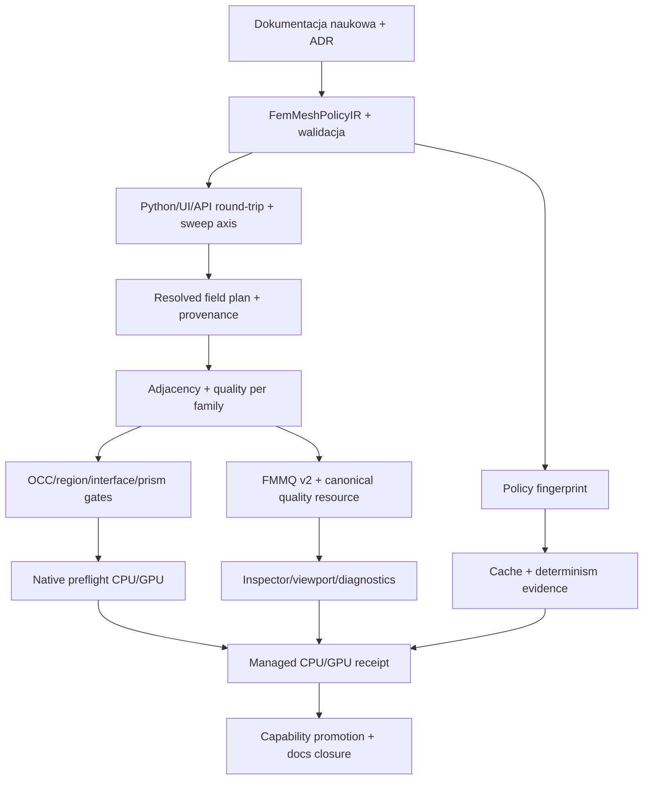

# Produkcyjne domknięcie meshingu FEM — zweryfikowany plan implementacji i napraw

> **Dla agentów wykonawczych:** realizować zadania kolejno, z testem RED przed zmianą i z bramką wskazaną w każdym zadaniu. Nie wolno promować statusu runtime na podstawie samego przeglądu źródeł.

**Cel:** doprowadzić cały przepływ tworzenia siatki FEM — od Python DSL i Control Room, przez `ProblemIR`, planner, Gmsh/OCC, artefakty, API i frontend, aż do natywnego FEM CPU/GPU — do jednego, typowanego, mierzalnego i fail-closed kontraktu produkcyjnego.

**Architektura docelowa:** authoring zapisuje wyłącznie żądaną politykę meshu w SI. Normalizer tworzy jeden `FemMeshPolicyIR`, planner rozstrzyga legalność, generator Gmsh emituje jawny `ResolvedFemMeshPolicy` oraz raport realizacji, a niezależny postprocessing mierzy topologię, regiony, jakość i rzeczywistą gradację. API publikuje jeden revision- i fingerprint-bound zasób jakości. Backend przyjmuje tylko mesh, którego kontrakt wejściowy i dowód realizacji są zgodne z wybraną capability.

**Stos:** Rust (`fullmag-ir`, `fullmag-authoring`, `fullmag-plan`, `fullmag-api`, `fullmag-runner`), Python/NumPy/Gmsh/meshio, C++/MFEM/hypre/libCEED/CUDA, OpenAPI v2, TypeScript/React/Control Room, zarządzane recepty `just`. Gmsh 4.15.2 jest przypiętym baseline'em strict mixed Box+airbox; ogólna ścieżka zachowuje obecny wspierany zakres `gmsh>=4.12,<5`, dopóki osobna macierz kompatybilności go nie zawęzi.

**Rewizja bazowa:** `5ac37c7a8c4715cff7fdf197caede15f94665d9e`.

**Stan drzewa:** plan powstał na współdzielonym, brudnym worktree. Istniejące zmiany innych zadań pozostają własnością użytkownika. Implementacja nie może ich resetować, stashować, formatować ani nadpisywać. W szczególności bieżące zmiany dotyczące planarnego próbkowania `Prism6` nie są dowodem kwalifikacji generowania mixed-P1.

---

## 1. Materiał wejściowy i metoda weryfikacji krzyżowej

Porównano:

1. `docs/audits/2026-08-27-fem-mesh-pipeline-audit.md` — audyt repozytoryjny z rejestrem `FM-MESH-001..018`, ścieżkami, testami i granicami dowodu;
2. załączony raport ChatGPT PRO — szersza narracja problemowa i pięcioetapowy kierunek napraw;
3. bieżący kod na wskazanej rewizji;
4. istniejące testy jednostkowe Gmsh/OCC, mixed-P1, persistence i authoringu;
5. istniejące ADR-y, noty naukowe, capability matrix i recepty zarządzanego runtime.

Statusy w tym planie:

- `CONFIRMED` — potwierdzone w bieżącym kodzie albo świeżym testem lokalnym;
- `PARTIALLY CONFIRMED` — mechanizm lub ryzyko istnieje, lecz nie ma pełnego dowodu skutku albo pełnego pokrycia tras;
- `BLOCKED` — nie istnieje wymagany bieżący dowód produkcyjny;
- `NOT VERIFIED` — wymaga managed runtime, GPU albo realnego browser/WebGL proof.

Świeże testy przeglądu potwierdziły:

- osiem kontraktów gradacji, edge/corner, regionów CSG i jawnego fallbacku;
- exact mixed `prism6` dla `layers in {1,2,3}`;
- round-trip semantycznych Physical Groups przez eksport/import Gmsh;
- odrzucanie niespójnych parametrów layered mesh oraz liczby warstw poza zakresem.

Nie uruchomiono pełnego managed FEM CPU/GPU ani browser proof. Brak pliku `.fullmag/reports/fem-meshing-production/evidence.v1.json` został potwierdzony, dlatego bieżąca kwalifikacja produkcyjna pozostaje `BLOCKED`.

---

## 2. Werdykt porównania obu dokumentów

### 2.1 Co oba dokumenty rozpoznają prawidłowo

Oba materiały trafnie wskazują:

- brak jednej kanonicznej polityki wejściowej meshu;
- rozjazd walidacji UI/API/Python;
- brak końcowej, topologicznej kontroli wzrostu rozmiaru między sąsiadami;
- utratę `sweep_direction` przed właściwym generatorem;
- brak wspólnej bramki jakości dla `tet4`, `prism6`, `pyramid5`, `hex8`;
- niepełne statystyki mixed per family, marker i strefa;
- brak kryptograficznego związania FMMQ z topologią i kolejnością elementów;
- słabszą walidację `material_interface` po stronie natywnej;
- brak wykonawczego cache z testowaną invalidacją;
- brak samodzielnie generowanego managed CPU/GPU/browser receipt;
- konieczność rozdzielenia `requested`, `resolved`, `fallback` i `qualified`.

### 2.2 W czym audyt repozytoryjny jest mocniejszy

Audyt repozytoryjny jest lepszą bazą dowodową, ponieważ:

- wiąże ustalenia z symbolami i testami;
- rozróżnia source contract od managed runtime qualification;
- opisuje realny strict mixed path oraz ograniczenia geometrii;
- rejestruje ryzyka FMMQ, cache, markerów, fallbacku i dokumentacji;
- jawnie podaje obszary nieweryfikowane.

Jego dotychczasowy plan naprawczy jest jednak zbyt skrótowy: dla każdego ID nie podaje pełnej sekwencji RED → zmiana symboli → test → gate.

### 2.3 W czym materiał ChatGPT PRO jest mocniejszy

Materiał ChatGPT PRO lepiej:

- objaśnia fizyczny sens rozdzielenia FM/interface/airbox;
- pokazuje potrzebę raportowania dominacji pól;
- rozróżnia regularność przez grubość od strukturalności w płaszczyźnie;
- grupuje prace w logiczne etapy kontrakt → gradacja → jakość → topologia → receipt.

Niektóre tezy są jednak hipotezami bez dowodu runtime lub opisują jako brak coś, co już częściowo istnieje.

### 2.4 Korekty wymagane po weryfikacji kodu

| Teza wejściowa | Zweryfikowany werdykt | Konsekwencja dla naprawy |
|---|---|---|
| Brak kontrolowanego łańcucha `Distance → Threshold/MathEval → Min → Background Field` | Łańcuch istnieje. Upper bounds są składane przez `Min`, lower bounds przez `Max`, a wynik przez `Max(upper, lower)`. | Nie przepisywać algebraicznego rdzenia. Dodać typowany plan pól, provenance i raport dominacji. |
| `growth_rate` działa głównie przez `Mesh.SmoothRatio` | Nieprecyzyjne. Parametr zasila również geometryczne `MathEval`; liniowy `Threshold` używa `SizeMin/Max` i `DistMin/Max`, nie ratio. | Problemem jest brak pomiaru realizowanego ratio na gotowej siatce oraz niejasna aktywacja prawa liniowego, nie sam brak sterowania generatorem. |
| Ogólna trasa wyłącza `Mesh.MeshSizeFromCurvature` | Fałsz dla ogólnej trasy; `_apply_mesh_options` może curvature aktywnie ustawiać. | Poprawić audyt/noty i raportować aktywne źródła rozmiaru. Nie wyłączać curvature bez decyzji polityki. |
| `max(dx,dy,dz)` bboxa jest błędem jakości | Potwierdzona jest tylko nieciągłość pochodnej na zmianie dominującej osi. Skutek dla siatki nie jest dowiedziony. | Najpierw metryki gradientu/dominacji i neighbor growth. Smooth-max wdrażać wyłącznie po negatywnym wyniku fixture. |
| Globalna hierarchia pól jest niepoprawna | Algebra jest zasadniczo właściwa, lecz rozproszona i słabo obserwowalna. | Scentralizować model/provenance, nie zmieniać semantyki bez testu równoważności. |
| Explicit prism może zawsze milcząco stać się tet | Za szerokie. Bezpośredni generator odrzuca non-Box explicit prism; legacy/auto paths mogą kończyć tet albo fallbackiem. | Wymusić wspólny requested/resolved contract we wszystkich dispatcherach. |
| Każda ekstrudowana siatka jest strukturalna | Fałsz i oba dokumenty słusznie to odrzucają. | Raportować osobno regularność normalną, exact layers oraz in-plane structure. |
| Brak typowanych elementów polityki w IR | Częściowo fałsz: istnieją `MeshSemanticsIR`, `UniverseMeshConfigIR`, `PerObjectMeshConfigIR`, `SweptMeshHintsIR`. | Rozszerzyć i scalić istniejący model; nie tworzyć drugiego równoległego kontraktu. |

### 2.5 Nowe ustalenia, których oba dokumenty nie eksponują dostatecznie

1. `world.py::_validate_mesh_control_values` akceptuje dodatni `growth_rate <= 2.5`, choć komunikat deklaruje zakres `1.0–2.5`; `_airbox_grading.py::_add_airbox_grading_field` wyłącza grading dla `grading_ratio <= 1.0`. Parametr z `(0,1]` może więc przejść walidację, a następnie stać się nieaktywny.
2. `geometry_mesh_override_value` może zamienić błędny tekst rozmiaru na JSON `null`, co uruchamia downstream default zamiast błędu.
3. `replace_mesh_universe_config` utrzymuje dwa nośniki stanu (`study.universe_mesh` i warunkowo `scene.universe`). Odczyt preferuje study, więc błąd runtime nie jest potwierdzony, ale round-trip/provenance są zagrożone.
4. Plan nowego publicznego kontraktu musi zostać włączony do istniejącego, przygotowywanego `ProblemIRV04`; niezależne podbicie wersji lub drugi model wejściowy stworzy kolizję migracji.
5. UI prawidłowo blokuje prism przy capability `implemented`. Nie wolno usuwać tej blokady bez receipt albo jawnego trybu eksperymentalnego.

---

## 3. Docelowy kontrakt semantyczny

Kanoniczna polityka ma być częścią istniejącego `MeshSemanticsIR`, a nie nowym surowym wpisem w `problem_meta.runtime_metadata`:

```text
MeshSemanticsIR
├── requested_policy: FemMeshPolicyIR
│   ├── ferromagnet: bulk / edge / corner
│   ├── interface: h / thickness
│   ├── airbox: near / far / transition / law
│   ├── strategy_intent: tetra | thin_film_tetrahedral | swept
│   ├── sweep: requested axis / layers / distribution / family intent
│   ├── geometric_element_order: 1
│   ├── growth: max_neighbor_ratio / tolerance / definition_id
│   └── quality: versioned policy and thresholds per family/scope
└── solver_mesh: realized artifact reference
    └── build_report: requested / resolved / evidence / fallback / quality identity
```

Zasady:

- wszystkie długości są w metrach w IR;
- pole niepodane to `None`; błędna wartość nigdy nie jest zamieniana na `None`;
- `growth_rate == 1.0` nie ma podwójnej semantyki. `uniform` nie ma transition field ani ratio; `linear` używa `near_h`, `far_h` i `transition_distance`, ale nie ratio; `geometric` dodatkowo wymaga `1.0 < ratio <= 2.5`;
- limit sąsiedni jest osobnym wymaganiem wyniku, nie aliasem Gmsh `Mesh.SmoothRatio`;
- `requested_sweep_direction` nie jest nadpisywany; `resolved_sweep_direction` powstaje dopiero w plannerze/generatorze;
- authored `strategy_intent`, `swept_family_intent` i `requested_sweep_direction` są różne od wyniku. Jedynym właścicielem resolved axis/topology/families jest Pythonowy mesh-realization generator; planner tylko waliduje legalność, nie rozwiązuje osi drugi raz;
- `swept_family_intent=prism` kończy się `prism6` w objętości swept albo twardym błędem; wynik całej shared domain może być mixed `prism6+pyramid5+tet4`;
- `geometric_element_order` jest jawnie równy `1`; P2 jest odrzucane przed Gmsh i nie może zostać cicho obniżone do P1;
- fallback może zmienić tylko `resolved` i musi obniżyć capability; nie wolno przepisywać requested intent;
- zrealizowany mesh, quality report i FMMQ mają wspólny topology/order fingerprint.

Tożsamość snapshotu jest atomowa: topology resource, quality report i FMMQ
publikują ten sam `MeshIdentity { mesh_revision, topology_fingerprint,
element_order_fingerprint }`. Klient najpierw pobiera identity topologii, a
następnie żąda reportu i FMMQ z silnym `If-Match` równym ETag tego identity.
Zmiana rewizji lub fingerprintu zwraca `412 Precondition Failed`; frontend
odrzuca cały snapshot i ponawia trzy odczyty, zamiast łączyć zasoby z `r` i
`r+1`.

Migracja IR:

- rozszerzyć `crates/fullmag-ir/src/mesh_assets.rs::MeshSemanticsIR` o `requested_policy`;
- dodać typy do nowego `crates/fullmag-ir/src/mesh_policy.rs`, eksportowanego z `crates/fullmag-ir/src/lib.rs`;
- w fazie przygotowawczej publiczny writer 0.3 pozostaje bez zmian, zgodnie z ADR 0024;
- dodać `requested_policy` do już istniejącego `ProblemIRV04` i istniejącej migracji `0.3 → 0.4`;
- migracja jest jednokierunkowa: reader V03 normalizuje legacy `runtime_metadata.mesh_workflow` do typed policy i zapisuje migration provenance; V04 read/write/execute używa wyłącznie typed policy, a zmiana lub usunięcie legacy mapy nie może zmienić wykonania;
- atomowy cutover 0.4 ma jednocześnie przełączyć model obiektów i mesh policy; nie tworzyć wersji 0.4 konkurencyjnej wobec `ProblemIRV04`.

---

## 4. Rejestr ustaleń z planem naprawczym dla każdego punktu

### FM-MESH-001 — rzeczywista gradacja sąsiadów

**Status/prio:** `CONFIRMED`, P0.

**Przyczyna:** pola Gmsh sterują rozmiarem, ale po generacji nie powstaje graph wspólnych faset z pomiarem `h_large/h_small`. `Mesh.SmoothRatio` i pola `MathEval` są hintami realizacji, nie dowodem wyniku.

**Pliki:**

- `packages/fullmag-py/src/fullmag/meshing/_gmsh_types.py` — dodać canonical adjacency i `NeighborGrowthReport`;
- `packages/fullmag-py/src/fullmag/meshing/mesh_build_report.py` — serializować wynik per family/marker/scope;
- `packages/fullmag-py/src/fullmag/meshing/_gmsh_fields.py` — zachować Gmsh hint, ale wiązać go z `definition_id`;
- `crates/fullmag-ir/src/mesh_policy.rs` — `max_neighbor_ratio`, `relative_tolerance`, `cell_size_definition_id`;
- `docs/physics/0102-airbox-mesh-grading-geometric.md` i `docs/physics/0105-fem-meshing-production-acceptance.md` — definicja matematyczna.

**Naprawa:** zbudować adjacency z kanonicznych ścian `tet4/prism6/pyramid5/hex8`; zdefiniować `h` jako średnicę kuli o równoważnej dodatniej objętości, `h=(6V/pi)^(1/3)`, aby jedna definicja działała dla wszystkich rodzin; liczyć ratio dla każdej wspólnej fasety, osobno wewnątrz scope i cross-scope; publikować max, p95, p99, histogram i stabilnie posortowane worst pairs; failować, gdy `max > target * (1+tolerance)`.

**RED/gate:** `packages/fullmag-py/tests/test_mesh_neighbor_growth.py`; pojedyncza wadliwa para ma zwrócić oba ordinals, family, markers, shared-face nodes, measured i threshold. Gate: `PYTHONPATH=packages/fullmag-py/src .fullmag/local/python/bin/python -m pytest -q packages/fullmag-py/tests/test_mesh_neighbor_growth.py`.

### FM-MESH-002 — wspólna produkcyjna bramka jakości

**Status/prio:** `CONFIRMED`, P0.

**Przyczyna:** `MeshData.validate_strict` kontroluje orientację/Jacobian, strict mixed ma mocniejszy certyfikat, ale ordinary tetra i pozostałe rodziny nie przechodzą jednego policy-driven gate.

**Pliki:**

- `packages/fullmag-py/src/fullmag/meshing/quality.py` — zastąpić tet-only compatibility validator fasadowym wejściem do wspólnej biblioteki;
- `packages/fullmag-py/src/fullmag/meshing/_gmsh_types.py` — obliczenia rodzinne i strukturalny report;
- `crates/fullmag-ir/src/mesh_policy.rs` — `MeshQualityPolicyIR`;
- `crates/fullmag-ir/src/mesh_hints.rs::MeshQualityIR` — zachować compatibility metryki; w `crates/fullmag-ir/src/mesh_assets.rs` utworzyć nowy, strukturalny `MeshQualityReportIR` i identity zamiast udawać, że typ już istnieje;
- `crates/fullmag-api/src/schemas/mesh.rs` — typowany resource i gates;
- `docs/physics/0105-fem-meshing-production-acceptance.md` — progi i zasada `unavailable != pass`.

**Naprawa:** ujednolicić minimum signed/scaled Jacobian, dodatnią objętość, aspect ratio i skewness per family. Każda metryka ma `metric_definition_id`, ponieważ Gmsh i własna geometria nie mogą używać tej samej nazwy dla różnych definicji. `fail` lub brak wymaganej metryki blokuje publikację i start FEM.

**RED/gate:** utworzyć `packages/fullmag-py/tests/test_mesh_quality_contract.py` z idealnym i pojedynczo zdeformowanym `tet4/prism6/pyramid5/hex8`. Gate: wszystkie celowe deformacje są odrzucone z family, ordinal, centroid, observed i threshold.

### FM-MESH-003 — utrata `sweep_direction`

**Status/prio:** `CONFIRMED`, P0.

**Przyczyna:** DSL i per-geometry metadata zachowują wartość, ale `_mesh_options_from_runtime_metadata` nie przenosi jej do `MeshOptions`; generic Box wybiera oś automatycznie. Obecny test osi wywołuje generator bez pełnego dispatchera.

**Pliki:**

- `packages/fullmag-py/src/fullmag/world.py::GeometryMeshHandle.swept`, `_mesh_spec_to_metadata`, `_collect_mesh_workflow_metadata`;
- `crates/fullmag-authoring/src/adapters.rs::geometry_mesh_override_value`;
- `crates/fullmag-ir/src/mesh_policy.rs::FemSweepPolicyIR`;
- `crates/fullmag-plan/src/util.rs::mesh_workflow_metadata` i `crates/fullmag-plan/src/mesh.rs`;
- `packages/fullmag-py/src/fullmag/meshing/_size_field_plan.py::_mesh_options_from_runtime_metadata`;
- `packages/fullmag-py/src/fullmag/meshing/_gmsh_types.py::MeshOptions`;
- `packages/fullmag-py/src/fullmag/meshing/_gmsh_swept.py::generate_swept_mesh`;
- `packages/fullmag-py/src/fullmag/meshing/mesh_build_report.py`.

**Naprawa:** przeprowadzić `requested_sweep_direction` przez cały łańcuch. Planner sprawdza tylko, czy intent jest legalny dla capability; Pythonowy mesh-realization generator jest jedynym resolverem `auto` i musi użyć explicit osi bez ponownego wyboru. Certificate/report zapisują requested i resolved; różnica dla explicit x/y/z jest błędem, nie fallbackiem.

**RED/gate:** pełne fixtures x/y/z w `packages/fullmag-py/tests/test_mixed_element_meshing.py` oraz golden UI/Python round-trip. Gate: DSL/API → normalized IR → `MeshOptions` → generator → report zachowuje oś lub failuje przed Gmsh.

### FM-MESH-004 — niespójna walidacja UI/API/Python

**Status/prio:** `CONFIRMED`, P0.

**Przyczyna:** requesty OpenAPI są mapami JSON, UI ma własną luźną walidację, `ScriptBuilderUniverseState` nie ma walidatora semantycznego, a adapter może zamienić malformed text na `null`.

**Pliki:**

- `crates/fullmag-authoring/src/builder.rs::ScriptBuilderUniverseState`;
- `crates/fullmag-authoring/src/validation.rs` — dodać `validate_universe_mesh_policy`;
- `crates/fullmag-authoring/src/adapters.rs::parse_optional_text_f64_or_auto` i `geometry_mesh_override_value`;
- `crates/fullmag-api/src/schemas/mesh.rs::{MeshUniverseConfigReplaceRequest,MeshObjectConfigReplaceRequest}`;
- `crates/fullmag-api/src/router_v2/handlers/meshing/mesh.rs::replace_mesh_universe_config`;
- `apps/control-room/src/modules/inspector/panels/airbox/airboxMeshPolicyDraft.ts`;
- `apps/control-room/src/modules/inspector/panels/ObjectMeshPolicyPanelModel.ts`;
- `packages/fullmag-py/src/fullmag/world.py::StudyUniverseConfig` i `_validate_mesh_control_values`.

**Naprawa:** API przyjmuje typowane DTO wygenerowane z IR; Rust jest autorytatywnym walidatorem zapisu, Python implementuje identyczne constraints, UI jedynie daje wczesny feedback. Odrzucać NaN/inf, `20nm`, zero, minus, partial vectors, ujemny padding, nieznany mode, `hmin>hmax` i obce pola. Usunąć możliwość malformed → `null`.

**RED/gate:** wspólny JSON fixture `tests/golden/mesh-policy/validation-cases.v1.json`, konsumowany w Rust, Python i TS. Każda warstwa zwraca ten sam stable error code i JSON pointer.

### FM-MESH-005 — brak samodzielnego receipt produkcyjnego

**Status/prio:** `BLOCKED`, P0.

**Przyczyna:** `just verify-fem-meshing-production` waliduje istniejący manifest; nie generuje managed CPU/GPU/browser evidence. Bieżący `evidence.v1.json` nie istnieje.

**Pliki:**

- `justfile::verify-fem-meshing-production`;
- `scripts/verify_fem_meshing_production.sh`;
- `scripts/verify_fem_meshing_production.py`;
- `scripts/test_verify_fem_meshing_production_manifest.py`;
- `scripts/verify_fem_mixed_prism_airbox_runtime.py`;
- `apps/control-room/scripts/smoke-viewport-3d-mixed-topology.mjs`.

**Naprawa:** recipe ma od zera: zapewnić managed runtime, wygenerować canonical workload, wykonać CPU i forced GPU double bez fallbacku, zebrać topology/quality/FMMQ/policy hashes, uruchomić API i browser smoke, a dopiero na końcu atomowo zapisać `fem_meshing_production_gate.v2`. Walidator pozostaje osobnym fail-closed agregatorem.

**RED/gate:** test czystego evidence root; końcowy gate to `just verify-fem-mixed-prism-airbox-runtime`, potem `just verify-fem-meshing-production`. Browser evidence wymaga widocznego canvas, `isContextLost()==false`, niezerowego drawing buffer i niepustego obrazu.

### FM-MESH-006 — brak jednego kanonicznego modelu wejściowego

**Status/prio:** `PARTIALLY CONFIRMED`, P1.

**Przyczyna:** istnieją typowane fragmenty, ale aktywny planner/generator nadal rekonstruuje policy z `runtime_metadata.mesh_workflow`; `MeshSemanticsIR` i `SweptMeshHintsIR` nie są jedynym wejściem.

**Pliki:** `crates/fullmag-ir/src/mesh_policy.rs` (nowy), `crates/fullmag-ir/src/mesh_assets.rs::MeshSemanticsIR`, `crates/fullmag-ir/src/physics_object.rs::ProblemIRV04`, `crates/fullmag-ir/src/validation.rs`, `crates/fullmag-authoring/src/scene.rs`, `crates/fullmag-authoring/src/adapters.rs`, `packages/fullmag-py/src/fullmag/world.py`, `crates/fullmag-plan/src/util.rs`.

**Naprawa:** scalić universe, object, interface, topology, sweep, growth i quality w `FemMeshPolicyIR`. Legacy `mesh_workflow` jest czytany tylko przez jednokierunkowy migrator V03 → V04 i nie jest porównywany ani konsultowany podczas wykonania V04. Przy atomowym V04 cutover usunąć runtime odczyt kanonicznych pól z mapy; legacy wartości pozostają wyłącznie w raporcie migracji.

**RED/gate:** golden UI i Python generują bajtowo równoważny znormalizowany policy fragment oraz ten sam canonical Python export. Nie uruchamiać cache przed ustaleniem `policy_fingerprint`.

### FM-MESH-007 — statystyki mixed per family/region/scope

**Status/prio:** `CONFIRMED`, P1.

**Przyczyna:** `MeshData.statistics_ir()` zwraca `None` poza czystym `tet4/tri3`; obecne rankingi koncentrują się na SICN/gamma.

**Pliki:** `packages/fullmag-py/src/fullmag/meshing/_gmsh_types.py::statistics_ir`, `mesh_build_report.py`, `remesh_cli.py`, `crates/fullmag-api/src/schemas/mesh.rs`, `apps/control-room/src/shared/domain/mesh/qualityStatistics.ts`.

**Naprawa:** generować dystrybucje per `family × marker × scope`, z exact bins, quantiles, counts i worst ordinals. Scope co najmniej: `ferromagnet.bulk`, `.flat_interface`, `.edge`, `.corner`, `airbox.near_interface`, `.transition`, `.far`. Klasyfikator ma `scope_definition_id=fullmag.fem.mesh_scope.centroid_distance.v1` i używa centroidu komórki oraz tych samych semantycznych selectorów/dystansów co resolved field plan. Precedence po stronie FM to `corner > edge > flat_interface > bulk`; po stronie air to `near_interface > transition > far`. Granice to odpowiednio `corner_extent`, `edge_thickness`, `interface_thickness` i `airbox.transition_distance`. Aligned `element_scope_code` jest zapisywany razem z global ordinalem, aby histogram i viewport nie rekonstruowały scope inną metodą.

**RED/gate:** `packages/fullmag-py/tests/test_mixed_mesh_quality_statistics.py`; suma binów musi równać się populacji scope, każda obecna rodzina ma raport, kolejność worst jest deterministyczna.

### FM-MESH-008 — aspect ratio i skewness

**Status/prio:** `CONFIRMED`, P1.

**Przyczyna:** nie są produkcyjnymi, rodzinnymi metrykami gate; cross-section ma tet-only obliczenia, które nie mogą zostać uogólnione nazwą.

**Pliki:** `_gmsh_types.py`, `quality.py`, `crates/fullmag-api/src/fem_cross_section.rs`, `docs/physics/0105-fem-meshing-production-acceptance.md`.

**Naprawa:** zdefiniować `edge_aspect_ratio=max_edge/min_nonzero_edge`; dla skewness wybrać i opublikować osobne definicje rodzinne z versioned `metric_definition_id`. Cross-section używa wartości parent cell z canonical report, zamiast przeliczać tet-only alternatywę.

**RED/gate:** idealne elementy oraz deformacje kontrolujące dokładnie jedną metrykę; tolerancje numeryczne zapisane w nocie naukowej.

### FM-MESH-009 — FMMQ bez identity topologii

**Status/prio:** `CONFIRMED`, P1.

**Przyczyna:** FMMQ v1 zawiera version/flags/count/arrays, ale nie topology fingerprint, order fingerprint ani family offsets.

**Pliki:** `packages/fullmag-py/src/fullmag/meshing/remesh_cli.py::_write_quality_data_artifact_if_available`, `persistence.py`, `crates/fullmag-api/src/fem_cross_section.rs`, `crates/fullmag-api/src/router_v2/handlers/meshing/mesh.rs::read_mesh_quality_data_artifact`, `apps/control-room/src/kernel/api/codecs/meshQualityDataCodec.ts`, `apps/control-room/src/modules/viewport-3d/viewport3dQualityMapping.ts`.

**Naprawa:** FMMQ v2 ponownie używa istniejącego mixed/persistence fingerprintu `v3`: Rust `MeshIR::mixed_topology_fingerprint_v3()` i Python `MeshData.topology_fingerprint_v3()` muszą dawać ten sam digest domeny `fullmag:fem-mesh-topology-fingerprint:v3`. Nie używać nazwanego historycznie `MeshIR::topology_fingerprint_v6()`, które jest identity periodic-certificate v6 o innym znaczeniu, ani nie wprowadzać trzeciego algorytmu. `element_order_fingerprint` jest SHA-256 strumienia `fullmag.fmmq.element-order.v1\0`, liczby elementów `u64 LE`, a następnie dla każdego elementu w kolejności payloadu: `global_ordinal:u64 LE`, canonical `family_code:u8`, `marker:u32 LE` i `scope_code:u16 LE`.

Exact layout FMMQ v2:

- fixed header 128 B: magic `FMMQ`, `version=2`, `scalar_kind=f64_le`, `header_len=128`, flags, `family_count:u32`, `element_count:u64`, `mesh_revision:u64`, raw 32 B topology digest v3, raw 32 B element-order digest, raw 32 B quality-policy digest;
- family table, 24 B na rodzinę: canonical family code, 7 B reserved zero, `element_offset:u64`, `element_count:u64`; elementy są grupowane według canonical family order;
- aligned arrays: `global_ordinal:u64[element_count]`, `marker:u32[element_count]`, `scope_code:u16[element_count]`, padding do 8 B, następnie kanały `f64[element_count]` w kolejności bitów flags;
- `metric_definition_ids`, scope-code table i SHA-256 całego pliku FMMQ są w revision-bound JSON quality report/sidecar. Digest nie jest przechowywany wewnątrz hashowanych bytes, więc nie tworzy cyklicznej definicji.

V1 pozostaje read-only legacy i nie może wejść do production receipt.

**RED/gate:** dwa meshe o tej samej liczbie elementów, ale innej topologii/kolejności, muszą zostać odrzucone przez API i frontend przed mapowaniem kolorów.

### FM-MESH-010 — brak wykonawczego cache

**Status/prio:** `CONFIRMED`, P1.

**Przyczyna:** persistence ma bezpieczne fingerprinty artefaktów, lecz `remesh_cli.py` używa katalogów stagingowych bez lookup/hit/miss i bez invalidacji policy/quality/Gmsh.

**Pliki:** `packages/fullmag-py/src/fullmag/meshing/cache.py` (nowy), `persistence.py`, `remesh_cli.py`, `crates/fullmag-cli/src/python_bridge.rs`, `mesh_build_report.py`.

**Naprawa:** content-addressed key = geometry/authoring digest + normalized policy fingerprint + jednostki + Gmsh version/options/threads + `requested_topology_policy` + quality policy + artifact format. Wynikowy `resolved_topology_fingerprint` nie należy do klucza, bo jest znany dopiero po generacji; trafia do manifestu wpisu i jest ponownie walidowany przy każdym hit. Atomowy zapis przez temp + rename i blokada per key. Każdy hit rewaliduje manifest oraz hashes.

**RED/gate:** `packages/fullmag-py/tests/test_mesh_quality_cache.py`: hit identycznego wejścia, miss po zmianie policy/progu/Gmsh/topologii, jeden producer dla dwóch równoległych requestów, odbudowa po uszkodzonym wpisie.

### FM-MESH-011 — deterministyczność poza strict mixed

**Status/prio:** `PARTIALLY CONFIRMED`, P1.

**Przyczyna:** seed/reproducibility istnieją, strict mixed wymusza jeden wątek, lecz ogólny default zależy od liczby CPU i nie ma N-repeat qualification.

**Pliki:** `packages/fullmag-py/src/fullmag/meshing/_gmsh_infra.py::_resolve_gmsh_thread_count`, `_gmsh_fields.py::_apply_mesh_options`, `mesh_build_report.py`, `scripts/verify_fem_meshing_determinism.py` (nowy).

**Naprawa:** jawne tryby `deterministic` i `best_effort_parallel`; production wymaga jednego wątku albo zatwierdzonego dowodu równoważności. Report zapisuje Gmsh, threads, seed, option digest, topology i quality digest.

**RED/gate:** N powtórzeń Box/Cylinder/CSG/imported STL/region/airbox; różnica fingerprintu w trybie deterministic failuje z pierwszym divergent artifact.

### FM-MESH-012 — słabsza walidacja `material_interface` w native

**Status/prio:** `CONFIRMED`, P1.

**Przyczyna:** Python tworzy rolę tylko dla dwóch właścicieli o różnych markerach; MFEM builder sprawdza tylko owner count.

**Pliki:** `crates/fullmag-ir/src/mesh_hints.rs::MeshIR::validate`, `crates/fullmag-runner/src/native_fem.rs` preflight, `backends/fem/cpu/mfem/runtime/mfem_mesh_builder.cpp::collect_boundaries`, odpowiadający native contract test.

**Naprawa:** IR ponownie wylicza owners z global node IDs i wymaga dokładnie dwóch różnych markerów. Runner sprawdza przed ABI, C++ broni kontraktu ponownie. Exterior/periodic mają dokładnie jednego ownera.

**RED/gate:** ręczny facet dwóch komórek tego samego markera jest odrzucony przez `fullmag-ir` i native contract; uruchomić `just verify-fem-mixed-p1-native-contract` po testach Rust.

### FM-MESH-013 — niepełna parytetowość UI thin-film/prism

**Status/prio:** `CONFIRMED`, P1.

**Przyczyna:** UI nie prezentuje całej typowanej semantyki `thin_film_tetrahedral`; prism jest słusznie fail-closed dla statusu `implemented`, ponieważ managed proof nie istnieje.

**Pliki:** `ObjectMeshPolicyPanelModel.ts`, `ObjectMeshPolicyPanel.tsx`, ich testy, `geometryLifecycleResources.ts`, generated OpenAPI files.

**Naprawa:** dodać pełny typed editor tetra thin-film; dla prism pokazywać strategy/family intent, bounded layers i powód blokady. W `ObjectMeshPolicyPanelModel.ts` usunąć możliwość produkcyjnego odblokowania na podstawie samego `production_executable`: zarówno `implemented`, jak i `production_executable` bez pasującego receipt/scope są disabled. Odblokować produkcyjnie wyłącznie przy `validated` związanym z aktualnym receipt; opcjonalny tryb eksperymentalny musi być jawny i nie może tworzyć production receipt.

**RED/gate:** UI round-trip tetra thin-film; matrix `unsupported/implemented/production_executable-without-receipt/validated-with-matching-receipt`; browser sprawdza stabilność panelu podczas PUT/ACK i brak przedwczesnego odblokowania.

### FM-MESH-014 — rozproszona obserwowalność

**Status/prio:** `CONFIRMED`, P1.

**Przyczyna:** summary, build report, scoped endpoints i frontendowe fallbacki mogą prezentować różne fragmenty; `derive_mesh_quality_gates` może uznać topologiczne minimum za pass.

**Pliki:** `crates/fullmag-api/src/schemas/mesh.rs`, `router_v2/handlers/meshing/mesh.rs::derive_mesh_quality_gates`, `geometryLifecycleResources.ts`, `useMeshDetailsModel.ts`, `MeshQualityStatisticsView.tsx`, `MeshQualityGatesSection.tsx`.

**Naprawa:** producer-owned `MeshQualityReportResource` z identity, policy, families, scopes, distributions, gates i artifacts. Handler nigdy nie syntetyzuje `pass`; brak wymaganego reportu daje `unavailable` albo `fail`. UI nie rekonstruuje semantyki z surowych map.

**RED/gate:** workspace z nodes/elements/coverage bez quality report nie może zwrócić pass; Inspector pokazuje tę samą rewizję i fingerprint co FMMQ.

### FM-MESH-015 — drift dokumentacji i statusów

**Status/prio:** `CONFIRMED`, P1.

**Przyczyna:** `0101`, `0102`, `0104`, `0106` i capability matrix opisują różne etapy wdrożenia; część dokumentacji sugeruje gradację wyłącznie liniową lub brak mixed support. Audyt dodatkowo zbyt szeroko opisał wyłączenie curvature.

**Pliki:** `docs/physics/0100-mesh-and-region-discretization.md`, `0101-swept-mesh-through-thickness.md`, `0102-airbox-mesh-grading-geometric.md`, `0103-rectangular-waveguide-edge-corner-mesh-refinement.md`, `0104-gmsh-semantic-entity-selectors.md`, `0104-material-regions-parameter-fields-and-interface-couplings.md`, `0104-thin-film-shared-domain-meshing.md`, `0105-fem-meshing-production-acceptance.md`, `0106-fem-mixed-prism-pyramid-shared-domain.md`, ich `.source-map.json`, `docs/specs/capability-matrix-v0.md`, `docs/audits/2026-08-27-fem-mesh-pipeline-audit.md`.

**Naprawa:** oddzielić source implemented, planner legal i managed validated; poprawić curvature i field algebra; dopisać source maps dla każdego zmienianego terminalnego dokumentu naukowego.

**RED/gate:** rozszerzyć checker dokumentacji tak, aby capability `validated` wymagała receipt path/hash, a source map wskazywała istniejące symbole i testy.

### FM-MESH-016 — niespójna semantyka prism między geometriami

**Status/prio:** `CONFIRMED`, P1.

**Przyczyna:** strict Box ma rzeczywisty prism6, Cylinder w trasach auto/legacy może zostać potetraedryzowany, ArchWaveguide przechodzi do STL/free-tet; bezpośredni explicit non-Box prism jest odrzucany, ale raportowanie nie jest jednolite.

**Pliki:** `packages/fullmag-py/src/fullmag/meshing/_gmsh_swept.py`, `asset_pipeline.py`, `mesh_build_report.py`, `crates/fullmag-plan/src/mesh.rs`, capability matrix.

**Naprawa:** capability per geometry i tryb; każdy dispatcher zwraca `strategy_intent`, `swept_family_intent`, `resolved_topology`, exact resolved families, requested/resolved axis i fallback reason. Explicit family intent prism nie ma automatycznego tet fallbacku. `strategy_intent=auto` może rozwiązać się do tet, ale requested intent pozostaje niezmienione.

**RED/gate:** matrix Box/Cylinder/ArchWaveguide × explicit prism/auto/tetra; każdy przypadek ma jednoznaczny wynik i status.

### FM-MESH-017 — błąd jakości tylko jako tekst

**Status/prio:** `CONFIRMED`, P2.

**Przyczyna:** przygotowanie ma fazy, ale failure jakości jest redukowany do ogólnego stringa.

**Pliki:** `crates/fullmag-cli/src/python_bridge.rs::python_mesh_preparation_update`, `crates/fullmag-api/src/schemas/preparation.rs`, preparation handlers, Control Room startup overlay/diagnostics.

**Naprawa:** `MeshQualityGateFailure {gate_id,status,family,scope,metric_id,observed,threshold,element_ordinals,report_identity}`; tekst pozostaje opisem, struktura jest źródłem UI i receipt.

**RED/gate:** przekroczenie growth/quality ustawia preparation failed z typed payload i linkiem do bieżącego reportu.

### FM-MESH-018 — osłabienie gwarancji po fallbacku OCC/STL

**Status/prio:** `PARTIALLY CONFIRMED`, P1.

**Przyczyna:** fallback jest jawny i degraded, conformal object regions są fail-closed, ale zwykła tetra/STL trasa nie ma uniwersalnej capability bramki odbierającej OCC-only claims.

**Pliki:** `asset_pipeline.py::_realize_fem_domain_mesh_asset_from_components_impl`, `mesh_build_report.py`, `crates/fullmag-plan/src/mesh.rs`, `crates/fullmag-runner/src/lib.rs`, API capability resource i UI.

**Naprawa:** reportuje `build_mode`, `degraded`, `fallbacks_triggered`, `conformal_qualified`, `region_identity_qualified`, `size_field_scope_qualified`. Degraded build nie dziedziczy strict prism, conformal interface ani edge/corner claims niewspieranych przez fallback.

**RED/gate:** wymuszona awaria OCC daje dokładny degraded report; conformal region failuje; zwykły fallback nie otrzymuje capability konformalnej.

### FM-MESH-019 — zaakceptowany, lecz nieaktywny `growth_rate <= 1`

**Status/prio:** `CONFIRMED`, P0.

**Przyczyna:** walidator Python dopuszcza dodatnią wartość do 2.5, generator zwraca brak pola dla ratio `<=1.0`; komunikat walidatora obiecuje inny zakres.

**Pliki:** `world.py::_validate_mesh_control_values`, `world.py::StudyUniverseConfig.__post_init__`, `_airbox_grading.py::_add_airbox_grading_field`, `mesh_policy.rs`, frontend drafts/tests.

**Naprawa:** enum law `uniform|linear|geometric`; `uniform` nie ma transition field ani ratio, `linear` zawsze buduje `Threshold` z near/far/transition i nie przyjmuje ratio, a `geometric` wymaga `1.0 < ratio <= 2.5`. Usunąć wspólny warunek aktywacji `grading_ratio > 1` dla linear. Legacy `law=linear` mapuje ratio do migration note i nie pozwala mu sterować polem; legacy `law=geometric, ratio=1.0` jest niejednoznaczne i failuje z instrukcją wyboru `uniform`, a wartości `<1.0` są odrzucane.

**RED/gate:** fixtures geometric ratio `0.9`, `1.0`, `1.000001`, `2.5`, `2.500001` oraz linear z ratio `None`, `1.0`, `>1`; linear tworzy pole niezależnie od ratio legacy i raportuje migrację, geometric ma wspólny wynik/error code na każdej warstwie.

### FM-MESH-020 — niegładki prostokątny envelope bboxa

**Status/prio:** `PARTIALLY CONFIRMED`, P2.

**Przyczyna:** `_rectangular_airbox_fraction_expression` i `_box_airbox_boundary_ramp_expression` używają zagnieżdżonych `Min/Max`; funkcja jest ciągła, ale nie `C1` na remisach osi. Brak dowodu, że powoduje naruszenie jakości.

**Pliki:** `_airbox_grading.py`, `_gmsh_fields.py`, nowe diagnostyki w `_gmsh_types.py`, `docs/physics/0102-airbox-mesh-grading-geometric.md`.

**Naprawa:** najpierw dodać adversarial rectangular fixtures i mierzyć neighbor growth, anizotropię oraz pasma dominacji przy `dx=dy`, `dy=dz`, narożnikach i ścianach. Jeżeli gate wykaże regresję, zastąpić hard-max przez udokumentowany bounded smooth-max/p-norm, który nadal osiąga far target na każdej ścianie airboxa. Zmiana wymaga testu równoważności wartości brzegowych.

**RED/gate:** sam skok gradientu nie jest failure. Failure stanowi przekroczenie policy neighbor ratio lub quality gate w strefie tie-surface.

---

## 5. Kontrakty już działające — nie przepisywać, tylko utrwalić regresją

### 5.1 OCC fragment i region mapping

`_gmsh_occ.py::generate_shared_domain_mesh_via_occ` wykonuje pojedyncze `occ.fragment`, konsumuje `result_map`, odtwarza komponenty/regiony i dopiero potem tworzy Physical Groups. To jest właściwy model konformalny.

Plan ochronny:

- dodać fixtures `fragment`, `cut`, `fuse`, `intersect`, osobny region wewnątrz owner geometry;
- potwierdzić, że operand konstrukcyjny CSG nie staje się materiałem bez jawnego regionu/komponentu;
- po każdym OCC operation wyliczyć coverage input region → result volumes i odrzucić zero/ambiguous ownership;
- nie zastępować `result_map` heurystyką bbox/centroid jako źródłem tożsamości.

### 5.2 Physical Groups, marker `0`, meshio i persistence

Eksport Gmsh 4.1 oraz sidecar zachowują semantyczny marker air `0`; import bez sidecara wymaga jednostek i mapy regionów. Ten kontrakt należy rozszerzyć, nie zastąpić.

Plan ochronny:

- round-trip mixed families + tri/quad facets + markers + roles + global ordinals;
- porównać topology fingerprint przed i po meshio;
- odrzucać brak `gmsh:physical`, nieznaną jednostkę oraz konflikt sidecar/plik;
- dodać testy markerów wysokich, sparse i kolidujących z encodingiem Gmsh.

### 5.3 Strict Box prism

Obecna ścisła trasa `Box + swept_prism + bbox airbox + P1 + layers 1..3 + Gmsh 4.15.2 + one thread` rzeczywiście generuje `prism6` w magnesie oraz `pyramid5/tet4` w airboxie i certyfikuje exact layers.

Plan ochronny:

- nie rozluźniać bounded geometry/physics scope bez oddzielnego receipt;
- zachować brak prism-to-tet splittera;
- zachować `fallbacks_triggered=[]` w strict mode;
- rozróżniać feasibility fixture, source implemented, planner legal i managed validated.

---

## 6. Kolejność implementacji



Nie wolno zaczynać cache od surowego `mesh_workflow`, bo jego klucz nie będzie stabilny. Nie wolno odblokować prism w UI przed końcowym receipt.

---

## 7. Zadania wykonawcze

### Zadanie 0: Zamrozić baseline i macierz dowodów

**Pliki:** bez zmian w kodzie; zaktualizuj wyłącznie tabelę evidence w tym planie, jeśli baseline ulegnie zmianie przed wdrożeniem.

- [ ] Zapisać dokładny HEAD, dirty-path inventory, wersje Python/Gmsh/meshio i dostępne receipts.
- [ ] Przypisać każdemu findingowi istniejący test, planowany test RED, test obserwacyjny albo managed/browser gate.
- [ ] Oddzielić testy source-contract od runtime qualification.
- [ ] Dla FM-MESH-020 zachować test obserwacyjny tie-surface; nie zakładać istniejącego błędu.

**Gate 0:** każdy z 20 punktów ma właściciela dowodu i późniejszą bramkę; na tym etapie nie powstaje kod ani semantyczny test przed publikacją definicji naukowej.

### Zadanie 1: Publikacyjna definicja polityki i ADR

**Pliki:**

- modyfikuj `docs/physics/0100-mesh-and-region-discretization.md`;
- modyfikuj `docs/physics/0101-swept-mesh-through-thickness.md`;
- modyfikuj `docs/physics/0102-airbox-mesh-grading-geometric.md`;
- modyfikuj `docs/physics/0103-rectangular-waveguide-edge-corner-mesh-refinement.md`;
- modyfikuj `docs/physics/0104-gmsh-semantic-entity-selectors.md`;
- modyfikuj `docs/physics/0104-material-regions-parameter-fields-and-interface-couplings.md`;
- modyfikuj `docs/physics/0104-thin-film-shared-domain-meshing.md`;
- modyfikuj `docs/physics/0105-fem-meshing-production-acceptance.md`;
- modyfikuj `docs/physics/0106-fem-mixed-prism-pyramid-shared-domain.md`;
- dodaj brakujące adjacent `.source-map.json` dla każdego zmienianego dokumentu 0101–0105 i aktualizuj istniejące 0100/0106;
- utwórz `docs/adr/0027-canonical-fem-mesh-policy-and-quality-evidence.md`;
- dodać odnośnik z `docs/adr/0021-native-mixed-p1-fem-topology.md` do nowego ADR bez zmiany jego bounded decision; `docs/adr/0021-fem-runtime-crossover-policy.md` zmieniać tylko wtedy, gdy receipt zmieni runtime selection; ADR 0024 aktualizować tylko dla zgodności migracji V04.

- [ ] Zdefiniować SI, strefy, topology, sweep, growth i quality policy.
- [ ] Zdefiniować każdą metrykę, sampling points, tolerancję i failure semantics.
- [ ] Opisać dokładną algebrę `Max(Min(upper), Max(lower))` oraz curvature jako niezależne źródło kontrolowane polityką.
- [ ] Zapisać różnicę exact layers vs structured in-plane mesh.
- [ ] Zapisać strategię V04: jeden atomowy cutover, zero równoległych modeli.
- [ ] Zapisać FMMQ v2 i compatibility exit criteria dla v1.

**Gate 1:** check dokumentacji przechodzi; wszystkie publiczne parametry są w tabeli z typem, defaultem, jednostką, zakresem, błędem i źródłem.

### Zadanie 2: Jeden `FemMeshPolicyIR`

**Pliki:**

- utwórz `crates/fullmag-ir/src/mesh_policy.rs`;
- modyfikuj `crates/fullmag-ir/src/lib.rs`;
- modyfikuj `crates/fullmag-ir/src/mesh_assets.rs::MeshSemanticsIR`;
- modyfikuj `crates/fullmag-ir/src/physics_object.rs::ProblemIRV04`;
- modyfikuj `crates/fullmag-ir/src/validation.rs`;
- modyfikuj `crates/fullmag-ir/tests/ir_tests.rs` i `physics_object_ir.rs`.
- utwórz `tests/golden/mesh-policy/validation-cases.v1.json`;
- utwórz `crates/fullmag-authoring/tests/fem_mesh_policy_roundtrip.rs`.

- [ ] Dodać zamknięte enumy law/topology/axis/family/transition.
- [ ] Dodać `FemMaterialMeshPolicyIR`, `FemInterfaceMeshPolicyIR`, `FemAirboxMeshPolicyIR`, `FemSweepPolicyIR`, `MeshGrowthPolicyIR`, `MeshQualityPolicyIR`.
- [ ] Dodać jawne `geometric_element_order=1` i odrzucać inne wartości bez cichego downgrade.
- [ ] Canonical policy i publiczne authored DTO deserializować z `deny_unknown_fields` i walidować finitość; nie nakładać tej reguły na cały `ProblemIRV04` ani artifact envelopes z `legacy_extensions`.
- [ ] Dodać stable canonical serialization i `policy_fingerprint` z wersjonowaną domeną hash.
- [ ] Rozszerzyć istniejącą migrację V04 jako jednokierunkową; legacy mapy są source-only adapterem i nie uczestniczą w V04 execution.
- [ ] Najpierw dopisać RED fixtures dla unknown policy field, malformed value, P2 request i V03→V04; unknown retained legacy extension ma się migrować, lecz nie wpływać na policy fingerprint.
- [ ] Nie przełączać jeszcze publicznego writera 0.3.

**Weryfikacja:**

```bash
CARGO_TARGET_DIR=/tmp/fullmag-zfn2-build/cargo-targets/fem-mesh-policy \
CARGO_INCREMENTAL=0 cargo test -p fullmag-ir --tests -- --nocapture
```

**Gate 2:** malformed present field nie może stać się `None`; canonical round-trip zachowuje policy fingerprint; V04 execution pozostaje identyczne po usunięciu lub zmianie legacy `runtime_metadata.mesh_workflow`.

### Zadanie 3: Authoring, Python DSL i atomowy round-trip

**Pliki:**

- `crates/fullmag-authoring/src/builder.rs`;
- `crates/fullmag-authoring/src/scene.rs`;
- `crates/fullmag-authoring/src/adapters.rs`;
- `crates/fullmag-authoring/src/validation.rs`;
- `packages/fullmag-py/src/fullmag/world.py`;
- `packages/fullmag-py/tests/test_api.py`;
- `packages/fullmag-py/tests/test_script_builder_roundtrip.py`;
- `packages/fullmag-py/tests/test_mixed_element_meshing.py`.

- [ ] SceneDocument ma jeden authoring projection policy; usunąć dublowanie universe przy zapisie.
- [ ] Python DSL obniża wartości bezpośrednio do tej samej semantyki i SI.
- [ ] Dodać explicit `uniform` zamiast magicznego ratio 1.0.
- [ ] Dodać `linear` bez ratio i `geometric` z ratio `>1`; żaden legalny linear request nie może zniknąć przez warunek growth.
- [ ] Zachować sweep axis w typed policy i canonical script export.
- [ ] Legacy aliases `hmax/hmin/growth_rate` mapować jawnie z migration notes.
- [ ] Nieznany tekst/enum/jednostka kończy się stable error.

**Weryfikacja:**

```bash
PYTHONPATH=packages/fullmag-py/src .fullmag/local/python/bin/python -m pytest -q \
  packages/fullmag-py/tests/test_api.py \
  packages/fullmag-py/tests/test_script_builder_roundtrip.py \
  packages/fullmag-py/tests/test_mixed_element_meshing.py -k 'mesh_policy or sweep_direction'
```

**Gate 3:** UI-origin i Python-origin produkują identyczny normalized policy; x/y/z nie giną; żaden legalny `uniform/linear/geometric` request nie wyłącza się po cichu, a geometric ratio `<=1` jest jednoznacznie odrzucone.

### Zadanie 4: Typowane OpenAPI i Control Room

**Pliki:**

- `crates/fullmag-api/src/schemas/mesh.rs`;
- `crates/fullmag-api/src/router_v2/handlers/meshing/mesh.rs`;
- `crates/fullmag-api/src/openapi_v2.rs`;
- `apps/control-room/src/kernel/api/apiTypes.ts`, `apiPaths.ts`, `ControlRoomApi.ts`;
- `apps/control-room/src/kernel/resources/geometryLifecycleResources.ts`;
- panel object/airbox i testy.

- [ ] Zastąpić mapy JSON zamkniętymi request/response DTO.
- [ ] Handler zapisuje jedno source of truth i zwraca canonical normalized resource.
- [ ] Regenerować `openapi-v2.{json,types,client,paths}` poleceniem projektu wyłącznie z OpenAPI; plików generated nie edytować ręcznie.
- [ ] UI obsługuje tetra thin-film i fail-closed capability dla prism: `implemented` oraz `production_executable` bez pasującego receipt/scope pozostają disabled; enabled jest wyłącznie `validated` z aktualnym receipt.
- [ ] PUT/ACK nie remountuje panelu i nie blokuje pól niezwiązanych z mutacją.

**Weryfikacja:**

```bash
CARGO_TARGET_DIR=/tmp/fullmag-zfn2-build/cargo-targets/fem-mesh-api \
CARGO_INCREMENTAL=0 cargo test -p fullmag-api mesh -- --nocapture
pnpm --dir apps/control-room generate:api
pnpm --dir apps/control-room typecheck
env TMPDIR=/tmp pnpm --dir apps/control-room test -- \
  ObjectMeshPolicyPanelModel airboxMeshPolicyDraft AirboxMeshParametersPanel
```

**Gate 4:** OpenAPI nie ma `additionalProperties` dla canonical mesh policy; generated diff pochodzi wyłącznie z `generate:api`; round-trip i error fixtures są zgodne z Rust/Python; capability matrix test odrzuca `implemented` i nieudowodnione `production_executable`.

### Zadanie 5: Resolved Gmsh field plan i sweep realization

**Pliki:** `_size_field_plan.py`, `_gmsh_types.py`, `_gmsh_fields.py`, `_airbox_grading.py`, `_gmsh_swept.py`, `asset_pipeline.py`, `mesh_build_report.py`.

- [ ] `MeshOptions` konsumuje tylko normalized policy i przenosi sweep axis.
- [ ] `MeshOptions` i report zachowują `geometric_element_order=1`; P2 request failuje przed ustawieniem Gmsh.
- [ ] Dodać `ResolvedMeshSizeFieldPlan` z upper/lower roles, target scopes, formula digest i source policy path.
- [ ] Zachować istniejącą algebrę i dodać fake-Gmsh test struktury operatorów.
- [ ] Rozdzielić realizację `linear` (`Threshold`, bez ratio) od `geometric` (`MathEval`, ratio `>1`) i usunąć wspólne ciche wyłączenie.
- [ ] Raportować aktywne/inaktywne curvature, point, boundary, narrow-region sources.
- [ ] Dodać dominance sampling w punktach diagnostycznych stref.
- [ ] Dodać bbox tie-surface fixtures; smooth-max pozostaje warunkowym follow-up po failure.

**Weryfikacja:** focused tests `airbox`, `edge_corner`, `size_field`, `sweep_direction` w `test_meshing.py` i `test_mixed_element_meshing.py`.

**Gate 5:** każdy field ma source/scope/role; explicit axis jest zrealizowana; fake-Gmsh potwierdza strukturę `Max(Min(upper),Max(lower))`, a rzeczywisty fixture Gmsh rectangular airbox potwierdza pasma, wartości brzegowe i tie-surfaces. Neighbor-growth tego wyniku jest osobną bramką Zadania 6.

### Zadanie 6: Adjacency, metryki rodzinne i quality report

**Pliki:** `quality.py`, `_gmsh_types.py`, `_gmsh_extraction.py`, `mesh_build_report.py`, `remesh_cli.py`, nowe testy jakości/statystyk.

- [ ] Wyodrębnić kanoniczne face templates dla czterech rodzin.
- [ ] Liczyć signed/scaled Jacobian, volume, aspect ratio, skewness i characteristic h.
- [ ] Liczyć neighbor growth na wspólnych fasetach.
- [ ] Tworzyć per family/marker/scope distributions i worst elements/pairs.
- [ ] Klasyfikować scope przez versioned centroid-distance rule i zapisywać aligned `element_scope_code`.
- [ ] Rozdzielić `gmsh` metric source od topology proxy.
- [ ] Gate jest producer-owned; brak metryki nie jest pass.

**Weryfikacja:**

```bash
PYTHONPATH=packages/fullmag-py/src .fullmag/local/python/bin/python -m pytest -q \
  packages/fullmag-py/tests/test_mesh_quality_contract.py \
  packages/fullmag-py/tests/test_mesh_neighbor_growth.py \
  packages/fullmag-py/tests/test_mixed_mesh_quality_statistics.py
```

**Gate 6:** wszystkie cztery rodziny przechodzą wspólny, konieczny `common_family_quality_gate`. Strict mixed dodatkowo i niezależnie przechodzi `mixed_p1_topology_certificate_gate` z exact layers, dozwolonymi families, conformal airbox i bounded physics scope; wspólna jakość nie zastępuje certyfikatu.

### Zadanie 7: OCC, regiony, interfejsy i prism semantics

**Pliki:** `_gmsh_generators.py`, `_gmsh_occ.py`, `_gmsh_extraction.py`, `_gmsh_swept.py`, `asset_pipeline.py`, `mesh_build_report.py`, `test_meshing.py`, `test_meshing_fallbacks.py`, `test_mesh_persistence.py`.

- [ ] Dodać coverage report `input entity/region → result volumes` po fragment.
- [ ] Utrzymać Physical Groups dopiero po synchronizacji i result mapping.
- [ ] Walidować conformal shared nodes oraz owner markers.
- [ ] Dodać cut/fuse/intersect/import round-trip fixtures.
- [ ] Explicit prism daje pryzmat albo błąd; auto zachowuje resolved evidence.
- [ ] Fallback odbiera nieobsługiwane capability i edge/corner claims.

**Gate 7:** zero orphaned/lost/ambiguous regions; marker i material ID nie są utożsamiane; fallback nie udaje OCC; Box/Cylinder/ArchWaveguide matrix jest jednoznaczna.

### Zadanie 8: FMMQ v2 i jeden quality resource

**Pliki:** `remesh_cli.py`, `persistence.py`, `crates/fullmag-api/src/fem_cross_section.rs`, `crates/fullmag-api/src/schemas/mesh.rs`, `crates/fullmag-api/src/router_v2/handlers/meshing/mesh.rs` i testy, `crates/fullmag-api/src/openapi_v2.rs`, `apps/control-room/src/kernel/api/{apiTypes.ts,apiPaths.ts,ControlRoomApi.ts}`, `apps/control-room/src/kernel/resources/geometryLifecycleResources.ts`, frontend codec/quality mapping/tests. `openapi-v2.{json,types,client,paths}` są wyłącznie regenerowanym wynikiem.

- [ ] Zdefiniować exact binary layout v2 i sidecar identity.
- [ ] Pisać family/ordinal aligned arrays oraz hashes.
- [ ] Użyć istniejącego mixed/persistence topology fingerprint v3 z parity Rust/Python; osobno liczyć canonical element-order fingerprint.
- [ ] API waliduje topology, order, payload i policy identity przed zwróceniem bytes.
- [ ] Wymagać `If-Match` dla reportu/FMMQ i zwracać `412` przy zmianie `MeshIdentity`.
- [ ] Regenerować OpenAPI i frontend transport po dodaniu version/identity metadata; hook odrzuca snapshot mismatch przed decode.
- [ ] Cross-section czyta canonical metric parent cell dla każdej rodziny.
- [ ] Frontend odrzuca stale/mismatched bytes przed overlay.
- [ ] V1 jest jawnie legacy i niedopuszczony do receipt.

**Weryfikacja:**

```bash
CARGO_TARGET_DIR=/tmp/fullmag-zfn2-build/cargo-targets/fmmq-v2 \
CARGO_INCREMENTAL=0 cargo test -p fullmag-api fmmq -- --nocapture
pnpm --dir apps/control-room generate:api
env TMPDIR=/tmp pnpm --dir apps/control-room test -- \
  geometryLifecycleResources meshQualityDataCodec viewport3dQualityMapping
```

**Gate 8:** same count/wrong order/topology/payload hash oraz mieszanie rewizji `r/r+1` jest odrzucone we wszystkich konsumentach.

### Zadanie 9: Native preflight i lane legality

**Pliki:** `crates/fullmag-ir/src/mesh_hints.rs`, `crates/fullmag-plan/src/mesh.rs`, `crates/fullmag-runner/src/native_fem.rs`, `backends/fem/cpu/mfem/runtime/mfem_mesh_builder.cpp`, `backends/fem/tests/fem_mixed_p1_contract.cpp`, capability matrix.

- [ ] Centralnie walidować owner count, różne markery i shared global node IDs.
- [ ] Dodać direct-ABI negative case z dwoma ownerami tego samego markera do `fem_mixed_p1_contract.cpp`; uruchamiać go dla CPU i CUDA rollback-device path.
- [ ] Utrzymać planner jako trust boundary certyfikatu; nie rozszerzać C ABI bez direct-ABI use case.
- [ ] Rozdzielić importable/buildable/planner-legal/managed-qualified.
- [ ] Nie promować GPU DMI/STT na podstawie mixed demag support.
- [ ] Forced unsupported lane failuje bez CPU fallbacku.

**Weryfikacja:**

```bash
CARGO_TARGET_DIR=/tmp/fullmag-zfn2-build/cargo-targets/fem-mesh-ir \
CARGO_INCREMENTAL=0 cargo test -p fullmag-ir mesh_ir_rejects_same_marker_material_interface -- --exact
just verify-fem-mixed-p1-capability-contract
just verify-fem-mesh-runner-abi-contract
just verify-fem-mixed-p1-native-contract
```

**Gate 9:** malformed direct IR/ABI nie dochodzi do solve; legal mixed workload przechodzi native contracts w managed container.

### Zadanie 10: Inspector, viewport i structured preparation failure

**Pliki:** API preparation schema, `python_bridge.rs`, resource hooks, `useMeshDetailsModel.ts`, `MeshQualityStatisticsView.tsx`, `MeshQualityGatesSection.tsx`, `viewport3dQualityMapping.ts`, scoped panel tests, mixed topology smoke.

- [ ] UI konsumuje jeden typed quality resource.
- [ ] Osobne family/scope rows, canonical bins i worst selection.
- [ ] Overlay wymaga FMMQ identity; unavailable family jest oznaczona, nie interpolowana.
- [ ] Preparation failure pokazuje gate/metric/value/threshold/family/element.
- [ ] Zachować stabilność root, focus, scroll i field-scoped pending.
- [ ] Browser smoke sprawdza canvas/WebGL po ostatniej zmianie quality overlay.

**Gate 10:** binary carrier fixtures dla każdej rodziny poprzedzają browser smoke. Real browser pokazuje metryki tylko dla rodzin/kanałów faktycznie opublikowanych przez FMMQ v2; `unavailable` jest jawnym wynikiem, nie interpolacją ani fałszywą metryką mesh-wide. Histogram/worst selection działają, a WebGL jest zdrowy i niepusty.

### Zadanie 11: Cache i determinism evidence

**Pliki:** nowy `cache.py`, `persistence.py`, `remesh_cli.py`, `_gmsh_infra.py`, `python_bridge.rs`, `mesh_build_report.py`, nowy verifier i testy.

- [ ] Cache key powstaje dopiero z canonical policy fingerprint.
- [ ] Atomowe hit/miss/rebuilt i revalidation.
- [ ] Deterministic one-thread policy dla strict/production, chyba że konkretna multi-thread konfiguracja przejdzie parity.
- [ ] N-repeat suite zapisuje pierwszy divergent artifact.
- [ ] Receipt zawiera cache status i determinism evidence.

**Gate 11:** pełna invalidation matrix, N-repeat topology/quality equality dla wspieranych tras i brak reuse przy same-count/different-topology.

### Zadanie 12: Produkcyjna recipe i końcowa promocja capability

**Pliki:** `justfile`, `scripts/verify_fem_meshing_production.py`, `scripts/verify_fem_meshing_production.sh`, `scripts/test_verify_fem_meshing_production_manifest.py`, mixed runtime verifier, browser smoke, capability matrix, physics docs/source maps.

- [ ] Dodać recipe generatora evidence i zachować oddzielny aggregator.
- [ ] Podnieść `EVIDENCE_MANIFEST_SCHEMA_VERSION` do `fem_meshing_production_gate.v2` i domyślną ścieżkę do `evidence.v2.json`; v1 pozostaje tylko legacy-readable i nigdy nie kwalifikuje nowego scope. Dodać testy v1 read/report oraz v2 strict validation.
- [ ] Fresh evidence root generuje native, managed CPU/GPU, API i browser stages.
- [ ] Wszystkie stages wiąże jeden source snapshot, policy/topology/quality identity i runtime image hash. Production receipt wymaga czystego checkoutu albo exact snapshot digest obejmujący HEAD, tracked diff, jawny allowlist digest untracked runtime files, container image digest i workload digest; sam HEAD jest niewystarczający.
- [ ] Browser stage zapisuje tę samą session revision, build-report identity i MeshIdentity co runtime workload.
- [ ] GPU jest forced double i nie może spaść na CPU.
- [ ] Failure jednego stage nie zapisuje finalnego receipt.
- [ ] Dopiero po przejściu zmienić capability z `implemented` na `validated` dla dokładnego scope.

**Weryfikacja końcowa:**

```bash
just verify-fem-mixed-prism-airbox-runtime
just verify-fem-meshing-production
```

**Gate 12:** `fem_meshing_production_gate.v2`/`evidence.v2.json` jest odtworzony od zera, hashowany, exact-source-bound i zawiera pozytywne dowody CPU, forced GPU oraz browser/WebGL dla tego samego certified mesh. Walidator v2 odrzuca sam HEAD bez clean/snapshot-diff identity oraz v1 użyte jako dowód nowego scope.

---

## 8. Macierz końcowej akceptacji

| Obszar | Wymagany dowód | Warunek zaliczenia |
|---|---|---|
| Python/UI/API | golden round-trip | identyczny normalized `FemMeshPolicyIR` i canonical Python export |
| Walidacja | shared fixtures | zero malformed → default; stable code + JSON pointer |
| Sweep | dispatcher E2E | explicit x/y/z zachowane; explicit prism = prism albo error |
| Thin-film | topology report | exact layers i regularność normalna osobno od in-plane structure |
| Gmsh fields | resolved plan | pełne upper/lower provenance i poprawna algebra |
| Gradacja | post-mesh adjacency | max neighbor ratio w policy wewnątrz i między strefami |
| Jakość | family/scoped report | Jacobian, volume, aspect, skewness i degeneracja dla każdej rodziny |
| OCC/regiony | operation fixtures | pełny result-map coverage, zero orphanów, różne marker owners |
| Physical Groups | Gmsh/meshio round-trip | marker/material/facet role/global ordinal zachowane |
| Fallback | forced failure | degraded i capability downgrade, bez fałszywych OCC claims |
| FMMQ | identity mismatch tests | stale/same-count-wrong-order odrzucone |
| Cache | invalidation/concurrency | poprawne hit/miss/rebuilt i atomowy zapis |
| Deterministyczność | N-repeat receipt | zgodne topology/quality digests dla zatwierdzonej konfiguracji |
| Native FEM | managed contracts | preflight + CPU/GPU exact scope, bez silent fallback |
| Control Room | real browser | typed data, właściwe scope/family, zdrowy niepusty WebGL |
| Produkcja | receipt v2 | jeden source-bound dowód od świeżego checkoutu/evidence root |

---

## 9. Zasady wykonania i stop conditions

1. Nie usuwać legacy readerów/map w pierwszym kroku. Najpierw golden migration i parity; po atomowym V04 cutover legacy jest wyłącznie wejściem migratora V03 i nie jest czytane przez V04 execution.
2. Nie tworzyć drugiego publicznego modelu obok `MeshSemanticsIR` ani niezależnego `ProblemIR 0.4` obok istniejącego `ProblemIRV04`.
3. Nie zmieniać hard-max bboxa wyłącznie dlatego, że nie jest `C1`; wymagany jest negatywny wynik quality/growth fixture.
4. Nie traktować `Mesh.SmoothRatio` jako dowodu limitu sąsiedniego.
5. Nie wyprowadzać `pass` z samej obecności elementów, markerów lub certyfikatu innej trasy.
6. Nie utożsamiać `implemented`, `planner-legal` i `managed-validated`.
7. Nie odblokowywać prism w UI przed receipt dla dokładnego scope.
8. Nie uruchamiać host-first native FEM buildów; wszystkie natywne bramki przez repozytoryjne, container-backed `just` recipes.
9. Nie commitować ani nie integrować zmian bez osobnej zgody użytkownika.
10. Jeżeli dwie kolejne próby tej samej bramki kończą się tym samym błędem, zatrzymać implementację, zebrać pełny log i zbadać rozwiązania przed kolejną zmianą.

---

## 10. Definicja zakończenia

Praca jest zakończona dopiero wtedy, gdy:

- wszystkie `FM-MESH-001..020` mają test, wynik i zamknięty status;
- UI/Python/API/IR używają jednej policy, a legacy metadata nie jest aktywnym źródłem prawdy;
- każdy jawny parametr jest skonsumowany albo odrzucony;
- zwykły tet i mixed mesh przechodzą wspólny family-quality gate, a strict mixed dodatkowo zachowuje własny topology certificate gate;
- regiony, markery, interfejsy i element order są fingerprint-bound przez eksport, import i API;
- cache i determinism są mierzone, a nie deklarowane;
- managed CPU/GPU i realny browser tworzą jeden aktualny receipt;
- dokumentacja i capability matrix opisują dokładnie wynik receipt, nie planowany stan.

Do tego momentu poprawny opis stanu brzmi: **source contract jest częściowo zaawansowany, strict mixed Box jest zaimplementowany i testowany lokalnie, lecz pełny meshing FEM nie jest jeszcze produkcyjnie zakwalifikowany**.
