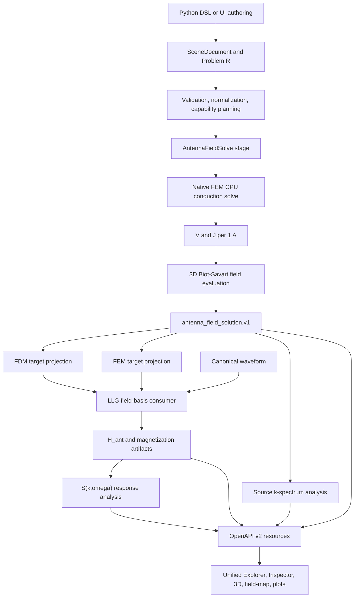

# Microwave Antenna Field-Basis Design

- Status: proposed implementation design
- Date: 2026-07-10
- Governing physics: `docs/physics/0950-quasistatic-microwave-antenna-field-basis-and-k-selective-excitation.md`
- Governing decision: `docs/adr/0017-staged-antenna-field-basis-workflow.md`

## 1. Decision summary

Fullmag will implement two independent excitation products:

1. `SolvedAntennaDrive`: a variable-width 3D microstrip or CPW is meshed,
   solved for a 1 A current basis, converted to a magnetic-field basis, and
   referenced by later LLG stages;
2. `RegionalFieldDrive`: a MuMax-style prescribed spatial magnetic field and
   waveform with no conductor solve.

The conductor-backed MVP is a separable Tier 1 model:

```text
3D conductor layout and terminal modes
  -> FEM H1 quasistatic conduction solve
  -> J per 1 A
  -> adaptive three-dimensional Biot-Savart evaluation
  -> immutable H per 1 A field-basis artifact
  -> projection to an FDM grid or FEM mesh
  -> H_ant(r,t) = I(t) H_1A(r) in LLG
```

The first solve is a first-class `AntennaFieldSolve` study stage. It is never
hidden in an LLG RHS and never replaced by a regional mask. The first
production solve belongs to native FEM CPU under `backends/fem`; FDM and FEM
CPU/GPU lanes consume the resulting artifact through explicit projections.

## 2. Evidence from the current repository

The design is a controlled replacement of unfinished behavior, not a greenfield
module.

### 2.1 Existing semantics worth retaining

- `packages/fullmag-py/src/fullmag/model/antenna.py` already exposes
  `MicrostripAntenna`, `CPWAntenna`, `RfDrive`, `AntennaFieldSource`, and
  `SpinWaveExcitationAnalysis`.
- `crates/fullmag-ir/src/study.rs` already has antenna source enums and
  `TimeDependenceIR`; `SincPulse` already exists.
- `crates/fullmag-plan/src/antenna_zeeman.rs` already materializes a prescribed
  Zeeman mask at FDM cell centers or FEM nodes.
- ADR 0004 already freezes `H_ant` as a full-domain vector field in A/m.
- The API already implements FDM and exact-tetrahedral FEM field slices and
  projections, including metadata, scalar binary payloads, arrows, PNG render,
  empty masks, and projection depth profiles.
- `apps/control-room` already recognizes antenna objects, can create a
  microstrip prototype, displays `H_ant` in quantity lists, and has a reusable
  demand-driven ECharts surface.

### 2.2 Existing behavior that cannot be promoted

- `mqs_2p5d_az` is not an $A_z$ finite-element solve. The current code in
  `crates/fullmag-runner/src/antenna_fields.rs` evaluates infinite-y
  rectangular-strip Biot-Savart samples. Finite length, `center_y`, and
  `preview_length` do not affect the result.
- Its CPW path forces currents $+I,-I/2,-I/2$ through three infinite strips and
  cannot represent a taper or constriction along current flow.
- `CurrentTransport(model="ohmic_poisson")` is accepted semantically but the
  planner rejects it on public FDM and FEM lanes.
- Native FEM time evolution does not consume the current planned antenna mask
  buffers; planning success is not proof of native execution.
- CUDA FDM explicitly rejects or falls back for prescribed antenna masks.
- The UI's `geometry.add-microstrip-antenna` command creates a `Box` plus
  `prescribed_zeeman_mask`. The CPW ribbon action is disabled and the Inspector
  edits only amplitude, direction, and waveform.
- `SceneResource.current_modules` and `study` remain loose JSON projections,
  so raw merge patches are not a safe final authoring contract.

### 2.3 Legacy plan disposition

`docs/plans/active/fullmag_fem_microwave_antenna_plan.md` is superseded as an
implementation source. It assumes 2.5D invariance for the initial production
path and names pre-relocation backend and frontend directories. It remains a
historical requirements source only.

## 3. Scope

### 3.1 Required in the first complete product slice

- planar, straight microstrip and CPW layouts with a rigid 3D transform;
- width/gap/ground-width stations along the current-flow axis;
- finite 3D conductor thickness and length;
- explicit signal and return conductor bodies;
- named terminal groups and current-mode weights summing to zero;
- native FEM CPU conductor solve normalized to 1 A;
- adaptive 3D Biot-Savart evaluation on an inspection domain and magnetic
  targets;
- immutable versioned field-basis artifact and staleness signatures;
- FDM CPU reference consumption, then CUDA FDM consumption;
- native FEM CPU consumption, then native FEM GPU consumption;
- constant, sinusoidal, pulse, piecewise-linear, and sinc waveforms;
- `H_ant` composition in LLG and display as A/m or derived `mu0 H` in T/mT;
- 3D authoring/inspection, slice and projection heatmaps, contours, vectors,
  probes, line cuts, source k-spectrum, and time-domain $S(k,\omega)$;
- canonical Python/UI/ProblemIR round-trip and resource-first API lifecycle.

### 3.2 Explicit non-goals of Tier 1

- 50 ohm wave ports, impedance, S11/S21, and dBm normalization;
- dielectric RF propagation, capacitance, radiation, or reflections;
- frequency-dependent skin/proximity effects or complex component phase;
- magnetic backreaction on the source field;
- curved centerlines and arbitrary 3D swept conductors;
- automatic circuit-derived ground-current splitting;
- detector voltage and absolute electrical-to-magnon efficiency;
- mode-overlap production claims before eigenmode normalization is qualified.

## 4. End-to-end architecture



The field solve and downstream magnetic solve have separate execution intent,
capability, progress, and provenance. A user may request FDM GPU LLG while the
precompute resolves to FEM CPU. Both decisions remain visible.

## 5. Canonical authoring model

### 5.1 Antenna layout

An antenna layout is a nonmagnetic scene-owned physical object with role
`antenna`. The canonical layout owns:

```text
id and name
kind = microstrip | cpw
local frame = current u, transverse v, thickness w
rigid transform
length
constant conductor thickness
piecewise-linear width stations
named conductor parts
conductivity per conductor part
terminal face selectors
optional visual substrate metadata
```

The MVP uses a straight local current axis. A global transform supplies
placement and orientation in the shared 3D scene. This is sufficient for a
center constriction without introducing a curved-sweep geometry system.

### 5.2 Width station types

```rust
pub struct MicrostripStationIR {
    pub s: f64,
    pub signal_width_m: f64,
}

pub struct CpwStationIR {
    pub s: f64,
    pub signal_width_m: f64,
    pub left_gap_m: f64,
    pub right_gap_m: f64,
    pub left_ground_width_m: f64,
    pub right_ground_width_m: f64,
}
```

Convenience Python constructors may accept symmetric `gap` and
`ground_width`; lowering expands them to left/right values. Stations include
`s=0` and `s=1`, are strictly increasing, and loft linearly.

### 5.3 Port modes

```rust
pub struct AntennaTerminalGroupIR {
    pub id: String,
    pub conductor_part: String,
    pub inlet_selector: BoundarySelectorIR,
    pub outlet_selector: BoundarySelectorIR,
    pub current_weight: f64,
}

pub struct AntennaPortModeIR {
    pub id: String,
    pub terminals: Vec<AntennaTerminalGroupIR>,
    pub normalization_current_a: f64,
}
```

`normalization_current_a` is fixed to `1.0` in schema v1. Current weights must
sum to zero within `1e-12` after normalization. The symmetric CPW convenience
constructor expands to signal `+1`, left ground `-0.5`, and right ground
`-0.5`. All branches use the same local `u_min` inlet and `u_max` outlet
selectors; a negative weight reverses current relative to that orientation.

For microstrip, the signal strip and return plane are separate conductor parts
with opposite weights. A layout without a return conductor cannot participate
in a Tier 1 solve.

### 5.4 Field solve

```rust
pub struct AntennaFieldSolveIR {
    pub antenna_ref: String,
    pub port_mode_ids: Vec<String>,
    pub model: AntennaFieldSolveModelIR,
    pub conductor_mesh: ConductorMeshPolicyIR,
    pub field_sampling: FieldSamplingDomainIR,
    pub target_refs: Vec<String>,
    pub solver_policy: AntennaFieldSolverPolicyIR,
    pub outputs: AntennaFieldSolveOutputsIR,
}

pub enum AntennaFieldSolveModelIR {
    QuasistaticConductionBiotSavart3d,
}
```

The public model name is deliberately explicit. `mqs_2p5d_az` is not accepted
as an alias. The primitive node in `StudyPipelineDocument` owns `stage_id`;
the singular `ProblemIR.study` remains one `StudyIR` variant.

### 5.5 Solved drive

```rust
pub struct StageOutputRefIR {
    pub stage_id: String,
    pub output_id: String,
}

pub struct SolvedAntennaDriveIR {
    pub name: String,
    pub solution_ref: StageOutputRefIR,
    pub port_mode_id: String,
    pub peak_current_a: f64,
    pub waveform: TimeDependenceIR,
    pub time_origin: TimeOriginIR,
    pub active_stage_ids: Vec<String>,
}
```

`active_stage_ids` may be empty to mean all compatible time-evolution stages.
It never activates the drive during direct minimization. A relaxation stage
must opt in explicitly to time-dependent source evaluation.

### 5.6 Regional drive

```rust
pub struct RegionalFieldDriveIR {
    pub name: String,
    pub region_ref: String,
    pub amplitude_b_t: f64,
    pub direction: [f64; 3],
    pub spatial_profile: AntennaSpatialProfileIR,
    pub waveform: TimeDependenceIR,
    pub time_origin: TimeOriginIR,
    pub active_stage_ids: Vec<String>,
}
```

This is the canonical successor of
`AntennaFieldSource(model="prescribed_zeeman_mask")`. It does not reference a
field-solve artifact and does not display conductor diagnostics.

### 5.7 Canonical field-specific IR fragments

`ProblemIR` retains one singular `study` section. A multi-stage workflow lives
in the existing `StudyPipelineDocument`; each primitive node lowers one
`ProblemIR` plus explicit dependency context. The fragments below show the new
field-specific sections. Existing geometry, magnetic material, dynamics, and
sampling sections remain governed by `docs/specs/problem-ir-v0.md`.

Field-solve stage fragment:

```json
{
  "antenna_layouts": [
    {
      "id": "cpw_constriction",
      "kind": "cpw",
      "length_m": 0.000012,
      "thickness_m": 1.2e-7,
      "conductivity_s_per_m": 58000000.0,
      "transform": {
        "translation_m": [0.0, 0.0, 1.5e-7],
        "rotation_quaternion": [0.0, 0.0, 0.0, 1.0]
      },
      "stations": [
        {"s": 0.0, "signal_width_m": 0.000002, "left_gap_m": 0.000001, "right_gap_m": 0.000001, "left_ground_width_m": 0.000004, "right_ground_width_m": 0.000004},
        {"s": 0.46, "signal_width_m": 2.6e-7, "left_gap_m": 9.5e-8, "right_gap_m": 9.5e-8, "left_ground_width_m": 0.0000012, "right_ground_width_m": 0.0000012},
        {"s": 0.54, "signal_width_m": 2.6e-7, "left_gap_m": 9.5e-8, "right_gap_m": 9.5e-8, "left_ground_width_m": 0.0000012, "right_ground_width_m": 0.0000012},
        {"s": 1.0, "signal_width_m": 0.000002, "left_gap_m": 0.000001, "right_gap_m": 0.000001, "left_ground_width_m": 0.000004, "right_ground_width_m": 0.000004}
      ],
      "port_modes": [
        {
          "id": "drive_mode",
          "normalization_current_a": 1.0,
          "terminals": [
            {"id": "signal", "conductor_part": "signal", "inlet_selector": {"kind": "local_u_min"}, "outlet_selector": {"kind": "local_u_max"}, "current_weight": 1.0},
            {"id": "ground_left", "conductor_part": "ground_left", "inlet_selector": {"kind": "local_u_min"}, "outlet_selector": {"kind": "local_u_max"}, "current_weight": -0.5},
            {"id": "ground_right", "conductor_part": "ground_right", "inlet_selector": {"kind": "local_u_min"}, "outlet_selector": {"kind": "local_u_max"}, "current_weight": -0.5}
          ]
        }
      ]
    }
  ],
  "study": {
    "kind": "antenna_field_solve",
    "antenna_ref": "cpw_constriction",
    "port_mode_ids": ["drive_mode"],
    "model": "quasistatic_conduction_biot_savart_3d",
    "field_sampling": {
      "kind": "box_grid",
      "size_m": [0.000016, 0.00001, 0.000003],
      "spacing_m": [4e-8, 4e-8, 2e-8]
    },
    "target_refs": ["yig_waveguide"],
    "outputs": {"field_basis_output_id": "field_basis"}
  }
}
```

Downstream time-evolution field-drive fragment after the pipeline dependency
has been resolved:

```json
{
  "field_drives": [
    {
      "kind": "solved_antenna_drive",
      "name": "cpw_sinc_drive",
      "solution_ref": {"stage_id": "solve_cpw_field", "output_id": "field_basis"},
      "port_mode_id": "drive_mode",
      "peak_current_a": 0.01,
      "waveform": {"kind": "sinc_pulse", "cutoff_hz": 25000000000.0, "t0": 1e-10, "amplitude": 1.0},
      "time_origin": "stage_local",
      "active_stage_ids": ["run_spin_waves"]
    }
  ],
  "study": {
    "kind": "time_evolution"
  },
  "resolved_stage_dependencies": [
    {
      "stage_id": "solve_cpw_field",
      "output_id": "field_basis",
      "solution_id": "antenna-solution-17",
      "manifest_schema": "antenna_field_solution.v1",
      "content_hash": "sha256:d02f976c799bb3ed1098d579d6206e271736876659f751cc1ffcedf86049bf72"
    }
  ]
}
```

## 6. SceneDocument and round-trip

`SceneDocument` remains the single control-room authoring source. It gains
typed collections that mirror the canonical IR rather than adding deeper
untyped content to `current_modules`:

```text
scene.antenna_layouts
scene.field_drives
scene.study.study_pipeline.nodes[stage_kind=antenna_field_solve]
```

During migration, the adapter reads existing
`scene.current_modules.modules[kind=antenna_field_source]` and emits canonical
layout/drive projections. New UI writes only typed semantic transactions. It
does not build a full `current_modules` array and send a raw merge patch.

Round-trip obligations:

1. Python constant-width antenna becomes two endpoint stations.
2. Python variable-width CPW preserves every station and terminal weight.
3. UI edit and exported Python lower to equal normalized ProblemIR.
4. Re-imported Python preserves object transform and stage references.
5. Legacy prescribed-mask source becomes `RegionalFieldDriveIR` without a
   change in field semantics.
6. Legacy infinite-strip source remains readable but exports an explicit
   compatibility constructor and warning until its removal window closes.

## 7. Planner and capability resolution

### 7.1 Capability vocabulary

```text
antenna.layout.microstrip.variable_width
antenna.layout.cpw.variable_width
antenna.port_mode.explicit_returns
antenna.field_solve.quasistatic_conduction_biot_savart_3d
antenna.field_basis.consume.fdm_cpu
antenna.field_basis.consume.fdm_gpu
antenna.field_basis.consume.fem_cpu
antenna.field_basis.consume.fem_gpu
antenna.drive.regional_field
analysis.antenna.source_k_spectrum
analysis.antenna.local_k_spectrum
analysis.spin_wave.dynamic_structure_factor
```

### 7.2 Requested and resolved execution

The field-solve stage owns its own execution intent:

```json
{
  "requested": {
    "discretization": "fem",
    "device": "auto",
    "precision": "double",
    "mode": "strict"
  },
  "resolved": {
    "engine_id": "fem_cpu_native",
    "discretization": "fem",
    "device": "cpu",
    "precision": "double",
    "field_realization": "adaptive_biot_savart_3d"
  }
}
```

The downstream stage separately preserves its FDM/FEM choice. `auto` may
resolve a field solve to FEM CPU. Forced FEM GPU field solve is rejected until
that lane is implemented; it does not fall back silently.

### 7.3 Stage ordering

The normalized study graph requires every solved drive to reference an earlier
field-solve stage in the same pipeline or an explicitly imported compatible
artifact. Cycles are invalid. A later target projection may be materialized
after meshing, but it remains a child output of the original field solution.

Valid graph:

```text
mesh conductor and target
  -> solve antenna field
  -> relax magnetic state
  -> derive h_perp and source spectrum
  -> time evolution
  -> dynamic structure factor
```

The source field solve does not depend on relaxation. `h_perp` does.

## 8. Native backend design

### 8.1 Ownership boundaries

Target production ownership:

```text
backends/fem/core/antenna/
  antenna_field_contract.hpp
  antenna_field_artifact.hpp
  antenna_port_mode.hpp
  antenna_target_projection.hpp

backends/fem/cpu/mfem/workflows/antenna_field_solve/
  conductor_mesh.cpp
  conductor_mesh.hpp
  terminal_constraints.cpp
  terminal_constraints.hpp
  conduction_solver.cpp
  conduction_solver.hpp
  current_normalization.cpp
  current_normalization.hpp
  biot_savart_evaluator.cpp
  biot_savart_evaluator.hpp
  target_projection.cpp
  target_projection.hpp
  diagnostics.cpp
  diagnostics.hpp
  workflow.cpp
  workflow.hpp

backends/fem/cpu/mfem/interactions/antenna_drive/
  antenna_drive.cpp
  antenna_drive.hpp

backends/fem/gpu/cuda/interactions/antenna_drive/
  antenna_drive.cu
  antenna_drive.hpp

backends/fdm/gpu/cuda/interactions/antenna_drive/
  antenna_drive.cu
  antenna_drive.hpp
```

These are the normative target ownership paths; CMake must list the focused
translation units explicitly. The field solve does not grow `Context`,
`mfem_bridge.cpp`, generic `execute.rs`, or runner `dispatch.rs` with numerical
algorithms.

### 8.2 Native descriptor boundary

The native field-solve ABI consumes versioned descriptors for:

- conductor tetrahedral mesh and part markers;
- terminal face indices and weights;
- conductivity coefficients;
- port modes;
- solver tolerances;
- field-sampling point coordinates;
- target point coordinates and topology metadata.

It returns owned result handles plus bounded diagnostics. Heavy vectors are
copied or exported through dedicated field-buffer functions, not embedded in a
single JSON/string response.

### 8.3 Conduction solver

The initial CPU solver uses MFEM P1/H1 and a constrained linear system with one
gauge condition per disconnected conductor component. The solver must expose:

- DOFs and element count;
- assembly and solve time;
- requested and realized terminal currents;
- net current imbalance;
- residual norm and iteration count;
- gauge policy;
- current normalization factor;
- finite-value status.

The solve rejects missing terminal markers, zero-area terminals, unbalanced
weights, disconnected paths between a terminal pair, nonpositive
conductivity, or a singular system after gauge construction.

### 8.4 Biot-Savart evaluator

The evaluator receives the solved element current representation and target
points. It has two explicit modes:

- `reference_midpoint_regularized`: deterministic small-fixture oracle;
- `adaptive_element_quadrature`: production candidate.

Production promotion requires convergence against analytic wire/strip cases
and the reference mode away from the source. Near-field samples publish
quadrature refinement and error estimates. Samples inside conductor geometry
are legal only with the documented volume-current integral; no arbitrary
distance clipping is allowed in the production mode.

### 8.5 Runtime consumers

Each LLG backend receives one immutable vector buffer per active port mode plus
waveform descriptors. At every RHS evaluation it computes one scalar per mode
and accumulates

```text
H_eff[i] += peak_current_a * waveform(t) * H_basis[i]
```

CPU and GPU share signs, units, time origin, and waveform definitions. GPU
lanes keep field bases and piecewise-linear waveform tables resident. Output
readback is cadence-driven; it is not part of the hot loop.

### 8.6 FDM CPU reference

The reference implementation belongs in the existing trusted Rust FDM
reference field pipeline, but it consumes a resolved field-basis plan and does
not calculate production antenna geometry. It proves:

- per-ampere scaling;
- canonical waveform evaluation;
- `H_ant` inclusion in `H_eff` and torque;
- time-origin behavior;
- artifact reload equivalence.

### 8.7 FEM build and runtime proof

All native FEM implementation tasks start from repository container-backed
`just` recipes. The plan will use existing `rebuild-fem-runtime`,
`ensure-managed-fem-runtime`, and managed headless recipes, and will add
focused `verify-fem-antenna-field-runtime` and
`verify-fem-antenna-drive-runtime` recipes. Host CMake or Cargo runs may be
diagnostics only and cannot promote capability status.

## 9. Artifact and cache design

### 9.1 Manifest identity

```json
{
  "schema": "antenna_field_solution.v1",
  "solution_id": "antenna-solution-17",
  "stage_id": "solve_cpw_field",
  "source_id": "cpw_constriction",
  "status": "ready",
  "normalization_current_a": 1.0,
  "port_modes": ["drive_mode"],
  "requested_execution": {
    "discretization": "fem",
    "device": "auto",
    "precision": "double"
  },
  "resolved_execution": {
    "engine_id": "fem_cpu_native",
    "device": "cpu",
    "precision": "double"
  },
  "signatures": {
    "current_solution": "sha256:7a3d8b0d6e6810352491a82494f2d8af6f2b8c9795e5fc7ebdcf0d51cfaf93f4",
    "field_solution": "sha256:d02f976c799bb3ed1098d579d6206e271736876659f751cc1ffcedf86049bf72"
  },
  "fields": [
    {"field_id": "antenna:antenna-solution-17:drive_mode:V_electric", "domain_ref": "conductor-mesh-17", "unit": "V"},
    {"field_id": "antenna:antenna-solution-17:drive_mode:J_charge", "domain_ref": "conductor-mesh-17", "unit": "A/m^2"},
    {"field_id": "antenna:antenna-solution-17:drive_mode:H_ant_basis", "domain_ref": "antenna-field-grid-17", "unit": "A/m/A"}
  ],
  "diagnostics": {
    "relative_residual": 4.1e-11,
    "relative_current_imbalance": 2.7e-12,
    "validity_wave_ratio": 0.0021,
    "validity_skin_ratio": 0.036,
    "validity_status": "within_advisory_range"
  }
}
```

Hashes shown above are illustrative schema values, not validation evidence.

### 9.2 State machine

```text
missing
  -> queued
  -> meshing
  -> solving_current
  -> evaluating_field
  -> projecting_targets
  -> ready

any active state -> cancelled | failed
ready -> stale when a dependency signature changes
ready -> degraded only when an explicitly accepted lower-fidelity realization is used
```

`degraded` is not used for ordinary mesh error or solver failure. Those are
failed results. A fallback realization must be named and accepted by policy.

### 9.3 Signatures

`current_solution_signature` includes normalized layout, transform,
conductivity, terminal selectors/weights, conductor mesh identity, gauge, and
solver policy.

`field_solution_signature` includes the current signature, field evaluator,
quadrature policy, sampling point coordinates, and field-domain identity.

`target_projection_signature` includes the field signature, target
domain-generation id, topology revision/hash, indexing, scope, and projection
method.

Waveform, peak current, display settings, camera, color scale, and equilibrium
magnetization are excluded. An `h_perp` analysis resource has its own signature
including equilibrium artifact identity.

## 10. OpenAPI v2 resource design

### 10.1 Resource ownership

| Resource | Owner |
|---|---|
| canonical antenna layouts and drives | `model/scene` |
| typed layout/drive projections | `model/antennas`, `model/field-drives` |
| full study stage tree | `simulation/stages/execution` |
| stage plan/progress/diagnostics | stage-scoped simulation resources |
| field-solution manifest | `data/antenna-field-solutions/{solution_id}` |
| V/J/H field catalog and samples | `data/fields` |
| source k spectra | `analysis/antenna-excitation/{solution_id}` |
| dynamic structure factor | `analysis/spin-wave-response/{run_id}` |
| camera, active quantity, layers | `visualization/state` |
| Explorer selection and center tab | `workspace/*` |

Typed projection routes do not become a second authoring store. Mutations
commit `SceneDocument` transactions and return the new `scene_revision`.

### 10.2 Model routes

```text
GET    /v2/sessions/current/model/antennas
POST   /v2/sessions/current/model/antennas
PATCH  /v2/sessions/current/model/antennas/{antenna_id}
DELETE /v2/sessions/current/model/antennas/{antenna_id}

GET    /v2/sessions/current/model/field-drives
POST   /v2/sessions/current/model/field-drives
PATCH  /v2/sessions/current/model/field-drives/{drive_id}
DELETE /v2/sessions/current/model/field-drives/{drive_id}
```

Every write accepts `base_revision` and returns the committed scene or a typed
projection plus `scene_revision`. Conflict uses the standard revision-conflict
error contract.

### 10.3 Stage routes

Execution is submitted through the existing command endpoint:

```json
{
  "kind": "solve",
  "target": {"kind": "stage", "stage_id": "solve_cpw_field"}
}
```

Read resources:

```text
GET /v2/sessions/current/simulation/stages/{stage_id}/antenna-field-solve/plan
GET /v2/sessions/current/simulation/stages/{stage_id}/antenna-field-solve/progress
GET /v2/sessions/current/simulation/stages/{stage_id}/antenna-field-solve/diagnostics
```

The full stage record remains owned by `simulation/stages/execution`; these
routes own only antenna-specific details.

### 10.4 Solution and field routes

```text
GET /v2/sessions/current/data/antenna-field-solutions
GET /v2/sessions/current/data/antenna-field-solutions/{solution_id}
GET /v2/sessions/current/data/antenna-field-solutions/{solution_id}/projections
```

Every `V_electric`, `J_charge`, `H_ant_basis`, instantaneous `H_ant`, and
derived `h_perp` field appears in the existing field catalog with `domain_ref`,
location, unit, component count, revision, and provenance links. Consumers use
the existing vector, slice, and projection families:

```text
GET /v2/sessions/current/data/fields/{field_id}/samples/vector
GET /v2/sessions/current/data/fields/{field_id}/samples/slice/meta
GET /v2/sessions/current/data/fields/{field_id}/samples/slice/scalar
GET /v2/sessions/current/data/fields/{field_id}/samples/slice/arrows
GET /v2/sessions/current/data/fields/{field_id}/samples/slice/render.png
GET /v2/sessions/current/data/fields/{field_id}/projection/meta
GET /v2/sessions/current/data/fields/{field_id}/projection/scalar
GET /v2/sessions/current/data/fields/{field_id}/projection/empty-mask
GET /v2/sessions/current/data/fields/{field_id}/projection/render.png
```

An arbitrary spatial line cut needs a new resource because the existing
`projection/profile` is a depth profile through one projection pixel:

```text
POST /v2/sessions/current/analysis/field-line-cuts
GET  /v2/sessions/current/analysis/field-line-cuts/{line_cut_id}
```

The POST creates a revisioned analysis product from a field id and a polyline;
it does not mutate the field.

### 10.5 Spectrum routes

```text
GET /v2/sessions/current/analysis/antenna-excitation/{solution_id}/source-spectrum
GET /v2/sessions/current/analysis/antenna-excitation/{solution_id}/local-k-spectrum
GET /v2/sessions/current/analysis/spin-wave-response/{run_id}/dynamic-structure-factor
```

Spectrum resources carry explicit axis arrays, units, coordinate frame,
component policy, window, normalization, and source field/equilibrium/run
revisions. Large 2D $k$-$\omega$ products use a tiled binary raster plus thin
JSON metadata; they are not embedded in status or a websocket event.

### 10.6 Binary codecs

- FMVP remains the vector-field carrier.
- Existing scalar slice/projection payloads remain the heatmap carrier.
- Projection empty masks use a dedicated `u8` codec in the control-room API
  layer.
- A new versioned tiled raster codec carries large source-spectrum and
  dynamic-structure-factor matrices with numeric axes described by metadata.
- All binary resources use ETag/304 and preserve exact `u64` revisions without
  coercion to JavaScript `number`.

### 10.7 Realtime

Websocket events contain command state and resource invalidations only:

```text
command.accepted
command.running
command.completed
command.failed
resource.batch_changed
```

Progress payloads, field arrays, solution manifests, and spectra are fetched
over HTTP. Invalidations name exact resources and revisions; a waveform edit
does not invalidate the field-solution resource.

## 11. Control-room UX

### 11.1 Unified Explorer tree

```text
Model
  Antennas
    CPW constriction
      Layout
      Conductors
      Width profile
      Ports
      Mesh
      Visualization
  Field drives
    CPW sinc drive
    Regional FMR drive
Study
  0 Antenna Field Solve
  1 Relax
  2 Time Evolution
Resources
  Antenna field solutions
    antenna-solution-17
      Current solution
      Field basis
      Target projections
      Diagnostics
Results
  Field maps
  Source k-spectrum
  Spin-wave S(k,omega)
```

Every semantic child has a dedicated Inspector route. A generic antenna panel
must not reuse the same form for layout, port, field solve, and drive nodes.

### 11.2 Inspector panels

`AntennaLayoutPanel`

- kind, length, thickness, conductivity;
- transform and local frame;
- table of width stations;
- minimum width/gap and geometry-validation diagnostics;
- add/remove constriction and taper commands.

`AntennaPortsPanel`

- named signal and return conductor parts;
- inlet/outlet face overlays;
- signed current weights and sum;
- one-click symmetric CPW mode;
- current direction arrows and validation.

`AntennaFieldSolveStagePanel`

- requested and resolved backend/device/precision;
- conductor mesh policy and realized mesh summary;
- field sampling box and target objects;
- solver and quadrature policy;
- state, progress, stale reason, residual, current imbalance, and validity
  warnings;
- solve, cancel, refresh, and inspect-artifact commands.

`SolvedAntennaDrivePanel`

- solution and port-mode selector;
- peak current and waveform;
- stage-local or absolute time origin;
- active stage selection;
- clear indication that waveform edits reuse the solved spatial basis.

`RegionalFieldDrivePanel`

- region, B amplitude, direction, spatial profile, waveform, and active stages;
- no conductor, port, current-balance, or field-solve controls.

`AntennaSolutionPanel`

- signatures, dependency revisions, mesh identity, normalization, validity
  ratios, diagnostics, fields, projections, and export links.

### 11.3 Ribbon and command registry

Geometry tab:

```text
Add Microstrip
Add CPW
Add Width Station
Add Taper
Add Constriction
Add Port Mode
Validate Antenna
```

Physics tab:

```text
Add Solved Antenna Drive
Add Regional Field Drive
Edit Waveform
Toggle Drive
```

Study tab:

```text
Add Antenna Field Solve
Solve Selected Stage
Refresh Stale Solution
Run Pipeline
```

Results tab:

```text
J Charge
H Antenna Basis
H Antenna Instantaneous
mu0 H Display
Transverse Field
Slice
Projection
Line Cut
Source k-Spectrum
Spin-Wave S(k,omega)
```

All surfaces render the same registered commands with capability and selection
gates. Disabled commands expose a concrete reason.

### 11.4 3D viewport

Before a conductor mesh exists, `viewport-3d` renders a procedural loft from
the station profile and the rigid transform. It shows distinct signal/ground
materials, terminal-face overlays, current-direction arrows, and selection
outlines. This is authoring intent, not solver topology.

After a successful solve, the user can switch to realized conductor topology.
`V_electric` and `J_charge` attach only to that topology. `H_ant_basis` may be
shown as glyphs or scalar colors on its field sampling domain and as a target
projection on magnetic topology.

Field layers do not attach to a procedural fallback mesh. Topology and field
buffer revisions remain separate. Rendering is dirty-driven and one WebGL
canvas remains the rule.

### 11.5 Field-map center surface

Add `apps/control-room/src/modules/field-map/` with a declarative manifest for
`viewport-main`. It owns interactive scalar maps for existing slice/projection
resources:

- component or magnitude heatmap;
- linear/log/symmetric range policy;
- contours;
- sparse arrows;
- conductor and magnetic-object outlines;
- cursor probe with world coordinate and value;
- empty/unsupported/stale overlays;
- PNG and numeric export commands.

The module reuses shared chart primitives and Catppuccin `--fm-*` tokens. An
ECharts instance is created once per mount, updated only when a resource
revision or user control changes, resized by observer, and disposed on unmount.
The inactive 3D module is unmounted, not hidden.

### 11.6 Analysis plots

The existing `analysis-plots` module owns line cuts, scalar curves, source
k-spectrum traces, local $u$-$k$ maps, and $k$-$\omega$ response maps through
domain adapters. It does not import `field-map` internals. Shared raster and
axis models live under `src/shared/domain/analysis`.

UI labels are explicit:

- `Antenna source spectrum W_H(k)`;
- `Local antenna spectrum W_H(u,k)`;
- `Spin-wave response S_m(k,omega)`.

The first two are never labeled as excited spin-wave intensity.

### 11.7 Stale and unsupported states

The UI supports:

```text
missing
stale
queued
meshing
solving_current
evaluating_field
projecting_targets
ready
cancelled
failed
degraded
unsupported
```

Every stale state includes the changed dependency, for example:

```text
Geometry changed: station cpw_constriction[2].signal_width_m
Port mode changed: ground_right current weight
Target projection stale: magnetic topology revision 41 -> 42
Equilibrium changed: transverse-field analysis only
```

## 12. Error handling

### 12.1 Authoring errors

Reject before planning:

- missing start/end stations;
- nonmonotone station coordinates;
- nonpositive width, gap, thickness, or conductivity;
- self-intersecting loft;
- missing return conductor;
- terminal selector resolving to no face;
- current weights not summing to zero;
- duplicate ids or dangling references;
- solved drive referencing a later stage;
- raw callback waveform.

### 12.2 Planning errors

Reject with capability and remediation data:

- forced unsupported field-solve device;
- unsupported conductor element order;
- target without a current topology when projection is required;
- imported solution with mismatched schema or signature;
- waveform unsupported by the selected LLG lane;
- requested full-wave output from a Tier 1 model.

### 12.3 Runtime errors

The stage fails, preserving partial diagnostics, for:

- conductor mesh failure;
- singular constrained conduction system;
- nonconverged linear solve;
- nonfinite V, J, or H;
- current imbalance above the accepted tolerance;
- Biot-Savart quadrature failure;
- target projection topology changed during execution;
- cancellation.

The runtime never substitutes the midpoint oracle for adaptive production mode
unless the request explicitly permits that degraded realization and provenance
records it.

### 12.4 API errors

Use existing structured v2 errors for validation, not found, conflict,
unsupported, command rejection, and internal failure. Binary decode errors are
client diagnostics and do not silently retry with a different field or scope.

## 13. Validation and test matrix

### 13.1 Physics and numerics

| Gate | Evidence |
|---|---|
| straight conductor | linear potential, conserved cut current, far-field $I/(2\pi r)$ |
| symmetric CPW | current sum zero, expected field parity, suppressed unbalanced far field |
| constriction | increased local current density and shifted local source-spectrum peak |
| mesh convergence | three levels for current balance, field norms, and k-peak positions |
| quadrature convergence | fixed observation points and surfaces against tightened tolerance |
| linearity | 0.5 A, 1 A, and 2 A scaling from one stored basis |
| separability warning | skin/wave ratios and unknown-bandwidth diagnostics |

### 13.2 Cross-backend

- FDM CPU reference versus FEM target samples at matched points;
- CUDA FDM versus CPU FDM double-precision field and short LLG parity;
- native FEM GPU versus FEM CPU after GPU consumer implementation;
- artifact reload versus in-memory basis;
- FDM and FEM projection convergence without bitwise equality claims.

### 13.3 Contract and API

- Python validation and normalized serialization;
- Python -> ProblemIR -> SceneDocument -> exported Python round-trip;
- legacy constant-width and prescribed-mask migrations;
- planner stage graph, cycle, stale, forced-lane, and fallback tests;
- OpenAPI route/schema tests and generated TypeScript compilation;
- `ControlRoomApi` and resource-hook ETag/304 tests;
- FMVP, scalar raster, empty-mask, and tiled-spectrum malformed-payload tests;
- exact invalidation-scope tests proving waveform edits do not advance field
  solution revisions;
- HTTP recovery after missed websocket events.

### 13.4 UI and performance

- every Explorer node maps to its own Inspector;
- station table and constriction geometry model tests;
- port overlay selection and weight validation;
- stage progress/stale/failed/unsupported views;
- FDM and FEM slice/projection adapters;
- ECharts mount/update/resize/dispose and zero idle redraw;
- bounded tiled spectrum and decimation behavior;
- center-tab active-only mount tests;
- viewport browser smoke with visible canvas, `gl.isContextLost() == false`, and
  nonzero drawing buffer;
- repeated 3D/field-map/plot switching with bounded memory.

### 13.5 End-to-end acceptance workflow

The release workflow is:

```text
create variable-width CPW
  -> validate explicit returns
  -> solve 1 A field basis
  -> inspect J at constriction
  -> inspect H heatmap and local source k-spectrum
  -> relax YIG waveguide
  -> attach sinc drive without rerunning field solve
  -> run LLG
  -> inspect dynamic magnetization and S(k,omega)
  -> export canonical Python
  -> reload and reproduce signatures/results
```

Acceptance requires the publication-aligned trend that the constricted section
localizes access to the selected wave vector. It does not require agreement in
absolute transduction efficiency with a full-wave paper.

## 14. Migration plan

### 14.1 Legacy infinite-strip source

1. Keep deserialization of `model="mqs_2p5d_az"`.
2. Normalize runtime provenance to
   `legacy_infinite_strip_biot_savart` plus approximation metadata.
3. Remove it from new UI menus and default Python examples.
4. Preserve script export through an explicit compatibility constructor.
5. Remove public authoring after the ADR-defined compatibility window.

### 14.2 Prescribed Zeeman mask

1. Preserve current physical behavior as `RegionalFieldDrive`.
2. Migrate object-backed masks without changing amplitude, direction, profile,
   waveform, or time origin.
3. Keep `H_ant` output identity.
4. Implement native FEM and GPU execution before advertising cross-lane
   production status.

### 14.3 UI prototype

1. Replace direct default `Box` plus raw module merge patch with a typed antenna
   draft and atomic layout/port/source transaction.
2. Split `AntennaObjectPanel` into semantic Inspector routes.
3. Enable CPW only when typed geometry and port validation are available.
4. Retain existing quantity and viewport adapters where they satisfy the new
   domain/reference contract.

## 15. Delivery decomposition

The implementation is split into independently reviewable plans after this
spec is approved:

1. canonical Python, SceneDocument, ProblemIR, validation, planner, capability,
   and legacy migration;
2. native FEM CPU conductor solve, Biot-Savart evaluator, artifacts, and managed
   validation;
3. FDM/FEM field-basis consumers, waveform residency, quantities, and parity;
4. OpenAPI v2, generated transport, API facade, resources, codecs, and analysis
   endpoints;
5. unified control-room authoring, stage lifecycle, 3D overlays, field-map,
   spectra, script export, and browser/performance gates;
6. publication-aligned integrated benchmark and capability promotion.

Each plan starts with failing tests, uses exact repository paths and managed
container recipes where native FEM is involved, and ends with an independently
testable deliverable. No plan may promote a later lane based on an earlier
lane's source visibility.

## 16. Design self-review

- Placeholder scan: the design contains no unresolved decisions required for
  the Tier 1 implementation.
- Internal consistency: physics, stage, artifact, API, and UI all use the same
  per-ampere basis and explicit return-current model.
- Scope check: Tier 1 is isolated from harmonic/full-wave work and from the
  independent regional-drive implementation.
- Ambiguity check: variable width means ordered geometry stations along current
  flow; it does not mean a 2.5D parameter sweep.
- Ownership check: native numerical work remains under `backends/*`; runner,
  OpenAPI, and UI remain orchestration/product layers.
- Product check: one workspace and one resource contract serve FDM and FEM.
