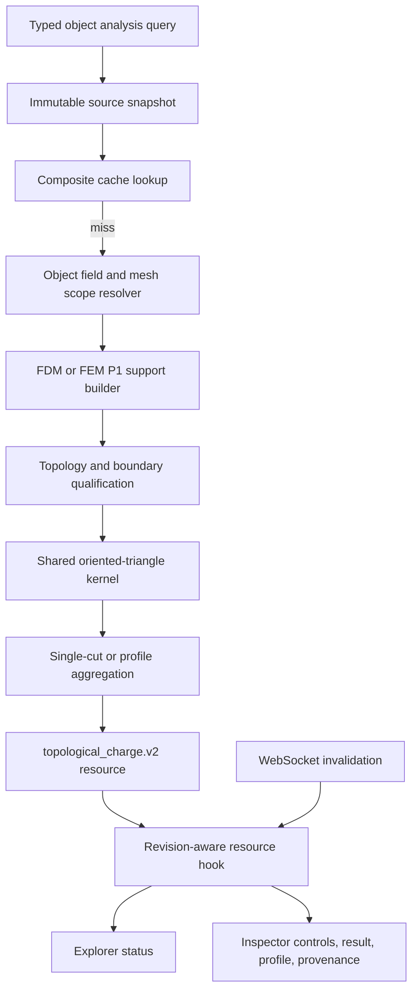

# Planar Topological Charge Production Design

- Status: approved for planning
- Approved scope: 2026-07-11
- Canonical physics: `docs/physics/0940-topological-charge-observable.md`
- API governance: `docs/specs/resource-first-control-room-api-v2.md`
- UI governance: `docs/specs/frontend-v2/13-inspector-and-property-editing.md`

## 1. Decision

Fullmag will productionize the existing object-scoped topological-charge
extension as one strictly planar observable for native FDM planes and
tetrahedral FEM P1 plane cuts.

The implementation will not silently extend this resource to high-order FEM,
curved surfaces, full three-dimensional topological flux, or Hopf invariants.
Those features require separate versioned observables.

The production result is not merely a number. It consists of:

- an oriented support identity;
- a numerically valid integral;
- topology, boundary, and resolution diagnostics;
- a separate scientific trust classification;
- complete field/mesh/domain/snapshot provenance;
- a deterministic cache identity;
- UI presentation that cannot turn unavailable or diagnostic data into a
  trusted integer.

### 1.1 Confirmed baseline defects

The design replaces defects verified in the current source, not hypothetical
future risks:

- `crates/fullmag-api/src/analysis/topological_charge.rs` returns numeric zero
  for insufficient support, silently skips triangles containing invalid
  samples, normalizes with an overflow-prone sum of squares, performs plain
  summation, and has no antipodal/exceptional or resolution qualification;
- `crates/fullmag-api/src/router_v2/handlers/analysis/extensions.rs` accepts
  untyped quantity/method/resolution strings, may fall back from current `m` to
  `latest_fields` or preview cache, constructs support and computes before the
  cache lookup, derives false `polarity`, discovers FEM layer faces instead of
  requiring the requested exact plane, and can use a global FDM grid without an
  object mask;
- compact FEM field compatibility is inferred from counts in shared field
  resolution rather than carried as an explicit field-sample to global-node
  mapping identity;
- `apps/control-room/src/kernel/object-extensions/useObjectExtensionActivation.ts`
  stores activation in a module-global singleton whose server snapshot is the
  live mutable client snapshot;
- `apps/control-room/src/modules/explorer/builders/buildModelTree.ts` defaults an
  extension child to `ready`, while the Inspector exposes only calculation mode
  and Compute, not the physical support, profile, snapshot, trust, or complete
  provenance contract.

Therefore the existing v1 path is a diagnostic prototype. Its current passing
unit/router/component tests do not qualify it as a production observable.

## 2. Considered approaches

### 2.1 Selected: strict planar P1 contract

Use exact object-scoped planar supports, a shared Berg-Luescher triangle kernel,
and explicit rejection outside FDM/native-plane and FEM P1/plane-cut coverage.

Advantages:

- matches the current production FEM order;
- admits analytical and convergence validation;
- keeps one observable identity and sign convention;
- removes unsafe fallbacks instead of adding more numerical branches;
- can be completed across backend, API, and UI without introducing a second
  solver or renderer path.

Cost:

- high-order and curved-surface users receive a clear unsupported result until
  separate methods are designed.

### 2.2 Rejected for this resource: high-order planar FEM immediately

This would require high-order geometry evaluation, high-order magnetization
evaluation, quadrature or certified adaptive subtriangulation, new runtime
payload provenance, and independent convergence qualification. Treating
vertices as P1 would be physically false.

### 2.3 Rejected for this resource: arbitrary curved surfaces and 3D topology

Curved oriented surfaces, closed-surface degree, Bloch-point flux, and Hopf
invariants are different mathematical observables. Combining them behind one
`topological-charge` endpoint would make orientation, units, validation, and UI
meaning ambiguous.

## 3. Architecture



HTTP v2 owns the snapshot. Realtime events only invalidate resource identities.
No module receives mesh or field payloads over WebSocket.

## 4. Ownership boundaries

### 4.1 Physics contract

`docs/physics/0940-topological-charge-observable.md` owns equations, orientation,
validity, P1 interpretation, diagnostics, aggregation, and validation targets.

### 4.2 API analysis subsystem

`crates/fullmag-api/src/analysis/topological_charge/` owns:

- unit-vector validation;
- oriented triangle solid angles;
- exceptional-triangle detection;
- deterministic compensated summation;
- support-topology diagnostics;
- boundary qualification;
- profile aggregation.

It does not own HTTP, live-session locks, scene lookup, field retrieval, cache,
or UI statuses.

### 4.3 Object-scoped source resolution

Shared data-plane utilities own:

- current versus snapshot field selection;
- full-domain versus compact `magnetic_only` layouts;
- explicit field-sample to global-node mapping;
- object mask and object mesh ownership;
- field/mesh/domain compatibility checks.

The analysis endpoint must consume these utilities. It must not reimplement a
different field-source priority. An explicit snapshot selects exactly that
snapshot; an omitted snapshot selects the captured current materialized `m`.
Preview-only fields and an arbitrary latest persisted snapshot are never
substituted.

### 4.4 Support builders

FDM support construction owns object mask application, canonical plane order,
native layer coordinates, and cell-thickness weights.

FEM support construction owns exact P1 tetra-plane intersection, global edge
keys, interpolation, deterministic polygon triangulation, triangle
ownership resolution for a cut coincident with a shared face, orientation, and
manifold incidence. Any duplicate without the certified shared-face ownership
case is a topology error, not silently deduplicated.

Resource v2 has no native FEM layer-face optimization. Every FEM support is an
exact tetra-plane cut. An arbitrary coplanar tetrahedral face is never treated
as the requested cross-section.

### 4.5 Handler and cache

The handler owns typed query validation, immutable snapshot capture, cache
lookup, status mapping, resource assembly, and HTTP errors. It releases the
live-session lock before cache lookup and computation.

### 4.6 Frontend kernel and modules

The kernel owns session-scoped extension activation and resource invalidation.
The Explorer derives node status from the resource. The Inspector owns controls
and presentation. Neither imports the other's store or internal components.

## 5. Versioned interfaces

### 5.1 Query

```text
TopologicalChargeQueryV2 {
  plane: auto | xy | xz | yz = auto
  support: midplane | layer_profile = midplane
  profile_samples?: auto | integer[3,257]
  snapshot_id?: string
  stage_id?: string
  method: berg_luescher_oriented_triangles_v2
}
```

Rules:

- `profile_samples` is rejected for `midplane`;
- omitted `profile_samples` resolves to `auto` only for `layer_profile`;
- `stage_id` without `snapshot_id` is rejected;
- unknown values are `400 invalid_query`;
- production quantity is fixed to `m`;
- no parameter is accepted and ignored.

### 5.2 Core computation

```text
compute_oriented_charge(input: OrientedChargeInput)
  -> Result<OrientedChargeResult, TopologicalChargeError>
```

The input contains samples, triangles, support frame, and physical coordinates.
The result contains charge and diagnostics. It does not contain HTTP status or
provenance.

### 5.3 Support builder

```text
build_fdm_support(source, request) -> Result<PlanarSupportProfile, SupportError>
build_fem_p1_support(source, request) -> Result<PlanarSupportProfile, SupportError>
```

Each profile contains one or more independently qualified planar supports with
`coordinate_m` and `integration_weight_m`. FEM uniform interior cuts use
full-bin midpoint weights; FDM native planes use their cell thicknesses.

### 5.4 Resource

```text
TopologicalChargeResourceV2 {
  schema_version
  resource_revision
  object_id
  status
  trust
  charge
  nearest_integer
  integer_error
  request
  resolved_support
  support_frame
  profile
  quality
  provenance
  method
  computed_at_unix_ms
  warnings
}
```

`polarity` is removed. `nearest_integer` and `integer_error` are nullable and
present only when `trust=qualified`.

Scientific `status` is closed to `ready`, `no_current_magnetization`,
`empty_support`, `invalid_magnetization`, `degenerate_support`,
`under_resolved`, `unsupported_geometry`, and
`unsupported_discretization`. Frontend lifecycle states `idle`, `loading`,
`stale`, and `error` do not appear in the successful scientific payload.

## 6. State and data flow

1. Inspector creates a typed query from explicit controls.
2. Resource hook keys the request by object plus canonical query serialization.
3. Facade uses generated v2 transport.
4. Handler validates object, query, and optional stage/snapshot scope.
5. Handler captures immutable source identities and arrays under a short lock.
6. Handler computes the composite revision/cache digest.
7. Cache hit returns the exact versioned resource without rebuilding support.
8. Cache miss resolves object-scoped field mapping and mesh ownership.
9. Backend-neutral support builder produces oriented triangles.
10. Qualification checks topology, boundary, and resolution.
11. Shared kernel computes each cut.
12. Profile aggregator computes a scalar only when the full requested profile
    is valid.
13. Handler stores and returns the resource.
14. Realtime invalidation marks matching hooks stale; continuous mode refetches,
    on-demand mode waits for Compute.

## 7. Failure semantics

The endpoint returns `200` with a typed scientific status for expected absence
or unsupported analysis conditions. It returns `400` for an invalid query,
`404` for a nonexistent object/snapshot/stage, `409` for stale or incompatible
source provenance that cannot be represented safely, and `500` only for an
unexpected internal failure.

Expected statuses never encode missing data as `Q=0`.

The UI shows transport failure separately from scientific status. A stale prior
result remains labelled stale and cannot retain a trusted badge.

## 8. UI design

The main object Inspector exposes an Extensions section. Enabling Topological
Charge creates a session-scoped Explorer child in `idle`, not `ready`.

The extension panel contains, in order:

1. compact method and canonical orientation explanation;
2. plane, support, profile, and snapshot controls;
3. on-demand/continuous controls and Compute action;
4. status and trust banner;
5. scalar result and qualified integer interpretation;
6. complete bounded profile table;
7. quality diagnostics;
8. provenance and method details;
9. complete warning list.

No viewport state changes. A future command may open the profile in an analysis
surface, but the Inspector does not import another module.

## 9. Validation design

Validation is layered:

- pure kernel analytical and exceptional-input tests;
- support topology and orientation tests;
- FDM object-scope and layer-weight tests;
- FEM P1 exact-cut, compact-field, permutation, and convergence tests;
- handler query, snapshot, cache, provenance-conflict, and HTTP error tests;
- OpenAPI generation and facade tests;
- resource invalidation and session-state tests;
- Inspector/Explorer component and accessibility tests;
- managed FDM runtime, managed FEM runtime, and cross-backend proof.

Production promotion requires every layer. A passing analytic grid unit test is
not production proof.

## 10. Migration

The existing endpoint path remains stable, while its response schema becomes
`topological_charge.v2`. Generated types move atomically with the backend.

The old `polarity`, untyped method strings, implicit quantity selection,
module-global activation, arbitrary FEM layer-face detection, and global FDM
fallback are removed in the same implementation program. No indefinite
compatibility path remains in modules.

There is no dual-schema transport transition. Backend schema, generated
artifacts, handwritten facade, hook, fixtures, and Inspector migrate in the
same implementation program before the production gate is allowed to pass.

## 11. Non-goals

- authoring or `ProblemIR` changes;
- solver-selection changes;
- a new global capability flag;
- curved-surface charge;
- high-order FEM charge;
- 3D flux, Bloch-point, or Hopf observables;
- topology-density viewport overlay;
- batch analysis over every object.

## 12. Acceptance

The design is complete when the implementation satisfies every normative rule
in physics note 0940, every task in the production plan, and all managed proof
gates without ignored parameters, hidden fallback, stale provenance, or UI
reinterpretation.
