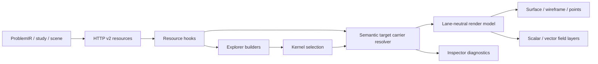

# Projekt naprawy Explorera, Inspectorów i regionów FEM/FDM

**Status:** zatwierdzona architektura, oczekuje na przegląd zapisanej specyfikacji  
**Data:** 2026-08-07  
**Źródło wymagań:** `docs/audits/2026-08-07-explorer-inspectors-fdm-fem-audit.md`  
**Zakres:** wszystkie P0, P1 i P2 z audytu oraz pełna implementacja i kwalifikacja regionów w FEM i FDM.

## 1. Cel i definicja ukończenia

Control Room ma prezentować tylko zasoby istniejące w bieżącej sesji, używać jednej tożsamości fizycznej dla Airboxa i regionów niezależnie od lane'u oraz renderować geometrię i pola z tej samej, rewizjonowanej własności domeny.

Ukończenie wymaga jednocześnie:

1. usunięcia wszystkich fałszywych i hardkodowanych stanów w `Resources`, `Results`, `Jobs` i `Diagnostics`;
2. poprawnego mapowania obiektów i regionów FDM na kanoniczną maskę komórek;
3. poprawnego mapowania obiektów i regionów FEM na aktualne części mesha;
4. jednego publicznego targetu Airboxa i jednego formatu targetu regionu;
5. dedykowanego Inspectora dla każdego wybieralnego rodzaju węzła;
6. zgodnego filtrowania geometrii, scalar fields i vector fields przez tę samą maskę/membership;
7. testów kontraktowych, jednostkowych, integracyjnych i przeglądarkowych dla FEM i FDM;
8. zrzutów dowodowych pokazujących Airbox i co najmniej dwa rozłączne regiony w trybach surface, wireframe, points i vectors.

## 2. Decyzje architektoniczne

### 2.1. Jedna tożsamość targetu, lane-neutral renderer

Publiczne semantic target IDs:

```text
airbox
object:<objectId>
region:<objectId>:<encodedRegionId>
mesh-part:<meshPartId>
```

`fdm-universe-outside-support` przestaje być publicznym targetem UI. Może istnieć wyłącznie jako wewnętrzna nazwa carriera migracyjnego do czasu usunięcia zapisów v1. Renderer otrzymuje lane-neutral `SemanticRenderTarget`; różnice FEM/FDM kończą się w resolverze carrierów i adapterze render modelu.

Region nie jest lokalnym filtrem globalnego targetu. Jest stabilnym targetem z własnym display state, selection identity, provenance i capability. `encodedRegionId` używa istniejącego kanonicznego kodowania selection targetu; nie wolno konkatenować surowego identyfikatora zawierającego znaki separatora.

`SemanticRenderTargetKind` i wspólny target catalog obejmują `region`. Katalog przechowuje tylko identity, revision i identyfikatory carrierów, nigdy ciężkie bufory membership/topology. Regiony nie mogą pozostawać drugim, bocznym mapowaniem wyłącznie w hooku viewportu.

### 2.2. Kanoniczna własność regionu FDM

FDM rozwiązuje `region:<objectId>:<encodedRegionId>` przez:

- bieżący `DomainMeta` z `origin`, `spacing`, `shape` i domain generation;
- deskryptor membership z `grid_fingerprint`, `revision`, `freshness` i `region_legend`;
- binarną tablicę numeric region IDs;
- jednoznaczny wpis legendy dopasowany do `object_id` i `region_id`.

Carrier regionu FDM zawiera:

```ts
interface FdmRegionCarrier {
  kind: "fdm-region-cells";
  targetId: `region:${string}:${string}`;
  objectId: string;
  regionId: string;
  numericRegionId: number;
  gridFingerprint: string;
  membershipRevision: string | number;
  domainGenerationId: string;
  cellCount: number;
  coverageComplete: boolean;
}
```

Jeśli wpis legendy nie istnieje, jest niejednoznaczny albo identity nie pasuje do gridu, target ma status `unavailable` lub `stale`, nigdy `ready` z liczbą zero. Active cell count zlicza dokładnie numeric ID regionu. Airbox zlicza wyłącznie sentinel inactive/outside-support. Stan `ready` wymaga pełnego rozliczenia: selected region, inne aktywne regiony, active-unassigned i Airbox sumują się do `totalCells`.

### 2.3. Kanoniczna własność regionu FEM

FEM rozwiązuje ten sam target przez bieżący region membership i `mesh_part_ids`. Carrier zawiera:

```ts
interface FemRegionCarrier {
  kind: "fem-region-parts";
  targetId: `region:${string}:${string}`;
  objectId: string;
  regionId: string;
  meshRevision: string | number;
  meshPartIds: readonly string[];
  elementCount: number;
  exclusiveNodeCount: number | null;
  sharedInterfaceNodeCount: number | null;
}
```

Carrier Airboxa FEM publikuje osobno:

- wszystkie carrier nodes;
- exclusive-air nodes;
- shared-interface nodes;
- air elements;
- outer boundary faces;
- revision maski/membership.

Nie wolno utożsamiać `carrier nodes` z maską próbek pola wyłącznie w powietrzu.

### 2.4. Jedna maska dla geometrii i pola

Adapter render modelu rozwiązuje target jeden raz do `ResolvedTargetCarrier`. Ten sam wynik zasila:

- surface/shader geometry;
- wireframe edges;
- point geometry;
- scalar sample filtering;
- vector sample filtering;
- selection highlight i isolate;
- Inspector diagnostics.

Picking fizycznego mesh partu używa tego samego katalogu. Jeśli część należy jednoznacznie do regionu, kliknięcie powierzchni i kliknięcie węzła Explorera wybierają identyczny target regionu. Wielowłaścicielska lub nakładająca się membership nie może być arbitralnie nadpisana w `Map<partId, region>`; musi mieć jawną reprezentację albo stan diagnostycznie niejednoznaczny.

Każdy payload pola musi mieć identity zgodne z carrierem: domain generation, topology/grid fingerprint, membership/mesh revision oraz scope. Brak zgodności daje jawny stan degraded/stale i blokuje renderowanie pola. UI nie może wyświetlać pola z globalnej domeny na geometrii zawężonego regionu bez jawnej, zweryfikowanej mapy indeksów.

### 2.5. Requested i resolved display state

Persisted state zachowuje intencję użytkownika jako `requested`. Resolver capability publikuje `resolved` oraz opcjonalny powód migracji/fallbacku. Migracja v2 mapuje:

```text
fdm-universe-outside-support -> airbox
stare targety regionów -> region:<objectId>:<encodedRegionId>
```

Niedozwolony tryb nie może być jednocześnie prezentowany jako bieżący i niedostępny. Po migracji zapis staje się legalny albo Inspector pokazuje osobno requested/resolved.

Backendowy `VisualizationTargetRegistryState` obejmuje jawne `regions`, a źródło targetu rozróżnia region sceny. Regionowe overrides nie mogą pozostać niezwalidowanym dodatkiem poza registry. Każdy effective target publikuje requested settings, resolved settings i typowany resolution reason.

## 3. Resource-first Explorer

### 3.1. Gating Frequency Domain

Frequency Domain pojawia się w drzewie sesji tylko wtedy, gdy spełniony jest co najmniej jeden warunek:

- `StageExecutionResource` lub kanoniczne study zawiera etap `eigenmodes` albo `frequency_response`;
- sesja publikuje manifest tej rodziny;
- sesja publikuje zachowane artefakty z typowaną tożsamością rodziny frequency-domain.

Platform capability nie tworzy węzła zasobu, wyniku ani joba bieżącej sesji. Opcjonalne hooks są wyłączone, dopóki bramka nie jest prawdziwa. Oczekiwany brak opcjonalnego zasobu jest `not configured`, bez 404 w konsoli.

Obecne ogólne `ArtifactResource.kind/path` nie jest wystarczającym dowodem rodziny. Nie wolno rozpoznawać frequency-domain przez dopasowanie nazwy pliku lub ścieżki. Dopóki API nie publikuje typowanej rodziny artefaktu albo cienkiego wskaźnika manifestu w statusie, sam ogólny artefakt nie otwiera tej gałęzi.

### 3.2. Resources

`Published fields` powstaje z kanonicznego field catalogu. Badge jest wyliczany z dostępnych quantity IDs, a Inspector pokazuje quantity, label, unit, availability, domain scope, sample location i revision/provenance.

`Mesh topology` powstaje z bieżącego statusu i manifestu/DomainMeta. Badge pokazuje rzeczywistą rewizję lub `not materialized`. Nie istnieje literał `revision 0`.

Root `Session Resources` dostaje dedykowany overview albo jest niewybieralny. Nie może trafiać do placeholdera.

### 3.3. Results

Węzły wyników powstają wyłącznie z opublikowanych quantities/artifacts/stages. `m` ma jednostkę `1`; `M` lub inna wielkość wymiarowa może mieć `A/m` tylko wtedy, gdy tak definiuje ją katalog quantity. Field result Inspector pokazuje resource identity, unit, sample count, scope i provenance.

Root Results ma dedykowany overview albo jest niewybieralny.

### 3.4. Jobs i Diagnostics

Command queue i job nodes powstają z rzeczywistego command/stage state. Brak kolejki jest `unavailable`, nie wymyślonym `idle`.

Resource cache Inspector pokazuje rzeczywiste revision/freshness/error entries z kernel resource registry/diagnostics resource. Jeśli backend nie publikuje wymaganej diagnostyki, węzeł jest ukryty lub opisany jako `not published`.

## 4. Inspector completeness

Wildcard pozostaje wyłącznie bezpiecznikiem developerskim i renderuje widoczny błąd kontraktu. Test registry buduje zbiór wszystkich wybieralnych `ExplorerNodeKind`, odejmuje jawną allowlistę niewybieralnych folderów i wymaga dedykowanego panelu dla reszty.

Dedykowane panele wymagane przez audyt:

- session resources overview;
- published field catalog i field quantity;
- results overview;
- jobs overview i command queue;
- diagnostics overview i resource cache;
- FDM Airbox/region visualization debug.

Inspector Shell przyjmuje declarative action capabilities. `Focus` i `Isolate` są widoczne/aktywne tylko dla selekcji przestrzennych. Reset/Apply zależą od edit session. `Copy node ID` używa wspólnego `copyTextToClipboard()` z obsługą błędu i feedbackiem.

## 5. Pozostałe naprawy audytu

### 5.1. Boundary Faces FEM

Backend/manifest ma publikować spójne `boundary_face_count === boundary_face_indices.length`. Frontend waliduje spójność; przy rozjeździe pokazuje diagnostykę kontraktu, nie arbitralnie wybiera jedną wartość. Test sesji dowodowej wymaga 180.

### 5.2. Authoring geometry kontra realized discretization

Object General rozdziela:

- `Geometry source`: primitive/CSG/imported;
- `Realized discretization`: FDM structured cells albo FEM mesh parts;
- `Freshness`: relacja scene revision do mesh/membership revision.

`primitive-only` nie jest etykietą mesha i nie może przeczyć badge `mesh-ready`.

### 5.3. Duplikacja FDM Airbox/Mesh

`Universe -> Airbox` odpowiada za fizyczny zakres, membership, display i debug. `Mesh -> Structured Grid` odpowiada za descriptor, globalną maskę, region legend i provenance. FEM-only Quality/Topology/Build nie są kopiowane jako puste poddrzewo FDM.

### 5.4. Visualizations 2D

Authoring monitorów pozostaje w Model jako Planar Monitors. Przestrzenne wyniki 2D trafiają do Results i otwierają `field-map`. Legacy cross-section image pozostaje tylko compatibility export/fallback i nie tworzy równoległego modelu `Visualizations 2D`.

## 6. Przepływ danych



HTTP v2 pozostaje źródłem prawdy. WebSocket tylko unieważnia zasoby. React components nie wykonują bezpośredniego `fetch()` i nie budują endpointów.

## 7. Obsługa błędów

- nieobecny opcjonalny feature: węzeł ukryty lub `not configured`, bez console error;
- poprawny obiekt i poprawny rodzaj opcjonalnej interakcji, która nie jest skonfigurowana: `200` z `present:false` i `enabled:false`; `404` pozostaje dla nieznanego obiektu lub nieznanego rodzaju;
- niezgodna revision/identity: `stale`, brak renderowania pola;
- niejednoznaczna legenda FDM: `unavailable`, brak zmyślonego zera;
- niespójny boundary count: błąd kontraktu z obiema wartościami;
- pusty region: `ready` tylko wtedy, gdy kanoniczny runtime jawnie publikuje region o zerowej mierze;
- nieobsługiwany display mode: requested/resolved z powodem migracji;
- clipboard failure: niedestrukcyjny feedback w Inspectorze.

## 8. Strategia testów

### 8.1. Testy modelu i kontraktów

- zwykłe study FDM/FEM nie zawiera żadnego węzła Frequency Domain;
- study frequency-domain zawiera właściwe węzły w czterech zakładkach;
- field catalog wyznacza badge, jednostkę i dostępność;
- brak hardkodowanych `m, H_demag`, `revision 0`, `A/m` dla `m` i `idle` queue;
- każdy wybieralny kind rozwiązuje dedykowany Inspector;
- Boundary Faces odrzuca rozjazd count/indices i pokazuje 180 dla spójnego manifestu.

### 8.2. Testy regionów FDM

Fixture ma co najmniej dwa obiekty/regiony o rozłącznych numeric IDs oraz Airbox sentinel. Testy dowodzą:

- poprawnego mapowania object/region legend;
- dokładnych cell counts dla obu regionów i Airboxa;
- owner-qualified targetów dla dwóch obiektów używających tej samej lokalnej nazwy regionu;
- rozłączności masek;
- identycznego zbioru indeksów dla points, wireframe/surface i field sampling;
- odrzucenia stale grid fingerprint/membership revision;
- wspólnego przebudowania geometry i field masks po zmianie membership revision przy niezmienionym grid fingerprint;
- niezależnego display state dwóch regionów.

### 8.3. Testy regionów FEM

Fixture ma co najmniej dwa regiony i Airbox ze współdzielonym interfejsem. Testy dowodzą:

- poprawnego rozwiązania `mesh_part_ids`;
- tego samego zestawu part IDs w geometrii, field requests, Inspectorze i pickingu;
- osobnych element/node counts;
- rozróżnienia exclusive i shared nodes;
- wspólnego scope dla geometry i fields;
- odrzucenia stale mesh revision;
- diagnostycznego overlay bez fizycznego pola, gdy membership nie ma aktualnych mesh parts;
- niezależnego display state regionów.

### 8.4. Browser/runtime qualification

Dwie żywe sesje, FDM i FEM, muszą przejść automatyczne kliknięcie wszystkich wybieralnych węzłów w pięciu zakładkach. Gate odrzuca PlaceholderPanel, nieoczekiwane 4xx/5xx, console errors, fikcyjne workflow i sprzeczne statusy.

Osobny viewport smoke wykonuje dla Airboxa i dwóch regionów w obu lane'ach:

1. surface;
2. wireframe;
3. points;
4. `H_demag` vectors;
5. isolate każdego regionu;
6. weryfikację non-zero drawing buffer i `gl.isContextLost() === false`;
7. porównanie liczby renderowanych/sample carriers z maską;
8. zapis zrzutów przed/po.

## 9. Migracja i kompatybilność

Migracja display-state v2 jest jednokierunkowa i idempotentna. Nie dodajemy nowego API v1 ani fallbacku v2→v1. Stary target `fdm-universe-outside-support` jest odczytywany tylko przez migrator, nigdy zapisywany ponownie. Usunięcie kompatybilności następuje po teście, który potwierdzi brak starych IDs w aktualnych zapisach i fixtures.

Zmiany frontend-only nie wymagają regeneracji OpenAPI. Jeśli naprawa Boundary Faces lub diagnostics wymaga zmiany JSON schema, backend, OpenAPI v2, wygenerowane types/transport, facade i hooks muszą zostać zmienione razem.

## 10. Granice modułów i wydajność

- Explorer, Inspector i viewport komunikują się przez kernel selection, resource hooks i semantic target catalog; brak importów module-to-module.
- Renderer pozostaje lane-neutral.
- Zmiana regionu lub quantity nie przebudowuje topologii bez zmiany topology/grid revision.
- Mask/filter buffers są cache'owane po target identity i revision oraz zwalniane po zmianie identity/unmount.
- R3F pozostaje `frameloop="demand"`; nowe regiony nie dodają ciągłej animacji.
- Obniżenie jakości, liczby glyphów lub ukrycie warstwy nie jest domyślną naprawą wydajności.

## 11. Niezmienniki akceptacyjne

1. Jedno drzewo i jeden Inspector registry dla FEM/FDM.
2. Jeden publiczny Airbox target i wspólny format region targetu.
3. Jedna ownership mask/membership dla geometrii i pola.
4. Każda wyświetlana wartość ma resource identity, revision/freshness i jednostkę.
5. Brak placeholderów dla wybieralnych węzłów.
6. Brak fikcyjnych gałęzi i hardkodowanych stanów runtime.
7. Brak nieoczekiwanych błędów HTTP/konsoli w browser gate.
8. Dowód wizualny oraz liczbowy dla Airboxa i co najmniej dwóch regionów w FEM i FDM.

## 12. Poza zakresem

- zmiana równań fizycznych lub solverów;
- nowy format pola niezwiązany z brakującym scoped membership;
- osobne aplikacje lub drzewa dla FEM i FDM;
- wielopanelowy viewport lub drugi WebGL canvas;
- kosmetyczny redesign niepotrzebny do prawdziwości i kompletności Inspectorów.
