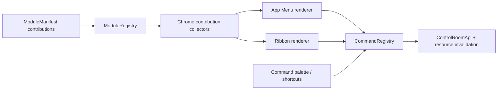

# Refaktoryzacja chrome’u Control Room

**Status:** projekt zatwierdzony
**Data:** 2026-08-23
**Zakres:** `apps/control-room`

## Kontekst

Od utworzenia App Menu i Ribbonu Control Room otrzymał nowe workflow geometrii,
fizyki, siatki, study, wyników, diagnostyki oraz wizualizacji. Chrome nie
ewoluował razem z modułowym kernelem:

- `ModuleManifest.contributes` obsługuje wyłącznie komendy, mimo że specyfikacja
  przewiduje wkłady menu, Ribbonu i statusu;
- `AppMenuBar.tsx` jest faktycznie implementacją modułu umieszczoną w
  `src/kernel/layout`, ręcznie utrzymuje listy komend i otwiera pięć dialogów
  przez specjalne rozgałęzienia;
- `ribbonContributions.tsx`, `ribbonCommands.ts` i `RibbonModule.tsx` łączą
  modele prezentacji, politykę zasobów, capability gating, dialogi oraz
  wykonanie komend;
- menu, Ribbon, paleta i skróty nie mają w pełni wspólnej semantyki
  potwierdzenia oraz cyklu życia komendy;
- `PanelHeader` nie jest używany, a docki, Inspector, powierzchnie analityczne,
  Explorer, Footer i Status Bar tworzą niezależne warianty nagłówków;
- poniżej 900 px główne menu znika bez kompletnego odpowiednika;
- część kontrolek omija wspólne prymitywy, przez co stan wyłączenia i jego powód
  nie są dostępne w jednakowy sposób z klawiatury.

## Cel

Zachować obecny układ, gęstość, etykiety, wysokości i język wizualny, ale
przebudować chrome tak, aby:

1. wszystkie powierzchnie wykonywały jedną kanoniczną komendę;
2. moduły deklarowały swoje pozycje w menu i Ribbonie;
3. renderer chrome’u nie znał semantyki fizyki ani poszczególnych workflow;
4. zasoby były subskrybowane tylko przez aktywny kontekst Ribbonu;
5. każdy nagłówek należał do jawnej kategorii i używał wspólnych prymitywów;
6. zwężenie okna nie odbierało dostępu do komend;
7. migracja mogła być wykonywana i weryfikowana etapami.

## Poza zakresem

- zmiana backendu, OpenAPI v2 lub generowanego transportu;
- zmiana semantyki fizycznej, Python DSL lub `ProblemIR`;
- przebudowa R3F, viewportu, resource hooks albo realtime;
- nowy system persystencji layoutu;
- osobna aplikacja mobilna lub redesign wizualny;
- naprawa niezwiązanych problemów legacy i cutover poza dokumentacyjnym
  odnotowaniem aktualnego stanu.

## Wybrana architektura

Kernel pozostaje właścicielem slotów, layoutu, cyklu życia modułów,
`ModuleRegistry` i `CommandRegistry`. Nie przejmuje modeli domenowych ani
renderowania modułów.

`ModuleManifest.contributes` zostanie rozszerzony o:

- `menu`: uporządkowane pozycje wskazujące `commandId` i region menu;
- `ribbon`: uporządkowane, leniwie montowane grupy zakładek;
- `status`: pozostawione jako kontrakt dla obecnego i przyszłego Status Baru.

Wkłady są statyczne i nie wykonują efektów podczas importu. Dynamiczne grupy
Ribbonu mogą używać hooków dopiero w leniwie zamontowanym komponencie grupy.
Efekty użytkownika przechodzą wyłącznie przez komendę.

## Model menu

App Menu definiuje wyłącznie stałą architekturę informacji: region aplikacji,
File, Edit, View, Simulation, Tools, Help, Quick Access i Run Control. Moduły
dostarczają uporządkowane elementy do tych regionów.

Pozycja menu przechowuje `commandId`, kolejność, opcjonalne wejście oraz
minimalny wariant prezentacji. Tytuł, ikona, skrót, aktywność i powód
wyłączenia są rozwiązywane z `CommandRegistry`. Podmenu jest kontenerem
prezentacyjnym, a nie alternatywnym systemem komend.

`AppMenuBar` zostanie przeniesiony do modułu `app-menu`. Dialogi narzędziowe
przejdą do modułu `overlay`; jego komendy otwierają modułowy store dialogów.
Menu nie będzie posiadało specjalnych warunków dla identyfikatorów narzędzi.

## Model Ribbonu

`ribbon` pozostaje pojedynczym rendererem zakładek i grup. Każdy wkład grupy
określa zakładkę, kolejność, tytuł, ton oraz leniwie ładowany komponent.
Komponent grupy:

- pobiera wyłącznie zasoby wymagane przez tę grupę;
- buduje jeden `CommandContext` dla swoich akcji;
- renderuje akcje przez wspólne adaptery komend;
- nie wywołuje API ani store’ów w callbackach prezentacyjnych;
- znika razem z nieaktywną zakładką.

Istniejące definicje zostaną rozdzielone na domeny Home, View, Definitions,
Geometry, Materials, Physics, Mesh, Study, Results i Automation. Największy
View zostanie dalej podzielony na global display, orientation, slice,
display/quantity oraz selected-target visualization.

Nieukończone pozycje nie będą filtrowane według `NODE_ENV`. Komenda
niezarejestrowana nie tworzy kontrolki. Komenda obsługiwana, lecz chwilowo
niedostępna, pozostaje widoczna z dokładnym powodem wyłączenia.

## Wspólna prezentacja i wykonanie komend

Kernel dostarczy czysty `resolveCommandPresentation()` oraz adaptery
`CommandTrigger` i `CommandMenuItem`. Każda powierzchnia otrzyma z nich ten sam
tytuł, ikonę, skrót, active state, disabled state i opis przyczyny.

Potwierdzenie będzie właściwością definicji komendy, a nie renderera. Wspólny
dispatcher skieruje prośbę do hosta w module `overlay`. Istniejący dialog
budowania siatki zachowa specjalistyczną treść, ale nie będzie wywoływany przez
rozpoznawanie `commandId` w Ribbonie i palecie.

Wynik lokalnego dispatchu rozróżni `accepted` od `completed`. Odpowiedź
`accepted` nie wyemituje `command:completed`; końcowy stan komendy serwerowej
pozostanie własnością zasobów command queue/detail i invalidacji HTTP v2.

## Rodzina nagłówków

Nie powstanie jeden komponent próbujący obsłużyć wszystkie przypadki.
Obowiązuje następująca taksonomia:

- `AppHeader`: marka, menu, sesja, quick access i run controls;
- `DockHeader`: tytuł, uchwyt przeciągania i akcje zewnętrznej ramy docka;
- `SurfaceHeader`: kontekst i narzędzia głównej powierzchni, między innymi
  Field Map i Analysis;
- `InspectorIdentityHeader`: breadcrumbs, tożsamość, badge i metadane
  zaznaczonego obiektu;
- `SectionHeader`: małe nagłówki sekcji i instrumentów wewnątrz modułu;
- istniejący `DialogHeader` oraz nagłówki tabel pozostają wyspecjalizowane.

`WorkspaceDockLayout` użyje jednego `DockColumnFrame` zarówno po hydratacji,
jak i w fallbacku SSR. Nie zostaną dodane dodatkowe rzędy nad Explorerem,
Viewportem ani Footerem. Obecna geometria pozostaje stabilna.

## Responsywność i wygląd

Zachowane zostają wartości:

- App Header: 38 px;
- Ribbon: 124 px;
- Dock Header: 38 px;
- Status Bar: 26 px.

Zachowane zostają selektory istotne dla automatyzacji, w tym `.fm-header`,
`.fm-ribbon`, `.fm-ribbon__tab`, `[data-action-id]`,
`.fm-dock-column__handle`, `.fm-inspector__header`, `.fm-footer__bar` i
`.fm-status-bar`.

Przy zwężaniu:

- od 1400 px działa pełna prezentacja;
- poniżej 1400 px Ribbon może przejść do wariantu kompaktowego;
- poniżej 1180 px search i quick access przechodzą do overflow;
- poniżej 900 px menu desktopowe znika, ale wszystkie jego regiony są dostępne
  w dropdownie aplikacji;
- Ribbon zachowuje wszystkie komendy przez przewijanie grup, bez
  `display: none` dla działań.

Kolory pozostają w tokenach `--fm-*`, klasy mają prefiks `fm-*`, a Mocha i
Latte zachowują identyczną geometrię. `app/globals.css` pozostaje import-only.

## Obsługa błędów

- zduplikowany identyfikator wkładu powoduje błąd rejestracji z nazwą modułu;
- odwołanie do nieznanej komendy jest błędem testu architektury i wpisem
  diagnostycznym w development;
- wykonanie niedostępnej komendy nie uruchamia efektu i zwraca jej
  `disabledReason`;
- odrzucone potwierdzenie kończy lokalną próbę statusem `cancelled`;
- błąd komendy trafia do istniejącej diagnostyki bez demontażu chrome’u;
- błąd leniwego komponentu grupy jest izolowany przez granicę modułu, a
  pozostałe zakładki Ribbonu pozostają dostępne.

## Migracja

1. Zamrozić kontrakty geometrii i rozszerzyć testy architektury.
2. Dodać typy oraz kolektory wkładów i wspólną prezentację komend.
3. Ujednolicić dispatch, potwierdzenia i `accepted`/`completed`.
4. Przenieść App Menu do modułu i dialogi narzędziowe do overlay.
5. Przełączyć szkielet Ribbonu na wspólne prymitywy i leniwe grupy.
6. Migrować zakładki domenami, zachowując działający Ribbon po każdym kroku.
7. Wprowadzić rodzinę nagłówków i usunąć zduplikowany fallback docków.
8. Naprawić overflow, breakpointy i selektory screenshotów.
9. Domknąć testy, specyfikacje i ADR.

Nie powstaje długotrwały drugi chrome. Przejściowe adaptery są usuwane w tym
samym zadaniu, które przełącza ostatniego konsumenta.

## Weryfikacja

Wymagane są:

- testy kolekcji i walidacji wkładów;
- test wykonania jednego `commandId` z menu, Ribbonu, palety i skrótu;
- testy `accepted`, `completed`, `failed`, `cancelled` i potwierdzenia;
- testy aktywnego-only ładowania zasobów Ribbonu;
- testy SSR/hydration i pojedynczego markupu `DockColumnFrame`;
- testy semantyki Tabs, menu, przycisków i powodów wyłączenia;
- browser smoke przy 1400/1399, 1180/1179 i 900/899 px;
- screenshoty Mocha/Latte i reduced motion;
- drag, resize, reload layoutu oraz pojedynczy zamontowany `viewport-main`;
- architecture hygiene, API hygiene, typecheck, lint, Vitest i build.

## Dokumentacja architektoniczna

Implementacja aktualizuje ADR 0013 oraz ADR 0015 zamiast tworzyć równoległą
decyzję o tym samym kernelu. Aktualizacji wymagają również specyfikacje 01, 02,
09, 10, 12, 18, 21 i 22. ADR 0011 oraz resource-first API pozostają bez zmian
semantycznych; dokumentacja ma jawnie wskazać, że refaktor jest frontend-only.

