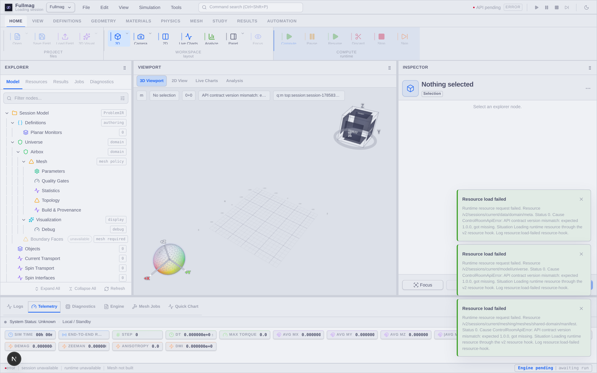

# FullMag

<a id="readme-top"></a>

<div align="center">
  <a href="https://fullmag.mzelent.pl/">
    
  </a>

  <h2>FDM and FEM micromagnetics with Python, CPU/CUDA solvers, and an interactive Control Room</h2>

  <p>
    <strong>One study model · multiple numerical engines · advanced relaxation and spectral solvers · explicit provenance</strong>
  </p>

  <p>
    <a href="https://fullmag.mzelent.pl/"><strong>Documentation</strong></a>
    ·
    <a href="https://fullmag.mzelent.pl/frontend/control-room/index.html">Control Room</a>
    ·
    <a href="https://fullmag.mzelent.pl/python-api/index.html">Python API</a>
    ·
    <a href="#quick-start">Quick start</a>
    ·
    <a href="docs/specs/capability-matrix-v0.md">Capability matrix</a>
  </p>
</div>

## Overview

FullMag is active research software for finite-difference (FDM) and finite-element (FEM)
micromagnetics. A model can be authored through the stage-oriented Python API or the Control Room,
lowered to the canonical `ProblemIR`, checked against backend capabilities, and executed as an
ordered study. The runtime records requested and resolved execution settings together with solver
diagnostics and scientific artifacts.

FullMag combines structured and conforming discretizations, CPU and CUDA implementations,
time-domain dynamics, direct relaxation, hysteresis, FEM eigenmodes, driven frequency response,
and interactive 2D/3D analysis in one workflow.

> [!IMPORTANT]
> Support is resolved for a complete execution lane: physics, discretization, device, precision,
> solver, mesh class, and workload. Source code or an API object does not by itself imply
> executable, validated, or production-qualified support. CPU/GPU and FDM/FEM parity is never
> assumed; consult the [capability matrix](docs/specs/capability-matrix-v0.md).

<div align="center">
  <a href="https://fullmag.mzelent.pl/frontend/control-room/index.html">
    
  </a>
  <p><sub>Control Room: model authoring, mesh and field inspection, 2D/3D visualization, live analysis, runtime status, and Python export.</sub></p>
</div>

<a id="numerical-engines"></a>

## Numerical engines

| Engine | Best suited to | Main implementation |
|---|---|---|
| **FDM** | Regular films, nanowires, racetracks, disks, pillars, periodic cells, repeated time integration, and disconnected multilayers | Cell-centred Cartesian grids; Newell demagnetization tensors with zero-padded FFTs; Rust/RustFFT CPU paths; C++17/CUDA/cuFFT GPU paths; explicit finite-image PBC and multilayer contracts |
| **FEM** | Curved or irregular 3D bodies, conforming multi-region structures, local refinement, magnetic-plus-air domains, and modal or driven-response studies | Gmsh conforming meshes; C++17/MFEM/hypre/libCEED operators; Poisson Airbox and CPU FEM/BEM demagnetization; bounded CUDA paths and optional PETSc/SLEPc spectral infrastructure |

Each engine owns its mesh, operators, memory layout, dependencies, and validation evidence.
Unsupported combinations fail in `strict` mode instead of being replaced by a hidden backend,
device, or solver fallback.

## Studies and physics

| Area | Current public scope |
|---|---|
| **Time-domain dynamics** | Gilbert LLG with Heun, RK4, RK23, RK45, and bounded lane-specific ABM3/coupled paths |
| **Relaxation** | `llg_overdamped`, tangent projected-gradient Barzilai–Borwein, and Polak–Ribière+ nonlinear conjugate gradient; availability is lane-specific |
| **Hysteresis** | Ordered field schedules built from the same relaxation, stopping, artifact, and provenance contracts |
| **Eigenmodes and dispersion** | Tangent-space linearized-LLG generalized eigenproblems; the public modal contract is FEM, not production FDM |
| **Driven frequency response** | Complex linear response around equilibrium with dense, sparse, Schur, modal, and GPU-oriented planner families; the public response contract is FEM |
| **Interactions** | Exchange, demagnetization, and Zeeman have public FDM and FEM paths. Anisotropy, DMI, thermal fields, STT/SOT, Oersted fields, magnetoelasticity, and transport have explicit lane-specific statuses |
| **Periodic boundaries** | FDM finite-image kernels and bounded FEM periodic/Floquet formulations are separate capabilities with separate validation requirements |
| **Parallel execution** | Current public execution is single-device. `gpu_count > 1` is rejected; CPU threading and GPU residency depend on the resolved lane |

Detailed equations, discretizations, implementation mappings, and validation evidence are maintained
in the [physics](https://fullmag.mzelent.pl/physics/index.html) and
[numerical-methods](https://fullmag.mzelent.pl/numerical-methods/index.html) references.

## Execution model

```text
Python study or Control Room
            │
            ▼
         ProblemIR
            │
            ▼
validation and capability planning
            │
            ▼
 session → run → ordered stages
            │
      ┌─────┴─────┐
      ▼           ▼
     FDM         FEM
      └─────┬─────┘
            ▼
fields, observables, diagnostics, artifacts, and provenance
```

The public authoring contract is `fm.study(...)`. Requested intent and resolved execution remain
separate in provenance. Automatic selection, where available, is recorded as a planner decision
and is not treated as scientific validation.

<a id="quick-start"></a>

## Quick start

Install the Python authoring layer:

```bash
git clone https://github.com/MateuszZelent/fullmag
cd fullmag
python -m pip install ./packages/fullmag-py
```

Install optional geometry and meshing dependencies when needed:

```bash
python -m pip install "./packages/fullmag-py[meshing]"
```

Run the repository-owned FDM CPU smoke scenario:

```bash
just run-headless examples/fdm_cpu_relax_smoke.py
```

This smoke test verifies the execution path; it is not a convergence or scientific qualification
benchmark. Native FEM/MFEM/hypre/libCEED/CUDA builds use the managed container recipes owned by the
repository `justfile`:

```bash
just ensure-managed-fem-runtime
```

Platform-specific setup is documented in the
[installation guide](https://fullmag.mzelent.pl/getting-started/installation.html).

<details>
<summary><strong>Show the FDM CPU relaxation example</strong></summary>

```python
import fullmag as fm

study = fm.study("fdm_cpu_relax_smoke")
study.engine("fdm")
study.device("cpu", precision="double")
study.universe(
    mode="manual",
    size=(80e-9, 160e-9, 10e-9),
    center=(0.0, 0.0, 0.0),
    padding=(0.0, 0.0, 0.0),
)
study.cell(5e-9, 5e-9, 5e-9)

film = study.geometry(
    fm.Box(size=(40e-9, 120e-9, 10e-9), name="smoke_box"),
    name="smoke_box",
)
film.Ms = 752000.0
film.Aex = 1.55e-11
film.alpha = 0.1
film.m = fm.texture.uniform(0.0, 1.0, 0.0)

study.demag()
study.b_ext(0.0, 0.0, 1e-3)
study.solver(fix_dt=1e-13, g=2.115)
study.stages.add_relax(
    algorithm="llg_overdamped",
    dt=1e-13,
    tolA=1e-4,
    max_steps=4,
).tableautosave(
    every_steps=1,
    quantities=["step", "t", "dt", "mx", "my", "mz", "E_total"],
)
```

The tracked source is [`examples/fdm_cpu_relax_smoke.py`](examples/fdm_cpu_relax_smoke.py).

</details>

## Repository map

| Path | Responsibility |
|---|---|
| `packages/fullmag-py/` | Public Python API, geometry, materials, interactions, stages, outputs, and lowering |
| `crates/fullmag-ir/` | Canonical backend-neutral `ProblemIR` |
| `crates/fullmag-plan/` | Validation, capability checks, and execution-lane resolution |
| `crates/fullmag-engine/` | Reference and public executable solver logic |
| `backends/`, `native/` | Native FDM/FEM CPU and GPU implementations and ABI |
| `crates/fullmag-api/`, `crates/fullmag-runner/`, `crates/fullmag-cli/` | Sessions, runs, API, CLI, artifacts, and provenance |
| `apps/control-room/` | Next.js/React/TypeScript Control Room with Three.js and ECharts |
| `public_docs/site/` | Sphinx/MyST public documentation |
| `tests/`, `tests/standard_problems/` | Unit, regression, parity, benchmark, and standard-problem cases |

The supporting stack includes Python/NumPy/Zarr/HDF5, Rust/Axum/Tokio/PyO3,
C++17/CUDA/cuFFT, Gmsh/MFEM/hypre/libCEED, and optional PETSc/SLEPc. Exact
repository-declared versions are shown below.

## Documentation and validation

Use the public documentation as the user-facing and scientific reference:

- [Getting started](https://fullmag.mzelent.pl/getting-started/index.html)
- [Control Room](https://fullmag.mzelent.pl/frontend/index.html)
- [Python API](https://fullmag.mzelent.pl/python-api/index.html)
- [Physics](https://fullmag.mzelent.pl/physics/index.html)
- [Numerical methods](https://fullmag.mzelent.pl/numerical-methods/index.html)
- [Validation](https://fullmag.mzelent.pl/validation/index.html)
- [Architecture](https://fullmag.mzelent.pl/architecture/index.html)

Internal plans, audits, and engineering notes under `docs/` are not automatically part of the
public contract.

<!-- fullmag-version-dashboard:start -->
<a id="version-dashboard"></a>

## Version and compatibility dashboard

The badges below are generated from repository-owned manifests. They distinguish exact
toolchain pins from supported dependency ranges; `contract-guard` fails when this README
no longer matches the source files.

<p align="center">
  <strong>Continuous verification</strong><br />
  <a href="https://github.com/MateuszZelent/fullmag/actions/workflows/contract-guard.yml"></a>
  <a href="https://github.com/MateuszZelent/fullmag/actions/workflows/react-doctor.yml"></a>
  <a href="https://github.com/MateuszZelent/fullmag/actions/workflows/documentation.yml"></a>
</p>

<p align="center">
  <strong>Core toolchain</strong><br />
  <a href="Cargo.toml"></a>
  <a href="packages/fullmag-py/pyproject.toml"></a>
  <a href=".node-version"></a>
  <a href="rust-toolchain.toml"></a>
  <a href="docker/fem-gpu/Dockerfile"></a>
  <a href="docker/fem-gpu/Dockerfile"></a>
  <a href="docker/fem-gpu/Dockerfile"></a>
</p>

<p align="center">
  <strong>Scientific backends</strong><br />
  <a href="docker/fem-gpu/Dockerfile"></a>
  <a href="docker/fem-gpu/Dockerfile"></a>
  <a href="docker/fem-gpu/Dockerfile"></a>
  <a href="Cargo.toml"></a>
  <a href="packages/fullmag-py/pyproject.toml"></a>
  <a href="packages/fullmag-py/pyproject.toml"></a>
</p>

<p align="center">
  <strong>Control Room</strong><br />
  <a href="apps/control-room/package.json"></a>
  <a href="apps/control-room/package.json"></a>
  <a href="apps/control-room/package.json"></a>
  <a href="apps/control-room/package.json"></a>
  <a href="apps/control-room/package.json"></a>
  <a href="Cargo.toml"></a>
</p>

<details>
<summary><strong>Version policy and sources of truth</strong></summary>

| Contract | Current manifest value | Source of truth | Policy |
|---|---|---|---|
| FullMag packages | `0.1.0` | `Cargo.toml`, `packages/fullmag-py/pyproject.toml`, `apps/control-room/package.json` | package versions must agree |
| Core toolchain | Python `>=3.10`; Node `24.18.0`; Rust `stable` / edition `2021` | `pyproject.toml`, `.node-version`, `rust-toolchain.toml`, `Cargo.toml` | compatibility range or pinned channel/version |
| Managed FEM/GPU bundle | CUDA `12.4.1`; CMake `3.30.5`; MFEM `4.9`; hypre `3.1.0`; libCEED `0.12.0` | `docker/fem-gpu/Dockerfile` | exact reproducible build pins |
| Python scientific API | NumPy `>=1.24,<3`; Zarr `>=2.18,<4`; h5py `>=3.9,<4`; Gmsh `>=4.12,<5` | `packages/fullmag-py/pyproject.toml` | declared compatibility ranges |
| Control Room direct stack | Next.js `16.2.11`; React `19.2.4`; TypeScript `5.8.3`; Three.js `^0.183.2`; ECharts `^6.1.0` | `apps/control-room/package.json` | direct constraints; complete transitive resolution is pinned in `pnpm-lock.yaml` |
| Rust/Python and desktop bridge | PyO3 `0.29`; Tauri `2.11.1` | `Cargo.toml` | workspace dependency constraints |

Regenerate after changing a version source:

```bash
python3 scripts/update_readme_version_dashboard.py --write
```

</details>
<!-- fullmag-version-dashboard:end -->

## Contributing

Read [`AGENTS.md`](AGENTS.md) before changing the repository. A capability change should update the
relevant authoring API, `ProblemIR`, planner data, executable backend, tests, validation evidence,
and public documentation. Capability claims must name their backend, device, precision, mode,
solver, mesh, and workload scope.

## Citation and authors

Until a versioned release with a persistent identifier is available, cite the repository and the
exact commit used for the reported result:

> M. Zelent, M. Gołebiewski, and P. Pirro, *FullMag: a computational framework for reproducible finite-difference and finite-element micromagnetics*, research software, 2026. Repository: [github.com/MateuszZelent/fullmag](https://github.com/MateuszZelent/fullmag). Documentation: [fullmag.mzelent.pl](https://fullmag.mzelent.pl/).

<details>
<summary><strong>BibTeX</strong></summary>

```bibtex
@software{fullmag_2026,
  author = {Zelent, Mateusz and Gołebiewski, Mateusz and Pirro, Philipp},
  title  = {FullMag: A Computational Framework for Reproducible
            Finite-Difference and Finite-Element Micromagnetics},
  year   = {2026},
  url    = {https://github.com/MateuszZelent/fullmag},
  note   = {Research software; cite the exact release or commit used}
}
```

</details>

| Author | Affiliation |
|---|---|
| Dr Mateusz Zelent | Fachbereich Physik and Landesforschungszentrum OPTIMAS, RPTU Kaiserslautern-Landau, Germany |
| Dr Mateusz Gołebiewski | Faculty of Physics and Astronomy, Adam Mickiewicz University, Poznań, Poland |
| Prof. Philipp Pirro | Fachbereich Physik and Landesforschungszentrum OPTIMAS, RPTU Kaiserslautern-Landau, Germany |

Project coordination: **Mateusz Zelent, RPTU Kaiserslautern-Landau**.

## License

The repository does not currently contain a root-level license file. Contact the project
coordinator before reuse or redistribution.

## Funding

Mateusz Zelent acknowledges funding from the European Union's Horizon Europe programme under
HORIZON-MSCA-2024-PF-01, Marie Skłodowska-Curie Grant Agreement No. **101208951 (CNMA)**.
