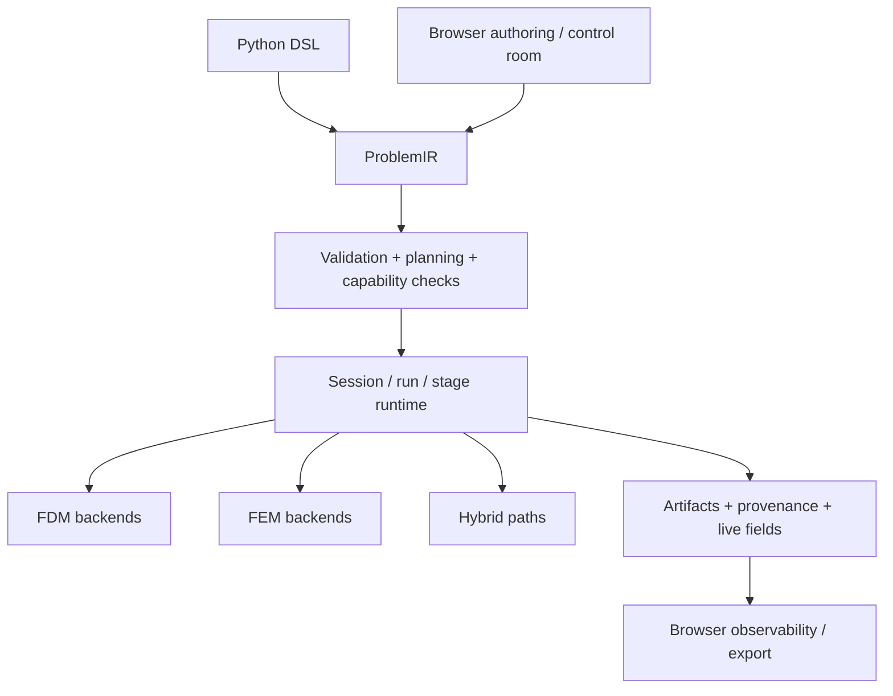
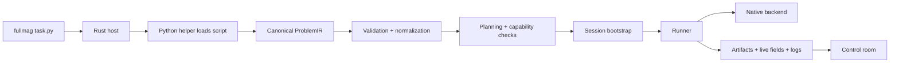

# Fullmag

Fullmag is a micromagnetics platform being built around one simple contract:

> **the shared interface describes a physical problem, not a numerical mesh layout**

It aims to become a **best-in-class micromagnetics application** with:

- one public launcher,
- one canonical Python DSL,
- one browser control room,
- one semantic core,
- multiple execution backends,
- one reproducible provenance chain.

This document is the public-facing architectural map of the project.

---

## What Fullmag is trying to become

Fullmag is being built to give users one coherent experience:

1. author a simulation in Python,
2. inspect and refine it in a browser control room,
3. run it locally or through managed compute runtimes,
4. stream live fields, meshes, and artifacts,
5. export the exact same simulation back to canonical Python,
6. reproduce the full run and execution choices later.

The design goal is not “many tools around a solver”.
The design goal is **one application with one physics-first model**.

---

## Core idea

Fullmag separates:

- **physical problem definition**
- **execution planning**
- **native compute**
- **live observability**
- **artifact/provenance**

That separation is deliberate.

It lets Fullmag support:

- FDM and FEM,
- CPU and GPU,
- local and managed runtimes,
- time-domain and frequency-domain workflows,
- reference solvers and production solvers,
- rich browser observability,

without inventing a different semantic model for each path.

---

## Product principles

### 1. Physics-first, not backend-first 
Users describe magnetism, geometry, materials, boundary conditions, stages, outputs, and mesh intent.
They do not describe CUDA pointers, MFEM objects, or internal memory layouts.

### 2. One canonical scripting surface
The public authoring surface is the embedded Python DSL in `packages/fullmag-py`.

### 3. One semantic core
All public flows must converge to a canonical `ProblemIR`.

### 4. One round-trip rule
The browser must be able to emit a canonical Python representation of the same simulation it edits.

### 5. Explicit execution
Requested backend/device/precision intent and resolved execution reality must both be visible.

### 6. Honest status
Bootstrap, transitional, reference, and production states must be clearly distinguished.

---

## The application model



### The practical meaning of this design

- the Python DSL is canonical,
- the browser is first-class,
- Rust is the control plane,
- native backends are execution realizations,
- provenance sits above backends, not inside them,
- live previews must remain consistent with solved data.

---

## Canonical public surfaces

### Public launcher
```bash
fullmag script.py
```

### Canonical public authoring
- embedded Python DSL in `packages/fullmag-py`

### Control room
- local browser UI for:
  - authoring assistance,
  - live monitoring,
  - mesh inspection,
  - stage execution,
  - artifact inspection,
  - script export,
  - future advanced analysis workflows

---

## Architecture

## 1. Semantic layers

| Layer | Role |
|---|---|
| Python DSL | public authoring surface |
| UI authoring | interactive authoring companion |
| `ProblemIR` | canonical lowered semantic model |
| Rust validation/planning | capability checks, backend resolution, session bootstrap |
| session/run runtime | command, stage, field, artifact, and lifecycle orchestration |
| native backends | high-performance compute |
| control room | observability, editing, export, and diagnostics |

---

## 2. Repository map

| Path | Role |
|---|---|
| `packages/fullmag-py` | public Python DSL and runtime scaffolding |
| `crates/fullmag-ir` | canonical typed semantic model |
| `crates/fullmag-plan` | planner and capability logic |
| `crates/fullmag-cli` | launcher and orchestration |
| `crates/fullmag-api` | control-plane API |
| `crates/fullmag-runner` | runner / stage execution |
| `crates/fullmag-engine` | trusted CPU/reference solvers |
| `crates/fullmag-py-core` | Python/Rust bridge |
| `apps/web` | browser control room |
| `native/` | native production backends |
| `docs/` | specs, ADRs, physics notes |

---

## 3. Backend authority policy

Each solver family has:

- one **authoritative production path**
- one **reference/validation path**

### FDM

| Role | Backend |
|---|---|
| Reference | Rust CPU reference |
| Production CPU/HPC | Rust production FDM |
| Production GPU | native CUDA FDM |

### FEM

| Role | Backend |
|---|---|
| Reference | Rust FEM reference |
| Production CPU | native MFEM/hypre/libCEED |
| Production GPU | native MFEM/libCEED/CUDA |

### Important consequence

Reference backends are not “fallback production”.
They are:

- oracles,
- regression baselines,
- debug paths,
- parity tools.

---

## Execution model

Execution is chosen in terms the user can understand:

- **discretization**: `fdm | fem | auto | hybrid (future)`
- **device**: `cpu | gpu | auto`
- **precision**: `single | double`
- **mode**: `strict | extended | hybrid`

Fullmag must preserve:

- what the user **asked for**
- what the planner **resolved**
- what the runtime **actually executed**

That distinction is part of the product.

---

## Full execution chain



---

## FEM mesh contract

Fullmag does **not** model FEM meshing as one anonymous blob.

It must preserve three levels:

1. **Universe mesh config**
   - meshing policy for air / outer domain

2. **Per-object mesh config**
   - independent meshing policy for each magnetic object

3. **Final shared-domain solver mesh**
   - one conforming mesh assembled from universe + objects

### Why this matters

It is the only way to support all of the following at once:

- object-specific refinement,
- airbox grading,
- interface refinement,
- transition regions,
- adaptive remesh,
- shared-domain conforming solve,
- honest UI inspection,
- canonical script round-trip.

### Important rule

Visibility, isolate mode, and viewport preview scope are **rendering concerns only**.
They must never silently change the physical FEM domain.

---

## Solver families

## Time-domain micromagnetics

Time-domain is the core execution path for:

- relaxation,
- driven dynamics,
- switching,
- thermal/stochastic workflows,
- initial-value evolution,
- coupled magnetostatic workflows.

### Design principles
- one canonical stage model,
- explicit relax semantics,
- explicit stop criteria and stop reasons,
- explicit stage completion status,
- honest logs and UI lifecycle,
- backend-specific performance hidden behind stable contracts.

---

## Frequency-domain and eigensolve

Frequency-domain is a first-class target, not an afterthought.

The long-term goal is:

- matrix-free eigensolve,
- linear response solver,
- reduced-order modal response,
- explicit support for:
  - eigenmodes,
  - frequency response,
  - periodic/Floquet problems,
  - surface-anisotropy BCs,
  - equilibrium import from time-domain solutions.

Dense O(n³) eigensolvers are acceptable only for:

- tiny bootstrap cases,
- debugging,
- parity checks.

They are not the long-term architecture.

---

## Control room architecture

The browser is a first-class control room.

### It must support
- live session state,
- stage lifecycle,
- mesh workspace,
- quantity switching,
- artifact browsing,
- per-stage diagnostics,
- canonical script export,
- viewport-based inspection for both FDM and FEM.

### It must not do
- invent UI-only physics semantics,
- hide backend limitations,
- treat already-computed fields as slow preview commands,
- silently drift from the Python / `ProblemIR` model.

---

## Data-plane doctrine

For live visualization, Fullmag should increasingly use a **field-store architecture**.

### Required direction
- solver publishes live fields,
- API exposes a field catalog,
- topology and field values are separated,
- field revisions are independent from mesh revisions,
- warm quantity switching is local and cheap,
- large payloads use binary transport where appropriate.

This is essential for responsive FEM/FDM control-room behavior.

---

## Performance strategy

Fullmag wants to be computationally serious.
That requires discipline in three places.

## 1. Native compute
- zero-alloc hot loops,
- workspace reuse,
- cache-friendly data layouts,
- CPU threading and NUMA awareness,
- validated GPU `double`,
- careful qualification of GPU `single`.

## 2. Heavy operators
- cache expensive magnetostatic / demag operators where valid,
- separate solver step from field refresh policies when useful,
- avoid rebuilding expensive operators when topology is unchanged.

## 3. Browser/runtime transport
- no giant JSON payloads for heavy vector fields,
- no accidental topology rebuilds on quantity changes,
- no preview-control path where a field-store read is enough.

---

## External reference solvers

Fullmag studies other solvers, but does not copy them.

### Used for architectural learning
- **mumax3 / mumax+**
  - GPU-first FDM
  - relaxed scripting ergonomics
  - practical relax/minimize semantics
  - FFT-centered demag structure

- **BORIS**
  - modular multiphysics
  - CUDA decomposition
  - large-scale runtime engineering

- **tetmag / tetrax**
  - FEM operator design
  - matrix-free ideas
  - frequency-domain architecture
  - demag/operator caching

### Policy
External solvers are **reference material only**.

---

## Current reality

The repo already contains strong foundations, but not every target is fully mature yet.

### The architecture already present
- canonical Python DSL,
- Rust validation/planning shell,
- local launcher,
- control-room application shell,
- production/reference backend split,
- FEM three-level mesh doctrine,
- growing live-session and mesh workspace contracts,
- strong docs-first / physics-first intent.

### Areas still under active evolution
- relaxation lifecycle polish,
- FEM demag production depth,
- live field-store fast paths,
- full COMSOL-like mesh round-trip,
- swept / advanced meshing workflows,
- matrix-free eigensolve and linear response,
- final production qualification across all backends.

Fullmag should always describe this status honestly.

---

## Getting started

## 1. Environment
```bash
cp .env.example .env
# then edit credentials/settings as needed
```

## 2. Bring up the dev environment
```bash
make up
make shell
```

## 3. Canonical build entrypoints
```bash
just build fullmag
just build fem-gpu-runtime-host
just package fullmag
```

## 4. Canonical run entrypoints
```bash
fullmag examples/exchange_relax.py
fullmag examples/exchange_demag_zeeman.py
fullmag -i examples/exchange_relax.py
```

## 5. Control room
```bash
just control-room
# or
./scripts/dev-control-room.sh
```

---

## Development rules

### Physics-first
Every serious physics/numerics feature must start with a note in `docs/physics/`.

### Round-trip-first
If the browser can author it, Python must be able to express it.

### Explicit execution
Do not hide requested vs resolved backend/runtime.

### Honest maturity
Document bootstrap, transitional, and production states clearly.

### Modularity
Avoid giant files and semantic god-objects.
Split by responsibility.

---

## What “done” means in Fullmag

A feature is only done when all relevant layers are done:

- physics note,
- Python API,
- IR,
- planner,
- runtime/session,
- backend execution,
- artifacts/provenance,
- UI/control room,
- docs,
- tests.

If only the backend works, the feature is not done.

---

## Near-term architecture priorities

## P1 — correctness and canonicalization
- remove semantic drift between Python, UI, IR, and session state,
- harden relaxation and stage lifecycle,
- make stop reasons and completion states explicit,
- finish first-class mesh semantics round-trip.

## P2 — production execution quality
- GPU-first FDM qualification,
- operator caching and runtime efficiency,
- strong mesh build diagnostics,
- field-store fast path,
- better artifact and provenance surfaces.

## P3 — advanced FEM and frequency-domain depth
- production FEM demag depth,
- swept / adaptive / gradient meshing maturity,
- matrix-free eigensolve,
- linear response and reduced-order response,
- stronger multiphysics couplings.

---

## Documentation map

Start here:

- `AGENTS.md`
- `docs/specs/fullmag-application-architecture-v2.md`
- `docs/specs/session-run-api-v1.md`
- `docs/specs/runtime-distribution-and-managed-backends-v1.md`
- `docs/physics/README.md`

For contributors, the most important habit is:

> update the scientific intent and the semantic contract before changing compute code.

---

## Contribution standard

A good Fullmag change:

- improves correctness,
- improves architectural clarity,
- reduces semantic drift,
- preserves canonical round-trip,
- makes execution more explicit,
- strengthens reproducibility,
- improves performance without cheating.

---

## Final note

Fullmag is ambitious by design.

The goal is not merely to “have a solver”.
The goal is to build a micromagnetics platform that is:

- scientifically credible,
- computationally serious,
- operationally explicit,
- architecturally clean,
- and genuinely pleasant to use.
